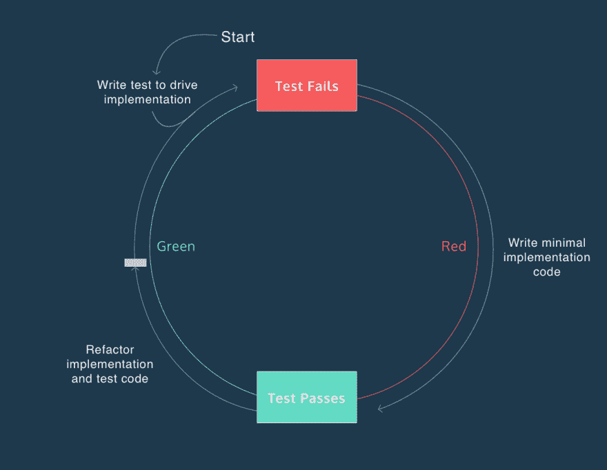

# 测试和要求

> 原文：<https://dev.to/vepo/thoughts-on-tdd-tests-and-requirements-e02>

在过去的日子里，我面临着一个巨大的问题:*几个团队一起做几个项目，如何避免新的错误？*

在我工作的公司，我们有很多微服务，但是没有主人。也许有人可以开始在一个项目中工作，并且应该在微服务中添加一个新功能。当这种情况发生时，不应该向任何客户端中任何服务添加任何错误！

在这篇文章中，我将描述我们如何处理 TDD 的特性变化。

# TDD 流程回顾

当使用 TDD 开发任何软件时，我们必须:

1.  配置测试框架
2.  编写一个失败的测试
3.  编写修复所有测试的代码
4.  如有必要，重构代码

这就是我们所说的红绿重构。首先你让一个测试失败，然后你修复它，至少你改进了你的代码组织。

[](https://res.cloudinary.com/practicaldev/image/fetch/s--7M5gZy3h--/c_limit%2Cf_auto%2Cfl_progressive%2Cq_auto%2Cw_880/https://s3.amazonaws.com/codecademy-content/programs/tdd-js/articles/red-green-refactor-tdd.png)

# 关于红绿重构的一些想法

**红绿重构**大部分时间用于单元测试。这就引出了一些关于需求问题:

*   ***我们如何确保我们的准则实现了所有的要求？*T3】**
*   ***我们如何确保未来的任何实现都不会改变任何需求？*T3】**
*   我们如何确保所有的开发人员在未来的实现中都知道所有的需求？T3】

[](https://res.cloudinary.com/practicaldev/image/fetch/s--QZMlqk3J--/c_limit%2Cf_auto%2Cfl_progressive%2Cq_auto%2Cw_880/https://memeworld.funnyjunk.com/pictures/When%2Byou%2Bhave%2Ba%2Bgroup%2Bproject_a71b2c_6624638.jpg)

如果我们在讨论单元测试，这个问题并不适用，因为我们测试的是一个类或者一小段代码。这段代码的一个变化可以改变所有的软件行为。

# 为需求创建测试

对于所有类型的测试，没有一个适用于需求，它们都是根据实现组件来命名的:

*   单元测试
*   集成测试
*   系统试验
*   健全性测试
*   烟雾测试
*   接口测试
*   回归测试
*   beta/验收测试

***但是...*** 这个名字可以没有任何意义，我们可以为任何我们想要的目的创建测试！所以，我提议一种新的测试: ***需求测试*** ...好了，[已经存在](https://www.tutorialspoint.com/software_testing_dictionary/requirements_based_testing)！没问题。

*   首先创建一个基于领域的测试套件，而不是基于实现。而不是`UserManagerTests`，只是一个`UserTests`类。
*   然后用简单完整的文本描述添加所有需求。这在 6 月 5 日运行良好
*   如果有任何测试失败，请更正代码

```
class UserTests {
   @Test
   @DisplayName("It SHOULD allow create Users without a name")
   void createWithoutNameTest() {
       // Do the tests
       fail();
   }

   @Test
   @DisplayName("It SHOULD only requires username and password")
   void createWithMinimumPropertiesTest() {
       // Do the tests
       fail();
   }
} 
```

在所有的变更中保持这种测试是很重要的，因为这种测试保留了所有需求的记忆。

## 提示

*   你越是滥用像**应该**、**永远不要**、**永远不要**或**这样的词，就越能更好地描述你。**
*   请记住，期望的行为应该表示为一个**测试**和一个**测试描述**。任何未来的发展应该知道为什么所有这些测试存在。
*   请记住，在未来的修改中，开发人员不能与您交谈，但他可以看到您在修改时的想法。

# 结论

大多数 TDD 方法总是谈论单元测试，但是单元测试不会阻止任何不希望的需求变更。为此，我们设计了一个需求测试。所有需求都应该写成测试。如果有任何失败，可能是:

*   要求已经改变
*   这种变化会在任何其他代码中增加一个错误。