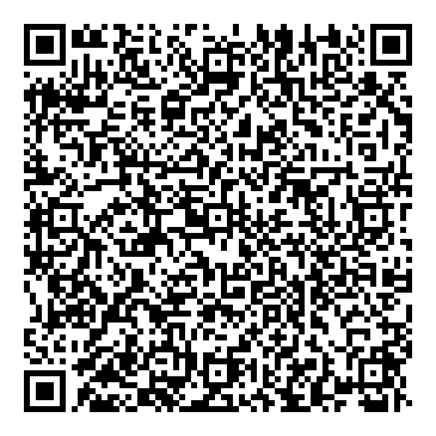

# 将文件批量转换为二维码

> 原文：<https://dev.to/petercour/bulk-converts-files-to-qr-codes-15mm>

最疯狂的备份方式是什么？云吗？软盘？二维码？

二维码是从日本汽车工业开始的。它们是可以用来存储数据的图形代码。

可以用 [duckduckgo](https://duckduckgo.com/?q=QR+hello+world&t=h_&ia=answer) 庸医二维码。为其输入“QR hello world”生成包含“hello world”的二维码。但是你知道你可以通过代码来实现吗？

[](https://res.cloudinary.com/practicaldev/image/fetch/s--SIgR8erC--/c_limit%2Cf_auto%2Cfl_progressive%2Cq_66%2Cw_880/https://proxy.duckduckgo.com/iu/%3Fu%3Dhttps%253A%252F%252Fmedia.tenor.com%252Fimages%252F8c4cb0ca7303aa791c4458d496379b07%252Ftenor.gif%26f%3D1)

### 二维码用 Python 备份

我们将使用 [Python 编程](https://pythonprogramminglanguage.com/)将文件批量转换成二维码。本指南适用于 Linux 计算机。

安装 zbar 工具和二维码模块

```
sudo apt install zbar-tools 
```

然后就可以全部转换了(。py)目录中的文件转换为二维码。

```
#!/usr/bin/python3
import qrcode
import glob

files = glob.glob("*.py")
for filename in files:
    data = ""
    with open(filename, 'r') as file:
            data = file.read()

    img = qrcode.make(data)
    img.save('qr-' + filename + '.png') 
```

文件大小有限制，大约 8 千字节。但是对于小文件，这实际上是可行的。

[](https://res.cloudinary.com/practicaldev/image/fetch/s--QBgyq68A--/c_limit%2Cf_auto%2Cfl_progressive%2Cq_auto%2Cw_880/https://thepracticaldev.s3.amazonaws.com/i/fujf4tzi2a4wyojko4yb.png)

这将在为目录中的每个 python 文件运行程序时创建一个 QR 码(*。py)。

您可以使用以下命令解码 QR 码:

```
zbarimg qr-qrfs.py.png 
```

然后你可以把你所有的文件打印在纸上。如果他们的文件符合二维码。

相关链接:

*   [维基百科上的二维码](https://en.wikipedia.org/wiki/QR_code)
*   [防漏方案](https://linux.die.net/man/1/zbarimg)
*   [学习 Python](https://pythonprogramminglanguage.com/)