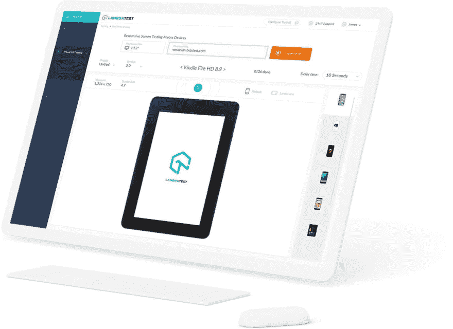
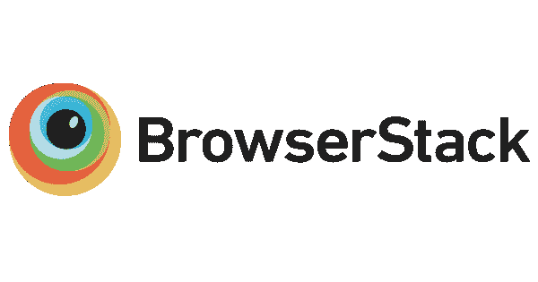
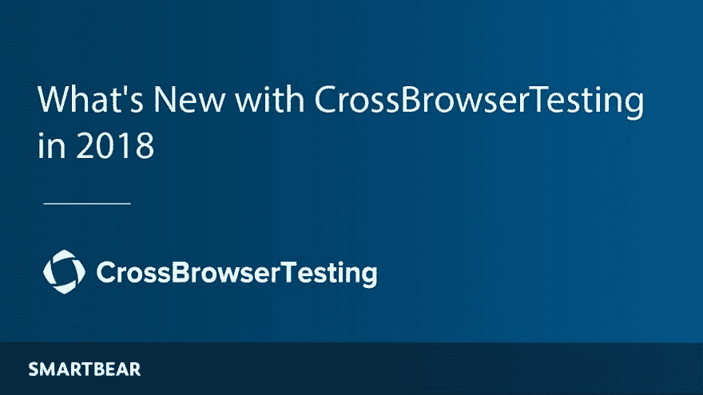
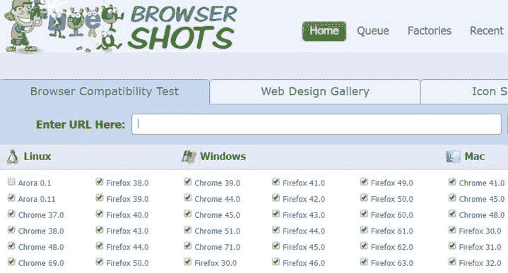
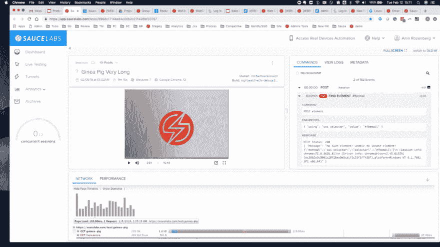
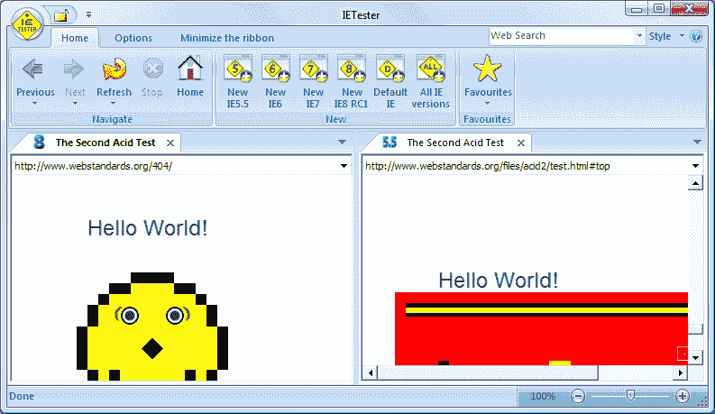

# 对比 2019 年十大跨浏览器测试工具

> 原文：<https://dev.to/lambdatest/comparing-top-10-cross-browser-testing-tools-of-2019-2mb2>

你已经开始了你的网上业务，过了一段时间后，它开始做得很好，但是你有没有检查过你的业务网站在访问者用来访问它的所有浏览器上的兼容性？

没有吗？那么是时候考虑一下了。

让我们考虑一下，你的 web 应用在 Mozilla 和 Chrome 浏览器上运行良好，但它看起来不吸引人，在其他浏览器上运行不合适；当个人使用任何其他浏览器访问您的网站时会发生什么？你会失去一个访问者或者一个潜在的用户。

因此，需要测试您的网站在所有所需浏览器之间的浏览器兼容性，为此您需要一个跨浏览器兼容性测试工具。不过，你也可以选择传统的方法来测试跨浏览器兼容性；它们将消耗大量的时间、资源、精力和成本，因为你必须将你的网络应用程序加载到电脑和移动设备上，在多种浏览器中进行测试。因此，选择一个跨浏览器测试工具来进行[浏览器兼容性测试](https://dzone.com/articles/what-is-cross-browser-compatibility-and-why-we-nee)是最理想的。

在本文中，我们对比了 2019 年十大跨浏览器测试工具。在继续之前，关于跨浏览器测试，您还应该知道一些其他的事情。

## 跨浏览器测试

跨浏览器测试是一项基本任务，需要在您的 web 应用程序上执行，以确保它能够在访问者访问您的网站时使用的所有浏览器、设备和操作系统上提供出色且一致的用户体验。在所有组合中提供相同的用户体验将帮助您获得更多用户，同时增加您的销售额。

### 跨浏览器测试需要测试什么？

执行跨浏览器测试时需要测试的几个因素是:

*   [CSS 验证、HTML 或 XHTML 验证](https://dzone.com/articles/complete-guide-on-creating-browser-compatible-html)
*   通过启用或禁用 JavaScript 进行页面验证
*   多屏幕分辨率的页面布局
*   Ajax 和 jQuery 功能
*   字体大小验证、所有图像和对齐
*   页眉和页脚部分
*   页面样式和日期格式
*   HTML 字符编码的特殊字符或

在其他浏览器、操作系统和设备中不能正常工作的任何此类元素。了解了这些因素，您可能就理解了为什么选择跨浏览器测试工具而不是传统的跨浏览器测试技术是可行的。

现在，让我们来看看 10 种不同的跨浏览器测试工具。

## 1。LambdaTest

我们列表中的第一个工具是 LambdaTest。这是一个基于云的测试平台，免费提供超过 2，000 种浏览器、操作系统和设备的[跨浏览器测试](https://www.lambdatest.com/?utm_source=dev&utm_medium=Blog&utm_campaign=Arnab-24072019&utm_term=Arnab)。LambdaTest 的特点是，它为您的 web 应用程序提供手动和自动跨浏览器测试。因此，愿意对应用程序执行实时跨浏览器测试、实时交互测试或可视化测试的人可以选择手动过程，而希望自动化测试过程的人可以在 LambdaTest 的可扩展云网格上运行自动化 Selenium 脚本。此外，谈到价格，LambdaTest 提供了最实惠的[定价方案](https://www.lambdatest.com/pricing?utm_source=dev&utm_medium=Blog&utm_campaign=Arnab-24072019&utm_term=Arnab)，每月 15 美元，功能齐全。

**T4】**

#### LambdaTest 带给您的优惠包括:

*   无限制的实时浏览器测试、响应测试和屏幕截图测试
*   最适合第一次跨浏览器的人
*   生成所有组合的网页或应用程序的自动截图
*   在多种屏幕分辨率下测试网页布局
*   作为 Chrome 扩展和 WordPress 插件提供
*   与 bug 测试工具集成，帮助您轻松管理和跟踪 bug
*   允许使用 Lambda 隧道功能测试本地托管或私人托管的页面
*   来自 LambdaTest 专家的全天候持续支持
*   15 天免费 200 分钟自动化时间

## 2。实验测试

如果您对测试您的 web 应用程序的功能和性能感兴趣，那么 [Experitest](https://experitest.com/) 提供了对大量浏览器和操作系统组合的持续测试，以检查您的应用程序是否如预期那样工作。然而，它允许您通过运行 Selenium 和 Appium 测试脚本，在 1，000 多个浏览器、操作系统和设备的组合中自动进行跨浏览器测试，这与 LambdaTest 相比要少一些。但是，以每月 9 美元的[计划](https://experitest.com/pricing/)，Experitest 提供了相当标准的功能。所以，那些预算有限的人可以选择 Experitest。

#### Experitest 包含的功能有:

*   能够在真实的 iOS、Android 和桌面浏览器上运行 Selenium 和 Appium 测试
*   通过可扩展的基于云的网格，并行运行多个测试以缩短测试周期
*   通过详细的报告(包括屏幕截图、日志文件和视频)快速检测并修复错误
*   测试你的站点的功能，并用手动方法调试代码

## 3。浏览器堆栈

软件测试历史上最古老的播放器， [Browserstack](https://www.browserstack.com) 仍然是市场上最好的测试工具之一，它允许您在 1500 多种浏览器上测试您的应用程序的浏览器兼容性。就像 LambdaTest 和 Experitest 一样，Browserstack 也是一个基于云的平台，不需要在您的系统上进行任何安装。此外，它还附带了预安装的开发人员工具，使您在测试时调试代码变得更加容易。但是，就价格而言，Browserstack 比 LambdaTest 贵得多:基本的[计划从 29 美元/月](https://www.browserstack.com/pricing)开始，用于网络直播测试，99 美元/月用于自动化测试。

**T4】**

#### 浏览器堆栈的功能包括:

*   测试您的 web 应用程序以及原生移动应用程序
*   使用地理位置测试功能模拟具有安全和私有 IP 的位置，以检查您的应用程序在其他国家/地区的运行情况
*   建立一个全面的测试环境，支持代理、活动目录和防火墙
*   为您的网页提供响应测试和截屏测试
*   使用本地主机功能测试本地托管的网页

## 4。浏览

Browserling 是最便宜的在线测试工具之一，它为运行在真实机器上的真实浏览器上的 web 应用和网站提供实时交互式跨浏览器测试。它配备了出色的 API 支持、专用服务器和奇妙的设施，允许您通过交互式浏览来比较屏幕截图和查明设计问题。除了在线测试，Browserling 还支持通过 SSL 加密测试本地托管的应用程序，具有出色的安全性。如果你不太关心自动化测试，那么这个工具对你来说是一个很好的选择。就价格而言，它比 LambdaTest 贵一点，因为[浏览器的开发者计划起价为 19 美元/月。](https://www.browserling.com/#pricing)

#### 浏览的主要特性包括:

*   捕捉测试过程的屏幕截图，并与您的团队分享
*   在不同屏幕分辨率下测试网页的网站响应能力
*   附带 Chrome、Firefox、Opera 和 Safari 扩展，便于跨浏览器测试
*   允许您将自己喜欢的测试配置加入书签
*   为跨浏览器测试提供无限的测试时间
*   提供免费测试计划和有限的测试时段

## [5。SmartBear 的跨浏览器测试](https://crossbrowsertesting.com/)

SmartBear 的跨浏览器测试是另一个基于云的平台，帮助用户通过手动和自动方式测试他们的 web 应用程序在在线浏览器和设备上的浏览器兼容性。通过 BrowserStack 的类似订阅设置，您可以访问 1，500 多个移动和桌面远程浏览器。与其他工具不同的是，它提供了对浏览器扩展以及 Chrome Dev tools 和 FireBug 等开发工具的访问，并使用户能够调试前端错误。对于自由职业者来说，[跨浏览器测试工具的价格从 15 美元/月](https://crossbrowsertesting.com/pricing)起，同时也为开源项目提供免费计划。

**T4】**

#### smart bear 跨浏览器测试的主要特点是:

*   提供一个可伸缩的 Selenium 在线网格，在真实的设备和浏览器上运行 Selenium 和 Appium 脚本
*   提供网页的并行测试以减少构建时间
*   利用可视用户界面测试功能获取网页的整页截图
*   提供无代码记录和重放功能
*   价格更低的浏览器堆栈的最佳替代方案

## 6\. Ranorex Studio

Ranorex Studio 与其他工具有些不同，因为它不仅仅是一个跨浏览器的测试工具，还可以作为 web 应用程序的一体化解决方案。它允许用户对各种技术和框架进行自动化测试，如 HTML5、JavaScript 网站、Java、Flash、Flex 应用程序、Salesforce 等。除此之外，它还支持 shadow DOM、JxBrowser、跨域 iframes 和混合桌面应用程序中的元素。Ranorex Studio 擅长用动态 id 对 web 元素进行对象识别。所有用户都可以免费试用 30 天。

#### Ranorex 工作室的特色

*   提供数据驱动和关键字驱动的 web 应用测试
*   通过内置的 Selenium WebDriver 支持，允许并行测试以及在 Selenium 网格上分布测试
*   允许共享对象存储库和可重用的代码模块，以便在减少维护的同时进行有效的测试
*   测试的视频记录，用于分析测试运行中发生的情况
*   与 TestRail、Git、Travis、吉拉等工具轻松集成

## 7。浏览器主机

[Browsershots](http://browsershots.org/) 是使用最广泛的跨浏览器测试平台之一，允许你在任何浏览器和操作系统中测试你的网站。它的流行是由于它的特性和定制选项。使用 Browsershots，您可以使用定制选项运行跨浏览器测试，如浏览器版本、操作系统、颜色深度、屏幕分辨率、Flash 启用/禁用等。但是，这个软件有一个缺点:当你在多个浏览器上测试你的 web 应用程序时，显示测试结果需要太多时间，有时甚至会显示超时错误。Browsershots 没有订阅费用，因为它是一个开源平台。

**T4】**

#### 浏览器主机的特性

*   提供一个简单的流程来测试您的网站或 web 应用程序
*   通过所需配置的不同分布式计算机系统传递您的 web URL
*   支持你可能没听说过的浏览器，比如 Epiphany，SeaMonkey，Iceweasel，Rekonq 等。
*   支持用户使用的几乎所有浏览器
*   在超过 61 种浏览器和操作系统中拍摄网站截图
*   为单一浏览器测试提供快速结果

## 8。功能化

如果你不想为在多种浏览器和操作系统上测试你的 web 应用程序而创建脚本，那么[functionalize](https://www.functionize.com/)是最适合你的测试平台。Functionize 与众不同之处在于它使用了人工智能，并用 NLP 创建测试，这意味着您只需用简单的英语编写测试。例如，如果您为一个浏览器设置了测试，那么您就不必为其他浏览器重新编码测试，这将节省您大量的时间。功能化跨浏览器测试的成本没有规定。但是，您可以使用 web 应用程序开始免费试用。

**T4】**

#### 使跨浏览器测试功能化的多种功能提供:

*   只需几分钟就可以在各种浏览器和操作系统上运行测试
*   允许对大量浏览器和操作系统组合执行并行跨浏览器测试
*   具有相同的特性标准，比如代码调试和可视化测试
*   提供有关浏览器运行时错误和浏览器特定异常的详细信息
*   非常适合 web 应用的可视化测试，即使网页很复杂或者很密集

## 9。酱油实验室

拥有超过 10 年的自动化测试经验， [Sauce Labs](https://saucelabs.com/) 是领先的基于云的测试平台，允许您跨多个浏览器和设备测试您的 web 应用程序以及移动应用程序的跨浏览器兼容性。它之所以与众不同，是因为它不需要任何 VM 设置或维护来运行测试用例。它提供对实时断点的访问，使您能够控制系统并手动调查问题。Sauce Labs 为您提供可伸缩性、广泛的测试覆盖范围和多年的经验，以加速您的软件测试生命周期并减少您的构建时间。与大多数跨浏览器测试工具类似，Sauce Labs 订阅计划基于您想要测试的设备类型。例如，在虚拟平台[上进行测试的订阅起价为 19 美元/月](https://saucelabs.com/pricing)，自动化测试起价为 149 美元/月。

**T4】**

#### 酱实验室的特色

*   使用 SSH Sauce Connect proxy 跨 800 多种浏览器测试本地托管的网页，无需设置硬件虚拟专用网络
*   用 selenium 支持的编程语言支持所有 Selenium 测试框架
*   允许使用仿真器、模拟器和真实设备测试本地移动应用
*   用移动自动化框架支持测试自动化，比如 Espresso、Appium 和 XCUITest
*   用适当的信息按时间顺序列出你最近执行的测试

## 10。第七个

即使在谷歌 Chrome 和 Firefox 流行之后， [Internet Explorer](https://www.my-debugbar.com/wiki/IETester/HomePage) 仍然被世界各地的许多用户使用，这使得开发人员在所有版本的 IE 上测试他们的 web 应用程序变得至关重要。现在，有多种工具可用于在 IE 上进行跨浏览器测试，但 IETester 完全专注于 Internet Explorer 浏览器，并允许您在所有 IE 版本上测试您的 web 应用程序，从 IE 5.5 到 IE 11。此外，它对于个人和专业网站都是完全免费的，因为它是一个开源工具。

**T4】**

#### IETester 的多重好处

*   在所有版本的 Internet Explorer 上测试您的 web 应用程序或网站
*   支持几乎所有 Windows 操作系统，如 Windows 8、7、Vista、XP
*   使用一个应用程序在最新的 IE 版本上测试您的 web 应用程序
*   对应用程序进行跨浏览器测试不需要任何成本

## 结论

市场上的跨浏览器测试工具数不胜数，它们的功能都是公认的。一些工具，如 Functionize，与人工智能技术相集成，以平稳地运行您的测试脚本，而一些工具，如 LambdaTest，提供免费增值计划和预算友好的计划，每月 15 美元起。在这里，我试图从上到下涵盖 2019 年流行的 10 大跨浏览器测试工具。如果你们发现任何我们遗漏的工具或平台，请告诉我们，我们随时欢迎反馈。