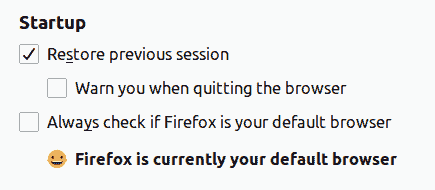

# Cookie 过期陷阱

> 原文：<https://dev.to/danielw/cookie-expiry-pitfalls-2g2b>

我只是偶然发现了一些关于 cookies 的浏览器行为，这些行为对我来说似乎非常奇怪，但事实证明是非常明显的，并且有很好的记录。我想我应该分享一下我学到的东西，以防你们中的一些人可能也没有遇到过这种情况。

## 会话 Cookie 到期

这个应该很简单，对吧？省略`Expires`属性将导致 cookie 在用户结束会话(即关闭浏览器)时被删除。
除非 [MDN 会通知您](https://developer.mozilla.org/en-US/docs/Web/HTTP/Headers/Set-Cookie)，如果用户已将浏览器设置为在关闭时恢复之前的会话。

如果你像我一样，总是带着大约 100+个打开的标签，你很有可能会激活这个设置。

Chrome 当然也有这个功能。

虽然这不是什么新鲜事，但直到现在，它还从未成为我的问题...当概念化 cookie 的使用时，很容易忘记这一点。所以要小心。

## 👻 Timezones 👻

所以你在你的饼干上设置了一个截止日期，嗯？如果你没有考虑到你的服务器的时区和使用你的网站的浏览器之间可能存在的差异，那将是一个遗憾😈
同样，正如 [MDN 向](https://developer.mozilla.org/en-US/docs/Web/HTTP/Headers/Set-Cookie)解释的那样:

> 当设置到期日期时，设置的时间和日期与设置 cookie 的客户端相关，而不是与服务器相关。

当你想到它的时候，这是相当明显的，但是当你想到设置 cookies 的时候，这是很容易被忽略的。

* * *

所以你有它。关于在服务器响应上设置 cookies 的两个小细节很容易被忽略，并可能导致数据在客户机上存储的时间比预期的长得多。

此外，这可能成为隐藏错误的有趣来源，这些错误将通过一些经典的“在我的机器上工作”来体现🤷“将来的行为。

编码快乐！:)