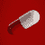

# 组件#9 -收音机

> 原文：<https://dev.to/oieeaaaa/component-9-radio-1mgb>

[https://codesandbox.io/embed/gv4xm](https://codesandbox.io/embed/gv4xm)

## 我学到了什么？

*   如何定制收音机输入:D
*   最后应用了 [@jer](https://dev.to/aut0poietic) 关于使用 css 兄弟选择器的建议。

[ ](/aut0poietic) [ Jer ](/aut0poietic) • [<time datetime="2019-07-18T14:43:50Z" class="date-short-year"> Jul 18 '19 </time>](https://dev.to/aut0poietic/comment/d662) 

干得漂亮 [@oieeaaaa](https://dev.to/oieeaaaa) ！

你可能要记住的一点是，设置为`display: none`的任何东西对于屏幕阅读器或 tab 键顺序都是不可用的——所以对于那些需要屏幕阅读器或通过键盘导航的人来说，他们不能与你的开关交互。`visibility:hidden`也会做同样的事情。

对于一些主动提供的建议:我实现这一点的方法之一(实际上是在一个 switch 组件中)是给定标签`position:relative`，然后将你的 switch UI(也就是轨道、旋钮等)定位为标签的子标签(因此是输入的直接兄弟)。然后对输入和开关 ui 应用一个相对位置，并将输入*放置在开关 UI*的下面。

```
<label class="switch-container">
   <input type="checkbox" value="is_dark" />
   <div class="switch-ui">...</div>
</label> 
```

<svg width="20px" height="20px" viewBox="0 0 24 24" class="highlight-action crayons-icon highlight-action--fullscreen-on"><title>Enter fullscreen mode</title></svg> <svg width="20px" height="20px" viewBox="0 0 24 24" class="highlight-action crayons-icon highlight-action--fullscreen-off"><title>Exit fullscreen mode</title></svg>

这种结构使用相邻的兄弟选择器实现了一些非常酷的 CSS。部分示例:

```
input[type="checkbox"]:checked + .switch-ui {
  // your checked styles here...
}

input[type="checkbox"]:focus + .switch-ui {
  // your focused styles here...
} 
```

<svg width="20px" height="20px" viewBox="0 0 24 24" class="highlight-action crayons-icon highlight-action--fullscreen-on"><title>Enter fullscreen mode</title></svg> <svg width="20px" height="20px" viewBox="0 0 24 24" class="highlight-action crayons-icon highlight-action--fullscreen-off"><title>Exit fullscreen mode</title></svg>

这两个选择器实际上是在说“当输入复选框被选中时，给具有类 switch-ui 的输入的相邻兄弟提供这些样式。”当复选框获得焦点时，第二个语句执行相同的操作。

好处是这对您和您的 javascript 来说都是很少的工作。您只需将一些状态定义为类，其余的由所有浏览器来处理。您的 React 类所要做的就是维护输入本身的选中状态。

再说一次，这是很好的工作。保持下去！

。

## 主要挑战有哪些？

嗯...:/

## 我为什么要这样做？

*   去学习。
*   为了开心。
*   敬未来的 Joimee(供参考)。

资源:
[如何创建自定义单选按钮](https://www.w3schools.com/howto/howto_css_custom_checkbox.asp)

萨拉马特。