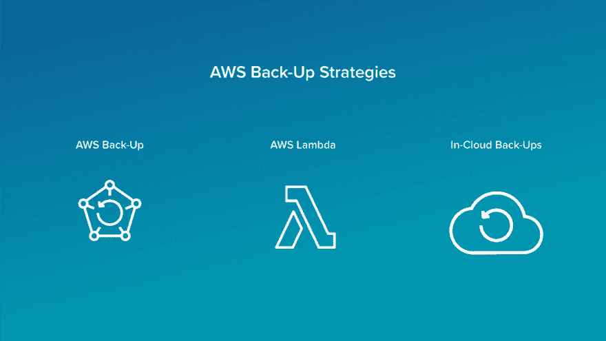

# 应该备份的 AWS 资源和操作方法

> 原文：<https://dev.to/totalcloudio/aws-resources-that-should-be-backed-up-and-how-to-3kh2>

正如许多组织直接发现的那样，数据丢失的后果可能是毁灭性的，通常会导致长时间的停机、严重的信誉损失以及重大的直接和间接经济损失。尽管 Amazon AWS 被誉为更安全、更具弹性的本地计算替代方案，但组织仍必须考虑如何通过实施合理的备份策略来保护其 AWS 资源免受损失。

选择 AWS 资源进行备份
根据 Amazon 的说法，AWS 资源是组织可以使用的所有实体，包括 EC2 实例、S3 存储桶和云形成堆栈。所有 AWS 资源都采用现收现付的定价方式，类似于公用事业公司对天然气、水和电的收费方式。

这种方法的一个主要优点是组织只为他们真正消耗的资源付费。然而，在数据备份的环境中，这可能很快成为一个缺点。当每次备份都要花费一定的资金时，避免备份实际上不需要备份的数据至关重要。

在选择 AWS 资源进行备份时，所有组织都应该自问的最重要的问题是，他们是否需要裸机恢复功能，或者仅恢复数据的能力是否足够。决定只备份数据的组织可能不介意使用 AWS 数据管道定期将 S3 数据移动到 Glacier，而其他组织可能不介意使用 EC2/RDS 快照。

除了备份范围之外，选择合适的备份方案也很重要。例如，古老的祖-父-子(GFS)备份策略由三个备份周期组成，在数据保留和成本之间提供了令人满意的平衡。GFS 让组织高枕无忧，因为他们知道即使发生任何可能挑战 AWS 卓越耐用性的“不可抗力”事件，他们也会受到保护。

下面列出的用于备份的推荐 AWS 资源
是应该备份的所有 AWS 服务(及其相应的资源):

亚马逊 Aurora (Aurora DB Cluster)
亚马逊 Aurora 是一款兼容 MySQL 和 PostgreSQL 的关系数据库。它的设计考虑到了云，将企业数据库的性能与开源解决方案的成本效益相结合。虽然在设计上具有容错能力，但您可以手动拍摄 Aurora DB 集群中数据的快照，以便在设置的备份保留期之后保留这些数据。

亚马逊 DynamoDB (DynamoDB Tables)
于 2012 年推出，亚马逊 DynamoDB 是一个键值和 NoSQL 文档数据库，被世界上一些最大的公司使用，包括 Lyft、Airbnb 和 Redfin。它带有内置的自动按需备份、恢复和时间点恢复，使得创建 Amazon DynamoDB 表的完整备份变得非常容易。

亚马逊 EC2 (EBS Volumes)
亚马逊的核心服务之一，弹性计算云(Elastic Compute Cloud)，简称 EC2，是一个云计算平台，提供安全、可调整大小的计算能力，可以以最小的摩擦获得。应该使用 Amazon EBS 快照定期备份 EBS 卷，并且应该跨多个 EC2 可用性区域部署关键应用程序。

Amazon Elastic Block Store(EBS Volumes)
专为配合 Amazon EC2 使用而设计，Amazon Elastic Block Store 是一种高性能的块存储服务，支持广泛的工作负载，包括大数据分析引擎、企业应用程序以及关系和非关系数据库，这里仅举几个例子。EBS 卷可以分布在多个可用性区域，也可以备份到亚马逊 S3。

Amazon Elasticsearch(elastic search Clusters)
构建于 Apache Lucene 之上，于 2010 年首次发布，Amazon elastic search 是一个开源、RESTful、分布式搜索和分析引擎，可用于从商业分析到全文搜索到安全智能再到日志分析的任何领域。Elasticsearch 的一个核心概念是 Elasticsearch 集群，这是一个包含数据并提供索引和搜索功能的节点集合。Elasticsearch 集群，包括它们的设置、节点信息、索引设置和分片分配，都可以用 Amazon Elasticsearch 服务索引快照来支持。

亚马逊红移(Redshift Cluster)
凭借其出色的性能和规模，亚马逊红移已成为首屈一指的互联网托管服务和数据仓库产品，为许多财富 500 强公司的关键任务工作负载提供支持。虽然可靠性是亚马逊红移的另一个主要特征，但仍然强烈建议自动和手动创建红移集群的快照，然后存储在亚马逊 S3 中。

亚马逊关系数据库服务(RDS Database Instances)
亚马逊关系数据库服务，或简称为亚马逊 RDS，是一种分布式关系数据库服务，它提供可调整的容量和成本效益，同时自动化许多耗时的管理任务，如备份。也就是说，仍然建议手动拍摄 RDS 数据库实例的快照，并根据需要保留它们。

亚马逊 S3 (S3 桶)
亚马逊 S3 为 99.999999999% (11 个 9)的耐用性而设计，是一种基于亚马逊用于其全球电子商务网络的相同架构而构建的对象存储服务。亚马逊 S3 桶可以毫不费力地备份到亚马逊冰川，这是亚马逊的数据存档和备份服务，以其超实惠的存储成本脱颖而出。

Amazon WorkSpaces(用户卷)
Amazon work spaces 部署在 Amazon 虚拟专用网络(VPC)中，是一种受管的安全云桌面服务，可帮助组织消除许多与 Windows 和 Linux 桌面管理相关的管理任务。单个用户卷每 12 小时自动备份一次，但最好也在工作区上启用 Amazon WorkDocs 同步，以允许用户持续将特定文件夹备份到 Amazon WorkDocs。

AWS 备份策略
备份 AWS 资源有几种可能的方法，亚马逊自己的备份服务 AWS Backup 是其中的佼佼者。

方法 1: AWS 备份
AWS 备份是一项完全托管的备份服务，它提供基于策略的解决方案，使跨 AWS 服务的数据备份集中化和自动化变得非常容易。AWS 备份使备份和恢复 EFS 文件系统、DynamoDB 表、EBS 卷、RDS 数据库和存储网关卷成为可能。

就像其他 AWS 服务一样，AWS Backup 采用按需付费的定价方式，以每 GB 为单位向客户收费。对于 AWS 资源的第一次备份，将保存数据的完整副本，但对于每次增量备份，仅保存 AWS 资源的更改部分。

要使用 AWS 备份来备份 AWS 资源:

打开 AWS 备份控制台。创建一个备份计划。
您可以从头构建一个，基于现有备份计划构建一个，或者基于现有备份计划的 JSON 表达式构建一个。
使用标签或直接列出资源 id，将资源分配给新创建的备份计划。
亚马逊在其开发者指南中详细描述了整个过程。

方法 2: AWS Lambda
在亚马逊推出 AWS 备份之前，许多 AWS 用户都在利用 AWS Lambda 的备份功能，这是亚马逊提供的一个事件驱动的无服务器计算平台。多亏了 AWS Lambda，可以基于来自其他 AWS 服务的触发事件运行备份过程。

当有人向 S3 存储桶写入数据时，或者自上次备份以来经过了一定时间时，可以触发备份过程。可以说，AWS Lambda 最大的缺点是其相对陡峭的学习曲线，以及备份脚本中的一个简单错误可能会导致整个备份无用，并导致亚马逊的巨额账单。

方法 3:云中备份解决方案
许多备份服务提供商已经为 AWS 开发了云中备份解决方案。此类解决方案拥有许多 AWS 备份不支持的功能，包括将 AWS 资源备份到竞争云、执行基于映像的增量应用感知备份、通过全局重复数据删除、压缩和排除交换文件有效利用存储空间等。

云内备份解决方案的主要提供商包括 [Veeam](https://www.veeam.com/) 、 [TotalCloud](https://totalcloud.io/) 、 [Commvault](https://www.commvault.com/) 、 [Druva](https://www.druva.com/) 和 [Acronis](https://www.acronis.com/) 。选择独立的云中备份解决方案可以防止供应商锁定，但备份成本会增加。

觉得这有帮助吗？在 twitter 上关注我们 [@totalcloudio](https://twitter.com/totalcloudio) ，了解更多#AwsGems 和 AWS 最佳实践！

OP:[https://blog . total cloud . io/AWS-resources-the-should-be-backed-and-how-to/](https://blog.totalcloud.io/aws-resources-that-should-be-backed-up-and-how-to/)