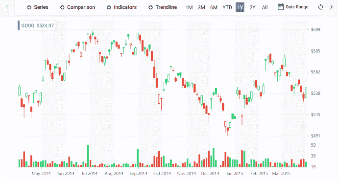
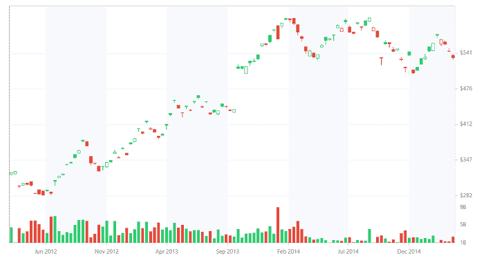
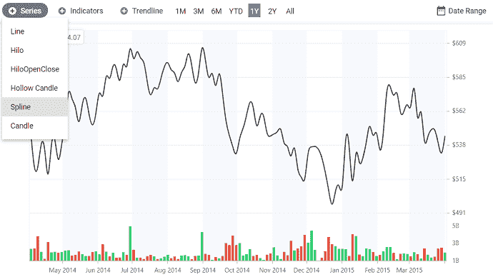
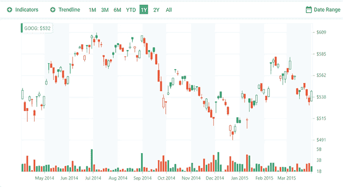
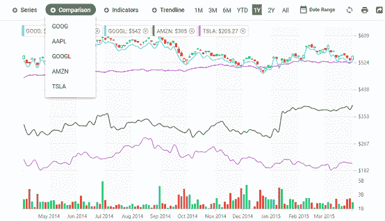

# 如何在 Angular 中创建股票图表

> 原文：<https://dev.to/syncfusion/how-to-create-stock-charts-in-angular-4ho6>

投资者和分析师通常会在投资任何股票之前分析其价格走势，因此这种趋势的图形表示使分析变得更加容易。图表和范围导航器在跟踪和可视化公司特定时期的股票价格方面起着关键作用。在这篇博客中，我们将介绍如何用 Syncfusion [角度图](https://www.syncfusion.com/angular-ui-components/angular-charts)和[范围导航器](https://blog.syncfusion.com/post/create-stock-charts-using-syncfusion-angular-charts.aspx)控件来表示股票分析。

[](https://res.cloudinary.com/practicaldev/image/fetch/s--CrsonWJz--/c_limit%2Cf_auto%2Cfl_progressive%2Cq_auto%2Cw_880/https://blog.syncfusion.com/wp-content/uploads/2018/08/1-2.png)

在深入讨论这个主题之前，让我们先回顾一下角度图表和范围导航器的基本功能。

## 概述

使用我们的角度图表组件中丰富的功能集，可以执行令人惊叹的数据可视化和分析。我们的角度图表支持 25 种类型的图表与用户互动，如缩放，工具提示，选择等。角度范围导航器提供了从大量数据中选择小范围数据的能力。另一方面，范围导航器有助于缩放主图表区中的数据。这两个组件在财务仪表板中扮演着关键角色，用于过滤和可视化特定时间段的数据。

## 模块注射

当您希望保持应用程序轻量级时，模块注入非常有用，因为 Syncfusion 角度图和范围导航器中的所有功能都是模块化的，可以作为单独的服务提供，您可以只使用应用程序所需的模块。例如，当您想要用蜡烛图可视化您的财务数据时，在提供者中注入[candleserviceservice](https://ej2.syncfusion.com/angular/documentation/api/chart/#candleseriesmodule)就足够了。

## 定制股票仪表盘

让我们创建一个仪表板，以直观显示和比较 2012 年至 2015 年期间不同公司(如 GOOG、AAPL、GOOGL、AMZN 和 TSLA)的股价。我们将使用不同类型的序列来可视化这些股票的价格，如[蜡烛线](https://ej2.syncfusion.com/angular/documentation/chart/financial-types/#candle)、[空心蜡烛线](https://ej2.syncfusion.com/aspnetcore/documentation/chart/financial-types/#candle)、[线](https://ej2.syncfusion.com/angular/documentation/chart/chart-types/#line-charts)、 [hilo](https://ej2.syncfusion.com/angular/documentation/chart/financial-types/#hilo) 、 [HiLoOpenClose](https://ej2.syncfusion.com/angular/documentation/chart/financial-types/#high-low-open-close) 和[样条线](https://ej2.syncfusion.com/angular/documentation/chart/chart-types/#line-charts)。

除此之外，我们将为这些数据添加[指标](https://ej2.syncfusion.com/angular/documentation/chart/technical-indicators/)和[趋势线](https://ej2.syncfusion.com/angular/documentation/chart/trend-lines/)，以根据历史价格、交易量和未平仓合约分析过去并预测未来的市场趋势。

为了帮助您选择和可视化不同期间的数据，示例中包含了一个期间选择器功能。除了这些功能，我们还可以选择[打印和导出](https://ej2.syncfusion.com/angular/documentation/chart/chart-print/)报告以备将来使用。

## 入门

要创建角度应用程序，使用以下命令全局安装 [Angular CLI](https://github.com/angular/angular-cli) 。

```
 npm install -g @angular-cli 
 ng new my-app 
```

创建角度应用程序后，使用以下命令安装包含图表和范围导航器组件的图表包。

```
 cd my-app
 npm install @syncfusion/ej2-ng-charts --save 
```

现在创建一个角度组件来呈现图表和范围导航器。

```
 F:\Development\Blogs\my-app>ng generate component chart 
```

接下来，在 **app.module.ts** 文件中导入图表和范围导航器模块。

```
import { BrowserModule } from '@angular/platform-browser';
import { NgModule } from '@angular/core';
import { AppComponent } from './app.component';
import { ChartComponent } from './chart/chart.component';
//ej2 Chart module
import { ChartAllModule, RangeNavigatorAllModule} from '@syncfusion/ej2-ng-charts';

@NgModule ({
  declarations: [ AppComponent,ChartComponent  ],
  imports: [ BrowserModule, ChartAllModule, RangeNavigatorAllModule],
  bootstrap: [AppComponent]
})
export class AppModule { } 
```

初始化**chart.component.html**文件中的图表和范围导航组件。

```
<ejs-rangenavigator> </ejs-rangenavigator>
<ejs-chart> </ejs-chart> 
```

## 填充所需数据

首先，让我们在初始加载时用蜡烛线和柱子系列来可视化 GOOG 的股价。在 app.module.ts 文件的提供者中定义 [CandleSeriesService](https://ej2.syncfusion.com/angular/documentation/api/chart/#candleseriesmodule) 和 [ColumnSeriesService](https://ej2.syncfusion.com/angular/documentation/api/chart/#columnseriesmodule) 。

```
import { CandleSeriesService, ColumnSeriesService } from '@syncfusion/ej2-ng-charts/src/chart/chart.component';
@NgModule ({
  providers: [CandleSeriesService, ColumnSeriesService],
})
export class AppModule { } 
```

然后，将该公司股票价格的 JSON 数据添加到您的应用程序中，并将其分配给序列中的 [dataSource](https://ej2.syncfusion.com/angular/documentation/api/chart/seriesDirective/#datasource) 属性。

```
public stockData: object[] = [
    { x: new Date("2012-04-02"), open: 85.975716, high: 88.395714, low: 85.76857, close: 88.375717, volume: 14958790 },
    { x: new Date("2012-04-03"), open: 89.614288, high: 90.315712, low: 88.93, close: 89.902855, volume: 20863990 },
    { x: new Date("2012-04-04"), open: 89.192856, high: 89.408569, low: 88.14286, close: 89.187141, volume: 14324520 },
    { x: new Date("2012-04-05"), open: 89.568573, high: 90.665718, low: 89.057144, close: 90.525711, volume: 16032450 },
    { x: new Date("2012-04-09"), open: 89.447144, high: 91.405716, low: 89.328575, close: 90.889999, volume: 14938420 },
    { x: new Date("2012-04-10"), open: 91.418571, high: 92, low: 89.428574, close: 89.777145, volume: 22243130 },
] 
```

```
<ejs-chart id="chart-container" [primaryXAxis] = 'primaryXAxis' >
<e-series-collection>
<e-series [dataSource]='stockData' yAxisName='secondary' width='2' type='Column' xName='x' yName='volumn'> </e-series>
<e-series [dataSource]='stockData' width='2' type='Candle' xName='x' yName='close' high='high' low='low' open='open' close='close' volume='volume' name='Apple Inc' bearFillColor='#2ecd71' bullFillColor='#e74c3d'> </e-series>
</e-series-collection>
<ejs-chart> 
```

由于我们将在单独的行中显示体积，我们需要定制图表的轴和行，如下所示。

```
export class AppComponent implements OnInit {
  public primaryXAxis: Object;
  public primaryYAxis: Object;
  public rows: Object;
  public axes: Object;
  ngOnInit(): void {
   this.primaryYAxis = {
        plotOffset: 25,
        rowIndex: 1, opposedPosition: true,
        rangePadding: 'None',
    };
   this.primaryXAxis = { valueType: 'DateTime' };
   this.rows = [
     { height: '15%' },
     { height: '85%' }
   ];
   this.axes = [{
    name: 'secondary', opposedPosition: true, rowIndex: 0,
   }];
 }
} 
```

添加系列后，图表将如下图所示。
[T3】](https://res.cloudinary.com/practicaldev/image/fetch/s--pztK5Rfk--/c_limit%2Cf_auto%2Cfl_progressive%2Cq_auto%2Cw_880/https://blog.syncfusion.com/wp-content/uploads/2018/08/2-1.png)

## 周期选择器

使用前面的代码片段，GOOG 公司的股票价格细节已经可视化。现在，您可以使用范围导航器中的期间选择器功能来选择特定期间的数据。您可以通过在提供者中注入 [PeriodSelector](https://ej2.syncfusion.com/angular/documentation/range-navigator/period-selector/) 并在范围导航器中启用 [disableRangeSelector](https://ej2.syncfusion.com/angular/documentation/range-navigator/period-selector/#visibility-of-range-navigator) 属性来访问该功能。

```
import { ChartModule } from '@syncfusion/ej2-ng-charts';
import { PeriodSelector } from '@syncfusion/ej2-ng-charts';
  @NgModule({
  imports: [ BrowserModule, ChartModule ],
  providers: [PeriodSelector]
 }) 
```

现在将 GOOG 数据分配给范围导航器中的[数据源](https://ej2.syncfusion.com/angular/documentation/api/range-navigator/#datasource)属性，并定义您想要可视化数据的时间段。

```
` <ejs-rangenavigator valueType='DateTime' (changed)='rangeChanged($event)'
   disableRangeSelector=true [dataSource]='stockData' xName='x' yName='close' [periodSelectorSettings]='periods'>
  </ejs-rangenavigator>` 
```

```
export class AppComponent implements OnInit {
  public periods: Object;
  ngOnInit(): void {
  this.periods = {
        position: 'Top',
        periods: [{ text: '1M', interval: 1, intervalType: 'Months' },
                 { text: '3M', interval: 3, intervalType: 'Months' },
                 { text: '6M', interval: 6, intervalType: 'Months' },
                 { text: 'YTD' },
                 { text: '1Y', interval: 1, intervalType: 'Years' },
                 { text: '2Y', interval: 2, intervalType: 'Years' },
                 { text: 'All' }]
     };    
  }
} 
```

启用期间选择器后，将出现范围导航器，如下图所示。现在，您可以在范围导航器中与期间交互来选择数据。
[T3】](https://res.cloudinary.com/practicaldev/image/fetch/s--ByzEPAUW--/c_limit%2Cf_auto%2Cfl_progressive%2Cq_66%2Cw_880/https://blog.syncfusion.com/wp-content/uploads/2018/08/3-1.gif)

## 添加指标和趋势线

您可以将[指标](https://ej2.syncfusion.com/angular/documentation/api/chart/indicatorDirective/)和[趋势线](https://ej2.syncfusion.com/angular/documentation/api/chart/trendlineDirective/)添加到绘制的数据中，根据价格、交易量或未平仓合约分析过去并预测未来的市场趋势。使用 [selectorRender](https://ej2.syncfusion.com/angular/documentation/api/range-navigator/#selectorrender) 事件，您可以向范围导航器中的周期选择器添加定制元素。

```
<ejs-rangenavigator (selectorRender)='selectorRender($event)'>
</ejs-rangenavigator> 
```

```
export class AppComponent implements OnInit {  
   ngOnInit(): void {
     this.selectorRender = (args: IRangeSelectorRenderEventArgs) => { 
      let indicatorModel: ItemModel = {
        template: ' <button id="indicatorType">Indicators</button>', align: 'Left'
      };      
      let trendLineModel: ItemModel = {
        template: ' <button id="trendType">Trendline</button>', align: 'Left'
      };      
      args.selector.splice(0, 0, trendLineModel);
      args.selector.splice(0, 0, indicatorModel);       
    };  
  }
} 
```

现在，让我们使用下拉列表自定义范围导航器的 loaded 事件中的元素，以显示图表中可用的指示器和趋势线类型。使用下拉菜单的 changed 事件，您可以将选定的指标和趋势线动态添加到图表中。

```
<ejs-rangenavigator (loaded)='rangeLoaded($event)' >
</ejs-rangenavigator> 
```

```
export class AppComponent implements OnInit {
  ngOnInit(): void {
      this.rangeLoaded = (args: IRangeLoadedEventArgs) => {
       let indicatorType: DropDownButton = new DropDownButton({
         items: [{ text: 'TMA' }, { text: 'Bollinger Bands' }, { text: 'RSI' }, { text: 'SMA' },
         { text: 'MACD' }],
         iconCss: 'e-icons e-add', cssClass: 'e-caret-hide',
         select: (args: MenuEventArgs) => { 
              this.indicators.push(type);
              this.chart.indicators = this.chart.indicators.concat(indicator);
              this.chart.refresh();
        },
      });
     indicatorType.appendTo('#indicatorType');
     let trendType: DropDownButton = new DropDownButton({
        items: [{ text: 'Linear' }, { text: 'Polynomial' }, { text: 'MovingAverage' }],
        select: (args: MenuEventArgs) => {
          let type: TrendlineTypes = args.item.text;
          this.chart.series[1].trendlines[0].animation.enable = false;
          this.chart.series[1].trendlines[0].width = 3;
          this.chart.series[1].trendlines[0].type = type;
          this.chart.refresh();
        },
        iconCss: 'e-icons e-add', cssClass: 'e-caret-hide'
      });
      trendType.appendTo('#trendType');
   }
  }
 } 
```

[](https://res.cloudinary.com/practicaldev/image/fetch/s--RbtxLpWR--/c_limit%2Cf_auto%2Cfl_progressive%2Cq_66%2Cw_880/https://blog.syncfusion.com/wp-content/uploads/2018/08/4-1.gif)

## 添加不同的系列类型

您可以查看图表中不同系列类型的股票数据。例如，如果您想要查看股票的收盘价，请通过将股票的收盘价绑定到系列中的 [yName](https://ej2.syncfusion.com/angular/documentation/api/chart/seriesDirective/#yname) 属性来使用直线或样条系列。HiLo 系列可用于表示股票在特定时期的最高价和最低价。

使用 [selectorRender](https://ej2.syncfusion.com/angular/documentation/api/range-navigator/#selectorrender) 事件，您可以在周期选择器中添加一个下拉列表来列出系列类型。使用下拉菜单的 changed 事件，您可以动态更改系列类型。

```
<ejs-rangenavigator (selectorRender)='selectorRender($event)' (loaded)='rangeLoaded($event)'>
</ejs-rangenavigator> 
```

```
export class AppComponent implements OnInit {
    ngOnInit(): void {
     this.selectorRender = (args: IRangeSelectorRenderEventArgs) => {
      let seriesModel: ItemModel = {
        template: ' <button id="seriesType">Series</button>', align: 'Left'
      };
      args.selector.splice(0, 0, seriesModel);  
      };  
     }
     this.rangeLoaded = (args: IRangeLoadedEventArgs) => {
     let seriesType: DropDownButton = new DropDownButton({
        items: [{ text: 'Line' }, { text: 'Hilo' }, { text: 'HiloOpenClose' },
        { text: 'Hollow Candle' }, { text: 'Spline' }, { text: 'Candle' }],
        select: (args: MenuEventArgs) => {
          if (args.item.text === 'Candle') {
            this.chart.series[1].enableSolidCandles = true;
            this.chart.series[1].type = 'Candle';
          } else if (args.item.text === 'Hollow Candle') {
            this.chart.series[1].enableSolidCandles = false;
            this.chart.series[1].type = 'Candle';
          } else {
            this.chart.series[1].type = args.item.text;
          }
          this.chart.refresh(); 
        },
      });
      seriesType.appendTo('#seriesType');
  }
 }
} 
```

将序列类型从蜡烛线改为样条线，以查看股票的收盘价。
[T3】](https://res.cloudinary.com/practicaldev/image/fetch/s--QCqVc_fA--/c_limit%2Cf_auto%2Cfl_progressive%2Cq_auto%2Cw_880/https://blog.syncfusion.com/wp-content/uploads/2018/08/5.png)

## 添加用户交互

要跟踪一段时间或范围内的股价详情，请使用[十字准线](https://ej2.syncfusion.com/angular/documentation/api/chart/#crosshair)和[缩放](https://ej2.syncfusion.com/angular/documentation/api/chart/#zoomsettings)功能。有了这些特性，您可以将鼠标悬停在图表中的任何区域上，以在注释中显示该公司的股票价值。您还可以使用鼠标滚轮放大和缩小图表，以查看数据集。

```
<ejs-chart #chart id='chartStock' [tooltip]='tooltip' [crosshair]='crosshair' (tooltipRender)='tooltipRender($event)' [zoomSettings]='zoomSettings'>
<e-annotations>
<e-annotation content='<div class="e-annotation"id="annotation"></div>' coordinateUnits='Pixel' region='Chart' x='3%' y='12%'
verticalAlignment='Bottom' horizontalAlignment='Far'>
</e-annotation>
</e-annotations>
</ejs-chart>` 
```

```
export class AppComponent implements OnInit {   
    ngOnInit(): void {
      this.primaryYAxis = {
         crosshairTooltip: { enable: true }, 
      }
      this.primaryXAxis = {
         crosshairTooltip: { enable: true }, 
      }
      this.tooltip = { enable: true, shared: true, header: '', 
                       format: '${point.x} High : <b>${point.high} </b>Low :' +
                               '<b>${point.low} </b>Open : <b>${point.open} </b>Close :' +
                               '<b>${point.close} </b>Volume : <b>${point.volume}</b>'
      };
     this.zoomSettings = { enableMouseWheelZooming: true, mode: 'X', toolbarItems: [] };
     } 
```

[](https://res.cloudinary.com/practicaldev/image/fetch/s--vJUDSYoG--/c_limit%2Cf_auto%2Cfl_progressive%2Cq_66%2Cw_880/https://blog.syncfusion.com/wp-content/uploads/2018/08/6.gif)

## 定制

在为图表设置了趋势线、指标和范围之后，最后要做的就是导出或打印它。为此，在周期选择器的 click 事件中添加一个按钮来打印或导出图表，如下面的代码所示。

```
<ejs-rangenavigator (selectorRender)='selectorRender($event)' (loaded)='rangeLoaded($event)'>
</ejs-rangenavigator> 
```

```
export class AppComponent implements OnInit {  
  ngOnInit(): void {
     this.selectorRender = (args: IRangeSelectorRenderEventArgs) => {
       let printModel: ItemModel = {
        template: ' <button id="print"></button>', align: 'Right', tooltipText: 'Print'
        };
       let exportModel: ItemModel = {
        template: ' <button id="export"></button>', align: 'Right', tooltipText: 'Export'
       };      
       args.selector.push(printModel);
       args.selector.push(exportModel);        
    };  
   this.rangeLoaded = (args: IRangeLoadedEventArgs) => {
      let print: Button = new Button({
        iconCss: 'e-icons e-play-icon', cssClass: 'e-flat'
      });
      print.appendTo('#print');
      document.getElementById('print').onclick = () => {
      this.chart.print(['chartStock']);
   };
 }
} 
```

在前面的代码示例中，GOOG 数据用于表示公司的股票价格。您还可以动态绘制其他公司的数据，并使用 period selector 元素在单个视图中比较它们的股票价值。在下面的截图中，我们显示了其他公司——AAPL、谷歌、AMZN 和 TSLA——使用 line 系列的接近价格。
[T3】](https://res.cloudinary.com/practicaldev/image/fetch/s--990CFq5n--/c_limit%2Cf_auto%2Cfl_progressive%2Cq_auto%2Cw_880/https://blog.syncfusion.com/wp-content/uploads/2018/08/7.png)

## 总结

在这篇博文中，我们看到了如何使用和定制图表和范围导航器控件的内置功能来创建股票图表。我们希望你喜欢它，并继续阅读像这样的关于如何为现实世界的应用定制 Syncfusion 控件的帖子。

我们建议您通过在 [GitHub](https://github.com/syncfusion/ej2-angular-ui-components/tree/master/components/charts) 上的源代码、交互式[样本浏览器](https://ej2.syncfusion.com/angular/demos/#/material/chart/line)和[文档](https://ej2.syncfusion.com/angular/documentation/chart/)亲自查看图表和范围导航器组件，探索所有的特性和 API。此外，一定要查看一下 GitHub 上的股票图表，它随时可以运行，看看创建和配置图表是多么容易。

如果您有任何问题或意见，请在下面的评论中告诉我们。您也可以通过我们的[支持论坛](https://www.syncfusion.com/forums)或 [Direct-Trac](https://www.syncfusion.com/support/directtrac/incidents) 联系我们。我们随时乐意为您提供帮助！

如果你喜欢这篇博文，我们认为你也会喜欢下面的免费电子书:

[JavaScript 简洁地](https://www.syncfusion.com/ebooks/javascript)
[ECMAScript 6 简洁地](https://www.syncfusion.com/ebooks/ecmascript_6_succinctly)
[AngularJS 简洁地](https://www.syncfusion.com/ebooks/angularjs)
[Angular 2 简洁地](https://www.syncfusion.com/ebooks/angular2_succinctly)

帖子[使用 Syncfusion 角度图](https://blog.syncfusion.com/post/create-stock-charts-using-syncfusion-angular-charts.aspx)创建股票图表最早出现在 [Syncfusion 博客](https://blog.syncfusion.com)上。