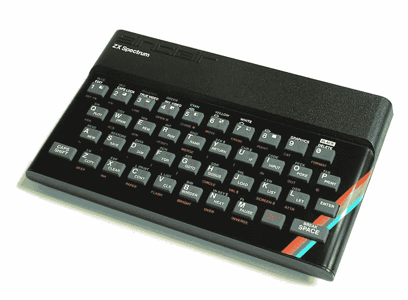
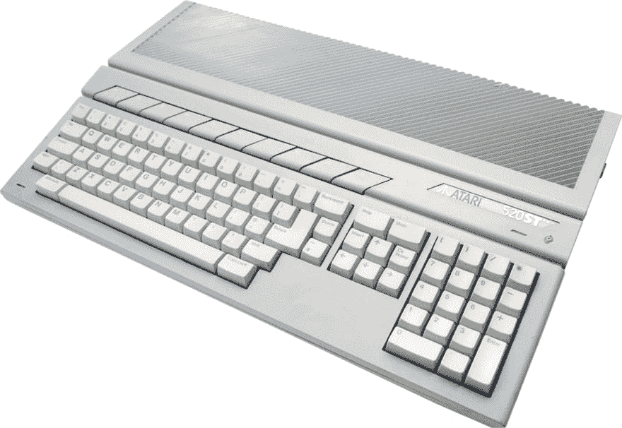
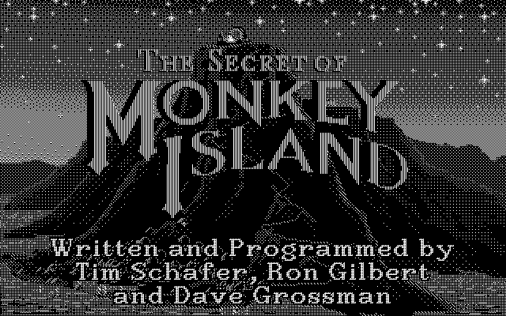
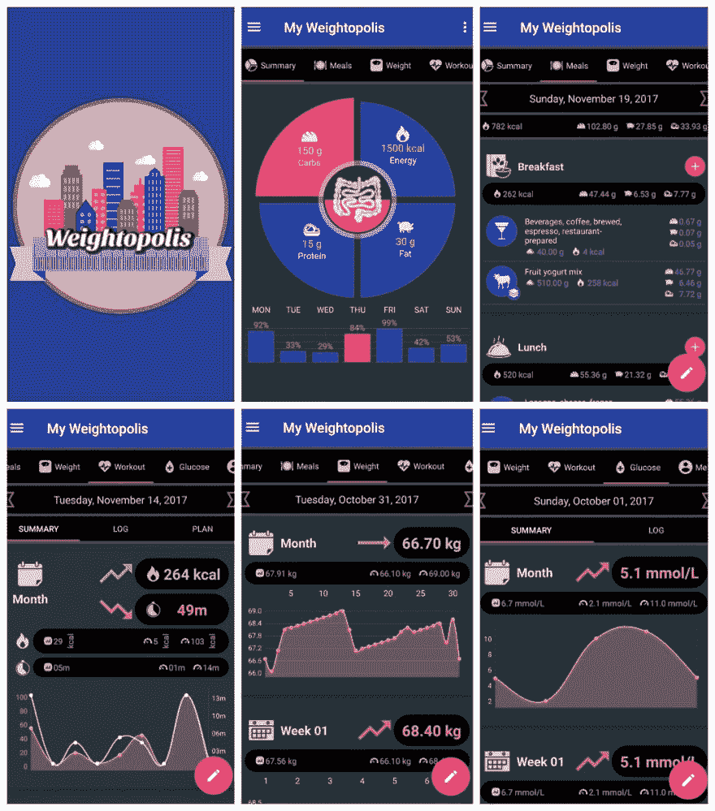
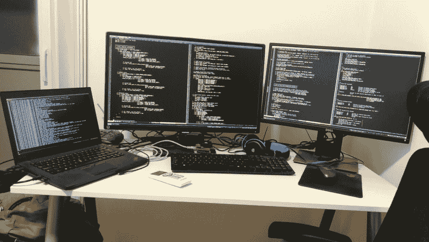

# 程序员的进化

> 原文：<https://dev.to/vimmer9/the-evolution-of-a-programmer-290o>

> **注**:本文已被以下文章取代，该文章最初发表在 [Soshace 的博客上。](https://blog.soshace.com/en/freelance/why-working-remotely-is-a-double-edged-sword/)
> 
>  [## 为什么远程工作是一把双刃剑
> 
> ### damir Franusic Aug 17 ' 198min read
> 
> #blogging #mentalhealth #career #productivity](/vimmer9/why-working-remotely-is-a-double-edged-sword-8m3)

> **免责声明**:请记住，我刚刚加入这个社区，由于我目前的精神状态，我觉得我不得不隐喻性地*说出我的心声*。如果你觉得这篇文章无聊和/或不相关，你可以随时停止阅读。

# 那现在怎么办？

这是我在这里的第一篇文章，也可能是我写的第一篇博客文章。我最近经历了人生中的一个转折点，感觉很奇怪，不同于我以前遇到的任何事情，对自己来说完全陌生的感觉很奇怪，或者更好，令人困惑。

# 背景

我叫达米尔，在克罗地亚出生和长大(很不幸)，目前住在萨格勒布。不幸的是，我使用了**这个词**,这可能会在沸腾的民族主义大杂烩中引起一股负面情绪，克罗地亚的大部分地区确实如此，但这与我无关。我一直与政治保持距离，从未对国家象征、政党或任何爱国主义的东西产生任何形式的依恋。总的来说，我一直忠于计算机和技术。最开始，也是我第一次面对当时被认为是工程学巅峰的东西是这样的:

我对这个设备很着迷，但当时我太小了，除了玩游戏和敬畏地看着那些磁带在我的小电视机上神奇地转换成移动图像之外，我什么都不会做。对于年轻一代，你可以在[维基百科](https://en.wikipedia.org/wiki/ZX_Spectrum)上找到更多关于 **ZX 光谱**的信息。

随着时间的推移，我的好奇心越来越强，我慢慢地开始学习编程语言，这样我就可以最终解决驻留在我的模拟磁带中的想象中的动画角色的日益增长的神秘，当在我的随身听中播放这些磁带时，这些磁带发出的令人难以忍受的刺耳噪音不知何故被赋予了生命。从那一刻起，技术和软件完全占据了我的大脑，并一直困扰着它。

我有史以来第二棒的设备是 Atari ST T1，当我打开它，不得不一直更换 3.5 英寸软盘时，我的感觉无法用语言来形容。哦，是的，没有更多的磁带，我跳过了 5.25“时代，直接到 3.5“魔术。这仍然主要是关于游戏，但与我这一代玩 **Kill-em-all** 类型游戏的大多数人不同，我总是不知何故粘在屏幕上玩冒险游戏，像**的猴岛的秘密**，这可能是(现在仍然是)我最喜欢的游戏之一。下图是雅达利 ST 电脑和我最喜欢的游戏的截图。我在单色 12 英寸雅达利屏幕上播放了它，它非常棒。

#### 雅达利圣和猴岛的秘密

[T6】](https://res.cloudinary.com/practicaldev/image/fetch/s--a04TC7sL--/c_limit%2Cf_auto%2Cfl_progressive%2Cq_auto%2Cw_880/https://www.mobygames.cimg/shots/l/800214-the-secret-of-monkey-island-atari-st-screenshot-title-screen.png)

在雅达利 ST 时代之后，一切都开始加速，我从 **286** 到**奔腾**和 **Windows 95** 。当时我已经忙于编程，我选择的语言是 [Pascal](https://en.wikipedia.org/wiki/Pascal_(programming_language)) 。我花了相当多的时间做各种有用和无用的编码来积累经验，当我找到我的第三份工作时，我们部门 50%的人都在运行 Linux，大部分是 Fedora。因为这项工作是关于运行在 Linux 服务器上的 php 的，所以试着把它作为一个客户端操作系统似乎是合乎逻辑的。这是我做过的最好的决定，也有点幸运的是，我有一个非常好的、知识渊博的导师，他从不缺少建议，并在路上的每一步都指引我正确的方向。说实话，我一直使用 Linux 直到今天，我只选择了 Gentoo 作为我的发行版。在那些年里，我尝试过许多不同的语言、脚本和框架，就我所能记得的，下面是清单:

*   帕
*   德尔斐
*   服务器端编程语言（Professional Hypertext Preprocessor 的缩写）
*   动态服务器页面
*   斯卡拉
*   Java 语言(一种计算机语言，尤用于创建网站)
*   C++
*   C
*   Nvidia CUDA
*   人寿保险商协会(Life Underwriters Association)
*   eBPF(有限制的 C)
*   Java Script 语言
*   动作脚本
*   HTML/CSS(无脚本)
*   React.js
*   节点. js
*   引导程序
*   SCSS
*   XML/XSLT

# 当下

从所有这些不同的技术中，我发现常规的 C 是我最喜欢的。它定义良好，简单快速，因为我用它进行系统和套接字编程，所以它非常适合。我也发现了自己的定位；似乎创建解析器( **Bison/Flex** )和实现协议解析器( **Wireshark** )是我隐藏的天赋。当我沉浸在这类项目中时，我感到一种奇怪的吸引力和满足感。

如今的趋势是不断增加更多更高的层，以使编程语言更简单，并使学习曲线不那么陡峭。我更喜欢低级语言，我并不想贬低这种新趋势，一点也不想。我只会打自己耳光，因为我的大部分工作也是在与 **React.js** 、 **Node.js** 和 **Android (Java)** 一起做项目。

> Damir Fran usic[@ vim mer 9](https://dev.to/vimmer9)我的[#失败](https://twitter.com/hashtag/failed) [#Android](https://twitter.com/hashtag/Android) 和 [#React](https://twitter.com/hashtag/React) 项目用于监测你的健康、体重、血糖等。后端在 [#php](https://twitter.com/hashtag/php) 和 [#mysql](https://twitter.com/hashtag/mysql) 中完成，不想成为 [#fullstack](https://twitter.com/hashtag/fullstack) 服务商😁。我把它贴在这里是为了提醒自己，有时候，生活对你有不同的安排。2019 年 7 月 23 日上午 11:5702

与玩雅达利 st 的黄金时代相比，我现在的设置看起来更像这样:

> Damir Fran usic[@ vim mer 9](https://dev.to/vimmer9)[@ nix craft](https://twitter.com/nixcraft)每个屏幕至少有 10 个终端标签12:54PM-04 2019 年 8 月0

# 人民

请记住，我刚刚加入这个社区，由于我目前的精神状态，我觉得我不得不隐喻性地*说出我的心声*。如果你觉得这篇文章无聊和/或不相关，或者你自己已经有足够的问题去听某个随机的家伙的意大利面条般的漫谈，你可以随时停止阅读。

无论如何，我想谈的是我一直存在的问题，那就是维持私人关系和自尊的问题。在过去的 8 年左右的时间里，我决定尝试建立一家自己的公司，如果你愿意，可以创业，看看会发生什么。我预计这将是大量的工作，长时间和与市场上其他竞争对手的持久战斗(电信相关业务)。长话短说，由于一些错误的决定和与我的联合创始人的不稳定关系，一切都以一场灾难告终。

我在这里想说的是，激发最初想法并通常维持相当长时间的热情只能到此为止。一旦你的热情开始下降，感觉就像你有戒断症状，因为你服用了一些想象中的高科技药物，这些药物让你坚持了这么多年。只有那时，你的视野才变得明朗，面具才会摘下。不幸的是，这个时刻也预示着即将到来的失控螺旋，这可能已经过去了，只是潜伏着，等待着让人们知道它的存在。

在我看来，创业公司的唯一支柱是人，而不是花哨的技术、产品、编程语言、网站等。我现在知道了，我也开始理解一些术语，比如**未发明综合症、**独角兽**开发者、**团队合作**以及一些新的术语，比如**10x 工程师**。回想起来，我似乎做了一切与我应该做的相反的事情，基本上是在与我自己和我的幸福作对，并且完全不顾后果。**

伤害已经造成，从那以后我的生活一直处于混乱之中。也许我只是一个性格软弱、反应过度敏感的人，这很难说。我慢慢接受了把我的状态归类为**精疲力竭**可能是相当准确的。

# 未来

我们期待已久的时刻，这场闹剧的终结。我已经开始了另一个项目的工作，并且已经到了我再次感到*筋疲力尽*并且只能盯着屏幕希望它会以某种方式开始编写代码的时候。我很确定，所有这一切都源于这样一个事实:在过去的 8 年里，我习惯了独自工作，有时一天工作 12 个小时，以至于加入一家公司并在一个团队中工作的想法会引起焦虑，并加深那种无能和自卑的感觉。

发布这篇文章的原因可能是我的潜意识告诉我发泄出来，做一些事情来促进急需的改变。我也想分享一下我混乱而难以理解的想法，看看是否还有其他人有类似的经历或问题。我不是要求一个“那里”的演讲或鼓舞士气的讲话，只是别人的经验，如果他们愿意分享的话。

感谢你的阅读，如果你能消化所有这些，我为你鼓掌。

#### 我最喜欢的名言

> 人们谈论预感好像它是一件奇怪的事情。不是的。只是记错了方向。“——博士是谁。