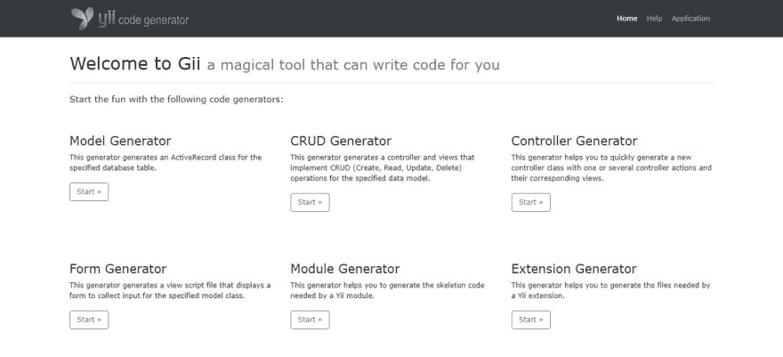
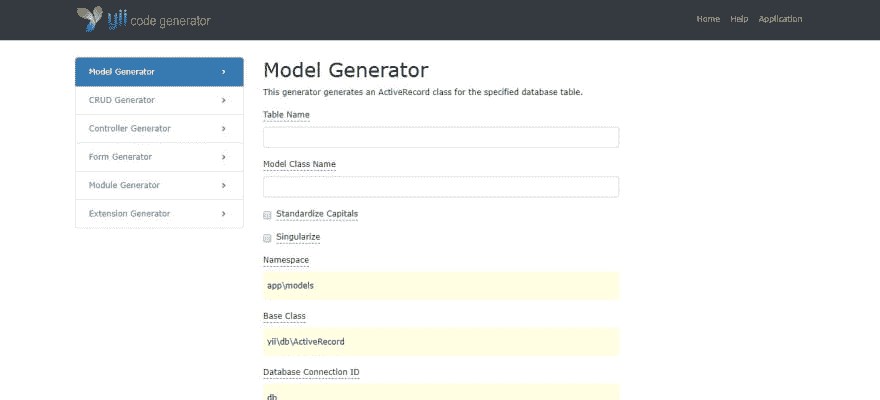
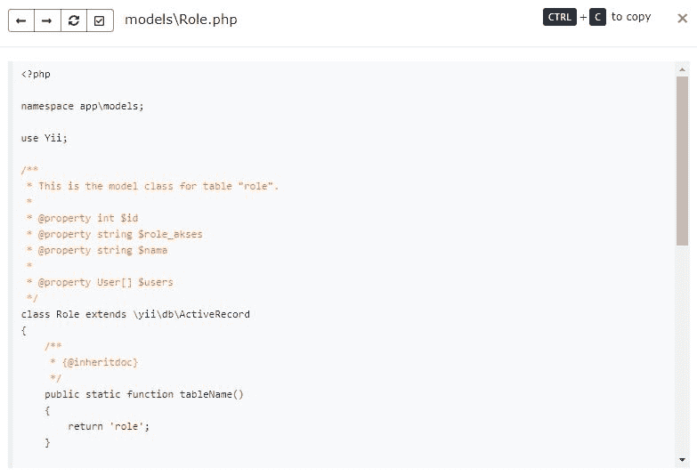
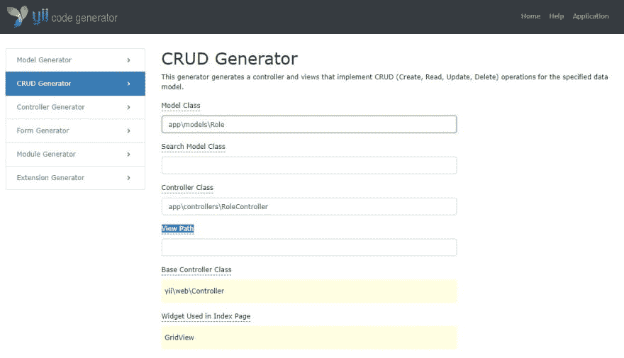

# Yuk Belajar Yii2 第 5 部分

> 原文::t0【https://dev . to/farid _ aditya/Yu-belajar-yii 2-part 5-5 IMF】

#### Berkenalan Dengan Gii

Hallo, maaf, beberapahari ini saya tidak sempat membuat lajutan dari seri ini, dikarenakan beberapa kesibukan. Ok kita langsung saja. Kali ini kita akan membahas Gii, modul ajaib yang sangat membatu kita.

Menurut Dokumen **Yii** , **Gii** adalah kode generator otomatis yang berguna untuk mengimplementasikan kode-kode yang secara umum digunakan dalam sebuah web site. biasanya kode-kode tersebut merupakan implementasi dari CRUD.

Sesuai judul, pada pembahasan kita kali ini, kita akan membahas beberapa topik yang berhubungan dengan **Gii** :

*   Membuat Databas beserta tabel-tabel yang diperlukan.

*   Menghubungkan **Yii** dengan Database.

*   Membuat Model, Controller dan View menggunakan **Gii** .

#### Membuat database

Pada bahasan sebelumnya kita sudah melihat class diagram ( **Lebit tepatnya ERD karena saya dalam menggambarnya menggunakan MySqlWorkbench** , *selain itu jika penggambaran class diagram tanpa method-method dari class tersebut penggambaranya akan sangat serupa dengan ERD* ) dari aplikasi sederhana yang akan kita buat, beserta beberapa deskripsinya ( jika terlewat bisa melihat di link [Yuk Belajar Yii Part 4](https://dev.to/farid_aditya/yuk-belajar-yii-part-4-19f1) ). kali ini kita akan mengimplementasikan class diagram tersebut ke dalam database. untuk itu kita bisa membuat tabel sesuai [file ini](https://drive.google.com/file/d/1oMSgKfdT6N8qc6-f9mAA0CmJuu-VY3Iq/view?usp=sharing) atau dengan sql dibawah ini :

```
CREATE TABLE `dosen` (

  `id` int(11) NOT NULL,
  `nama` varchar(45) NOT NULL,
  `tanggal_lahir` varchar(45) NOT NULL,
  `alamat_rumah` varchar(45) DEFAULT NULL,
  `foto` varchar(145) DEFAULT NULL,
  `user_id` int(11) NOT NULL
) ENGINE=InnoDB DEFAULT CHARSET=utf8;

CREATE TABLE `jadwal` (
  `id` int(11) NOT NULL,
  `matakuliah_id` int(11) NOT NULL,
  `ruang_kelas_id` int(11) NOT NULL,
  `hari` smallint(6) DEFAULT NULL,
  `jam` time DEFAULT NULL
) ENGINE=InnoDB DEFAULT CHARSET=utf8;

CREATE TABLE `jadwal_mahasiswa` (
  `id` int(11) NOT NULL,
  `jadwal_id` int(11) NOT NULL,
  `mahasiswa_id` int(11) NOT NULL
) ENGINE=InnoDB DEFAULT CHARSET=utf8;

CREATE TABLE `mahasiswa` (
  `id` int(11) NOT NULL,
  `nama_mahasiwa` varchar(45) NOT NULL,
  `tanggal_lahir` date NOT NULL,
  `user_id` int(11) NOT NULL,
  `alamat_rumah` tinytext,
  `foto` varchar(145) DEFAULT NULL
) ENGINE=InnoDB DEFAULT CHARSET=utf8;

CREATE TABLE `matakuliah` (
  `id` int(11) NOT NULL,
  `dosen_id` int(11) NOT NULL,
  `nama_matakuliah` varchar(45) DEFAULT NULL
) ENGINE=InnoDB DEFAULT CHARSET=utf8;

CREATE TABLE `role` (
  `id` int(11) NOT NULL,
  `role_akses` varchar(45) NOT NULL,
  `nama` varchar(45) NOT NULL
) ENGINE=InnoDB DEFAULT CHARSET=utf8;

CREATE TABLE `ruang_kelas` (
  `id` int(11) NOT NULL,
  `lantai` smallint(1) NOT NULL,
  `no_ruang` smallint(3) NOT NULL,
  `jenis_ruang` smallint(6) NOT NULL,
  `projector` smallint(6) NOT NULL,
  `pendingi_ruang` smallint(6) NOT NULL
) ENGINE=InnoDB DEFAULT CHARSET=utf8;

CREATE TABLE `user` (
  `id` int(11) NOT NULL,
  `role_id` int(11) NOT NULL,
  `username` varchar(255) COLLATE utf8_unicode_ci NOT NULL,
  `email` varchar(255) COLLATE utf8_unicode_ci NOT NULL,
  `password` varchar(255) COLLATE utf8_unicode_ci NOT NULL,
  `auth_key` varchar(32) COLLATE utf8_unicode_ci NOT NULL,
  `access_token` varchar(255) COLLATE utf8_unicode_ci DEFAULT NULL,
  `created_at` date NOT NULL,
  `updated_at` date NOT NULL
) ENGINE=InnoDB DEFAULT CHARSET=utf8 COLLATE=utf8_unicode_ci; 
```

Jika malas untuk membuatnya bisa mengunduh [File Mysql Workbench](https://drive.google.com/file/d/1xR2h9QIrK_T7MkhW2xVLFAXVKOM_KpRE/view?usp=sharing) dan menjalankanya. untuk pembahasan cara mebuat database dan tabelnyatidak akan di bahas detai disini.

#### Koneksi Yii Dengan Database

Sebelum menggunakan **Gii** kita perlu menghubungkan aplikasi Yii dengan database, untuk itu kita bisa perlu memodifikasi file **db.php** yang terletak di dalam folder **config** . Contohnya seperti dibawah ini :

```
<?php

return [
    'class' => 'yii\db\Connection',
    'dsn' => 'mysql:host=localhost;dbname=tutorial',
    'username' => 'root',
    'password' => 'root',
    'charset' => 'utf8',

    // Schema cache options (for production environment)
    //'enableSchemaCache' => true,
    //'schemaCacheDuration' => 60,
    //'schemaCache' => 'cache',
]; 
```

**Keterangan**

*   **class' = > 'yii\db\Connection'** memberitahukan file config bahwa kita menggunakan classs **Connection.php** terletak pada **Vendor/yiisoft/yii2/db** yang merupakan extend dari class **componen.php** yang artinya dbConnectin inimerupakan componen dalam **Yii**

*   **'dsn' = > 'mysql:host=localhost;dbname=tutorial'** , memberitahukan bahwa kita menggunakan mysql di server localhost dengan nama database tutorial, nilai/isi dari variable ini tergantung seting masing masing.

*   **‘用户名’=>‘根’**，用户名 dari 数据库 kita。

*   **‘密码’=>‘根’**，密码 dari 数据库 kita。

setelah semuanya selesai, cara paling mudah untuk mengecek koneksi aplikasi kita adalah langsung melalui **Gii** .

untuk memulai **Gii** caranya dengan mengarahkan browser ke halaman :

*   jika belum mengatur **漂亮的网址**:【http://yii2campus.test/index.php?r=gii T2】

*   Atau halaman ini jika sudah mengatur **Pretty URL** [http://yii2campus.test/gii](http://yii2campus.test/gii)

> Jika belum mengatur **Pretty URL** bisa melihat pada [part 03](https://dev.to/farid_aditya/yuk-belajar-yii2-part-3-2f7k) , Sebaiknya kita mengaturnya terlebih dahulu karena akan memudahkan kita ketika mencoba halaman yang kita buat.
> 
> Kita tidak membahas bagai mana cara seting Gii, karena secara default Gii sudah dapat berjalan pada Yii2\. Tetapi jika ada masalah bisa langsung melihat panduan lengkapnya pada link dibawah ini : [https://www.yiiframework.com/doc/guide/2.0/en/start-gii](https://www.yiiframework.com/doc/guide/2.0/en/start-gii)

#### Membuat Model, Controller dan View Menggunakan **Gii** .

Pertama kali membuka link dari **Gii** akan muncul halaman seperti di bawah ini,

[](https://res.cloudinary.com/practicaldev/image/fetch/s--ZvxDIHa4--/c_limit%2Cf_auto%2Cfl_progressive%2Cq_auto%2Cw_880/https://i.loli.net/2019/07/19/5d31dbd5a059236487.jpg)

selanjutnya yang pertama kita perlu buat adalah model, untuk itu kita klik start pada **Model Generator** . yang akan menampilkan halaman seperti ini,

[](https://res.cloudinary.com/practicaldev/image/fetch/s--pk3dDT0K--/c_limit%2Cf_auto%2Cfl_progressive%2Cq_auto%2Cw_880/https://i.loli.net/2019/07/19/5d31dd2942e4a13076.jpg)

untuk memastikan apakah **Yii** terhubung dengan database bisa di coba dengan mengklik pada field **Table Name** . Jika dalam Dropdown muncul nama table kita maka artinya database telah terhubung.

Jika semuanya telah siap ( koneksi dengan database telah terhubung, tabel telah dibuat ), maka bisa langsung bisa melakukan proses code generator.

#### 模型生成器

**Model Generator** adalah modul pertama dari Gii yang akan kita buka, karena class pertama yang kita harus buat adalah class **model** , karena modul **CRUD Generator** sangat bergantung pada **model** .

*   **角色**

Model pertama yang akan kita buar adalah model **Role** , selain karena model ini sangat simple tetapi model ini juga tidak bergantung dengan model lain.

Langkahnya adalah seperti :

*   表格名称:角色

*   模型类名:角色

*   标准化大写:beri tanda Cek

*   yang lainya abaikan saja, sesuai dengan aturan standar

Contohnya akan seperti gambar, di bawah ini :

[](https://res.cloudinary.com/practicaldev/image/fetch/s--zgestcHW--/c_limit%2Cf_auto%2Cfl_progressive%2Cq_auto%2Cw_880/https://i.loli.net/2019/07/23/5d37116997c1115655.jpg)

Setelah semuanya sesuai kita bisa mengklik tombol **Preview** , untuk melihat code hasil dari **Model Generatr** seperti di bawah, kita bisa mengklik **model/Role.php** di dalam box **Code File** :

[](https://res.cloudinary.com/practicaldev/image/fetch/s--VbEsRhL9--/c_limit%2Cf_auto%2Cfl_progressive%2Cq_auto%2Cw_880/https://i.loli.net/2019/07/23/5d3712dd0ff3296071.jpg)

Jika semua sudah ok kita bisa mengklik tombol **Generat** untuk menulis Kode ke dalam file.

*   **用户**

Karena model User.php adalah model bawaan dari Yii2dan sudah ada di dalam folder model, Sebaiknya kita tidak meng-overide model tersebut.

Tetapi karena akan ada sedikit perubahan dari model aslinya, maka kita akanmelakukan penyesuaian pada model secara manual. Masalah ini akan kita bahas pada bagian lain dari diskusi kita.

*   **Dosen**

Pada Diskusi [sebelumnya](https://dev.to/farid_aditya/yuk-belajar-yii-part-4-19f1) kita Sudah membuat model **Dosen.php** , tetapi kali ini kita tetap akan membuat model **Dosen.php** lagi dengan **Gii** . Perbedaanya dengan saat membuat model Role.php hanya pada bagian box **Code File** , jika pada model **Role.php** akan ada kotak ceklis dengan option **Create** untuk model dosen option dari kotak cek listnya akan berupa **overide** .

Untuk membuat model **Dosen.php** dari **Tabel Dosen** sama saja dengan cara membuat model **Role.php** dari **tabel Role** , dan begitu juga dengan model lainya akan sama.

Setelah membahas langkah lankah membuat model Role dan Dosen, dengan meggunakan Gii kita tidak akan membahas cara membuat model lainya. Tetapi untuk tetap dapat mengikuti diskusi ini diharapkan kita sudah membuat sebuat class dari model yang ada pada diagram dari diskusi kita pada [part 4](https://dev.to/farid_aditya/yuk-belajar-yii-part-4-19f1) .

Setelah sebelumnya kita membuat model dengan **Model Generator** , maka sekaran kita akan membuat Controller beserta viewnya, untuk keperluan ini kita dapat menggunakan **CRUD Genetator** .

Mengunakan **CRUD Generator** akan sedikit berbeda dari saatkita menggunakan **Model Generator** . Pada **CRUD Generator** kita perlu mengetahui **namespace** dari model yang ingin kita Generate Controllernya.

**Namesace** umumnya sesuai dengan nama folder, jika kita punya model **Dosen.php** di dalam folder models, maka namespacenya akan menjadi **app\models** . Jika kita perlu model Dosen dalam Controllers maka kita akan memanggil dengan **use app\models\Dosen** .

*   **角色控制器 dan Viewnya**

Seperti sebelumnya yang pertama akan kita buat adalah Role, langkahnya adalah sebagai berikut :

*   模型类:应用程序\模型\角色

*   搜索模型类:

*   控制器类:app\controllers\RoleController

*   查看路径:

Untuk Search **Model Class** dan **View Path** kita kosongkan saja, jika kosong artinya kita mengikuti Default dari **Gii** .

Setelah kita mengisi field field yang diperlukan, selanjutnya kita tinggal mengklik tombol **preview** kemudian jika udah sesuai kita tinggal menglik tombol **Generate** .

[](https://res.cloudinary.com/practicaldev/image/fetch/s--xTKsJTDD--/c_limit%2Cf_auto%2Cfl_progressive%2Cq_auto%2Cw_880/https://i.loli.net/2019/07/24/5d380df90bbee87088.jpg)

*   **UserController Dan Viewnya**

Jika dalam proses Model Generator tadi kita tidak membuat model User.php tetapi untuk UserController dan viewnya belum disediakan secara default oleh Yii. Jadi kitateta pelu membuatnya. langkahnya sama dengan point sebelumnya.

*   **控制器莱恩亚**

Seperti sebelumnya Controller lainya tetap kita buat, meskipun langkahnya tidak kita bahas disini.

#### Kesimpulan

Pada Diskusi kali ini, kita banyak membahas membuat **model, controller dan view** menggunakan fasilitas dari **Yii** yang bernama **Gii** . Fasilitas ini sangat membantu kita dalam membuat code program, tetapi code program yang dibuat oleh Gii mungkin masih belum memenuhi kebutuhan yang diperlukan oleh kita. Meskipun mungkin kirang sempurna tetapi Gii memberikan kita kerangka dasar dari program yang akan kita bangun.

Dalam Diskusi selanjutnya kita akan membahas tuning atau update kode program yang telah kita create menggunakan Gii. Hingga hasilnya sesuai dengan keperluan kita.