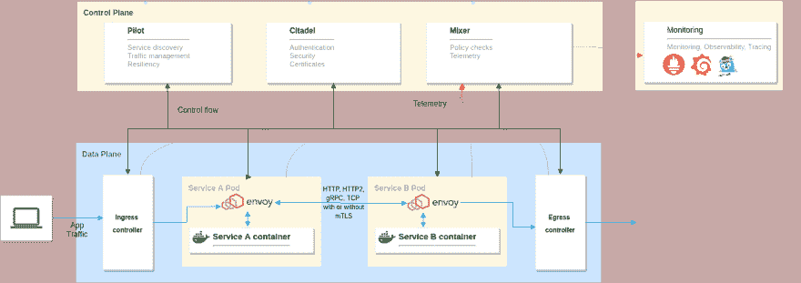
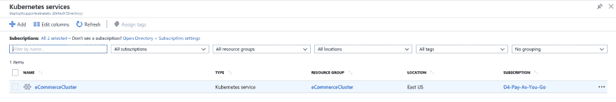
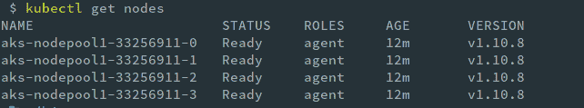
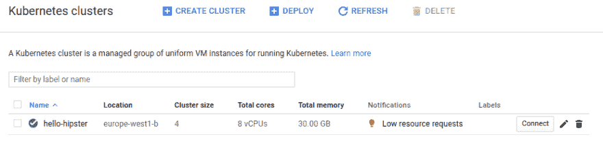
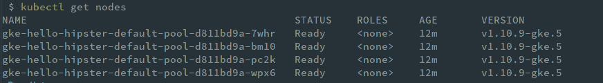
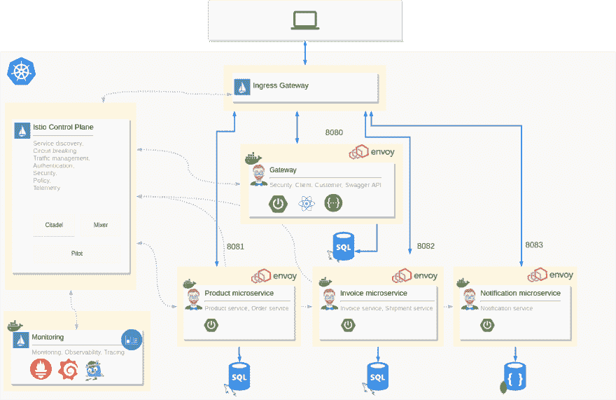
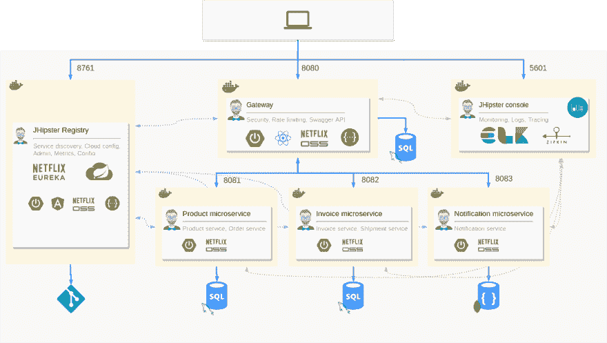

# 如何在 Kubernetes 上用 Istio 服务网格设置 Java 微服务

> 原文：<https://dev.to/deepu105/how-to-set-up-java-microservices-with-istio-service-mesh-on-kubernetes-5bkn>

*最初发布于[deepu . tech](https://deepu.tech/jhipster-microservices-with-istio-service-mesh-on-kubernetes/)T3。*

最初发布于 2018 年 11 月 17 日[媒体](https://medium.com/free-code-camp/jhipster-microservices-with-istio-service-mesh-on-kubernetes-a7d0158ba9a3)。
本文已于 2020 年 1 月更新，以便与 JHipster(7 . 0 . 0-beta 1)和 Istio(1.8.2)的最新版本配合使用。

* * *

Istio 现在是 DevOps 和 Cloud block 上最酷的孩子。对于那些没有密切关注的人来说，Istio 是一个分布式应用架构的服务网格，尤其是那些使用 Kubernetes 在云上运行的应用。Istio 与 Kubernetes 配合得非常好，好到你可能会认为它是 Kubernetes 平台的一部分。当你使用 Google Kubernetes 引擎时，像 Google Cloud 这样的平台甚至可以提供开箱即用的服务。

如果你还想知道，到底什么是服务网格或 Istio？那么我们来对 Istio 做一个概述。

## Istio

Istio 在分布式应用程序架构中提供了以下功能:

*   服务发现——传统上由平台提供，如[网飞尤里卡](https://github.com/Netflix/eureka/wiki)或[领事](https://www.consul.io/)。

*   自动负载平衡——你可能已经为此使用了[网飞·祖尔](https://github.com/Netflix/zuul/wiki)。

*   路由、断路、重试、故障转移、故障注入——想想[网飞丝带](https://github.com/Netflix/ribbon/wiki)、[海崔克斯](https://github.com/Netflix/Hystrix)等等。

*   针对访问控制、速率限制、A/B 测试、流量分流和配额的策略实施——同样，您可能已经使用 Zuul 完成了其中的一些任务。

*   度量、日志和跟踪——想想 [ELK](https://www.elastic.co/elk-stack) 或[堆栈驱动程序](https://cloud.google.com/stackdriver/)

*   安全的服务对服务通信

下面是 Istio 的架构。

[ ](https://res.cloudinary.com/practicaldev/image/fetch/s--8IpEP9KJ--/c_limit%2Cf_auto%2Cfl_progressive%2Cq_auto%2Cw_880/https://cdn-images-1.medium.com/max/2500/1%2A_STCerKXb4L3Hutyn4P5Gw.png) * Istio 建筑*

它可以分为两个不同的层面。

**数据平面**:由[特使](https://www.envoyproxy.io/)代理组成，部署为应用程序容器的侧柜。它们控制着容器的所有进出流量。

**控制平面**:使用 Pilot 管理和配置代理路由流量。它还配置 Mixer 来执行策略和收集遥测数据。它还有其他组件，如 Citadel，用于管理安全性，Galley，用于管理配置。

您还可以配置[格拉法纳](https://grafana.com/)、[普罗米修斯](https://prometheus.io/)、[耶格](https://www.jaegertracing.io/) / [齐普金](https://zipkin.io/)和[基亚利](https://www.kiali.io/)进行监控和观察，因为它们与 Istio 配合良好。如果您愿意的话，您可以使用这个或者使用您现有的监控堆栈。如果您使用 Istio 附带的演示配置文件，它会为 Grafana、Kiali 等预配置仪表板和配置。

我希望这提供了对 Istio 的概述，现在让我们关注本文的目标。

## 准备 Kubernetes 集群

首先，让我们准备一个 Kubernetes 集群来部署 Istio 和应用程序容器。遵循您喜欢的任何一个平台的说明。

### 先决条件

我们将使用 [istioctl](https://istio.io/latest/docs/reference/commands/istioctl/) 在 Kubernetes 集群上安装 Istio，使用 [kubectl](https://kubernetes.io/docs/reference/kubectl/kubectl/) 部署应用程序。

**:与 Kubernetes 交互的命令行工具。[安装](https://kubernetes.io/docs/tasks/tools/install-kubectl/)并进行配置。**

 **### 在 Azure Kubernetes 服务(AKS)上创建集群

如果你准备使用 Azure，那么安装 [**Azure CLI**](https://docs.microsoft.com/en-us/cli/azure/install-azure-cli?view=azure-cli-latest) 与 Azure 交互。安装并使用你的 Azure 账户登录(如果你还没有一个[免费账户](https://azure.microsoft.com/en-us/free/)，你可以创建一个)。如果没有，请跳过这一部分。

首先，让我们创建一个资源组。你可以在这里使用任何你喜欢的地区，而不是美国东部。

```
$ az group create --name eCommerceCluster --location eastus 
```

<svg width="20px" height="20px" viewBox="0 0 24 24" class="highlight-action crayons-icon highlight-action--fullscreen-on"><title>Enter fullscreen mode</title></svg> <svg width="20px" height="20px" viewBox="0 0 24 24" class="highlight-action crayons-icon highlight-action--fullscreen-off"><title>Exit fullscreen mode</title></svg>

创建 Kubernetes 集群:

```
$ az aks create \
  --resource-group eCommerceCluster \
  --name eCommerceCluster \
  --node-count 4 \
  --kubernetes-version 1.15 \
  --enable-addons monitoring \
  --generate-ssh-keys 
```

<svg width="20px" height="20px" viewBox="0 0 24 24" class="highlight-action crayons-icon highlight-action--fullscreen-on"><title>Enter fullscreen mode</title></svg> <svg width="20px" height="20px" viewBox="0 0 24 24" class="highlight-action crayons-icon highlight-action--fullscreen-off"><title>Exit fullscreen mode</title></svg>

`node-count`标志很重要，因为设置需要至少四个节点和默认 CPU 来运行一切。如果支持的话，你可以尝试使用更高的`kubernetes-version`,否则坚持 1.15

集群创建可能需要一段时间，所以请高枕无忧。🍹

创建集群后，通过运行下面的命令，从 kubectl 获取要使用的证书。它会自动将凭证注入到您的 kubectl 配置中的 ***~/下。kube/config***T4】

```
$ az aks get-credentials \
  --resource-group eCommerceCluster \
  --name eCommerceCluster 
```

<svg width="20px" height="20px" viewBox="0 0 24 24" class="highlight-action crayons-icon highlight-action--fullscreen-on"><title>Enter fullscreen mode</title></svg> <svg width="20px" height="20px" viewBox="0 0 24 24" class="highlight-action crayons-icon highlight-action--fullscreen-off"><title>Exit fullscreen mode</title></svg>

您可以在 Azure 门户中查看创建的集群:

[](https://res.cloudinary.com/practicaldev/image/fetch/s--2mUavvWQ--/c_limit%2Cf_auto%2Cfl_progressive%2Cq_auto%2Cw_880/https://cdn-images-1.medium.com/max/3284/1%2AyfLnHHc_N7VCkEY9vjNciQ.png)*AKS 的 Kubernetes 集群*

运行`kubectl get nodes`在命令行中查看它，并验证 kubectl 可以连接到您的集群。

[ ](https://res.cloudinary.com/practicaldev/image/fetch/s---t8X-i-v--/c_limit%2Cf_auto%2Cfl_progressive%2Cq_auto%2Cw_880/https://cdn-images-1.medium.com/max/2000/1%2Ak8xsRqQsvnquUhGPAh9TsA.png) *集群节点*

进入 **[安装和设置 Istio](#install-and-setup-istio)** 部分。

### 在 Google Kubernetes 引擎上创建集群(GKE)

如果你打算使用谷歌云平台(GCP)，那么安装 [**Gcloud CLI**](https://cloud.google.com/sdk/docs/) 与 GCP 互动。安装并使用您的 GCP 帐户登录(如果您还没有一个[免费帐户](https://console.cloud.google.com/freetrial)，您可以创建一个)。

您可以使用以下命令设置地区和区域，也可以在执行每个命令时传递区域选项。

```
$ gcloud config set compute/region europe-west1
$ gcloud config set compute/zone europe-west1-b 
```

<svg width="20px" height="20px" viewBox="0 0 24 24" class="highlight-action crayons-icon highlight-action--fullscreen-on"><title>Enter fullscreen mode</title></svg> <svg width="20px" height="20px" viewBox="0 0 24 24" class="highlight-action crayons-icon highlight-action--fullscreen-off"><title>Exit fullscreen mode</title></svg>

首先，我们需要一个 GCP 项目，您可以使用现有的项目，也可以使用 GCloud CLI 创建一个新项目，命令如下:

```
$ gcloud projects create jhipster-demo-deepu 
```

<svg width="20px" height="20px" viewBox="0 0 24 24" class="highlight-action crayons-icon highlight-action--fullscreen-on"><title>Enter fullscreen mode</title></svg> <svg width="20px" height="20px" viewBox="0 0 24 24" class="highlight-action crayons-icon highlight-action--fullscreen-off"><title>Exit fullscreen mode</title></svg>

将您想要使用的项目设置为默认项目，并启用容器 API。您还需要通过[谷歌云控制台](https://console.cloud.google.com/)
为项目启用计费

```
$ gcloud config set project jhipster-demo-deepu
$ gcloud services enable container.googleapis.com 
```

<svg width="20px" height="20px" viewBox="0 0 24 24" class="highlight-action crayons-icon highlight-action--fullscreen-on"><title>Enter fullscreen mode</title></svg> <svg width="20px" height="20px" viewBox="0 0 24 24" class="highlight-action crayons-icon highlight-action--fullscreen-off"><title>Exit fullscreen mode</title></svg>

现在让我们用下面的命令为我们的应用程序创建一个集群:

```
$ gcloud container clusters create hello-hipster \
    --cluster-version latest \
    --num-nodes 4 \
    --machine-type n1-standard-2 
```

<svg width="20px" height="20px" viewBox="0 0 24 24" class="highlight-action crayons-icon highlight-action--fullscreen-on"><title>Enter fullscreen mode</title></svg> <svg width="20px" height="20px" viewBox="0 0 24 24" class="highlight-action crayons-icon highlight-action--fullscreen-off"><title>Exit fullscreen mode</title></svg>

`num-nodes`和`machine-type`标志很重要，因为设置需要至少四个具有更大 CPU 的节点来运行一切。如果支持的话可以尝试使用最新的`cluster-version`，否则坚持 1.17。

集群创建可能需要一段时间，所以请高枕无忧。🍹

创建集群后，通过运行下面的命令，从 kubectl 获取要使用的证书。它会自动将凭证注入到您的 kubectl 配置中的 ***~/下。kube/config***T4】

```
$ gcloud container clusters get-credentials hello-hipster 
```

<svg width="20px" height="20px" viewBox="0 0 24 24" class="highlight-action crayons-icon highlight-action--fullscreen-on"><title>Enter fullscreen mode</title></svg> <svg width="20px" height="20px" viewBox="0 0 24 24" class="highlight-action crayons-icon highlight-action--fullscreen-off"><title>Exit fullscreen mode</title></svg>

您可以在 GCP GUI 中查看创建的集群。

[](https://res.cloudinary.com/practicaldev/image/fetch/s--Q9V7y0Gg--/c_limit%2Cf_auto%2Cfl_progressive%2Cq_auto%2Cw_880/https://cdn-images-1.medium.com/max/2000/1%2AZxNbIG4vqWJymTLweJpPyQ.png)*gke*上的立方簇

运行`kubectl get nodes`在命令行中查看它，并验证 kubectl 可以连接到您的集群。

[ ](https://res.cloudinary.com/practicaldev/image/fetch/s--WJp_00xk--/c_limit%2Cf_auto%2Cfl_progressive%2Cq_auto%2Cw_880/https://cdn-images-1.medium.com/max/2000/1%2AF5Qcd_GS_GSuA1PsJE7gvA.png) *集群节点*

## 安装并设置 Istio

按照以下步骤在本地机器上安装 Istio:

```
$ cd ~/

$ export ISTIO_VERSION=1.8.2

$ curl -L https://istio.io/downloadIstio | sh -

$ ln -sf istio-$ISTIO_VERSION istio

$ export PATH=~/istio/bin:$PATH 
```

<svg width="20px" height="20px" viewBox="0 0 24 24" class="highlight-action crayons-icon highlight-action--fullscreen-on"><title>Enter fullscreen mode</title></svg> <svg width="20px" height="20px" viewBox="0 0 24 24" class="highlight-action crayons-icon highlight-action--fullscreen-off"><title>Exit fullscreen mode</title></svg>

现在让我们使用 Istio 提供的图表在我们的 Kubernetes 集群上安装 Istio。

```
# Install the Istio CRDs and components from the Demo profile
$ istioctl install --set profile=demo -y

# Install Addons like Grfana, Prometheus, Kiali and Zipkin
$ cd ~/istio
$ kubectl apply -f samples/addons/grafana.yaml
$ kubectl apply -f samples/addons/prometheus.yaml
$ kubectl apply -f samples/addons/kiali.yaml
$ kubectl apply -f samples/addons/extras/zipkin.yaml 
```

<svg width="20px" height="20px" viewBox="0 0 24 24" class="highlight-action crayons-icon highlight-action--fullscreen-on"><title>Enter fullscreen mode</title></svg> <svg width="20px" height="20px" viewBox="0 0 24 24" class="highlight-action crayons-icon highlight-action--fullscreen-off"><title>Exit fullscreen mode</title></svg>

等待 pod 运行，它们将被部署到`istio-system`名称空间。

```
$ watch kubectl get pods -n istio-system 
```

<svg width="20px" height="20px" viewBox="0 0 24 24" class="highlight-action crayons-icon highlight-action--fullscreen-on"><title>Enter fullscreen mode</title></svg> <svg width="20px" height="20px" viewBox="0 0 24 24" class="highlight-action crayons-icon highlight-action--fullscreen-off"><title>Exit fullscreen mode</title></svg>

一旦 pod 处于运行状态，退出监视循环并运行下面的以获取入口网关服务的详细信息。这是唯一向外部 IP 公开的服务。

```
$ kubectl get svc istio-ingressgateway -n istio-system

NAME                   TYPE           CLUSTER-IP     EXTERNAL-IP
istio-ingressgateway   LoadBalancer   10.27.249.83   35.195.81.130 
```

<svg width="20px" height="20px" viewBox="0 0 24 24" class="highlight-action crayons-icon highlight-action--fullscreen-on"><title>Enter fullscreen mode</title></svg> <svg width="20px" height="20px" viewBox="0 0 24 24" class="highlight-action crayons-icon highlight-action--fullscreen-off"><title>Exit fullscreen mode</title></svg>

如果`istio-ingressgateway`显示外部 IP 为，等待几分钟，直到分配了 IP 地址。

外部 IP 在这里非常重要，让我们将它保存到一个环境变量中，以便在以后的命令中使用它。

```
$ export \
  INGRESS_IP=$(kubectl -n istio-system get svc \
  istio-ingressgateway \
  -o jsonpath='{.status.loadBalancer.ingress[0].ip}') 
```

<svg width="20px" height="20px" viewBox="0 0 24 24" class="highlight-action crayons-icon highlight-action--fullscreen-on"><title>Enter fullscreen mode</title></svg> <svg width="20px" height="20px" viewBox="0 0 24 24" class="highlight-action crayons-icon highlight-action--fullscreen-off"><title>Exit fullscreen mode</title></svg>

这里还需要为 Istio 做一个额外的步骤。自动创建的防火墙规则不会打开端口 15017。这个试点发现验证 webhook 需要这个，所以我们需要添加那个。首先，通过运行下面的命令获取 Istio 为项目添加的防火墙规则。如果不止一个，随便挑一个。如果您找不到任何规则，请运行不带过滤器的命令，并在描述中查找带有 Istio 的规则。

```
$ gcloud compute firewall-rules list --filter="name~k8s-fw-[0-9a-z]*" --format=json 
```

<svg width="20px" height="20px" viewBox="0 0 24 24" class="highlight-action crayons-icon highlight-action--fullscreen-on"><title>Enter fullscreen mode</title></svg> <svg width="20px" height="20px" viewBox="0 0 24 24" class="highlight-action crayons-icon highlight-action--fullscreen-off"><title>Exit fullscreen mode</title></svg>

现在，使用下面的命令更新该规则，添加所需的端口，用上面获取的规则的实际名称替换该名称，并将所有原始端口添加到列表

```
gcloud compute firewall-rules update <firewall rule name> --allow tcp:15017,tcp:80,tcp:443,<append all other protocol:port comma separated> 
```

<svg width="20px" height="20px" viewBox="0 0 24 24" class="highlight-action crayons-icon highlight-action--fullscreen-on"><title>Enter fullscreen mode</title></svg> <svg width="20px" height="20px" viewBox="0 0 24 24" class="highlight-action crayons-icon highlight-action--fullscreen-off"><title>Exit fullscreen mode</title></svg>

现在我们的 Kubernetes 集群已经为 Istio 做好了准备。🎉

*有关高级 Istio 设置选项，请参考[https://istio.io/docs/setup/kubernetes/](https://istio.io/docs/setup/kubernetes/)T3】*

## 创建微服务应用栈

在我之前的[帖子](https://deepu.tech/create-full-microservice-stack-using-j-hipster-domain-language-under-30-minutes)中，我展示了如何使用 **JHipster** 和 **JDL** 创建一个全栈微服务架构。如果你想了解更多细节，你可以在这里阅读帖子。在本练习中，我们将使用同一个应用程序，但不会使用我们之前使用的 Eureka 服务发现选项。此外，请注意，商店应用程序进一步分为网关和产品应用程序。

### 建筑

这是我们今天要创建和部署的微服务的架构。

[ ](https://res.cloudinary.com/practicaldev/image/fetch/s--trpAoWK2--/c_limit%2Cf_auto%2Cfl_progressive%2Cq_auto%2Cw_880/https://cdn-images-1.medium.com/max/2162/1%2AUmNJ-Ue362-OltPOxt-OFQ.png) *微服务架构与 Istio*

它有一个网关应用程序和三个微服务应用程序。他们每个人都有自己的数据库。您可以看到每个应用程序都有一个 Envoy 代理作为 sidecar 连接到 pod。Istio 控制平面组件也与 Prometheus、Grafana 和 Jaeger 一起部署到同一个集群。

Istio 的入口网关是流量的唯一入口点，它相应地将流量路由到所有微服务。遥测是从集群中运行的所有容器收集的，包括应用程序、数据库和 Istio 组件。

与原始应用程序[的架构相比，你可以清楚地看到我们用 Istio 替换了 JHipster 注册表和网飞 OSS 组件。麋鹿监控栈换成 Istio 配置的普罗米修斯、格拉法纳、耶格。这里是没有 Istio 的原始架构图，以便进行快速的视觉比较。](https://deepu.tech/create-full-microservice-stack-using-j-hipster-domain-language-under-30-minutes)

[ ](https://res.cloudinary.com/practicaldev/image/fetch/s--J1w3N3rl--/c_limit%2Cf_auto%2Cfl_progressive%2Cq_auto%2Cw_880/https://cdn-images-1.medium.com/max/2162/1%2AH-6_dz1-aYXQ-fzWEuJcRw.png) *微服务架构搭配网飞 OSS*

### 应用 JDL

让我们看看修改后的 JDL 宣言。你可以看到我们已经在这里声明了`serviceDiscoveryType no`,因为我们将为此使用 Istio。**