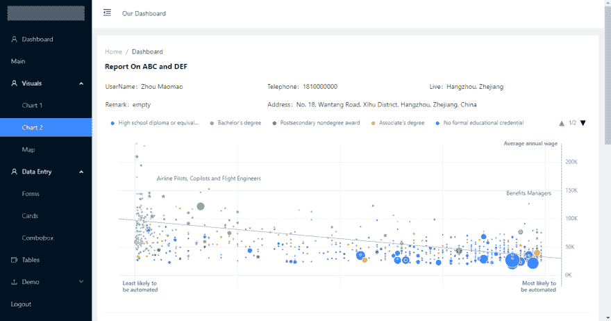
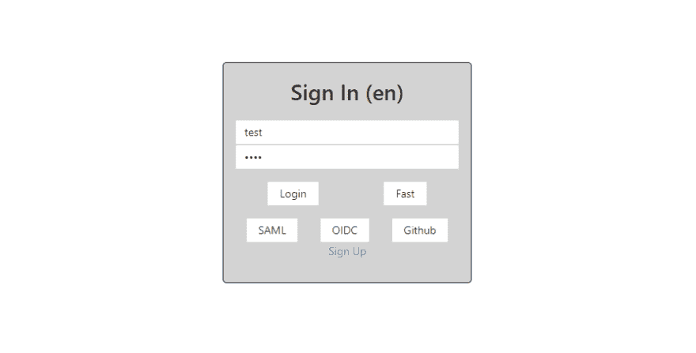
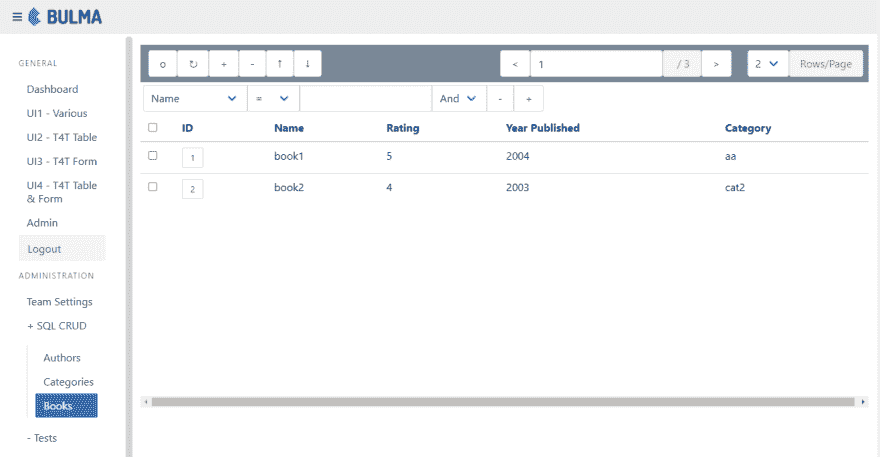

# VueJS+NodeJS 常青食谱

> 原文:# t0]https://dev . to/aisone/vuej-expressjs-crud-cookbook-46l 0

## 简介

> 食谱规则#1 -不要积累技术债务

作为开发人员，我们创建不同的应用程序。一路走来，我们想出了 ORMs、GraphQL、SSO、charts、OpenAPI、Vue/React SPA 等代码配方。

这些食谱解决了现实世界的问题，可以在其他地方重复使用！

## 常青食谱项目

这个项目最初是作为一个 CRUD 组件开始的。

随着越来越多的功能和代码被添加，代码“食谱”被合并成一个“食谱”供将来使用。

如果你只是想一头扎进去，那就去参观一下 **[项目](https://github.com/ais-one/cookbook)** 。

##  [ ais-one ](https://github.com/ais-one) / [菜谱](https://github.com/ais-one/cookbook)

### VueJS + NodeJS 常青食谱

<article class="markdown-body entry-content container-lg" itemprop="text">

# 关于

> **TL；DR** ExpressJS，VueJS cookbook，有常青树配方和模板(CRUD，CI/CD，QA，测试，云容器部署，Web 组件，es 模块等。)来更快地开发应用程序，同时减少由于依赖关系的变化而导致的重写或重构的需要。

最新版本 [0.6.7](https://github.com/ais-one/cookbook/releases/tag/0.6.7) -发布于 2021 年 9 月 25 日 1030 +8GMT

*   赛普拉斯 e2e 测试现在也可以在 CI/CD 中运行，如果需要的话
*   添加 NestJS 和 ReactJS 示例(来自[https://www.udemy.com/course/react-nest-admin](https://www.udemy.com/course/react-nest-admin)，但有待修改)
*   添加节点-saml 用法
*   流式文件下载，创建 pdf，下载 pdf

在此寻求帮助并提出改进建议

对这个项目的考虑类似于 [favv](https://github.com/ais-one/favv/blob/master/README.md#considerations) 。它们之间的区别是:

*   这个回购更多的是一本食谱，食谱不断得到改进和更新
*   favv back end 是用 Python 写的，它们可以互相改进

我们在大多数文件夹中不使用 Typescript，因为 TS 人可以很容易地理解 JS，但 JS-only…

</article>

[View on GitHub](https://github.com/ais-one/cookbook)

* * *

## 注意事项

配方必须持续维护:

*   添加新配方并删除过时的配方
*   更新和改进现有配方(例如更清洁的代码)

我们还应该记住以下对 cookbook 用户有影响的内容:

*   让用户能够轻松地基于菜谱构建和维护多个项目
*   当菜谱更新时，让用户可以轻松地更新他们的项目
*   使用 CI/CD、容器易于部署

* * *

## 菜谱

食谱中的一些可用食谱是:

*   图形 SQL 和订阅
*   SAML2，OpenID Connect，OAuth 社交登录，JWT，刷新令牌，2FA/TOTP
*   多部分表单、文件上传、注册上传
*   REST、OpenAPI 文档和验证
*   Web 组件-网络摄像头、画布输入、CRUD 表
*   MongoDB，复制，事务，流
*   SQL 查询生成器，迁移，种子
*   cors，主体解析器，头盔，连接-API-历史-回退
*   自动化测试
*   可视化(图表、地图等。)
*   记录

在引用项目文档的同时，通过检查、构建和运行代码来了解每个配方是如何工作的。

* * *

## 菜谱 Web 前端类型

有 3 种方法来构建 web 前端应用程序

*   单页应用程序(SPA)
*   服务器端呈现(SSR)
*   静态站点

下表显示了 3 种方法之间的比较。

[//www.slideshare.net/slideshow/embed_code/key/anHVp5aFN2MvLL](//www.slideshare.net/slideshow/embed_code/key/anHVp5aFN2MvLL)

在比较了每种方式的特点后，决定将重点放在 SPA 和静态站点上。

* * *

## 一些历史笔记

*   由于希望使用 VueJS 2 和 Vuetify 1 创建更好的表格编辑器，2017 年末开发了 CRUD 组件。
*   根据需要，添加了后端项目和身份验证。功能和应用程序开始被添加、更新和删除。
*   vue tify 2(2019 年第三季度)引入了突破性的变化。因此，需要寻找更稳定或数量更少的依赖项。
*   后端结构被重新组织，以允许多个项目上的相同代码库。
*   当必须考虑 docker 和 CI/CD 时，项目再次重新组织。
*   随着 ES 模块的引入，前端的无捆绑版本被创建。CRUD 用户界面也迁移到了使用 Web 组件和布尔玛 CSS。
*   添加了用于 DB、Redis、Kafka、Vault 等应用程序的 Docker 合成文件，以支持本地开发。
*   Vue3 破了 Vue2 插件，幸好项目没有用很多插件(直接用了 leafletJS 之类的库代替)。迁移是相当无痛的。
*   当 VueJS 和它的第三方库更新时，避免了很多痛苦，例如:
    *   vee-验证 v1 -> v2 -> v3 -> v4(持续中断)
    *   vue-apollo(还不能用于 Vue3)
    *   vue-rx(还不能用于 Vue3)
    *   vuetify v1 -> v2 -> v3(持续中断)
*   姐妹[项目](https://github.com/ais-one/favv)的经验有助于解决食谱用户的上述考虑。
*   现在正在等待即将到来的 NodeJS 16 LTS 版本中的 npm 工作区...关注项目的稳定性。

## [ais-one](https://github.com/ais-one) / [favv](https://github.com/ais-one/favv)

### 使用 FastAPI + Vite + VueJS 的全栈 Web 应用框架

* * *

希望你发现烹饪书项目，它的食谱很有帮助。

该食谱不断更新和改进，以保持相关性和实用性。

我们正在寻找贡献者和维护者来不断改进它。

感谢您花时间阅读本文。