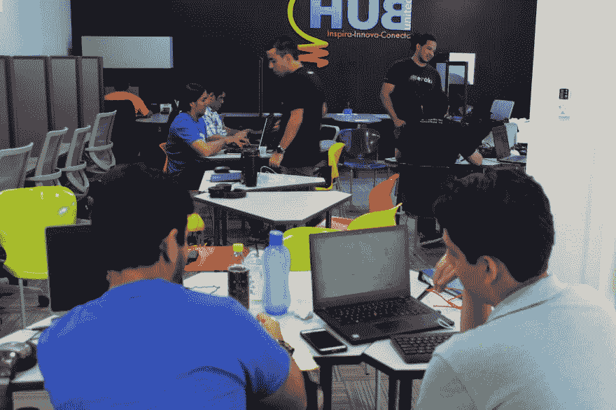
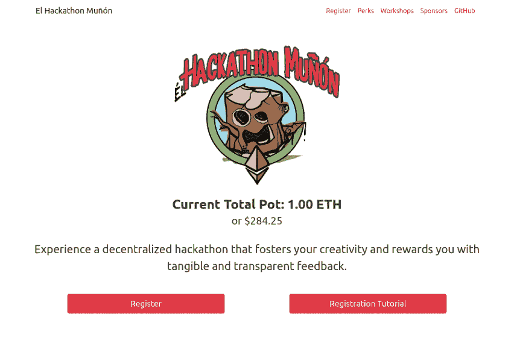
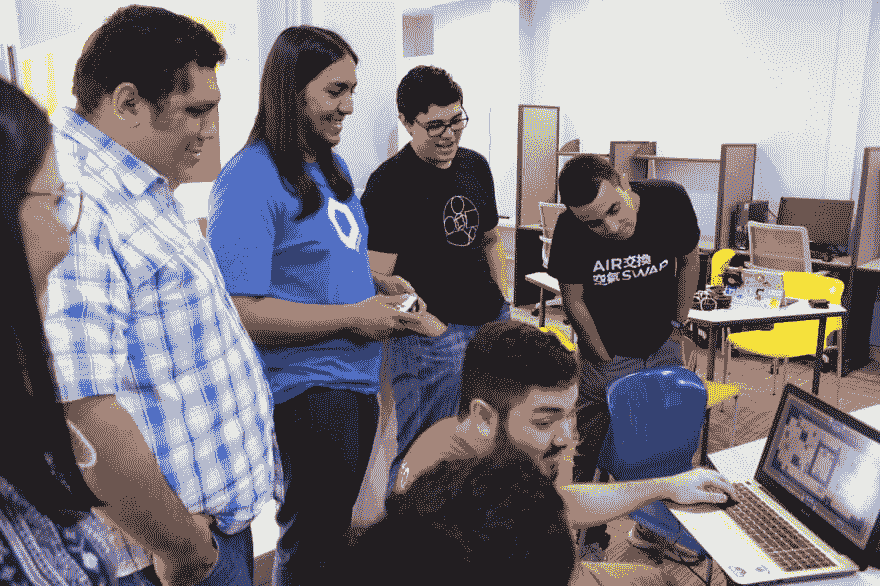
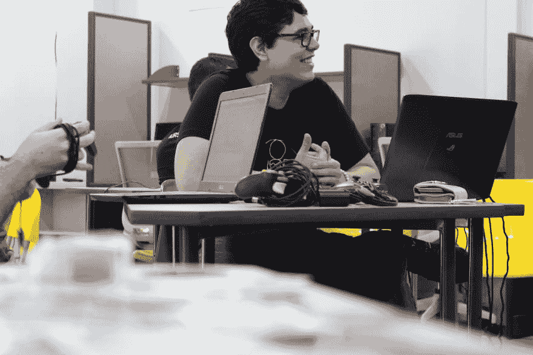
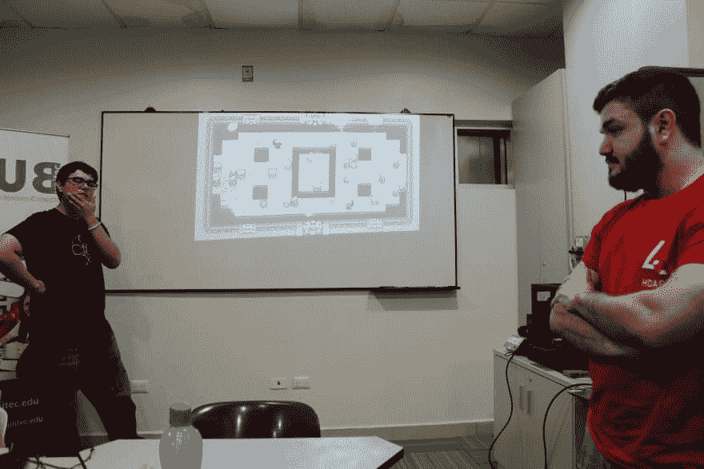
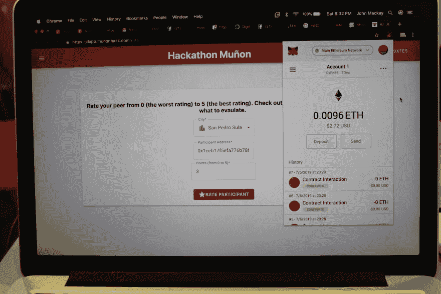

# 我们刚刚参加了一个分散的黑客马拉松

> 原文：<https://dev.to/turupawn/we-just-attended-to-a-decentralized-hackathon-1cae>

2019 年 7 月 6 日和 7 日，我们参加了在洪都拉斯圣佩德罗苏拉和特古西加尔巴举行的黑客马拉松。我们互相黑，互相冷，互相获取，互相反馈。我们玩得很开心。我们也体验了作为区块链驱动的刀的一部分的感觉。

这不是一次普通的黑客马拉松。在黑客马拉松比赛中，没有评委，也没有“赢家”和“输家”。这是为了促进黑客技术、创新和团队合作。

## 如何？

为了参与，每个人都要支付一笔入会费。在活动结束时，每个人都互相回顾自己的工作。最后，奖金会根据每个参与者对你工作的看法按比例分配。

我们在以太坊区块链的基础上创建了一个 dapp 来简化这个过程。在 dapp 上，参与者注册，互相评分，并获得相应的奖励。

## 向前移动

我们保持这个黑客马拉松相当低调，因为它的实验性质。现在，我们正在根据我们所学到的知识进行改进，并期望在不久的将来组织更多的活动。

## 信息表

*   迄今为止已经举办了 6 次黑客马拉松
*   其中两个在区块链
*   在赞助商的帮助下，我们达到了 1+ eth 底池
*   [登陆页面](https://munonhack.com/)
*   [Dapp 已用](https://dapp.munonhack.com/)(未直播)
*   [Github repo](https://github.com/buidl-honduras/HackathonMunon) ，非常欢迎代码投稿！
*   现在改进的东西，见[期](https://github.com/buidl-honduras/HackathonMunon/issues)
*   加入我们的[异议](https://discord.gg/nxzw8y)并与我们聊天！

