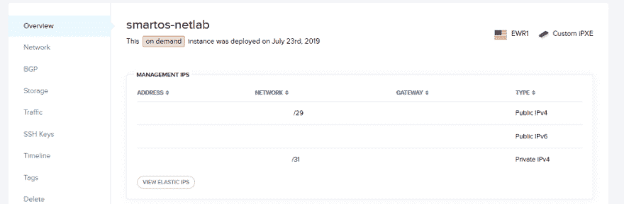

# 数据包上的 startos 区域网络

> 原文：<https://dev.to/jmarhee/smartos-zone-networking-on-packet-n51>

[](https://res.cloudinary.com/practicaldev/image/fetch/s--Tqkjgmg6--/c_limit%2Cf_auto%2Cfl_progressive%2Cq_auto%2Cw_880/https://cdn-images-1.medium.com/max/640/1%2AcX67g94XoOiAcDX_LiOBTg.png)

[在](https://medium.com/@jmarhee/more-on-pxe-booting-smartos-on-packet-and-provisioning-with-terraform-and-saltstack-5267fc9fe690)[数据包](https://packet.com)上运行 SmartOS 是 SmartOS 生产级部署的一个有据可查、受支持的选项，完全支持网络、计算和存储配置的最佳实践和模式:

[https://support.packet.com/kb/articles/smartos](https://support.packet.com/kb/articles/smartos)

这在一定程度上意味着，对于在区域(多个品牌— joyent、kvm、bhyve)中运行的服务，Packet 的网络自动化适用于您的分组管理 SmartOS 计算节点。

> **注意**:计算节点设置的最佳实践是，您的管理/管理界面(您在设置过程中配置的界面)不面向互联网，但是，如果您确实将它配置为可通过互联网访问，您将不再需要配置主机，除非您计划为您的区域提供数据包专用网络地址。
> 
> [https://wiki.smartos.org/managing-nics/](https://wiki.smartos.org/managing-nics/)
> 
> 否则，从您的管理界面在 Packet 的设施中共享的同一个网络分配地址将不再需要进一步的更改。

在对主机进行资源调配时，您可能还希望调配一个更大的子网(默认资源调配请求为单个主机请求 a /31)，类似于 a /29 的请求就足够了，如果您希望将公共地址附加到某些主机而不是其他主机，并且希望不同主机上的区域可以通过专用网络相互访问，请确保您对公共和专用网络都请求 a/31:

[](https://res.cloudinary.com/practicaldev/image/fetch/s--RF5K5-Dc--/c_limit%2Cf_auto%2Cfl_progressive%2Cq_auto%2Cw_880/https://cdn-images-1.medium.com/max/1024/1%2A_jr3E6eazflIjCXNwujTzA.png)

当您创建服务器时，您会在“配置”菜单下找到它。

请记住，如果您使用公共 IPv4 地址创建管理界面，您只需要第一个地址(使用网络掩码 255.255.255.248)和需要 IPv4 地址的区域使用的后续地址，而不是绑定整个子网。

然后，在配置好子网后，您需要分配该子网的某个网段以连接到您的 SmartOS 主机，因此回到您的服务器页面的“网络”选项卡，您将从您的管理范围中选择一个地址:

[](https://res.cloudinary.com/practicaldev/image/fetch/s--r3GqZ3vi--/c_limit%2Cf_auto%2Cfl_progressive%2Cq_auto%2Cw_880/https://cdn-images-1.medium.com/max/1024/1%2AmzBS1h4SzhMckMCEKpHRJQ.png)

您将对公共和私有 IPv4 地址使用相同的方法。

并且所选择的任何范围(在我们的例子中，一个地址和一个网关)都将被附加到该主机。

定义了我们的地址后，我们可以填充我们的区域定义，我们将从导入一个基本的 joyent 品牌图像开始:

```
imgadm import 643de2c0-672e-11e7-9a3f-ff62fd3708f8 
```

<svg width="20px" height="20px" viewBox="0 0 24 24" class="highlight-action crayons-icon highlight-action--fullscreen-on"><title>Enter fullscreen mode</title></svg> <svg width="20px" height="20px" viewBox="0 0 24 24" class="highlight-action crayons-icon highlight-action--fullscreen-off"><title>Exit fullscreen mode</title></svg>

并将它放入一个名为 base.json :
的文件中

```
{
 "brand": "joyent",
 "image\_uuid": "643de2c0-672e-11e7-9a3f-ff62fd3708f8",
 "alias": "public-ipv4-test",
 "hostname": "public-ipv4-test",
 "max\_physical\_memory": 512,
 "quota": 20,
 "resolvers": ["8.8.8.8", "8.8.4.4"],
 "nics": [
  {
   "nic\_tag": "admin",
    "ip": "1.2.3.51",
    "netmask": "255.255.255.248",
    "gateway": "1.2.3.49"
  }
 ]
} 
```

<svg width="20px" height="20px" viewBox="0 0 24 24" class="highlight-action crayons-icon highlight-action--fullscreen-on"><title>Enter fullscreen mode</title></svg> <svg width="20px" height="20px" viewBox="0 0 24 24" class="highlight-action crayons-icon highlight-action--fullscreen-off"><title>Exit fullscreen mode</title></svg>

这创建了一个简单的 joyent 品牌区域，但是这种网络方案将满足所有可用品牌的需要，例如，您的主机将是 1.2.3.50，您的第一个区域可以使用范围内的下一个地址(如我上面所做的)，1.2.3.51，等等。

您可以继续创建分区:

```
vmadm create -f /opt/base.json 
```

<svg width="20px" height="20px" viewBox="0 0 24 24" class="highlight-action crayons-icon highlight-action--fullscreen-on"><title>Enter fullscreen mode</title></svg> <svg width="20px" height="20px" viewBox="0 0 24 24" class="highlight-action crayons-icon highlight-action--fullscreen-off"><title>Exit fullscreen mode</title></svg>

你会得到一个 UUID 的回应，比如:

```
Successfully created VM e82392bd-93e2-e499-9710-bbbf07cf898c 
```

<svg width="20px" height="20px" viewBox="0 0 24 24" class="highlight-action crayons-icon highlight-action--fullscreen-on"><title>Enter fullscreen mode</title></svg> <svg width="20px" height="20px" viewBox="0 0 24 24" class="highlight-action crayons-icon highlight-action--fullscreen-off"><title>Exit fullscreen mode</title></svg>

并使用 zlogin 实用程序验证连通性:

```
zlogin e82392bd-93e2-e499-9710-bbbf07cf898c ping packet.com 
```

<svg width="20px" height="20px" viewBox="0 0 24 24" class="highlight-action crayons-icon highlight-action--fullscreen-on"><title>Enter fullscreen mode</title></svg> <svg width="20px" height="20px" viewBox="0 0 24 24" class="highlight-action crayons-icon highlight-action--fullscreen-off"><title>Exit fullscreen mode</title></svg>

如果这成功地配置了区域，您将得到如下响应:

```
packet.com is alive 
```

<svg width="20px" height="20px" viewBox="0 0 24 24" class="highlight-action crayons-icon highlight-action--fullscreen-on"><title>Enter fullscreen mode</title></svg> <svg width="20px" height="20px" viewBox="0 0 24 24" class="highlight-action crayons-icon highlight-action--fullscreen-off"><title>Exit fullscreen mode</title></svg>

确认网络配置正确。