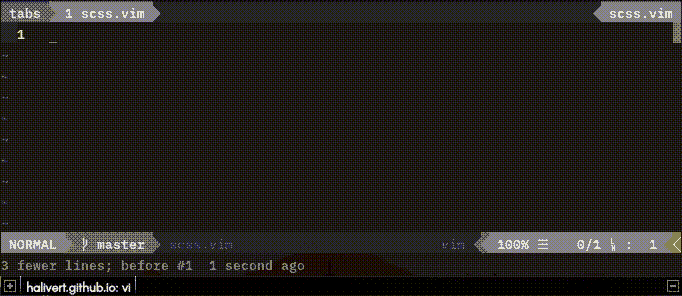
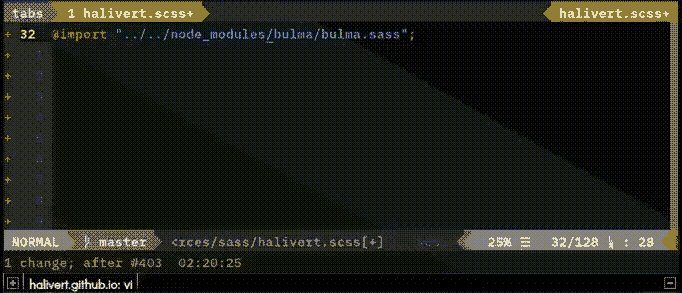

# 我是为 Bulma 来的宏

> 原文：<https://dev.to/halivert/vim-macros-for-bulma-589f>

当你使用一个像布尔玛一样灵活的 CSS 框架时，你只想拥有必要的组件，而不是更多。当您创建自己的“主题”时，您可以只导入您想要使用的组件和元素。

现在，当您不确定哪些文件包含哪些规则时会发生什么呢？
**导入一切**然后评论那些在那一刻没有必要的。

但是...我们如何轻松地进口布尔玛的所有组件和元素？

我发现这些宏非常有用:

```
let @q='02t/"cyt"o^[;r ^Rc^Mdd.2kI// ^[2j0'
let @j='0f"a../.^["cpF/l3dfsA;^[j0'
let @k='02f"i.sass^[j0' 
```

<svg width="20px" height="20px" viewBox="0 0 24 24" class="highlight-action crayons-icon highlight-action--fullscreen-on"><title>Enter fullscreen mode</title></svg> <svg width="20px" height="20px" viewBox="0 0 24 24" class="highlight-action crayons-icon highlight-action--fullscreen-off"><title>Exit fullscreen mode</title></svg>

现在，如果您复制并粘贴这些命令，它们将不起作用，因为它们包含控制字符(和其他字符)，您应该替换以下内容:

| 原创 | 替换 |
| --- | --- |
| `^[` | Ctrl + v, Esc |
| `^R` | Ctrl + v, Ctrl + r |
| `^M` | Ctrl + v，回车 |
| `;` | `:` |

<small>注意:我在正常模式下有这些映射:`noremap ; :`和`noremap : ;`。</small>

为了使这更容易，您可以用另外两个控制字符键入`:%s/\V^[/[Ctrl + v, Esc]/g`等。

[](https://res.cloudinary.com/practicaldev/image/fetch/s--EpxKgCJu--/c_limit%2Cf_auto%2Cfl_progressive%2Cq_66%2Cw_880/https://halivert.github.io/assets/2019-07-23-vim-macro-for-bulma/vim-macro.gif)

当您位于与`node_modules`文件夹相同的目录中时，您可以使用这些宏并执行以下操作:

[](https://res.cloudinary.com/practicaldev/image/fetch/s--2PocLFe_--/c_limit%2Cf_auto%2Cfl_progressive%2Cq_66%2Cw_880/https://halivert.github.io/assets/2019-07-23-vim-macro-for-bulma/vim-macro-used.gif) 

下期见 vim-tip👋🏽

#### 额外

这些宏是如何工作的？

```
let @q='02t/"cyt"o^[;r ^Rc^Mdd.2kI// ^[2j0' 
```

<svg width="20px" height="20px" viewBox="0 0 24 24" class="highlight-action crayons-icon highlight-action--fullscreen-on"><title>Enter fullscreen mode</title></svg> <svg width="20px" height="20px" viewBox="0 0 24 24" class="highlight-action crayons-icon highlight-action--fullscreen-off"><title>Exit fullscreen mode</title></svg>

*   首先，用`0`转到行首。
*   接下来，用`2t/`向前搜索第二个`/`之前的 1 个字符。
*   然后，在`c`中粘贴注册行的剩余部分，直到引号与`"cyt"`一致。
*   在下面插入一行，用`o^[`退出插入模式。
*   用`;r ^Rc^M`将`c`寄存器的内容添加到文件中。
*   删除注释行，然后删除带有`dd.`的`charset`行。
*   用`2k`上去两行。
*   评论一下我们和`I//`的路线。
*   退出插入模式，向下两行，用`^[2j0`回到行首。

```
let @j='0f"a../.^["cpF/l3dfsA;^[j0' 
```

<svg width="20px" height="20px" viewBox="0 0 24 24" class="highlight-action crayons-icon highlight-action--fullscreen-on"><title>Enter fullscreen mode</title></svg> <svg width="20px" height="20px" viewBox="0 0 24 24" class="highlight-action crayons-icon highlight-action--fullscreen-off"><title>Exit fullscreen mode</title></svg>

*   用`0`转到行首。
*   用`f"`搜索第一个报价。
*   我们添加了一个带有`a../.`的`../.`。
*   用`^[`退出插入模式。
*   用`"cp`粘贴`c`寄存器的内容。
*   向后搜索第一个`/`，用`F/l`向前移动一个字符。
*   用`3dfs`删除到第三个`s`。
*   在`A;`行的末尾添加分号。
*   退出插入模式，向下一行，用`^[j0`转到行首。

```
let @k='02f"i.sass^[j0' 
```

<svg width="20px" height="20px" viewBox="0 0 24 24" class="highlight-action crayons-icon highlight-action--fullscreen-on"><title>Enter fullscreen mode</title></svg> <svg width="20px" height="20px" viewBox="0 0 24 24" class="highlight-action crayons-icon highlight-action--fullscreen-off"><title>Exit fullscreen mode</title></svg>

*   从带有`02f"`的行的开头开始查找第二个引号。
*   用`i.sass`插入字符串`.sass`。
*   最后，退出插入模式，向下一行，用`^[j0`转到行首。

* * *

原文以西班牙文发布于:[https://hali vert . github . io/blog/2019/07/vim-macro-for-bulma/](https://halivert.github.io/blog/2019/07/vim-macro-for-bulma/)