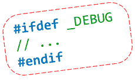
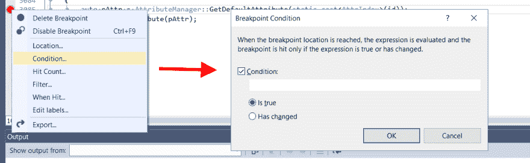
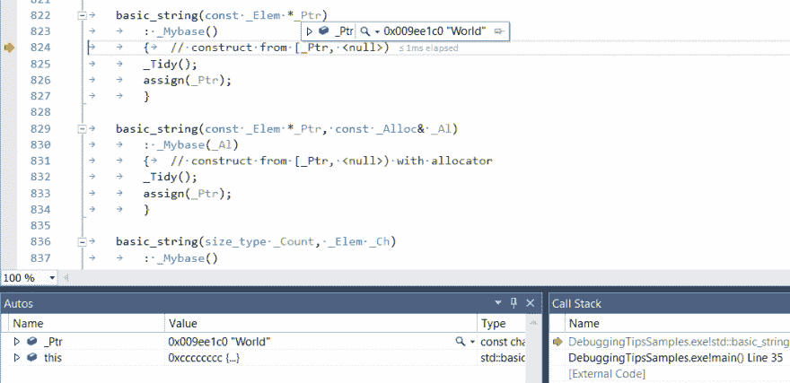

# 节省您时间的 11 个 Visual C++调试技巧

> 原文：<https://dev.to/fenbf/11-visual-c-debugging-tips-that-will-save-your-time-2bam>

[](https://res.cloudinary.com/practicaldev/image/fetch/s--9nTUc7Q7--/c_limit%2Cf_auto%2Cfl_progressive%2Cq_auto%2Cw_880/https://2.bp.blogspot.com/-_B5pxo0AfoY/V1gcz4PmQKI/AAAAAAAACqw/gtOh13xf6U4LKfk58h3x1g8THfNklDbYgCLcB/s1600/dbg.png)

编程不仅仅是键入代码并愉快地看它运行得有多流畅。往往并不是以我们想象的方式运行！因此，有效地调试应用程序至关重要。而且，看来调试本身就是一门艺术！下面是我列出的一些技巧，希望能对调试本机代码有所帮助。

最初发表于[bfilipek.com](http://www.bfilipek.com/2016/06/11-debugging-tips-that-will-save-your.html)

## 帮手

每个人都应该知道如何启动调试器，设置断点，继续代码执行，单步执行，单步执行(使用键盘！).这里有一些扩展这些常见动作的小技巧。

### 1。将 LinePos 添加到调试输出中

不管你有多精通，我想，你还是会用其中一个基本的方法:用 printf，trace，outputDebugString 等跟踪一些值……边调试边扫描输出。在 Visual Studio 中有一个很好的技巧，可以让你从调试输出窗口快速移动到特定的代码行。

对于输出格式，只需使用以下语法:

```
"%s(%d): %s", file, line, message 
```

但是要记住从源文件中的实际位置使用`file`和`line`，而不是在一些日志记录函数中。因此，您可能应该有这样一个宏:

```
#define MY_TRACE(msg, ...) MyTrace(__LINE__, __FILE__, msg, __VA_ARGS__) 
// usage:
MY_TRACE("hello world %d", 5); 
```

请注意，`__LINE__`和`__FILE__`是通用的、ANSI 兼容的预处理器定义，可用于您的编译器。参见[预定义宏，MSDN](https://msdn.microsoft.com/en-us/library/b0084kay.aspx)

还有一点:记得使用`OutputDebugString`以便消息进入输出窗口，而不是控制台…

当一个特定的消息进入 VS 输出窗口时，你现在可以双击该消息，VS 将把你移动到那个文件和行。在编译期间查看警告或错误也会发生同样的情况。当我看到一条消息时，我已经失去了很多时间，但我不知道代码中的确切位置。在这种情况下，我需要搜索字符串…这是缓慢和无效的。双击鼠标，只需几毫秒就能到达正确的目的地。

BTW:如果你使用其他 IDE(除了 Visual Studio ),你知道他们是否支持类似的双击功能？让我知道，因为我很好奇。

这里有一些你可以玩的简单例子:[github.com/fenbf/DebuggingTipsSamples](https://github.com/fenbf/articles/tree/master/DebuggingTipsSamples)

**更新**:正如 [jgalowicz](http://www.bfilipek.com/2016/06/11-debugging-tips-that-will-save-your.html#comment-2721645800) 在评论中提到的。如果你真的喜欢在输出中只有短文件名，你可以玩玩他的`__SHORT_FILE__`技术:[看这里他的博客。](http://blog.galowicz.de/2016/02/20/short_file_macro/)。

然而，默认情况下，Visual Studio 使用 [/FC 编译器选项](https://msdn.microsoft.com/en-us/library/027c4t2s.aspx)关闭，所以你通常有短文件名(可能只相对于你的解决方案目录)

### 2。控制特性的简单静态变量

```
// change while debugging if needed
static bool bEnableMyNewFeature = true; 
```

[在 Visual studio 中编辑并继续](https://msdn.microsoft.com/en-us/library/bcew296c.aspx)确实是一个强大的功能，但这里有一个简化的“手动”版本。可能没那么漂亮，但很管用。只要做一个静态变量，可以用来控制一个特性。可能只是一个布尔标志，或者一个整数。然后，在调试过程中，您实际上可以更改该值。无需重启程序或重新编译，您就可以使用您的功能。

如何在调试过程中更改值？转到“监视”窗口或悬停在变量上。您应该会看到一个编辑框，可以在其中更改值。

请记住在最终的构建和提交中禁用/删除那个丑陋的变量！

### 3。条件断点

我希望您已经使用了条件断点，但是让我快速展示一下它们的基本用法。顾名思义，您可以设置一个相对简单的条件，在该条件下调试器将停止。

[](https://res.cloudinary.com/practicaldev/image/fetch/s--Iog4svUc--/c_limit%2Cf_auto%2Cfl_progressive%2Cq_auto%2Cw_880/https://4.bp.blogspot.com/-ztAoikVysgk/V0vLWa_-rTI/AAAAAAAACqI/vIjwZzzqMZIFFt1Ja3PALEF8E5nIBTM0QCLcB/s1600/dbgtips_cond.png)

一个提示:如果您需要更高级的测试，请编写一个自定义断点。

以下是您可以在条件中使用的表达式列表: [msdn:调试器中的表达式](https://msdn.microsoft.com/en-us/library/za56x861.aspx)

这还不是全部。

正如您可能在上面的屏幕截图中注意到的，还有一个有用的断点条件:“命中次数”。您可以指定在多少次事件之后断点将真正发生。非常方便，如果你跟踪一些动态事件或大量的对象。

### 4。不要进入不需要的功能

有多少次你进入了一个字符串类型的构造函数，然后需要快速退出？或者当您需要在目标方法之前单步执行许多小函数/库函数时？在大多数情况下，这是浪费时间。

请参见以下示例:

```
void MyFunc(const string &one, const string &two)
{
    auto res = one + two;
    std::cout << res << "\n";
}
/// ...
MyFunc("Hello ", "World"); 
```

然后尝试按`Ctrl+F11`进入`MyFunc()`的通话。调试器将何去何从？我看到这样的东西:

[](https://res.cloudinary.com/practicaldev/image/fetch/s--xsxEzUOR--/c_limit%2Cf_auto%2Cfl_progressive%2Cq_auto%2Cw_880/https://3.bp.blogspot.com/-VFf4i3Q9dcg/V0-3QYqSEPI/AAAAAAAACqc/EwMxDw_4l0AfJCY2pSOSLB_ZD7InGvdSwCLcB/s1600/dbgtips_stepinto.png)

更重要的是，如果你跳出这个，然后再进入…你将进入第二个参数构造函数。想象一下如果你有几个参数会发生什么。在进入你的目标方法之前，你很容易受挫！

在大多数情况下，最好只是过滤掉那些不需要的方法。您试图捕捉的问题很少出现在`std::string`构造函数中:)

怎么做才能把那些基本功能过滤掉？

从 VS 2012 开始有一个简单的方法来创建过滤器:你需要编辑 default.natstepfilter

在这里阅读 VS 2012 之前的过滤方法:[如何使用 Visual C++调试器不单步执行函数](https://blogs.msdn.microsoft.com/andypennell/2004/02/06/how-to-not-step-into-functions-using-the-visual-c-debugger/)。在旧版本中，大部分时间你不得不使用注册表值。

**很酷的东西:**

作为一个小小的激励，同样的功能在**视觉辅助**中被大大简化了。调试时你会看到 [VA 阶滤波器](http://docs.wholetomato.com/default.asp?W506)。您只需单击复选框即可启用或禁用已发现方法的过滤器。该设置可以是全局的，也可以只针对给定的项目。VA 过滤器设置是自定义解决方案，它们不与`default.natstepfilter`文件合并。

### 5。在调试模式下为对象添加帮助变量

数据越多越好！过滤掉不想要的信息总是可能的，但凭空创造数据是不可能的。根据你正在做的事情，在你的对象中添加一些额外的变量可能是有用的。当你调试这些变量时，它们可能会带来非常重要的信息，或者让你的生活变得更简单。

例如，当你处理树形结构时，你可能经常需要检查`pNext`、`pPrev`元素。通常这些指针被放在某个基类中，比如一个`TreeNode`，如果你检查的是`MyTreeNode`，那是类层次结构的三个层次，每次检查`pNext`都很痛苦。如果您用来自`pNext`的一些额外数据更新`MyTreeNode`会怎么样？然后，您可以很容易地检查这一点，而无需通过对象层次结构。一个缺点是:如何保持额外的状态？`'pNext`可能很容易改变，所以你必须做一些额外的逻辑来正确地同步它。虽然这在大多数情况下是正确的，但也许对于调试来说，你不需要完整和完美的解决方案。

我给你举个例子。

我经常处理表示文本对象的树结构。文本对象包含行，行包含字符。检查我在哪一行——它包含什么文本是很痛苦的。因为我必须从这一行得到第一个字符，然后得到`pNext`，然后我“看到”这一行的前两个字母，所以我知道我在哪一行。如何让这个过程变得简单一点？我刚刚制作了`strLine`并把它添加到`Line`中。我会不时更新那个新成员的信息。这可能不是一个完美的信息(当在一个`frame`中添加或删除一个字母时，它可能会丢失，但在下一个`frame`中它会获得该信息)。但至少我可以很快知道我在哪个文本行。简单易行！并且节省了大量时间。

### 6。编写自定义调试可视化工具

这是一个我想介绍的大话题:

如果你对调试器中的对象视图不满意，你可能想写自己的可视化器。

[在 Visual C++ 2015 中调试可视化工具](https://blogs.msdn.microsoft.com/vcblog/2015/09/28/debug-visualizers-in-visual-c-2015/)

在 VS2015 中甚至有一个新的内置模板，可以在*项目- >添加新项目- > Visual C++- >实用工具- >调试器可视化文件(。纳特维斯)*

## 技法

有了这些基本工具，我们可以制定一些更高级的策略。

### 7。有很多东西要调查吗？

当你的代码需要调用很多对象时，很难遍历所有对象并逐行检查它们。考虑一个独特的值，它可能会引导您找到代码中有趣的地方。然后，您可以设置一个条件中断，并设置捕捉某个范围的条件。范围越小越好。

例如:我经常不得不调试遍历文档中所有字符的代码。一个(特殊的)角色表现不好。不可能单独调试所有这些字符。但是我知道这个特殊的字符有不同于其他字母的边界框大小。所以我设置了一个条件断点，并寻找可能指向我的特殊字符(`width > usual_char_width`)的‘width’值。我只需要检查两三个元素，所以我可以很快地调查出了什么问题。

通常，您希望尽可能缩小可用选项的范围，这样您就只有几个(而不是几十个或几百个)地方可以调试。

### 8。鼠标事件

调试鼠标事件尤其令人困惑，因为当调试器停止代码时，大多数事件都消失了！

鼠标点击通常很容易:例如，如果你想检查鼠标点击某个对象后调用了什么代码。只是闯入某个 OnClick/onMouseDown 方法。

鼠标拖动怎么办？如果调试器停止，则拖动状态会丢失。在这种情况下，我会努力做到以下几点:

*   使用良好的旧 trace/printf 输出。拖动的时候，我得到了很多信息，让我更好地理解发生了什么。而不中断执行。也许你想有短的拖动操作，否则你会有大量的输出需要过滤。使用该输出，您可以隔离最重要的地方，并在以后关注该部分。
*   在你真正想检查的地方使用条件断点。例如你旋转物体，你会感兴趣为什么它会意外地改变位置。您可以在 position 成员上设置一个断点，您将有机会看到那里发生了什么。停止后的状态会丢失，但至少你可以暂时进行旋转，进入代码中潜在的位置。另一个想法是在`obj_rot > some_meaningful_value`时设置条件。
*   拖动通常发生在对象的副本上。然后，在拖动之后，真实对象被转换成适当的状态。也许你可以设置断点只看原来的对象？也许应用程序中有一个单独的状态告诉*这是拖动操作正在发生*？那么调试器将在拖动操作结束时停止。

### 9。构建调试可视化工具

这可能是引入简单变量进行调试的一种发展。如果你正在处理一个复杂的对象，那么拥有能够更好地跟踪数据的工具是值得的。Visual Studio 或任何其他 IDE/调试器将帮助您处理一般的东西，但是由于每个项目都是不同的，拥有定制的解决方案是有用的。

在游戏中，我经常看到这种情况。你可能有一些层，可以在游戏过程中启用，它会显示游戏统计，性能数据，内存消耗。这可以根据你的需要进行改进，以显示更多的内容。所以我绝对建议投资那些工具。

## 其他

### 10。调试发布版本

发布版本更快，因为大多数优化都已启用。然而，没有理由不能调试这样的代码。如何启用这种调试？它需要以下步骤:在 VS 2013 和 VS 2015 中:

*   将调试信息格式设置为 C7 兼容(/Z7)或程序数据库(/Zi)。
*   将启用增量链接设置为否
*   将生成调试信息设置为是
*   将引用设置为/OPT:REF，并将 COMDAT 折叠启用为/OPT:ICF

### 11。加速调试构建！

*   慢速调试:工具->选项->调试->常规->“要求源文件与原始版本完全匹配”位于[http://www . code project . com/Tips/515168/ignored-reason-for-debug-step-slow-down-in-Visu](http://www.codeproject.com/Tips/515168/Overlooked-reason-for-debug-step-slow-down-in-Visu)
*   禁用调试堆——在 VS 2015 之前你可以在我以前的文章中读到关于调试堆的内容: [Visual Studio 慢速调试和 _NO_DEBUG_HEAP](http://www.bfilipek.com/2015/09/visual-studio-slow-debugging-and.html) 。幸运的是，在 VS2015 中，默认情况下这个堆是禁用的，所以您不应该遇到这些问题。
*   控制符号文件加载。您可以减少加载的符号文件的数量，这样启动会更快。在这里阅读更多:[了解符号文件和 Visual Studio 的符号设置](https://blogs.msdn.microsoft.com/visualstudioalm/2015/01/05/understanding-symbol-files-and-visual-studios-symbol-settings/)

## 总结

在这篇文章中，我介绍了 11 个加快调试过程的技巧。对我来说最重要的项目是什么？很可能是条件断点，调试大量对象和代码调试版本的改进。但是列表中的其他元素也很重要，所以在这里做出一个真正的顺序并不容易。通常你必须将一种技术转换成另一种技术，以最大限度地满足你的需求。

更何况清单肯定不全，还有很多技术存在。也许你有什么要补充的？

*   当你调试你的应用程序时，你使用任何特殊的技术吗？
*   你使用定制工具来帮助调试吗？

## 更多来自作者

Bartek 最近出版了一本书-[《C++ 17 详解》](https://leanpub.com/cpp17indetail?utm_source=devto&utm_campaign=dbgtips)可从@Leanpub 获得-与其阅读论文和 c++规范草案，不如用这本书以高效实用的方式学习新标准。