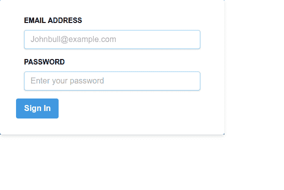

# 如何配置 Create-React-App 使用 TailwindCSS

> 原文：<https://dev.to/bnevilleoneill/how-to-configure-create-react-app-to-use-tailwindcss-4261>

[](https://res.cloudinary.com/practicaldev/image/fetch/s--Fg0CGI-C--/c_limit%2Cf_auto%2Cfl_progressive%2Cq_auto%2Cw_880/https://thepracticaldev.s3.amazonaws.com/i/8mxegevn1yyaedca0d4d.png)

最近，我尝试在由 [Create-React-App](https://facebook.github.io/create-react-app/) (CRA)样板引导的 React 项目中使用 TailwindCSS，并在将 [TailwindCSS](https://tailwindcss.com/) 设置为 CRA 抽象配置时遇到了困难。要进行定制配置，我们必须`eject` Create-React-App 才能完全修改配置，这也意味着更加繁琐的设置，如果有任何问题，你只能靠自己了。我修改了一下，找到了一个更好的方法来完成它。

在这篇文章中，我将展示一个简单的方法让 TailwindCSS 在你的 react CRA 项目中工作，而不需要弹出 Create-React-App。

本教程假设具备 TailwindCSS 和 React JS 的基础知识。

[](https://logrocket.com/signup/)

## 先决条件:

*   了解国家预防机制如何运作
*   安装了 [Node.js 8.0](https://nodejs.org/en/download/) 或更高版本和 [npm 5.2 或更高版本](https://www.npmjs.com/get-npm)
*   对 [React JS](https://reactjs.org) 和 [TailwindCSS](https://tailwindcss.com/docs) 的基本理解

## 入门

首先，打开您的终端并键入以下命令来创建一个新项目。

```
#Using NPM
$ npx create-react-app tailwindreact-app

#Using Yarn
$ yarn create react-app tailwindreact-app 
```

这将启动一个新的 react 应用程序，它具有所有必要的配置并构建管道( [Webpack](https://webpack.js.org/) ， [Babel](https://babeljs.io/) )。

`cd`进入您的应用程序目录。

```
cd tailwindreact-app 
```

接下来，安装顺风:

```
# Using npm
npm install tailwindcss --save-dev

# Using Yarn
yarn add tailwindcss --dev 
```

创建默认配置框架。

```
npx tailwind init tailwind.js --full 
```

这个命令在你的项目的基本目录中创建一个`tailwind.js`,这个文件包含了 Tailwind 的所有默认配置。

像这样安装 Autoprefixer 和 post CSS-CLI:

```
npm install postcss-cli autoprefixer --save-dev
or
yarn add postcss-cli autoprefixer --save-dev 
```

如 PostCSS [文档](https://github.com/postcss/postcss)中所述:

*PostCSS 是一个用 JS 插件转换样式的工具。这些插件可以 lint 你的 CSS，支持变量和混合，transpile 未来的 CSS 语法，内联图像，等等。*

虽然 [Autoprefixer](https://github.com/postcss/autoprefixer) 是一个 PostCSS 插件，但它基本上是解析您的 CSS，并在您编译的 CSS 规则中添加/删除不必要的供应商前缀。它可以帮助你为动画，过渡，变换，网格，flex，flexbox 等添加前缀。

## 如何配置 PostCSS

手动或使用命令:
在您的基本目录中创建一个 PostCSS 配置文件

```
$ touch postcss.config.js 
```

将下面几行代码添加到 PostCSS 文件中:

```
//postcss.config.js
 const tailwindcss = require('tailwindcss');
 module.exports = {
     plugins: [
         tailwindcss('./tailwind.js'),
         require('autoprefixer'),
     ],
 }; 
```

在你的`src`文件夹中创建一个文件夹，命名为`styles`，这是你所有风格的存放地。在这个文件夹中，创建一个`tailwind.css`和一个`index.css`文件。

`index.css`文件是我们导入 tailwind 的基本样式和配置的地方，而`tailwind.css`将包含`index.css`的编译输出。

## 如何将 tailwind 的组件、实用工具和基础样式注入到你的应用中

将以下内容添加到您的`index.css`文件中。

```
//index.css

@tailwind base;

@tailwind components;

@tailwind utilities; 
```

`@tailwind`是一个顺风指令，用于注入默认`base styles`、`components`、`utilities`和定制配置。

`@tailwind base` — *这注入了 Tailwind 的基本样式，是`Normalize.css`和一些附加基本样式的组合。*

有关预检应用的所有样式的完整参考，[请参见此样式表](https://unpkg.com/tailwindcss/dist/base.css)。

*如果你用的是`postcss-import`，用这个导入代替:*

```
@import "tailwindcss/base"; 
```

`@tailwind components` — *这将注入由你的 tailwind 配置文件中定义的插件注册的任何组件(小的可重用样式，如按钮和表单元素等)类。*

如果您使用的是`postcss-import`，请改用此导入:

`@import "tailwindcss/components";`

组件导入下面是您可以添加任何自定义组件类的地方；您希望在默认实用程序之前加载的内容，这样实用程序仍然可以覆盖它们。

这里有一个例子:

```
.btn { ... }
.form-input { ... } 
```

或者如果使用预处理器或`postcss-import` :

```
@import "components/buttons";
@import "components/forms"; 
```

`@tailwind utilities` — *这将注入所有 Tailwind 的实用程序类(包括默认的和您自己的实用程序)，它们是基于您的配置文件生成的。*

如果使用`postcss-import`，则使用此导入:

```
@import "tailwindcss/utilities"; 
```

在 utilities import 下面，您可以添加任何您需要的定制实用程序，这些实用程序不是 Tailwind 自带的。

这里有一个例子:

```
.bg-pattern-graph-paper { ... }

.skew-45 { ... } 
```

或者如果使用预处理器或`postcss-import` :

```
@import "utilities/background-patterns";
@import "utilities/skew-transforms"; 
```

Tailwind 将在构建时交换所有这些指令，并用生成的 CSS 替换它们。

## 如何配置你的 app 来构建你的 CSS 文件

配置您的应用程序，在每次运行`npm start`或`yarn start`命令时构建样式。

打开你的`package.json`文件，将`"scripts"`的内容替换为:

```
"scripts": {
  "build:style":"tailwind build src/styles/index.css -o src/styles/tailwind.css",
  "start": "npm run build:style && react-scripts start",
  "build": "react-scripts build",
  "test": "react-scripts test",
  "eject": "react-scripts eject"
}, 
```

## 如何将你的 CSS 导入 app

打开你的`index.js`文件，导入你的顺风风格。

```
import './styles/tailwind.css'; 
```

删除项目根目录中的`index.css`和`app.css`文件，并分别删除`Index.js`和`App.js`文件中对应的导入语句。

您的`index.js`文件应该类似于这个:

```
// index.js
import React from 'react';
import ReactDOM from 'react-dom';
import './index.css';
import App from './App';
import * as serviceWorker from './serviceWorker';
  ....... 
```

删除后，它应变成:

```
//index.js
import React from 'react';
import ReactDOM from 'react-dom';
import App from './App';
import * as serviceWorker from './serviceWorker'; 
```

您的`App.js`文件在删除前应该是这样的:

```
//App.js
import React from 'react';
import logo from './logo.svg';
import './App.css'; 
```

删除后，它应变成:

```
//App.js
import React from 'react';
import logo from './logo.svg'; 
```

这些更改将导致类似如下的输出:

[](https://res.cloudinary.com/practicaldev/image/fetch/s--RP8WPkkn--/c_limit%2Cf_auto%2Cfl_progressive%2Cq_auto%2Cw_880/https://i2.wp.com/blog.logrocket.com/wp-content/uploads/2019/07/browseroutput.png%3Fresize%3D300%252C230%26ssl%3D1) 

<figcaption id="caption-attachment-4064">删除你的 index.css 和 app.css</figcaption>

后在你的浏览器中输出

为了测试我们的配置是否正常工作，让我们创建一个简单的登录表单。

打开您的`App.js`文件，将返回函数之间的内容替换为:

```
<div className="App" >
    <div className="w-full max-w-md bg-gray-800" >
      <form action="" className=" bg-white shadow-md rounded px-8 py-8 pt-8">
        <div className="px-4 pb-4">
          <label htmlFor="email" className="text-sm block font-bold  pb-2">EMAIL ADDRESS</label>
          <input type="email" name="email" id="" className="shadow appearance-none border rounded w-full py-2 px-3 text-gray-700 leading-tight focus:outline-none focus:shadow-outline border-blue-300 " placeholder="Johnbull@example.com"/>
        </div>
        <div  className="px-4 pb-4">
          <label htmlFor="password" className="text-sm block font-bold pb-2">PASSWORD</label>
          <input type="password" name="email" id="" className="shadow appearance-none border rounded w-full py-2 px-3 text-gray-700 leading-tight focus:outline-none focus:shadow-outline border-blue-300" placeholder="Enter your password"/>
        </div>
        <div>
          <button className="bg-blue-500 hover:bg-blue-700 text-white font-bold py-2 px-4 rounded focus:outline-none focus:shadow-outline" type="button">Sign In</button>
        </div>
      </form>
    </div>
  </div> 
```

我们刚刚做的是用`w-full`给`div`一个`100%`的宽度，我们也用`max-w-md`为中等和更大的屏幕设置最大宽度。

我们用`bg-white`给表单一个白色背景，用`border`、`px-8`和`py-8`给表单添加一个`8px`的填充，同时`pt-8`给表单顶部添加一个`8px`的填充。

我们使用`text-sm`将`.875rem`的`font-size`添加到标签元素中，并使元素具有`block`的`display`，使用`font-bold`将`font-weight`设置为值`700`。

在 input 元素上，我们用`shadow`给元素添加了一些方框阴影，并使用`.appearance-none`来重置 input 元素上任何特定于浏览器的样式。

我们用`leading-tight`添加了一个`1.25`的`line-height`，用伪类`focus`删除了用`focus:outline-none`聚焦的输入元素的特定于浏览器的轮廓，用`focus:shadow-outline`添加了一点框阴影。

您应该会得到类似这样的结果。

[](https://res.cloudinary.com/practicaldev/image/fetch/s--yhBwj2sr--/c_limit%2Cf_auto%2Cfl_progressive%2Cq_auto%2Cw_880/https://i0.wp.com/blog.logrocket.com/wp-content/uploads/2019/07/form.png%3Fresize%3D567%252C380%26ssl%3D1) 
[https://codesandbox.io/embed/b1pr9](https://codesandbox.io/embed/b1pr9)

## 结论

在这篇文章中，我们学习了如何配置 Create-React-App (CRA)来使用 TailwindCSS。

顺风有牛逼[文档](https://tailwindcss.com/docs/installation/)。查看更多信息。

你也可以在 GitHub 上查看这个教程的[库](https://github.com/Jolaolu/react-tailwind-demo.git)来搭建你的应用。

* * *

## Plug: [LogRocket](https://logrocket.com/signup/) ，一款适用于网络应用的 DVR

[](https://res.cloudinary.com/practicaldev/image/fetch/s--6FG5kvEL--/c_limit%2Cf_auto%2Cfl_progressive%2Cq_auto%2Cw_880/https://i2.wp.com/blog.logrocket.com/wp-content/uploads/2017/03/1d0cd-1s_rmyo6nbrasp-xtvbaxfg.png%3Fresize%3D1200%252C677%26ssl%3D1)

[log rocket](https://logrocket.com/signup/)是一个前端日志工具，让你重放问题，就像它们发生在你自己的浏览器中一样。LogRocket 不需要猜测错误发生的原因，也不需要向用户询问截图和日志转储，而是让您重放会话以快速了解哪里出错了。它可以与任何应用程序完美配合，不管是什么框架，并且有插件可以记录来自 Redux、Vuex 和@ngrx/store 的额外上下文。

除了记录 Redux 动作和状态，LogRocket 还记录控制台日志、JavaScript 错误、stacktraces、带有头+体的网络请求/响应、浏览器元数据、自定义日志。它还使用 DOM 来记录页面上的 HTML 和 CSS，甚至为最复杂的单页面应用程序重新创建像素级完美视频。

[免费试用](https://logrocket.com/signup/)。

* * *

帖子[如何配置 Create-React-App 使用 TailwindCSS](https://blog.logrocket.com/create-react-app-and-tailwindcss/) 最先出现在[日志博客](https://blog.logrocket.com)上。