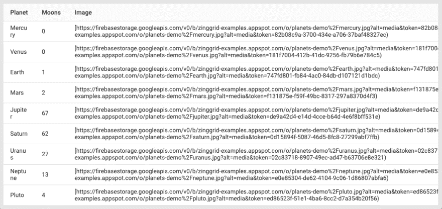
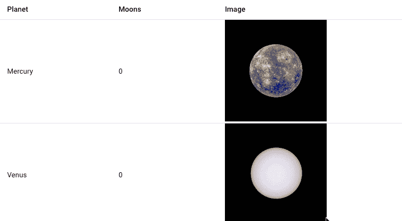

# 如何在 60 秒内将图像嵌入数据网格

> 原文：<https://dev.to/zinggrid/how-to-embed-images-in-a-data-grid-in-under-60-seconds-hcf>

欢迎来到我的“60 秒内实现 ZingGrid 功能”博客系列。这些演练旨在强调向 [ZingGrid 数据网格和表格](https://www.zinggrid.com/)添加交互性和功能是多么容易。

观看下面的视频短片，了解向 ZingGrid 数据网格添加图像是多么容易，或者进一步滚动以阅读涵盖基础知识的简短摘要。

[https://www.youtube.com/embed/yHvgZE73K3s](https://www.youtube.com/embed/yHvgZE73K3s)

您首先要做的是按照这个清单来确保您已经正确地设置了 ZingGrid，为实现这个特性做好了准备。如果你想了解更多关于使用 ZingGrid 创建你的第一个数据网格的信息，请查看这篇文章。

1.  请确保您要嵌入的图像已经在线托管，并且您有权限使用它们。
2.  更新您的 JSON 数据集，以包含您想要嵌入的图像的 URL。
3.  确保您已经在开发环境中使用 CDN 或自托管选项通过引用 ZingGrid 库建立了一个基本的网格

作为快速复习，如果你在一个基本的 HTML 页面中使用 ZingGrid，在开始本教程之前，你的代码应该是这样的:

```
<!DOCTYPE html>
<html>
    <head>
        <meta charset="utf-8">
        <title></title>
        <script src="https://cdn.zinggrid.com/zinggrid.min.js" defer></script>
    </head>
    <body>
        <zing-grid></zing-grid>
    </body>
</html> 
```

从这里开始，只需要将数据添加到网格中，并添加列，这样就可以为嵌入的图像指定列类型。

* * *

## 在一分钟内嵌入图像

假设你有一个关于太阳系行星的简单数据集。这个数据集在 ZingGrid 中呈现时将产生三列数据，最后一列包含图像。您的 JSON 数据集可能如下所示:

```
[ 
    {
        "planet": "Mercury",
        "moons": "0",
        "photo": "https://firebasestorage.googleapis.com/v0/b/zinggrid-examples.appspot.com/o/planets-demo%2Fmercury-200px.jpg?alt=media&token=23f8d355-ca73-4334-980c-23f5ae91d087"
    },
    {
        "planet": "Venus",
        "moons": "0",
        "photo": "https://firebasestorage.googleapis.com/v0/b/zinggrid-examples.appspot.com/o/planets-demo%2Fvenus-200px.jpg?alt=media&token=1f6119d6-414d-4f1e-906d-514d7f5a295f"
    },
    {
        "planet": "Earth",
        "moons": "1",
        "photo": "https://firebasestorage.googleapis.com/v0/b/zinggrid-examples.appspot.com/o/planets-demo%2Fearth-200px.jpg?alt=media&token=33df1022-e000-4e95-9996-5b9101af627d"
    },
    {
        "planet": "Mars",
        "moons": "2",
        "photo": "https://firebasestorage.googleapis.com/v0/b/zinggrid-examples.appspot.com/o/planets-demo%2Fmars-200px.jpg?alt=media&token=ff1209b7-ef9d-496d-8a93-ef1cd8fad794"
    },
    {
        "planet": "Jupiter",
        "moons": "67",
        "photo": "https://firebasestorage.googleapis.com/v0/b/zinggrid-examples.appspot.com/o/planets-demo%2Fjupiter-200px.jpg?alt=media&token=64c3cf9b-5541-475b-9711-17f046cff801"
    },
    {
        "planet": "Saturn",
        "moons": "62",
        "photo": "https://firebasestorage.googleapis.com/v0/b/zinggrid-examples.appspot.com/o/planets-demo%2Fsaturn-200px.jpg?alt=media&token=e4af20df-8319-4644-8361-e3f5b9a75d9f"
    },
    {
        "planet": "Uranus",
        "moons": "27",
        "photo": "https://firebasestorage.googleapis.com/v0/b/zinggrid-examples.appspot.com/o/planets-demo%2Furanus-200px.jpg?alt=media&token=a9e99164-7417-4a05-80eb-421c3867e9c5"
    },
    {
        "planet": "Neptune",
        "moons": "13",
        "photo": "https://firebasestorage.googleapis.com/v0/b/zinggrid-examples.appspot.com/o/planets-demo%2Fneptune-200px.jpg?alt=media&token=29d86d30-995c-45eb-ab96-1b99b7b1535c"
    },
    {
        "planet": "Pluto",
        "moons": "4",
        "photo": "https://firebasestorage.googleapis.com/v0/b/zinggrid-examples.appspot.com/o/planets-demo%2Fpluto-200px.jpg?alt=media&token=b7cbb041-df9b-48f8-b9ab-4f0f12df4efd"
    }
] 
```

如果您将这些数据内联添加到网格中，您的代码看起来会是这样的:

```
<!DOCTYPE html>
<html>
    <head>
    <meta charset="utf-8">
        <title></title>
        <script src="https://cdn.zinggrid.com/zinggrid.min.js" defer></script>
    </head>
    <body>
        <zing-grid
        data='[ 
            {
            "planet": "Mercury",
            "moons": "0",
            "photo": "https://firebasestorage.googleapis.com/v0/b/zinggrid-examples.appspot.com/o/planets-demo%2Fmercury-200px.jpg?alt=media&token=23f8d355-ca73-4334-980c-23f5ae91d087"
            },
            {
            "planet": "Venus",
            "moons": "0",
            "photo": "https://firebasestorage.googleapis.com/v0/b/zinggrid-examples.appspot.com/o/planets-demo%2Fvenus-200px.jpg?alt=media&token=1f6119d6-414d-4f1e-906d-514d7f5a295f"
            },
            {
            "planet": "Earth",
            "moons": "1",
            "photo": "https://firebasestorage.googleapis.com/v0/b/zinggrid-examples.appspot.com/o/planets-demo%2Fearth-200px.jpg?alt=media&token=33df1022-e000-4e95-9996-5b9101af627d"
            },
            {
            "planet": "Mars",
            "moons": "2",
            "photo": "https://firebasestorage.googleapis.com/v0/b/zinggrid-examples.appspot.com/o/planets-demo%2Fmars-200px.jpg?alt=media&token=ff1209b7-ef9d-496d-8a93-ef1cd8fad794"
            },
            {
            "planet": "Jupiter",
            "moons": "67",
            "photo": "https://firebasestorage.googleapis.com/v0/b/zinggrid-examples.appspot.com/o/planets-demo%2Fjupiter-200px.jpg?alt=media&token=64c3cf9b-5541-475b-9711-17f046cff801"
            },
            {
            "planet": "Saturn",
            "moons": "62",
            "photo": "https://firebasestorage.googleapis.com/v0/b/zinggrid-examples.appspot.com/o/planets-demo%2Fsaturn-200px.jpg?alt=media&token=e4af20df-8319-4644-8361-e3f5b9a75d9f"
            },
            {
            "planet": "Uranus",
            "moons": "27",
            "photo": "https://firebasestorage.googleapis.com/v0/b/zinggrid-examples.appspot.com/o/planets-demo%2Furanus-200px.jpg?alt=media&token=a9e99164-7417-4a05-80eb-421c3867e9c5"
            },
            {
            "planet": "Neptune",
            "moons": "13",
            "photo": "https://firebasestorage.googleapis.com/v0/b/zinggrid-examples.appspot.com/o/planets-demo%2Fneptune-200px.jpg?alt=media&token=29d86d30-995c-45eb-ab96-1b99b7b1535c"
            },
            {
            "planet": "Pluto",
            "moons": "4",
            "photo": "https://firebasestorage.googleapis.com/v0/b/zinggrid-examples.appspot.com/o/planets-demo%2Fpluto-200px.jpg?alt=media&token=b7cbb041-df9b-48f8-b9ab-4f0f12df4efd"
            }
        ]'>
        </zing-grid>
    </body>
</html> 
```

在这一点上，你的网格应该看起来像这样——但是不要担心，这不是一个错误:

[](https://res.cloudinary.com/practicaldev/image/fetch/s--jaSNYtQ2--/c_limit%2Cf_auto%2Cfl_progressive%2Cq_auto%2Cw_880/https://thepracticaldev.s3.amazonaws.com/i/cly3v3hwh5egtexf6qto.png)

这就是奇迹发生的地方！若要将数据集中的第三列呈现为图像而不是包含图像路径的字符串，您需要手动指定网格中的列，以便可以更改第三列的列类型。

为此，在`<zing-grid></zing-grid>`中添加三个`zg-column`标记——每个标记对应 JSON 数据中的一个惟一键。在我们的例子中，我们的样本数据集有三个唯一的 JSON 键，所以我们将在`<zing-grid></zing-grid>`标签中添加三个`<zg-column></zg-column>`标签。

在每组`<zg-column></zg-column>`标记中，我们将添加`index=""`，并按照我们希望列出现的顺序填写每个 JSON 键名。在`photo`的`zg-column`标签中，我们将添加值为`image`的`type=""`属性，以指定该列应该呈现图像而不是文本字符串。

如果您正在使用本教程中的示例数据，您的列标记应该如下所示:

```
<zg-colgroup>
    <zg-column index="planet"></zg-column>
    <zg-column index="moons"></zg-column>
    <zg-column index="photo" type="image"></zg-column>
</zg-colgroup> 
```

您不需要为`planet`和`moons`列指定列类型，因为 ZingGrid 的默认列类型是`text`。

如果你一直跟着做，你的代码应该是这样的(关注内联数据下面的代码):

```
<!DOCTYPE html>
<html>
    <head>
    <meta charset="utf-8">
        <title></title>
        <script src="https://cdn.zinggrid.com/zinggrid.min.js" defer></script>
    </head>
    <body>
        <zing-grid
        data='[ 
            {
            "planet": "Mercury",
            "moons": "0",
            "photo": "https://firebasestorage.googleapis.com/v0/b/zinggrid-examples.appspot.com/o/planets-demo%2Fmercury-200px.jpg?alt=media&token=23f8d355-ca73-4334-980c-23f5ae91d087"
            },
            {
            "planet": "Venus",
            "moons": "0",
            "photo": "https://firebasestorage.googleapis.com/v0/b/zinggrid-examples.appspot.com/o/planets-demo%2Fvenus-200px.jpg?alt=media&token=1f6119d6-414d-4f1e-906d-514d7f5a295f"
            },
            {
            "planet": "Earth",
            "moons": "1",
            "photo": "https://firebasestorage.googleapis.com/v0/b/zinggrid-examples.appspot.com/o/planets-demo%2Fearth-200px.jpg?alt=media&token=33df1022-e000-4e95-9996-5b9101af627d"
            },
            {
            "planet": "Mars",
            "moons": "2",
            "photo": "https://firebasestorage.googleapis.com/v0/b/zinggrid-examples.appspot.com/o/planets-demo%2Fmars-200px.jpg?alt=media&token=ff1209b7-ef9d-496d-8a93-ef1cd8fad794"
            },
            {
            "planet": "Jupiter",
            "moons": "67",
            "photo": "https://firebasestorage.googleapis.com/v0/b/zinggrid-examples.appspot.com/o/planets-demo%2Fjupiter-200px.jpg?alt=media&token=64c3cf9b-5541-475b-9711-17f046cff801"
            },
            {
            "planet": "Saturn",
            "moons": "62",
            "photo": "https://firebasestorage.googleapis.com/v0/b/zinggrid-examples.appspot.com/o/planets-demo%2Fsaturn-200px.jpg?alt=media&token=e4af20df-8319-4644-8361-e3f5b9a75d9f"
            },
            {
            "planet": "Uranus",
            "moons": "27",
            "photo": "https://firebasestorage.googleapis.com/v0/b/zinggrid-examples.appspot.com/o/planets-demo%2Furanus-200px.jpg?alt=media&token=a9e99164-7417-4a05-80eb-421c3867e9c5"
            },
            {
            "planet": "Neptune",
            "moons": "13",
            "photo": "https://firebasestorage.googleapis.com/v0/b/zinggrid-examples.appspot.com/o/planets-demo%2Fneptune-200px.jpg?alt=media&token=29d86d30-995c-45eb-ab96-1b99b7b1535c"
            },
            {
            "planet": "Pluto",
            "moons": "4",
            "photo": "https://firebasestorage.googleapis.com/v0/b/zinggrid-examples.appspot.com/o/planets-demo%2Fpluto-200px.jpg?alt=media&token=b7cbb041-df9b-48f8-b9ab-4f0f12df4efd"
            }
        ]'>
            <zg-colgroup>
                <zg-column index="planet"></zg-column>
                <zg-column index="moons"></zg-column>
                <zg-column index="photo" type="image"></zg-column>
            </zg-colgroup>
        </zing-grid>
    </body>
</html> 
```

这就是在 ZingGrid 数据网格中渲染图像所需做的全部工作！上述代码将产生以下结果:

[](https://res.cloudinary.com/practicaldev/image/fetch/s--LP1XXCOt--/c_limit%2Cf_auto%2Cfl_progressive%2Cq_66%2Cw_880/https://thepracticaldev.s3.amazonaws.com/i/qj4mo2l8kddt8wefwwiv.gif)

这些是在 ZingGrid 数据表和网格中添加图像嵌入的基础。在我们的工作室操场观看现场演示,看看它是如何工作的，这样你就可以摆弄最终结果了。