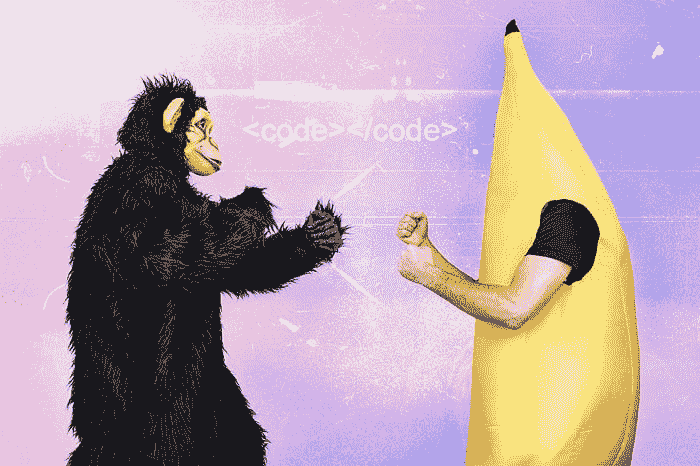
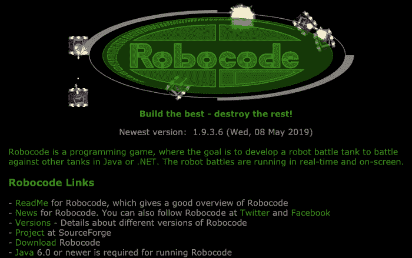
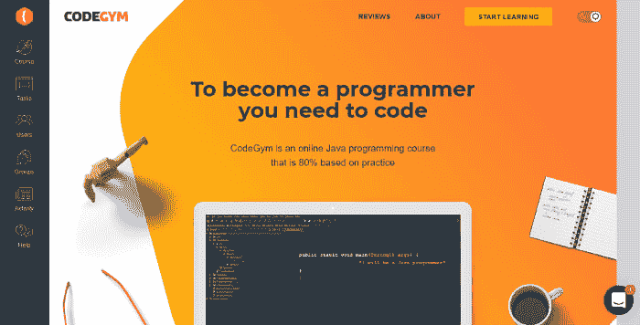
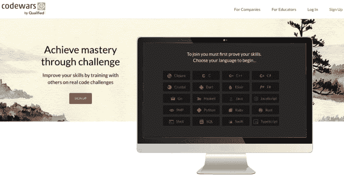
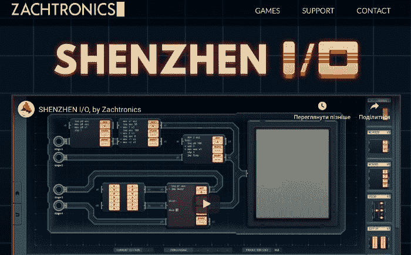
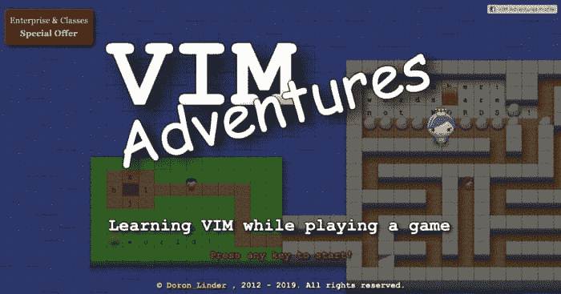
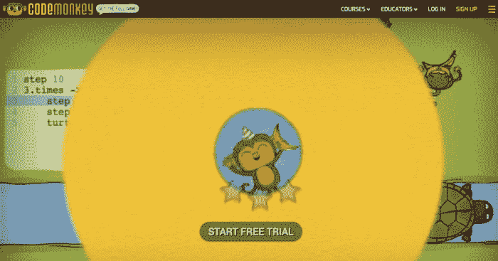
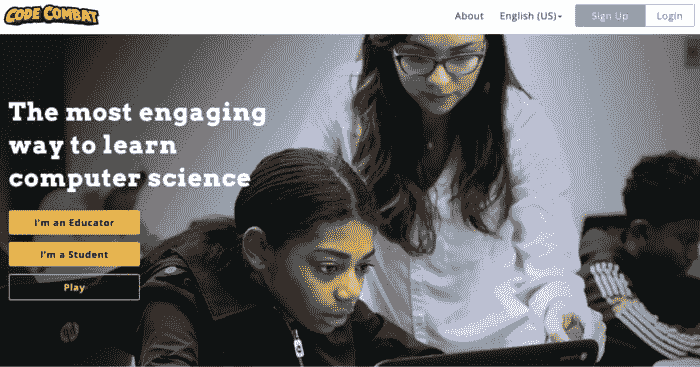

# 8 编写游戏代码来提高你的编程技能

> 原文：<https://dev.to/selawsky/8-coding-games-to-improve-and-level-up-your-programming-skills-3fc0>

编程是全球雇主要求最高的职业之一。这个世界就是找不到足够多的合格开发人员，我们每天都看到新技术和创业公司不断涌现。这个职业要求很高，竞争激烈，即使你已经是专业开发人员，也需要不断学习和扩展知识。当然，学习如何编程有很多方法，有数百种教科书、视频课程和指南。练习是帮助你学习一门新的编程语言或库的最好方法。这也是很多人经常遇到的障碍:有大量的学习资料，但严重缺乏运用理论的个人经验。
计算机理论道路上的另一个障碍——你和你的动机一起被它淹没了。没有实践，你不会在你的学习曲线上看到结果。
这些问题有一个解决方案，它适用于学习一般的编码方法或提高你对特定语言的知识。是编码游戏！今天我们将列出现有的最佳编码游戏。

## 1。[机器代码](https://robocode.sourceforge.io/)

*爪哇，。净*

在 Robocode 中，你通过控制一辆坦克与其他坦克战斗来学习编程，并在此过程中练习编写代码。

### 优点

*   **简单易学。**

Robocode 是一款老游戏(2000 年推出),有非常详细的教程向你解释游戏的每个方面。它的机制非常简单，所以它不会花时间来开始玩它。

*   这个游戏很有趣，甚至会让人上瘾。

机器人坦克战斗总是很有趣。由于其引人入胜和平衡的游戏过程，Robocode 拥有相当庞大的粉丝群。想一想，这款早在 2000 年就推出的游戏，如今仍由粉丝定期更新和维护。

*   它让你写出真正的代码。

在 Robocode 中，你必须用一堆流行的编程语言为你的机器人坦克编写 AI，包括 Java 和 C#。因此，每次玩游戏时，您都可以练习真正的、适用的编码技能。

*   这是一款开源游戏。

Robocode 是一个完全开源的项目，这意味着你可以重用它来做任何你想做的事情。多年来，粉丝们一直在为 Robocode 创建各种模式和插件。

*   **玩的时候可以用不同的编程语言。**

在 Robocode 中，你可以提高技能，学习一大堆不同的编程语言，而不是某一种。

### 弊

*   简单的设计。

正如已经提到的，机器代码是一个老游戏。它有非常基本的图形、设计和界面。这里没什么特别的。

*   **难以卸载。**如果你想从电脑上移除 Robocode，可能并不容易。Robocode 没有卸载文件。相反，你必须手动找到游戏的目录(这可能很棘手)并删除其中的所有文件。

## 2。 [CodeGym](https://codegym.cc/)

*Java*

### Java

CodeGym 是一门游戏化的编程课程，专为用户学习和练习 Java 编程而设计。

### 优点

*   **可以从零开始学习 Java 编程。**

玩家不需要了解任何 Java 的编码就可以开始游戏，适合新手。

*   这个平台提供了大量的例子和解释来简化学习过程。

如果你不知道如何完成其中一个任务，CodeGym 提供了各种例子来帮助你找到解决方案。

*   **CodeGym 教你在不同的目的和平台下使用 Java。**

它的课程中有超过 1200 个谜题。他们教你如何为不同的任务编写解决方案，为不同的需求和其他应用程序修改或改编现有的代码。

*   这不仅仅是一个游戏化的学习课程。

CodeGym 是一款激动人心的在线游戏，有真实的科幻情节、有趣的角色和大量的幽默。所有这些都使得学习 Java 变得有趣和有吸引力。

*   **虚拟导师。**

你的解决方案由虚拟老师验证，你即刻得到结果。虚拟老师会对你的解决方案提出建议，帮助你改正错误，还会给你一个关于你需要做什么的明确要求列表。

*   CodeGym 可以免费使用。

### 弊

*   为了理解 Java 的某些方面，你可能需要额外的学习材料。

有时候，拼图给你的还不够，你可能需要开始寻找额外的信息和教程。好消息是，你不需要找太远。网上和平台上有大量关于 Java 的资料。

*   该游戏并未针对移动平台进行全面优化。

CodeGym 确实需要一些调整来更好地适应移动平台。

## 3。[代码大战](https://www.codewars.com/)

*Clojure、C、C++、C#、Crystal、Dart、Elixir、F#、Go、Haskell、Java、JavaScript、PHP、Python、Ruby、Rust、Shell、SQL、Swift、TypeScript*

Codewars 是一个游戏化的在线平台，提供编码挑战，用户可以在这里解谜并比较他们的解决方案。

### 优点

*   你可以和其他玩家比较你的解决方案。
    Codewars 允许你和其他用户比较你的解谜方法。这有助于快速找到代码中的错误，也有助于从完全不同的角度了解如何解决相同的问题。

*   你通过完成挑战来练习编码。

解决不同的难题和算法挑战是快速学习编程语言最有效的方法之一。

*   Codewars 可以免费使用。

### 弊

*   **需要一些基本的编码知识才能开始。**

Codewars 不像 CodeGym 那样对新手友好。在开始使用它之前，您需要学习一些编码基础知识。

*   挑战的有限主题。

使用 Codewars 一段时间后，你会发现这个平台没有那么多种类的谜题可以提供。

## 4。[深圳 I/O](http://www.zachtronics.com/shenzhen-io/)

深圳 I/O 是一个益智游戏，教未来的工程师如何根据提供的要求构建电路和编写汇编代码。

### 优点

*   **深圳 I/O 模型它的工作原理一般。**

这个游戏不像以前的游戏那样关注编程语言，但是你用它训练的技能将适用于这个领域的许多不同的工作和目的。

*   对于那些对老式编程感兴趣的人来说，这是一个完美的选择。

过去，没有花哨的 ide 和框架，代码必须更加详细。这就是这个游戏允许你练习的。

### 弊

*   **深圳 I/O 相当难。**

这个游戏没有完整的用户手册，而且它的谜题通常都很难，所以很多人可能会觉得它太难了。

*   它有一个陡峭的学习曲线。

深圳 I/O 比较难学。它从几个相当简单的任务开始，但谜题会突然变得复杂得多。游戏没有给你太多调整的时间。

## 5。[维姆历险记](https://vim-adventures.com/)

*Vim*

Vim Adventures 是一款游戏，用于学习或提高您对流行的 Unix 文本编辑器 Vim 的知识。

### 优点

*   这是学习所有主要 Vim 概念的简单方法。

玩这个游戏你会很快学会所有 Vim 的键盘快捷键，主要概念和功能。

*   **对学习编程逻辑有用。**

虽然严格来说，Vim 不是一种编码语言，但是知道如何使用它会对程序员有很大帮助。

*   Vim Adventurers 是一款简单有趣的游戏。

### 弊

*   一些用户可能会很容易感到厌烦。

Vim Adventurers 过于简单，这可能会使游戏过程很快变得无聊。

## 6。[代码猴](https://www.playcodemonkey.com/)

*coffee script*
[T5】](https://res.cloudinary.com/practicaldev/image/fetch/s--1YRgS9UZ--/c_limit%2Cf_auto%2Cfl_progressive%2Cq_auto%2Cw_880/https://miro.medium.com/max/700/0%2ACN0H0RU0DHePJRNu)

Code monkey 是一款在线编码游戏，主要面向对编码了解非常有限或为零的中小学生，这使得它成为初学者的一个不错的选择。

### 优点

*   **适合对编码零知识的学生。**

CodeMonkey 是教儿童和青少年如何编码的一个很好的开始。如果对他们有好处，对任何年龄都有好处。

*   它提高了逻辑和解决问题的能力。

你在玩这个游戏时训练的技能，像逻辑和解决问题，几乎可以应用到生活中的任何地方，而不仅仅是编码。它使得 CodeMonkey 对那些有兴趣提高这些技能的人很有帮助，同时也学习如何编码。

*   **它的编码语言类似于 JavaScript。**

在 CodeMonkey 中使用这种语言，可以让你在玩完游戏后更容易学习 JavaScript。

### 弊

*   这个游戏不太适合在家学习的学生。

它通常需要技术支持和帮助。CodeMonkey 更适合作为课堂互动活动。

## 7。 [Flexbox Froggy](http://flexboxfroggy.com/)

*CSS*T2[T4](https://res.cloudinary.com/practicaldev/image/fetch/s--ym7RpL0_--/c_limit%2Cf_auto%2Cfl_progressive%2Cq_auto%2Cw_880/https://miro.medium.com/max/700/0%2AYj57q76viY35oN5I)

Flexbox Froggy 是一个简单的游戏，旨在帮助用户学习 CSS 代码。玩家必须通过掌握一个布局模块 CSS flexbox 来将 Froggy 带回家。

## 优点

*   为没有任何 CSS 知识的用户制作。

专为初学 CSS flexbox 的人设计，这样你可以用 Froggy 学习 CSS 的基础知识。

### 弊

*   这个游戏很简单，只适合初学者。

简单也是 Flexbox Froggy 最大的缺点。它更适合完全的初学者，并没有为要求更高的用户提供太多的学习空间。

## 8。[代码战斗](https://codecombat.com/)

*JS、Python、HTML、CSS、jQuery*

CodeCombat 是一款在线游戏，由玩家需要通过编写 JavaScript 代码来解决的谜题和挑战组成。

### 优点

*   **为初学者介绍 JavaScript 语法和逻辑。**
    你可以从非常简单的拼图开始，慢慢进步，一步一步学习 JS 语法。

*   这很有趣，也很吸引人。

CodeCombat 为玩家提供了相当广泛的谜题和挑战，这使得它非常有趣。玩这个游戏你一时半会不会觉得无聊。

### 弊

*   仅教授基本的 JavaScript 概念。

CodeCombat 只涵盖了 JavaScript 最基本的概念，如果你已经掌握了这些概念，要进一步学习，你需要找到另一个工具。

## 总结起来

边玩边学并不是一个新概念，游戏是一种久经考验的学习或提高技能的方法。编码也不例外。有很多优秀的编码游戏适合所有类型的玩家。无论你正在学习哪种语言，或者你目前的水平如何，你都可以找到游戏来提升你的编码技能，同时享受乐趣。

这篇文章最初发布在 [GitConnected 博客](https://levelup.gitconnected.com/8-coding-games-to-improve-and-level-up-your-programming-skills-52397201441a)上。