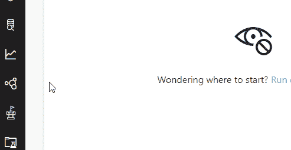
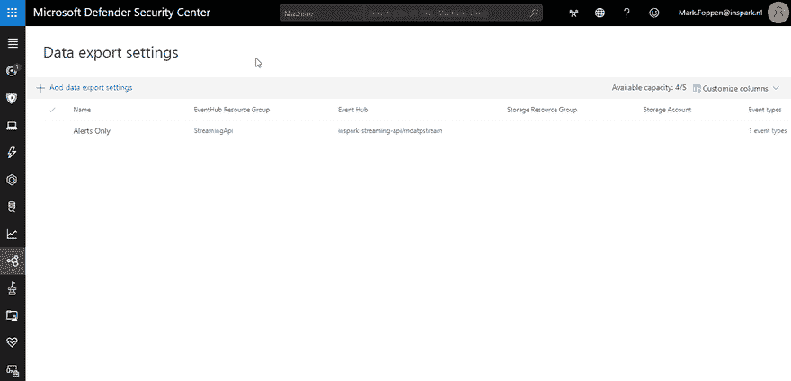
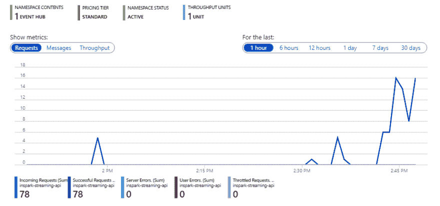
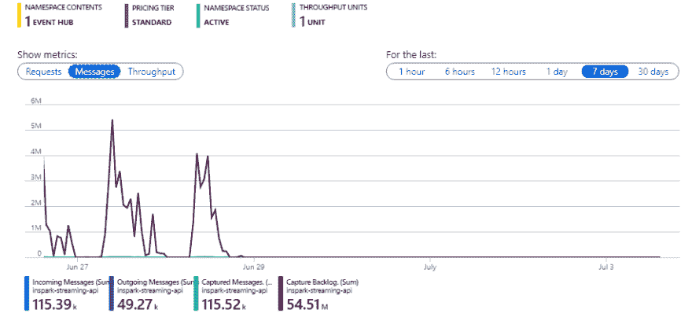
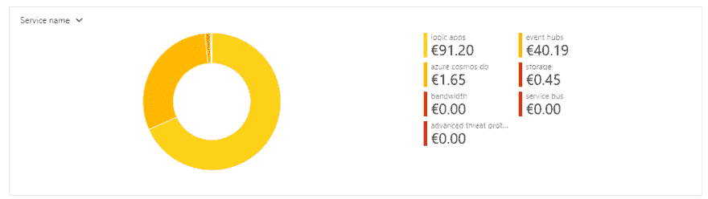
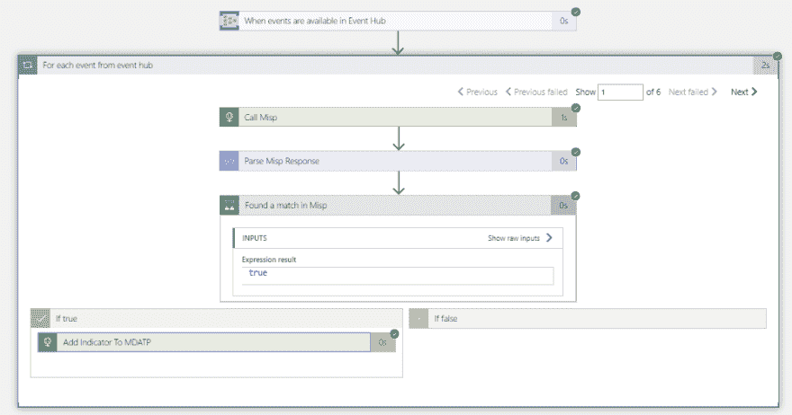
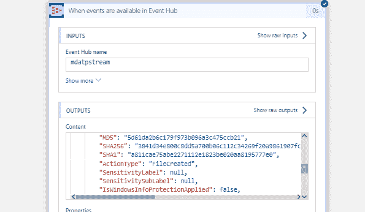
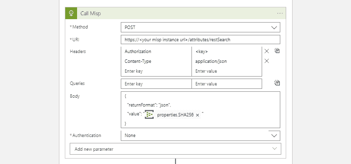
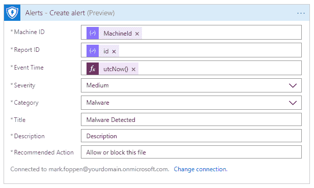

# 将 Microsoft Defender ATP 流 API 与 Misp 一起使用

> 原文：<https://dev.to/foppenma/using-mdatp-streaming-api-with-misp-2g0g>

如果您可以访问新的 Microsoft Defender 高级威胁防护(MDATP)中的所有数据，那岂不是很棒？如果您可以通过 API 访问所有数据，那就太好了。但是我真的不想开发另一种轮询机制来获取所有数据。这就是新的 MDATP 流 API 的来源，它刚刚启用了公共预览。

在这篇文章中，您将看到配置新的流 API 是多么容易，以及如何访问数据。您将看到如何将新的 API 附加到 Azure Storage 和 Azure Event Hub。

一旦我们收到所有数据，我们可以在第三方威胁情报提供商如 MISP 检查文件哈希。首先，让我们配置 MDATP 流 API。

## 配置 MDATP 流

我们首先转到 MDATP 门户[这里](https://securitycenter.windows.com)，您将看到默认的仪表板。要开始配置，您需要转到数据导出设置页面。

在此页面中，您总共可以添加 5 个流式连接。目前有两种类型的 Azure 资源可以连接:

*   Azure 存储
*   活动中心

如果您选择 Azure 存储选项，那么 MDATP 流会将所有事件保存在一个*中。json 文件作为 blobs。

在每个连接上，您可以选择 9 种类型的事件:

*   警报事件
*   机器信息
*   机器网络信息
*   流程创建事件
*   网络通信事件
*   文件创建事件
*   注册表事件
*   登录事件
*   ImageLoadEvents
*   错误事件

现在，我将只关注事件中心和 MDATP 之间关于 **FileCreationEvents** 的连接。如果你想确保捕捉到每个设备上的所有文件和进程，你还应该添加 **ProcessCreationEvents** 。

当您添加一个新的连接时，您将获得我刚才提到的所有选项。您可以在这里做出选择，并按照您喜欢的方式配置连接。我将把它配置成一个事件中心，只接收来自 MDATP 的文件创建事件。

现在事件中心已经配置好了，数据应该开始进来，看起来像这样

**提示**:只启用你真正想要的事件类型，因为消息量可能非常大。对于 Event Hub 来说，这不是问题，但如果你将它连接到一个逻辑应用程序，按执行付费，那么成本可能会非常高。

例如,' NetworkCommunicationEvents '记录每台机器上的每个连接。我不得不在两天内浪费掉我每月 150 美元的 Azure 信用点数，因为它连接到一个逻辑应用程序:|...

[T4】](https://res.cloudinary.com/practicaldev/image/fetch/s--phLWXfbp--/c_limit%2Cf_auto%2Cfl_progressive%2Cq_auto%2Cw_880/https://www.re-mark-able.net/conteimg/2019/07/HighPeak.png)

正如您在下面所看到的，大部分成本是在逻辑应用程序的连接和执行操作中，而不是在事件中心。所以要小心你连接到活动中心的东西。活动中心成本高是因为启用了“捕捉”功能和标准层级。不是因为事件的数量。

[T4】](https://res.cloudinary.com/practicaldev/image/fetch/s--jk_F-tlX--/c_limit%2Cf_auto%2Cfl_progressive%2Cq_auto%2Cw_880/https://www.re-mark-able.net/conteimg/2019/07/Costs.png)

然而，这促使我去调查使用 MDATP 流 API 和 Event Hub 的实际成本。为此，我们首先需要知道发送了多少个事件。我创建了一个新的 Event Hub 名称空间，将其连接到 MDATP 流 API 并选择所有可用的事件。接下来的 24 小时，我让它运行以捕捉所有事件。为了说明这一点，我统计了所有不同类型的事件以及我的租户中的机器数量。

网络通信事件:**95.070**

【图像加载事件: **【共混物】**【57.444】

过程****

 **这给我们留下了在 **83** 不同机器上总共 **303.989** 个事件。一个事件的平均大小约为 2.47 千字节，一台机器每天产生约 3，662 个事件。就每月费用而言，这意味着你有大约 900 万个活动，花费大约 0.25 美元。

## 用逻辑 app 消费 Eventhub

有时，有些用例需要第三方威胁情报系统来检查恶意软件。例如，检测带有恶意软件的安卓 APK。一个很好的例子你可以在这里看到。对于这个例子，我们将使用 MISP 也称为恶意软件信息共享平台和威胁共享。这是一个免费的社区驱动的威胁情报平台。在本帖中，我们不会讨论如何设置这个，但是你可以看到如何在 Kali Linux [上设置这个](https://www.inspark.nl/misp-threat-intelligence-azure-sentinel/)

这里列出了我们想要实现的目标:

*   从事件中心读取事件
*   根据 Misp 检查文件哈希
*   将指标添加到 MDATP

请注意，这是一个最基本形式的实现，您可以认为它没有任何错误处理或其他任何东西。先来看看逻辑 App 概述

首先，我们通过事件中心逻辑应用程序触发器接收事件，该触发器连接到 MDATPStream 中心，如前所示。当您保存仅带有触发器的逻辑应用程序时，您将得到如下响应:

既然我们收到了事件，我们可以使用以下参数调用 Misp API 来检查该文件是否被认为是可能的危害指示器(IoC)。

之后，我们解析响应并检查是否有任何 IoC 从 Misp 返回。如果是这样，我们就找到了匹配。在这一点上，这取决于您如何处理这个检测。您可以做的第一件事是，使用 Windows Defender 高级威胁保护(WDATP)逻辑应用连接器直接向 MDATP 发布警报。

实现对发现的 IoC 进行警告的方法是通过 WDATP 连接器创建警告。您可以通过将它添加到您的 logic 应用程序并将其与全局管理员帐户连接来完成此操作。

要创建警报，您需要设置可以在事件中心消息中找到的机器 id。对于其他字段，您可以随意设置。为了使警报有意义，您应该再次调用 Misp 并从 Misp 中检索事件。Misp 中的一个事件为创建的 IoC 提供了上下文，因此也包含标题、严重性、注释等字段。

## 可能性？

虽然这篇文章只描述了 MDATP 流 API 的一种可能的实现，但是还有更多的可能性。仅举几个例子:

*   将 MDATP 数据保存到单独的存储器中，以便无限期保留
*   现在，您可以实时响应警报，而不是从 graph API 轮询 MDATP 警报
*   实时监控网络通信
*   将您的数据传输给处理您的安全问题的第三方
*   将所有事件纳入您的安全信息和事件管理(SIEM)解决方案
*   将您的数据添加到 Azure Sentinel，因为还没有连接器。

和一些其他的，只是为了好玩或者因为你可以

*   绘制世界地图，并通过处理登录事件实时显示所有解锁和登录
*   通过使用登录事件，过程创建文件创建事件，回复人们他们不应该在假期工作；)

MDATP 产品中有多少数据是可预测的，目前我们只触及了表面。这应该给你一个很好的指示，说明使用 MDATP 流 API 可以实时实现什么。

感谢阅读！**