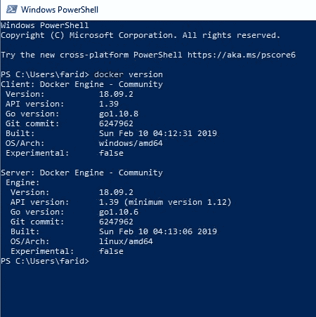
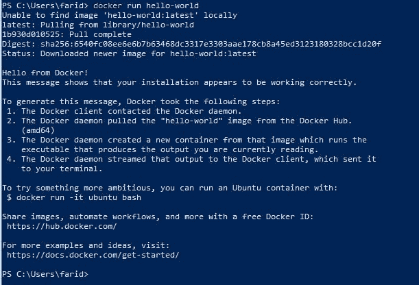

# 码头工人！！！，停靠点-我...。，停靠点...我...啊比金推雅

> 原文:# t0]https://dev . to/farid _ aditya/docker-docker-ah-bikin-pusing-aja-332 l .

#### 肯帕码头？？

Pertama tau docker, komen saya ah apaan sih ? rasanya koq cuma bikin ribet aja, paling juga strategi marketing atau apalah yang mikirnya negatif. Tapi Karena sering kebaca di readme.md akhirnya jadi penasaran juga. Nyesel juga sih, kenapa dulu gak langsung coba. Udah dulu curhatnya, ok sekaran lebih baik kita langsung aja bahas Dockernya aja.

Docker jika menggunakan bahasa simpelnya adalah sebuah produk yang bekerja sebagai kontainer yang dapat menyimpan unit perangkat lunak( aplikasi kita) beserta kode dan semua dipendesinya, sehingga kita bisa dengan mudah memindahkan aplikasi dari satu komputer ke komputer lain tanpa perlu menginstall atau menyeting ulang semua perangkat lunak pendukung aplikasi kita. Analoginya sama seperti kontainer biasa yang dapat diisi apa saja yang kita perlukan, hingga jika pindahkan dari satu ruang ke ruang lain akan mudah membawanya, .

> 容器是一个标准的软件单元，它将代码及其所有依赖项打包，以便应用程序能够快速可靠地从一个计算环境运行到另一个计算环境。Docker 容器映像是一个轻量级的、独立的、可执行的软件包，包括运行应用程序所需的一切:代码、运行时、系统工具、系统库和设置。

#### 安装坞站

Docker bisa diinstal di Os apa saja dari mula MacOs, Linux, Windows dan lain lain. Kali ini Kita akan mencoba membahas cara penginstalan docker di windows khususnya windows 10, untuk di windows lainya syarat utama yang diperlukan untuk menginstal Docker di sistem operasi windows adalah fitur windows **Hyper-V** harus aktif, karena Docker akan berjalan di dalam virtual machine.

Jika Hyper-V sudah terpasang maka untuk menginstal Docker, kan sangat mudah :

*   pertama und uh terleih dahulu 来自 link ini [的停靠桌面【https://www . docker . com/products/docker-desktop】](https://www.docker.com/products/docker-desktop)。

*   Setelah itu kita dapat menginstall docker seperti kita menginstal aplikasi window biasa.

*   Untuk membuka Docker kita juga hanya perlu mengklik shorcut docker dari start menu, kita pelu menuggu beberapa saat hingga Docker Destop terbuka.

*   Langkah selanjutnya, meskipun dapat di lewati, lebih baik kita mendaftar dahulu di **Docker Hub** .

*   Setelah semua langkah di atas di lakukan kita bisa menjalankan Docker melalui **Command Promp windows** atau **WindowsPowerShell** . *catatan : Contoh Contoh di pembahasan kita akan menggunakan PowerShell* .

Link lengkap untuk instalasi docker di

#### 模座码头

Seperti memulai mempelajari bahasa pemrograman baru, cara termudahnya untuk mencoba adalah dengan mumbuat hello-world, Docker juga seperti itu pada awalnya kita akan mencoba menjalahkan perintah Docker dengan Hello World.

Pertama kita buka dahulu PowerShell, untuk memastikan apakah instaladi Docker kita bejalan pertama kita bisa menggunakan perintah :

```
docker Version 
```

Enter fullscreen mode Exit fullscreen mode

Jika berjalan maka akan keluar tampilan seperti berikut :

[](https://res.cloudinary.com/practicaldev/image/fetch/s--VXl7M9IA--/c_limit%2Cf_auto%2Cfl_progressive%2Cq_auto%2Cw_880/https://i.loli.net/2019/07/23/5d3676632d36e94222.jpg)

Selanjutnya kita bisa langsung mencoba perintah hello world kita dengan perintah :

```
docker run hello-world 
```

Enter fullscreen mode Exit fullscreen mode

Selanjutnya akan tampil seperti

[](https://res.cloudinary.com/practicaldev/image/fetch/s--1qxS35jb--/c_limit%2Cf_auto%2Cfl_progressive%2Cq_auto%2Cw_880/https://i.loli.net/2019/07/23/5d3678a84f22149550.jpg)

ketika mengeksekusi perintah **docker run hello-world** adabeberapa hal yang bisa kita garis bawahi :

*   perintah **docker run** adalah perintah untuk membuat/memulai sebuah container.

*   **hello-world** sendiri adalah perintah untuk menjalankan image hello-world dalam container.

*   karena pada saat ini kita tidak mempunyai image hello-world di dalam docker, maka yang pertama yang tampil adalah pemberitahuan **unable to find image** , dikarenakan kita belum mempunyai image hello-world, maka docker akan mencari respositorynya di docker hub. Jika ditemukan akan langsung di downloadkan buat kita.

*   Jika download repository selesai maka kan menampilkan **hello from Docker!** , yang merupakan repository official dari docker.

#### 台达里码头

Ketika menggunakan Docker kita akan banyak menggunakan perintah Command-Line untuk menjalankan perintah atau fungsi dari Docker. Oleh karena itu akan lebih baik jika kita bisa menggunakan bantuan yang telah disediakan Docker.

Perintah bantuan (help) dari docker dapat diakses dengan menggunakan perintah `docker help` , yang akan menampilkan list dari top level syntax yang bisa kita gunakan untuk berinteraksi denggan Docker, misalnya run, build, commit dan lain lain.

Untuk mendapat detail perintah dari perintah Top Level ini kita bisa menanambah perintah dari Docker help dengan `docker help [perintah]` , misalnya `docker help run` , `docker help commit` dan lain lain.

#### Menjalankan Container

Pada awal pembahasan ini kita telah membahas tentang menjalanka Docker dengan perintah run untuk menjalankan hello-world. Sekarang kit akan mencoba menjalankan Ubuntu dalam container. Pertama kita akan menjalankan perintah `docker pull ubuntu:14.04` , peritah **pull** ini digunakan untuk menarik repositori ubuntu dari **Docker Hub** dan menyimpanya dalam image lokal. kemudian kita akan coba menjalankan perintah `docker images` dan perintah `docker ps` dan `docker ps -a` , mari kita lihat perbedaan anatara ketiga perintah tersebut.

*   pada perintah **images** akan kita melihat file image lokal yang ada di mesin kita. disini kita temukan file **ubuntu** yag telah kita tarik/ **pull** dari docker hub

*   pada perintah **ps** kita kita tidak melihat **ubuntu** karena perintah ini adalah untuk melihat container yang aktif saja.

*   selanjutnya pada perintah **ps -a** , juga kita tidak melihat **ubuntu** , tetapi kita melihat kontainer lain yang pernah kita buat. ( **-a artinya all** ). kita tidak melihat ubuntu karena kita belum membuat instance dari **ubuntu** .

Disini kita dapat melihat perbedaan antara **run** dengan **pull** . dimana perintah **pull** hanya akan mendownload imagenya saja sedangkan perintah **run** adalah untuk menjalankan container (sekaligus membuat instance dari image).

> Perintah **run** , akan menjalankan container, dengan melakukan pengecekan terlebih dahulu apakah ada image lokal dari container yang akan kita create, jika image tidak ada di mesin lokal maka docker akan mendownload image dari docker hub. Setelah prosen pengecekan atau download selesain maka proses akan menbuat instance dari image.

#### Kesimpulan

Awalnya saya hanya ingin membahas sedikit tentang Docker, tetapi topik pembahasan tentang docker ini cukup banyak sehingga tidak bisa dibahas seluruhnya dalam satu kali pembahasan. Selanjutnya kita akan membahas topik topik lain pada pembahasan kita selanjutnya.

Dalam pembahasan kali ini, kita telah mempelajari bagaimana cara menginstall docker, menggunakan fasilitas help, mengunduh dan menjalankan image dari docker hub.

Pada pembahasan selanjutnya kita akan lebih detail tentang Container serta pembahasan yang berhubungan dengannya.