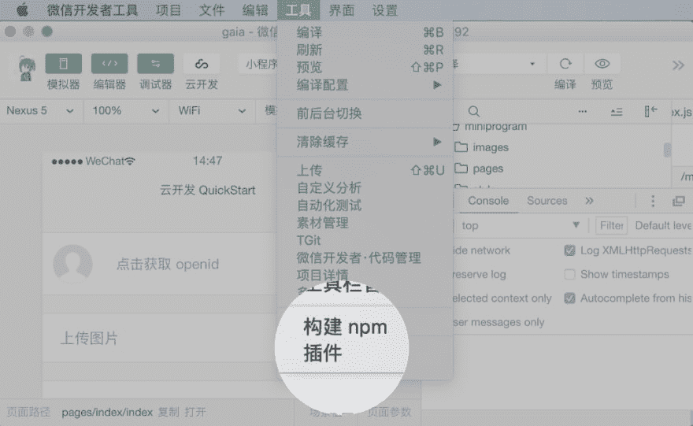
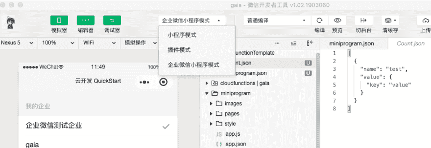
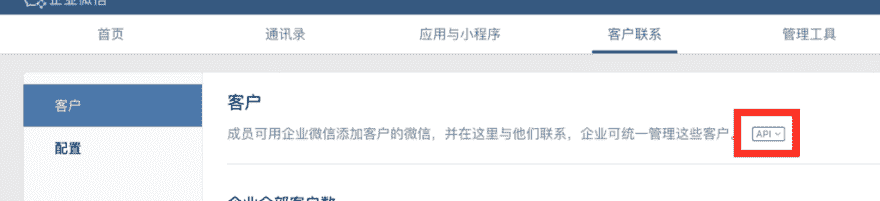
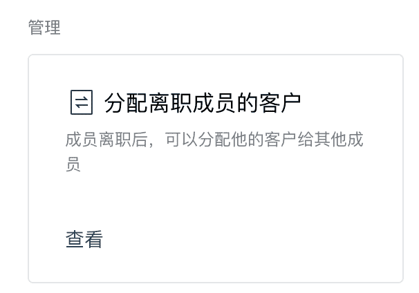
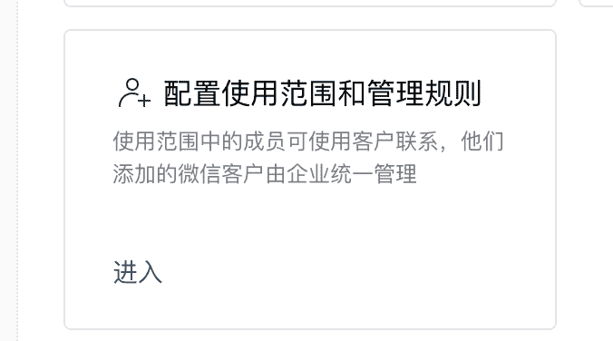
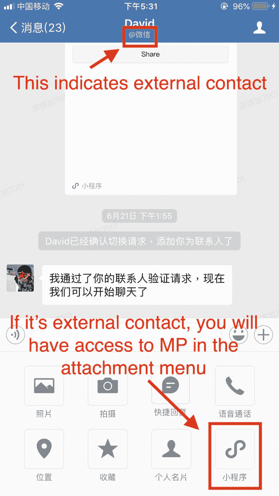

# 为微信工作搭建一个迷你程序是什么感觉？

> 原文：<https://dev.to/davidyu37/what-s-it-like-to-build-a-mini-program-for-wechat-work-1k10>

#### 微信工作中原型化的教训

[](https://res.cloudinary.com/practicaldev/image/fetch/s--PN8zIzkB--/c_limit%2Cf_auto%2Cfl_progressive%2Cq_auto%2Cw_880/https://cdn-images-1.medium.com/max/1024/1%2ABcsu1JZ8ibo9I7sc6KNkFw.png)

值得吗？听说大公司都在用。

这个微信工作的事情。

好像围绕微信工作还不够神秘，人们想知道有一个迷你程序绑定微信工作有什么好处。

在这篇文章中，我们将从一个开发者的角度探讨微信工作的迷你程序的可能性。

### UserID 是 OpenID

正如 Open ID 对于官方账号下的用户是唯一的一样，用户 ID 对于微信工作平台下的用户也是唯一的。

### 迷你程序需要发布才能绑定微信工作账号

在你看到如何在微信工作中与你的迷你程序交互之前，你需要有一个已发布的迷你程序。

你可以用微信工作应用扫描测试版的二维码，但有些功能只有在你绑定小程序后才能使用。

### dev tool 中的微信工作插件

[](https://res.cloudinary.com/practicaldev/image/fetch/s--YUhCCj9C--/c_limit%2Cf_auto%2Cfl_progressive%2Cq_auto%2Cw_880/https://cdn-images-1.medium.com/max/1024/1%2AM4pF-1srmD_LcxZ5IjdewA.png) 

<figcaption>在工具标签下找到插件选项</figcaption>

[](https://res.cloudinary.com/practicaldev/image/fetch/s--rvyQ4QnQ--/c_limit%2Cf_auto%2Cfl_progressive%2Cq_auto%2Cw_880/https://cdn-images-1.medium.com/max/976/1%2A5vLh-rST1KanWs0gzwg7mg.png) 

<figcaption>切换到企业微信模式</figcaption>

来源:[https://developers . weixin . QQ . com/mini program/dev/dev tools/qywx-dev . html](https://developers.weixin.qq.com/miniprogram/dev/devtools/qywx-dev.html)

类似于上面提到的限制，一些功能限于物理设备。

### 内外联系

*   由于可以通过微信工作 app 添加普通微信用户，因此用户分为内部联系人和外部联系人

当新用户添加到微信工作帐户时，要找到 API 秘密和设置您的回拨的位置，它隐藏在“客户联系”选项卡下的 API 按钮中。

[](https://res.cloudinary.com/practicaldev/image/fetch/s--BtMYjv6X--/c_limit%2Cf_auto%2Cfl_progressive%2Cq_auto%2Cw_880/https://cdn-images-1.medium.com/max/1024/1%2AWo_1Zen1BYINmqgOUdEkYA.png)

类似于您如何为官方帐户设置微信聊天机器人，您将设置一个端点来接收事件。[公文](https://work.weixin.qq.com/api/doc#90000/90135/90930)。

*   微信工作对组织的最大优势之一是，即使销售代表辞职，他们也可以获得他们的联系方式。

[](https://res.cloudinary.com/practicaldev/image/fetch/s--MlKS7c7C--/c_limit%2Cf_auto%2Cfl_progressive%2Cq_auto%2Cw_880/https://cdn-images-1.medium.com/max/606/1%2A9HeyyKeOtvKK2_SnrWs4fw.png)

*   默认情况下，并非每个员工都有权联系外部联系人。

[](https://res.cloudinary.com/practicaldev/image/fetch/s--vDBbxtA1--/c_limit%2Cf_auto%2Cfl_progressive%2Cq_auto%2Cw_880/https://cdn-images-1.medium.com/max/676/1%2Ai7zNKspIn1ULaWEnrcYP4w.png) 

<figcaption>你需要在这里设置一下</figcaption>

### 跳进跳出对话

[](https://res.cloudinary.com/practicaldev/image/fetch/s--4Uiuguzg--/c_limit%2Cf_auto%2Cfl_progressive%2Cq_auto%2Cw_880/https://cdn-images-1.medium.com/max/1024/1%2AOjV_iA99SGX1AAZ2RsJEYA.jpeg)

*   您将能够设置员工可以从附件中打开的不同页面
*   如果迷你程序从这里打开，您可以使用下面的方法获得对话的用户 ID

```
wx.qy.getCurExternalContact({
 success: function(res) {
 var userId = res.userId

}
}); 
```

### 多个 API 秘密和令牌

如果你在微信工作管理面板里玩一玩，你会发现不同种类的服务有不同的 API 秘密。

*   对于同步联系人列表
*   为了你的迷你程序
*   对于您的回拨网址
*   如果你绑定更多的小程序

确保您有正确的用户角色，这样您就可以在管理面板中看到完整的图片。

### 结论

如果你的组织已经采用了微信工作，那就利用它提供的 API 和功能。

然而，在我看来，微信工作对于内部沟通来说是非常棒的，可能是将中国工人从 996 工作文化中解放出来的答案。

这对于处理客户关系来说很普通，因为它实际上会让销售代表看起来像是只代表公司说话的人。而不是普通的微信关系，销售代表甚至可能被视为朋友。

如果你想了解更多关于微信相关软件开发的知识，[点击这里获取免费词汇表](https://pages.convertkit.com/b2469604dd/0c671fdd2d)。

* * *