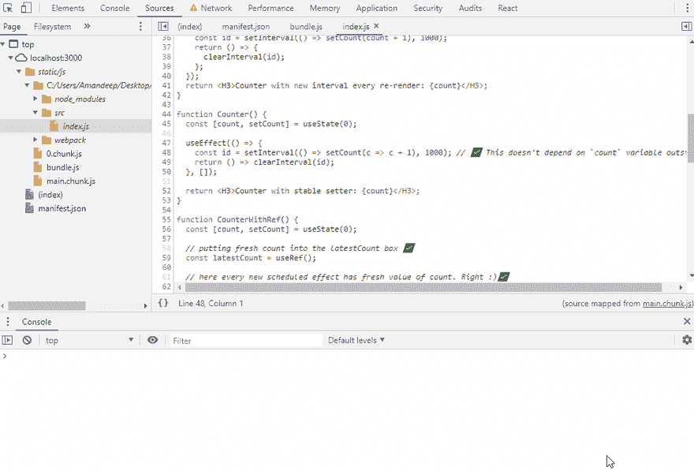
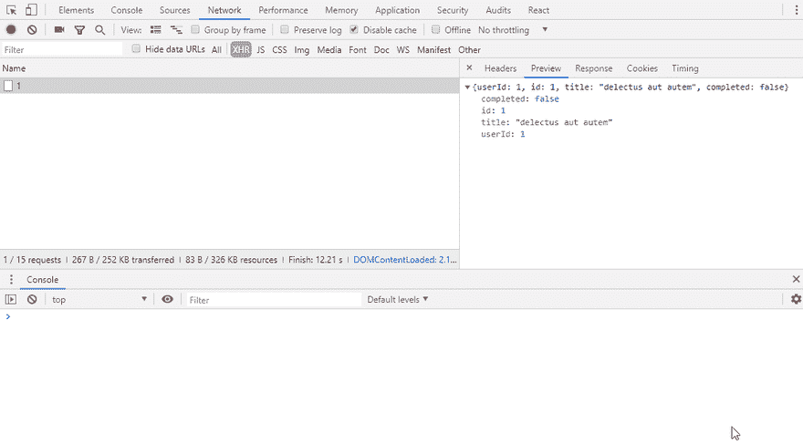
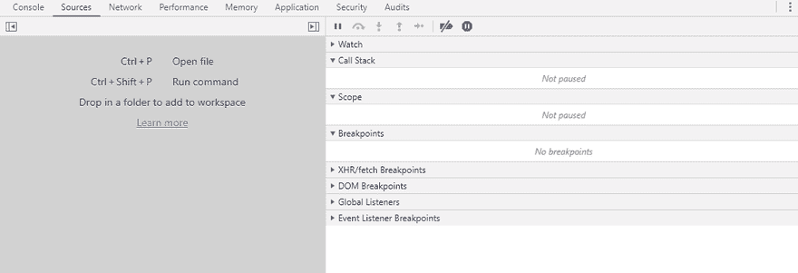
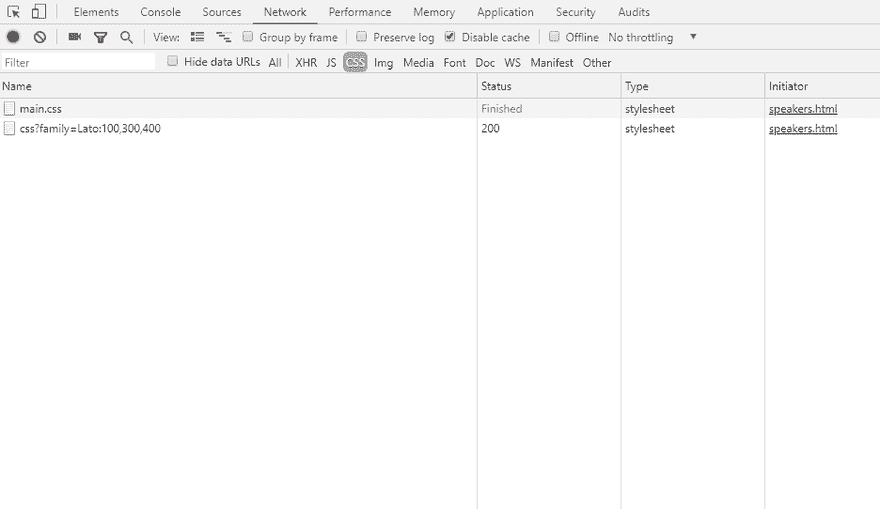

# 调试的隐藏宝石💎

> 原文：<https://dev.to/aman_singh/hidden-gems-of-debugging-1f11>

任何减少你艰巨任务时间的事情都有利于你的生产力。调试是那些费力的任务之一。开发人员努力编写无错误的代码，但我们都知道这并不容易。没有人喜欢在他们的代码中看到错误——那些红色的线不是很吸引人，对吗？尽管如此，如果你碰巧及早发现错误，错误是好事。正确地调试它们会给你新的学习和满足感。有无数个时刻，我在调试自己的代码时学到了很多东西，并看到它如何挑战我自己的概念。

> 我们都是通过犯错误来学习，然后再犯错来学习更多。

足够的动力。让我们进入正题。

今天，我将分享一些技巧和提示，你可以用它们来增强你的调试技能。我只在 chrome 开发工具中尝试过这些技巧(对不起 FireFox 用户)，但其中一些是浏览器不可知的。

### 1。在 console.log 中使用速记对象属性值表示法

这是我最喜欢的 *console.log* 技巧，必须放在列表的首位。你必须在你的代码库中编写大量的*控制台*语句，试图计算出一个变量的值。使用的便利性让“**主机**成为了调试冠军的领跑者🏆。黄金线是这样的:

```
 console.log(a); 
```

这太棒了，你可以打开你的控制台开发工具来看看它的价值。但是，随着行数的增加，跟踪特定值的引用变得很困难。

```
 console.log(a); // prints 20
 console.log(b); // prints 30
 console.log(c); // prints 40
// Sorry what was the reference variable for '30'? I am kind of lost😕 
```

对此，一个非常明显的解决方案是将一些字符串表示与变量一起转储。感谢**控制台**的多功能特性。

```
 console.log('a', a); // prints a 20
 console.log('b', b); // prints b 30
 console.log('c', c); // prints c 40 
```

但是正如我所说的，我们需要减少时间，写更少的行来提高效率和生产力，对吗？所以，诀窍是把你的变量放在' **{}** '花括号里。这实际上不是一个技巧，而是一种语言特性，称为对象属性值速记符号。你可以在这里了解更多关于[的信息。](https://alligator.io/js/object-property-shorthand-es6/) 

```
 // use object shorthand property value notation
  console.log({ a }); // prints { a: 20 };
  console.log({ b }); // prints { b: 30 }; 
```

这样做，将为您提供参考变量及其值。更少的代码更多的价值。

> **奖励**:在 chrome 的控制台标签中声明变量时，使用‘var’而不是‘const’或‘let’，以避免恼人的**语法错误**。“var”是您的便签簿伙伴。

### 2。胖[箭头](https://developer.mozilla.org/en-US/docs/Web/JavaScript/Reference/Functions/Arrow_functions)函数不再需要花括号

你现在一定用过**胖箭头**功能(如果你还没用过，那就开始用吧)。它们简短而精确，在编写函数定义时省略了对*花括号*和 *return* 语句的要求。

```
 const foo = x => 2 * x; // how awesome is that 😊 
```

一个流行的用例是数组实用程序回调( [map](https://developer.mozilla.org/en-US/docs/Web/JavaScript/Reference/Global_Objects/Array/map#) 、 [filter](https://developer.mozilla.org/en-US/docs/Web/JavaScript/Reference/Global_Objects/Array/filter#) 、 [reduce](https://developer.mozilla.org/en-US/docs/Web/JavaScript/Reference/Global_Objects/Array/reduce#) 等)

```
 let arr = [1, 2, 3];
   let newArr = arr.map(el => el * el); // [1, 4, 9] 
```

现在，假设您想要调试 map 回调函数，您将如何着手打印 *el* 值？一个简单的答案是重构回调函数，用花括号括起来，并注入 return 语句。

```
 let arr = [1, 2, 3];

 // using curly braces and return statement
 let newArr = arr.map(el => {
  console.log({ el }); // prints {el: 1}, {el: 2}, {el: 3}
  return el * el;
}); 
```

什么！你在开玩笑吗🙈？这并不理想。这不仅费时，而且还原也将耗费更多的时间。更好的解决方案是这样的:

```
 let arr = [1, 2, 3];

   // more concise and inline 🎉
   let newArr = arr.map(el => console.log({ el } ) ||  el * el); 
```

哇哦。！那是什么？别担心，这只是 JavaScript。我来解释一下:

这里发生了两件事:

*   **console.log()** 总是返回**未定义**，这是一个[假值](https://developer.mozilla.org/en-US/docs/Glossary/Falsy)。
*   给定一个类似 **expr1 || expr2** 的语句，[逻辑 OR 运算符](https://developer.mozilla.org/en-US/docs/Web/JavaScript/Guide/Expressions_and_Operators#Logical) (||)如果能转换为 **true** 则返回**expr 1**；否则，返回 **expr2** 。

因此， *console.log({ el })* 的返回值为*未定义*，从而执行第二个表达式 *el * el* 。这一变化的美妙之处在于，您可以看到内联的值**。不需要调试器或繁琐的*卷曲*仪式。大获全胜，对吧？😊**

 **当你是函数式编程的爱好者并使用像 [Ramda](https://ramdajs.com/) 这样的库时，这是非常方便的。

### 3。添加日志点——减少代码中 console.log 的使用

*console.log* 已经成为我们调试旅程中不可或缺的一部分。我们倾向于在代码中到处散布它；它已经成为我们抵御 bug 的第一道防线。
问题是*清理这些日志报表时消耗*的时间。显然，您可以找到每个控制台语句并手动删除它们。但是如果我说有更好的解决方案呢？在镇上拥抱新的孩子— **登录点**。

谷歌在 Chrome 73 中增加了这个[功能](https://developers.google.com/web/updates/2019/01/devtools)。它允许你直接从你的开发工具在你的**源代码**中添加控制台语句。

步骤:

*   打开开发工具的 **Sources** 部分，找到你的源代码。
*   写点击你想要添加你的控制台语句的任何行号。
*   将会出现一个选项列表；选择**添加登录点**。
*   一个**断点**编辑器将出现，允许您输入变量名。这和你在 *console.log()* 函数里面写表达式差不多。
*   输入一个我在上面[给你看的速记属性符号技巧。在**编辑器外点击**或点击**回车**保存。](#short_hand)
*   一个橙色徽章将代表你的登录点，你一切就绪。

现在，每次执行脚本时，您都会在开发工具的控制台部分看到记录的值。您可以添加多个日志点。

行动胜于雄辩:

[](https://res.cloudinary.com/practicaldev/image/fetch/s--cCydX6KU--/c_limit%2Cf_auto%2Cfl_progressive%2Cq_66%2Cw_880/https://thepracticaldev.s3.amazonaws.com/i/274an9y5c9uerghyf4lh.gif)

> **额外好处**:您还可以使用条件断点特性，在条件评估为真时插入一个断点。

### 4。存储和复制

Chrome 开发工具是我花大部分时间调试的地方。我把它作为我的 JavaScript 草稿栏。它有许多内置功能供我们使用。对我很有帮助的一个很酷的功能是**将变量值**复制到我的**剪贴板**。

要将任何引用变量(例如， *x* )复制到剪贴板中，只需在控制台选项卡中键入 **copy(x)** 并按回车键。Chrome 会将该变量复制到你的剪贴板，你可以使用普通的*粘贴*命令将它粘贴到任何地方。

当你在玩网络响应的时候，它的好处就显现出来了。在这里，您可以将这个**复制**特性与另一个名为**存储为全局变量**的优秀特性结合起来。

让我们看看实际情况:

*   打开您的**网络**选项卡，从列表中选择一个**请求**。
*   打开右边的**预览**部分。
*   右键单击属性名并选择**存储为全局变量**。
*   该变量将显示在您的控制台选项卡中，您可以使用 **copy()** 函数将它放在您的剪贴板中。

一举两得。

[](https://res.cloudinary.com/practicaldev/image/fetch/s--aR5ch39I--/c_limit%2Cf_auto%2Cfl_progressive%2Cq_66%2Cw_880/https://thepracticaldev.s3.amazonaws.com/i/xqd3qfehpjqshlv85rh0.gif)

> **附加功能**:您可以使用“Ctrl + f”在预览部分的整个响应对象中搜索特定的字符串匹配。

### 5。网络请求的断点

理想情况下，在构建客户机时，您应该努力使 HTTP 请求尽可能少。它不仅给你一个平稳的表现，也有助于避免 T2 错误。

在我们保险公司的一个项目中，我们正在构建一个数据驱动的 UI。表单中的下一个问题都是由用户之前的操作驱动的，随后通过网络获取。
我们需要分析，当特定类型的请求被触发时，我们可以准确地调试请求**负载**。我最终找到了这个名为**XHR/获取断点**的绝妙解决方案。它允许我在获取请求上设置一个条件断点。

**XHR 断点**允许你在所有的网络请求上设置断点。但是真正强大的是通过包含部分的 **URL 应用断点的能力。你可以在那里输入任何关键词，当 chrome 遇到包含匹配单词的请求 URL 时，它会放置一个**暂停**。多牛逼啊！！**

步骤是:

*   打开开发工具和右侧面板上的 **Sources** 选项卡。
*   你应该看到**断点**下面的**XHR/获取断点**部分。
*   点击 **+** 按钮，会出现一个**断点**编辑器，要求你输入关键字。
*   输入你的关键字，点击**回车**。

[](https://res.cloudinary.com/practicaldev/image/fetch/s--FIc25YeQ--/c_limit%2Cf_auto%2Cfl_progressive%2Cq_66%2Cw_880/https://thepracticaldev.s3.amazonaws.com/i/fc5d8mw10m9keudxtvsm.gif)

### 6。将您的请求复制为 cURL

当你想从类似于 **cmd** 或 **bash** 的**命令行**触发你的请求时，这很方便。您也可以将复制的链接粘贴到您的 [Postman 应用程序](https://www.getpostman.com/)中，它会为您填充所有的请求标题。非常方便地将你的要求形象化。

*   在 chrome 开发工具中打开你的**网络**标签。
*   找到您想要复制的**请求**,右键单击以显示多个选项。
*   将鼠标悬停在**复制**选项上，会显示一个不同格式的列表，您可以将您的请求复制为该格式。
*   选择**复制为 cURL** ，它将被保存到您的**剪贴板**中。

[](https://res.cloudinary.com/practicaldev/image/fetch/s--qtH4Wfm4--/c_limit%2Cf_auto%2Cfl_progressive%2Cq_66%2Cw_880/https://thepracticaldev.s3.amazonaws.com/i/jl54fll4xn5jya2yjw5e.gif)

### 7。不要放弃你的 CSS 改变——刷新时保持样式

这个技巧是献给我们的**UI/设计师**朋友们的。我们知道，通过**元素**选项卡的**样式**部分，我们可以修改 **CSS** 。但是当你刷新页面时，这些变化不会持续。如果希望保留对现有样式表所做的修改，可以通过以下步骤来实现:

*   打开**源**选项卡，选择**覆盖**。
*   点击**选择覆盖文件夹**并选择一个您想要保存更改的文件夹。
*   一个**许可**对话框会弹出来请求许可。请允许。
*   选择你的文件夹，你就可以开始摇滚了。

现在，每次您对现有样式进行更改时，即使您刷新页面，它们也不会消失。

*注意*:添加新的样式变化不会持久！。

* * *

### 最后的想法

你不能改变这样一个事实，那就是几乎不可能**写出 100% **无 bug**的代码。让我们适应并发展我们的调试技能，而不是把头撞在桌子上。相信我，通过探索你的 bug 的根源，你会学到很多东西。**

 **如果你喜欢这篇文章，几个❤️肯定会让我笑😀。现在，去~~杀死~~移除一些 bug 吧🐞。****