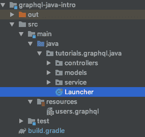
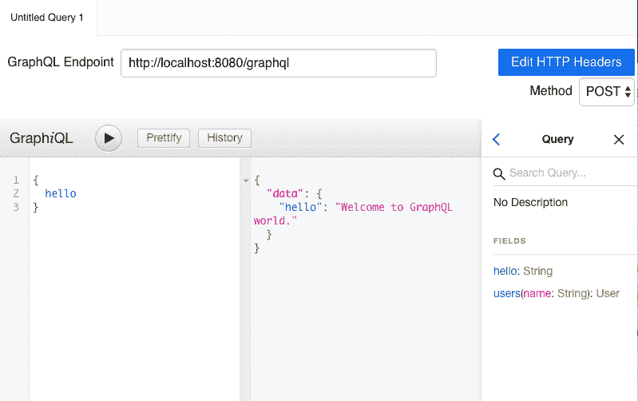
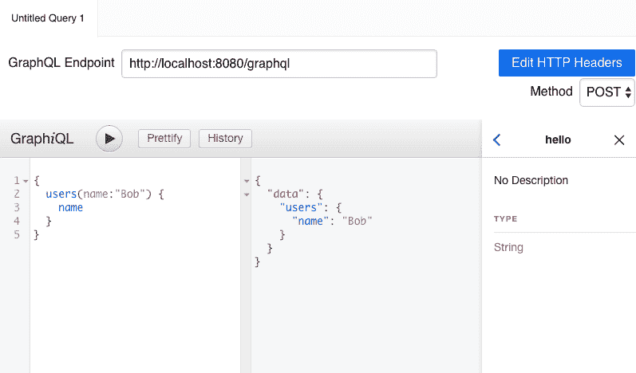
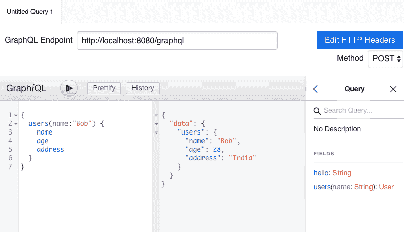
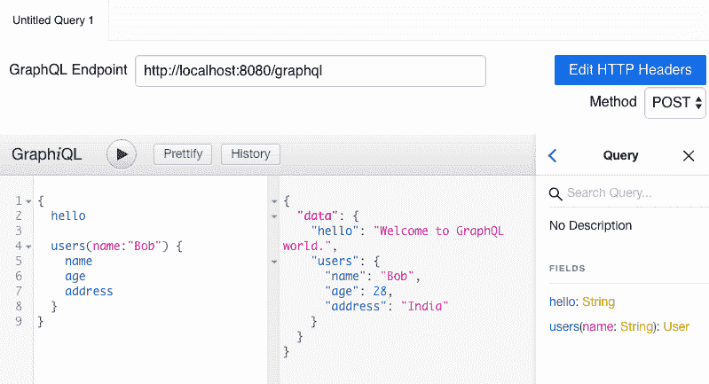
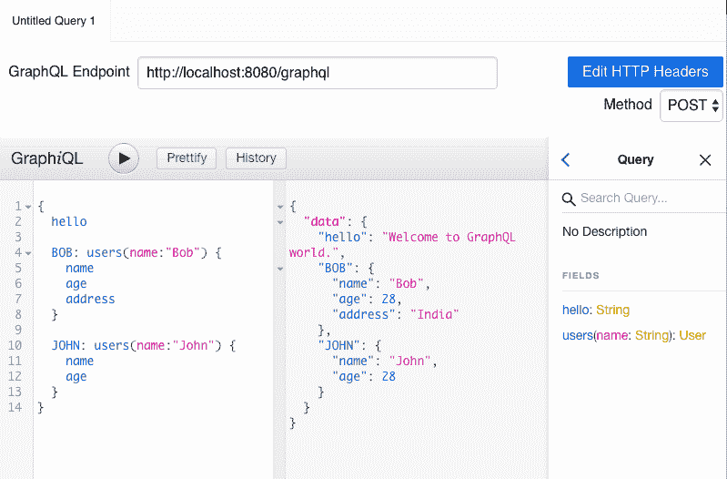

# GraphQL (Java)入门

> 原文：<https://dev.to/jeetmp3/getting-started-with-graphql-java-53j1>

GraphQL 是 Rest APIs 的查询语言，让客户能够准确选择他们需要的东西。它还提供服务器端运行时来执行查询。

GraphQL 有 3 个主要部分

1.  GraphQL 服务器
2.  GraphQL 模式
3.  客户

### GraphQL 服务器

GraphQL 服务器负责验证和执行查询，并根据客户的需要返回响应。客户端可以根据需要选择字段，服务器将只返回那些选定的字段。

### GraphQL 模式

GraphQL 有一个特定的语言叫做 **GraphQL 模式语言**来定义模式。GraphQL 模式由查询和类型组成。作为 API 所有者，我们可以决定消费者可以使用什么类型的查询&。模式有默认的根对象类型，称为**查询**，它包含所有的查询。一个典型的模式是

```
#The root object  type  Query  {  hello:  String  greet(name:  String):  String  }  #Defined Type  type  User{  name:  String  age:  Int  } 
```

在上面的模式中，根对象是 Query，它有一个名为 *hello* 的字段和一个方法 *greet* ，两者都返回字符串类型。*问候*有一个名为的输入参数*，它是一种字符串。这意味着客户端可以在查询 *greet* 时传递任何字符串类型的参数。*

用户类型是定义的类型，它有两个字段名称和年龄。GraphQL 支持多种内置类型，如 String、Int、Float、Boolean 等。[点击这里](https://graphql.org/learn/schema/)阅读更多关于 graphql 模式和类型的信息。

> 对于查询类型中的每个字段或查询，都有相应的解析器，它将在 GraphQL 服务器上运行。

### 客户端

客户就是消费者。因为 GraphQL 在 rest 上工作，所以任何 Rest 客户机都可以查询 graphql。很少有工具适合测试。这些工具提供了自动完成功能，我们可以查看所有可能的查询和类型。一些工具是 **GraphiQL** ，**失眠**。

### 行动中的 GraphQL-Java

下面的代码将向您展示如何在 Spring 应用程序中集成 GraphQL。所以让我们从 GraphQL 模式文件开始。

代码结构将如下所示

[](https://res.cloudinary.com/practicaldev/image/fetch/s--Q5YeZRBA--/c_limit%2Cf_auto%2Cfl_progressive%2Cq_auto%2Cw_880/http://blogs.jbisht.cimg/graphql/graphql-code-structure.png)

##### 定义模式文件 users.graphql

```
type  Query  {  hello:  String  users(name:  String):  User  }  type  User  {  name:  String  age:  Int  address:  String  } 
```

现在我们开始配置 GraphQL Java 对象以及查询解析器(hello & user)。

##### 第一步:读取&解析模式文件

文件名:GraphQLSchema.java

```
private TypeDefinitionRegistry readAndParseSchemaFile() throws Exception {
        String schemaString = ResourceUtils.readClasspathResourceContent("users.graphql");

        SchemaParser schemaParser = new SchemaParser();

        // parsing schema file and creating typeDefRegistery
        return schemaParser.parse(schemaString);
    } 
```

##### 第二步:配置解析器

```
private RuntimeWiring buildRuntimeWiring() {
        return RuntimeWiring.newRuntimeWiring()
                .type("Query", builder -> builder.dataFetchers(buildDataFetchers()))
                .build();
    }

    private Map<String, DataFetcher> buildDataFetchers() {
        Map<String, DataFetcher> dataFetchers = new HashMap<>();
        dataFetchers.put("hello", new StaticDataFetcher("Welcome to GraphQL world."));
        dataFetchers.put("users", env -> User.of("John", 28, "India"));
        return dataFetchers;
    } 
```

##### 第三步:准备 GraphQL 对象并执行查询

```
private void setup() throws Exception {
        // We need to create GraphQLSchema Object but before that we need to configure resolvers 
        GraphQLSchema graphQLSchema = new SchemaGenerator().makeExecutableSchema(readAndParseSchemaFile(), buildRuntimeWiring());
        graphQL = GraphQL.newGraphQL(graphQLSchema).build();
    }

    public ExecutionResult executeQuery(String graphQLQuery) {
        return graphQL.execute(graphQLQuery);
    } 
```

##### 步骤 4:在端点(/graphql)上服务用户查询

```
@RestController
    public class GraphQLController {

        private final GraphQLService graphQLService;

        @Autowired
        public GraphQLController(GraphQLService graphQLService) {
            this.graphQLService = graphQLService;
        }

        @PostMapping("/graphql")
        public Map<String, Object> executeQuery(@RequestBody GraphQLRequest request) {
            return graphQLService.executeQuery(request.getQuery()).toSpecification();
        }
    } 
```

##### 第五步:用户 graphql 或 Rest 执行 graph QL 查询

图形资源链接

*   [下载链接](https://github.com/graphql/graphiql)
*   [源代码](https://github.com/graphql/graphiql)

在 graphql 中添加/graphql 控制器的端点，并开始执行查询

[](https://res.cloudinary.com/practicaldev/image/fetch/s--fUay-mBm--/c_limit%2Cf_auto%2Cfl_progressive%2Cq_auto%2Cw_880/http://blogs.jbisht.cimg/graphql/gqlq1.png)

我们可以询问响应字段，graphql 将只服务于选定的字段。

1.  仅查询用户的姓名

[](https://res.cloudinary.com/practicaldev/image/fetch/s--3eADpqR4--/c_limit%2Cf_auto%2Cfl_progressive%2Cq_auto%2Cw_880/http://blogs.jbisht.cimg/graphql/gqlq2.png)

1.  查询用户的所有字段

[](https://res.cloudinary.com/practicaldev/image/fetch/s--YzLWFmHp--/c_limit%2Cf_auto%2Cfl_progressive%2Cq_auto%2Cw_880/http://blogs.jbisht.cimg/graphql/gqlq3.png)

我们可以在单个请求中要求多个查询

[](https://res.cloudinary.com/practicaldev/image/fetch/s--hLTi6XNF--/c_limit%2Cf_auto%2Cfl_progressive%2Cq_auto%2Cw_880/http://blogs.jbisht.cimg/graphql/gqlq4.png)

甚至多次使用别名的相同查询

[](https://res.cloudinary.com/practicaldev/image/fetch/s--J4hoV7XF--/c_limit%2Cf_auto%2Cfl_progressive%2Cq_auto%2Cw_880/http://blogs.jbisht.cimg/graphql/gqlq5.png)

你可以在这里找到完整的代码

快乐编码😀😀😀！！！