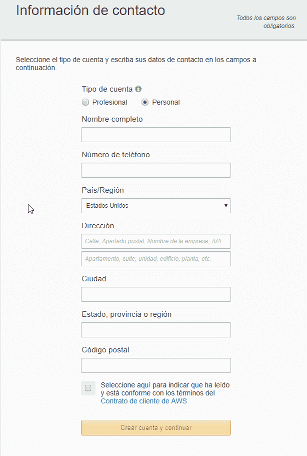
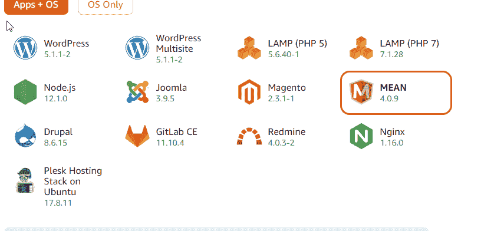
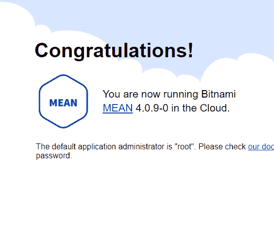
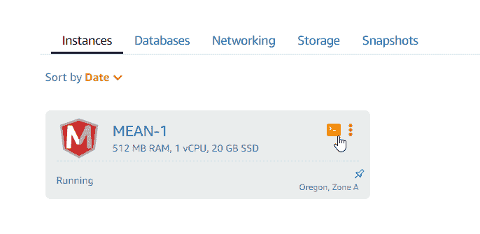
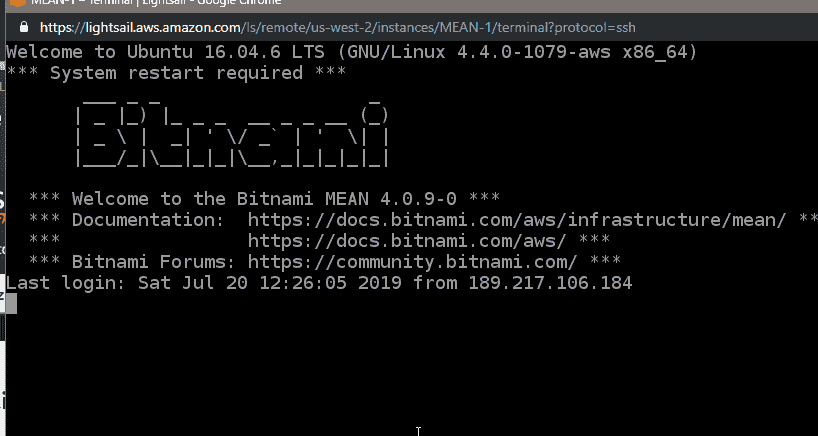
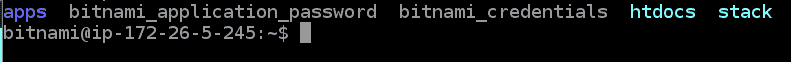
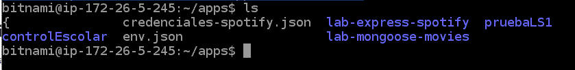
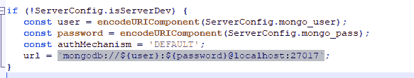
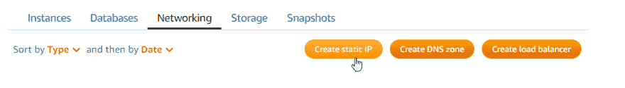
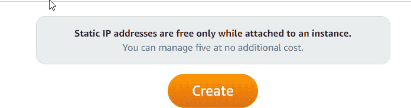

# 如何在 AWS 上创建多站点 NODE Express Mongo 服务器

> [https://dev . to/iqdavidh/how-create-un-server-in-AWS-con-multiple sites-node-express-mongo-55ob](https://dev.to/iqdavidh/como-crear-un-servidor-en-aws-con-varios-sitios-node-express-mongo-55ob)的多站点服务器

Amazon 为 IT 提供了非常广泛的服务(Amazon Web Services AWS)。其中一项服务是导光板；一种类似数字海洋或火山的虚拟机服务。
虚拟机是一个完整的操作系统，我们可以在其中自由安装我们想要的东西，这意味着我们也有义务对其进行管理并等待安全更新。

#### 选择导光板？

学习使用导光板使我们能够开始使用 AWS。这是构建虚拟专用云 VPC 的第一步，该虚拟专用云可以连接到 Amazon 的其他服务。服务器价格极具竞争力，适合开始测试。

#### 步骤 1:在 AWS 中创建帐户

创建帐户后，您需要执行 5 个步骤来设置所创建帐户的安全性，简而言之，我们需要创建一个不具有开单权限的辅助(开发人员)帐户，以使其成为我们使用的帐户。

其中一个步骤需要使用智能手机来执行 MFA 验证。在此，我建议您使用另一个设备安装身份验证，以便有两个设备。这样可以节省我们的头痛，因为如果你失去了设备，你就不能再作为主帐户进入。

视频 de 亚马逊
[https://www.youtube.com/watch?v=Ip5NaS7RS6g](https://www.youtube.com/watch?v=Ip5NaS7RS6g)

### 入账

此过程非常简单，并且有许多教程

[https://portal.aws.amazon.com/gp/aws/developer/registration](https://portal.aws.amazon.com/gp/aws/developer/registration)

### 我们将使用的服务是导光板

[https://aws.amazon.com/es/lightsail/](https://aws.amazon.com/es/lightsail/)

## 基本说明-创建导光板实例

简而言之，AWS 允许我们使用 BITNAMI 服务为我们的服务器使用默认设置，这意味着我们可以选择一台预配置了必要程序的服务器作为节点服务器。

我们必须创建“mongo express angular node”(mongo express angular node)实例。什么不选择 NODE 选项？-因为 MEAN 包括数据库配置。

一旦服务器创建完毕，我们就可以在 web 上看到它

在我们的控制面板上，它也会准备好

要连接到操作系统，可以使用 SSH 连接，也可以直接连接到 web 终端。

我们的服务器是 Apache web 服务器，我们要做的是配置多个 node - express 站点，为此，我们将有一个包含所有应用程序的目录和一个 mongo 服务器。

这是服务器的内容，目录是我们的网站/应用程序所在的位置。

唯一需要配置的是 mongo 服务器的安全性

我们需要当前会话用户的密码此密码位于 bitnami _ applicaction _ password 文件中

要查看密码，请运行

卡特彼勒 bitnami _ 应用程序 _ 密码

Copiar el 密码

我们运行以下命令以输入 mongo 作为管理员

mongo admin -用户名 root -密码 MY _ BITNAMI _ APPLICATION _ PASSWORD

我们需要做的是创建一个数据库并添加一个用户

使用 lab_celeb

db . create user({ user:" El usualio "，pwd: "el password "，roles:["dbOwner"]})

将 json 文件导入到集合中

mongo import-u root-p BitnamiPassword-authenticationDatabase " admin "-db lab _ celeb-collection celebridades-file。/seed _ celebridad . JSON-JSON array

步骤 2:组织应用程序

在目录(启动控制台时进入的目录)中，装载一个包含所有应用程序的目录

mkdir 应用

cd 应用程序

要安装应用程序，我们直接在 apps 目录中创建克隆 git。然后进行 npm 安装，对于具有 npm run build 视图的项目

与莽哥的连接将需要我们使用用户名和密码。

要在开发模式下运行应用程序，我们使用 nodemon。在生产中，我们使用软件包

instalar forever:
sudo NPM install-g forever
https://www.npmjs.com/package/forever[T3】](https://www.npmjs.com/package/forever)

## 运行应用程序

永远开始 app.js

最后，我们必须更新防火墙，以便接收到其他端口的连接。默认情况下，仅启用与端口 80 的通信

让我们的应用程式可以运作

进入防火墙

要定义哪些开放端口，请按如下方式组织应用程序:端口 3000 至 3020 将专用于 API。4000 至 4020 端口将专用于前端应用程序。

### 为服务器分配固定 IP

到目前为止，服务器有一个 IP，每次重新启动服务器时都会更改。为了确保我们的服务器具有特定的 IP，我们必须创建一个静态 IP 并将其分配给服务器

