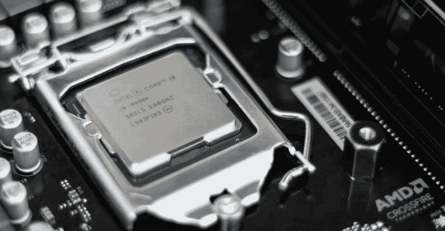
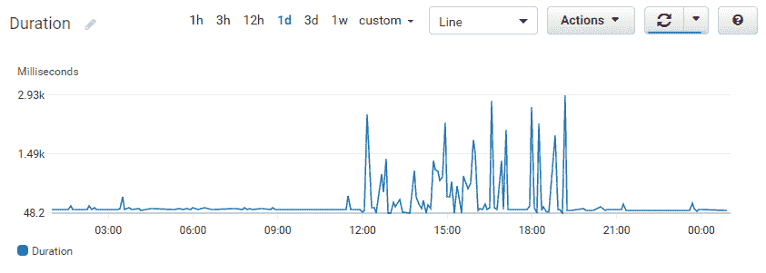
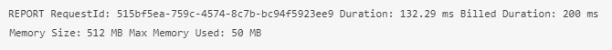
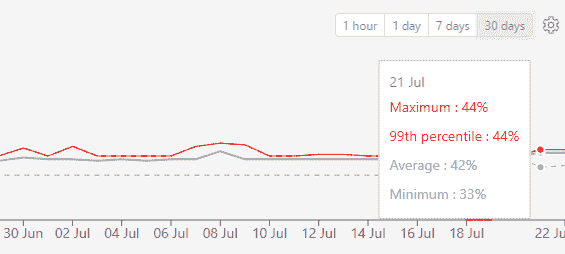

# 如何优化 Lambda 内存和 CPU

> 原文：<https://dev.to/byrro/how-to-optimize-lambda-memory-and-cpu-4dj1>

使用 AWS Lambda 极大地改变了我们对计算资源的看法。

在 [EC2](https://aws.amazon.com/ec2/) 上，我们按小时租用服务器，选择具有不同资源组合的机器类型。Lambda 模型有点不同，这篇文章展示了如何从一些有趣的优化中获益。

# λ模型

Lambda 资源分配模型非常简单:选择你的函数需要多少内存，然后嘣，你就完成了。目前，Lambda 提供了从 128 MB 到 3，008 MB 的选项。

一个好处是，除了你的函数和你需要的运行时(Java 机器、Python 解释器等)，你不必考虑操作系统使用的内存或其他任何东西。

不过，对于这种模型，有两个重要的注意事项，许多开发人员通常不会密切关注。

## CPU 分配

Lambda 将[分配 CPU 能力](https://docs.aws.amazon.com/lambda/latest/dg/resource-model.html)与配置的内存量成线性比例。这将对许多优化策略产生相关的影响，所以请记住这一点。

众所周知，[在 1，792 MB 时，我们得到 1 个完整的 vCPU](https://docs.aws.amazon.com/lambda/latest/dg/resource-model.html) 。注意到“CPU”前面的“v”了吗？vCPU 的定义是“ *[英特尔至强内核或 AMD EPYC 内核](https://aws.amazon.com/ec2/instance-types/?nc1=h_ls)* 的线程”。这对于计算优化的实例类型是有效的，它们是底层的 Lambda 基础设施(不是 AWS 的硬性承诺，而是一个通用规则)。

因此，如果您将 1，024 MB 分配给一个函数，您将得到大约 57%的 vCPU (1，024 / 1，792 ~= 0，57)。当然不可能“*划分*一个 CPU 线程，所以 AWS 在后台做的就是划分 CPU 的时间。在 1，024 MB 时，您的函数将获得 57%的处理时间。CPU 可能会在剩余的 43%的时间里切换到执行其他任务。

显然，这种 CPU 分配模型的结果是:分配给函数的内存越多，它完成给定任务的速度就越快。

## 多核(种)

假设 1，792 MB 获得 1 个完整的 vCPU，那么 AWS 如何随着配置规模的扩大而不断增加 CPU 能力，直到 3，008 MB？显然，它必须增加 vCPUs 的数量。

这里的问题是，对于单线程程序来说，增加内存超过这个阈值不会带来速度提升。从超过 1，792 MB 的 CPU 能力中获益的唯一方法是编写同时在两个线程中运行的代码。这显然不是在所有情况下都能做到的，所以一定要明智地使用这一点。

> *在[我们的测试中，我们观察到](https://medium.com/hackernoon/lower-your-aws-lambda-bill-by-increasing-memory-size-yep-e591ae499692)这个阈值为 2,048 MB，而不是 1,792 MB。我们不断增加单线程 CPU 密集型任务的内存，我们观察到速度提升超过 1，792 MB，直到 2，048 MB，其中内存增加不再转化为速度增加。这让我们相信 2，048 MB 是获得 1 个完整 vCPU 的实际阈值。*

# 时间敏感型工作负载

在某些情况下，我们希望 Lambda 函数尽可能快地做出响应。假设有一个真实的人在等待回复，我们不想看到他们对我们的申请越来越不耐烦。

在这种情况下，我们能做的最好的事情就是为 Lambda 函数分配更多的内存，但如果是单线程程序，就不要超过 1，792 MB。只要有可能，我们就可以并行执行，并利用具有更高内存设置的双 vCPU 设置。

您可以使用 [CloudWatch 指标](https://docs.aws.amazon.com/lambda/latest/dg/monitoring-functions-metrics.html)并比较内存调整前后的平均持续时间，以查看您的函数从内存增加中受益了多少。

# 记忆受限

对于对时间不敏感的工作负载，我们应该根据函数的要求尽可能低地分配内存，因为我们分配的内存越多，每 100 毫秒的开销就越大。

这里有另一个警告:由于我们按持续时间付费，更多的内存使我们的程序更快，我们实际上可以通过增加内存来省钱——即使我们并不真的需要它。查看[我最近写的这篇文章](https://medium.com/hackernoon/lower-your-aws-lambda-bill-by-increasing-memory-size-yep-e591ae499692),这篇文章提供了更多的细节和内存设置优化 Lambda 成本的基准。

现在，我们需要回答的问题是:对于我们的每个 Lambda 函数，需要多少内存？虽然这个问题应该很容易回答，但是 CloudWatch 指标在这里对我们没有帮助，因为内存使用情况不受 AWS 监控。

我们有两个选择来寻找答案，概述如下。第一种方法既麻烦又乏味，但第二种方法要简单得多。

### 从 CloudWatch 日志中提取内存使用情况

CloudWatch Logs 记录了我们需要的数据，但不是以一种易于消费的方式。

在每个 Lambda 调用日志的末尾，您会发现类似下面这样的一行:

注意这里的两个数据点:

*   内存大小:512 兆字节
*   使用的最大内存:50 MB

通过读取所有 Lambdas 日志中所有调用的这一行，我们将能够编译统计数据来回答上面的问题。例如，我们可以使用 [RegEx](https://en.wikipedia.org/wiki/Regular_expression) 来提取我们需要的值。开始分配可能的最大内存，运行一些示例测试或在生产中运行该函数一段时间，检查统计数据，然后根据该函数在峰值使用时真正需要的内存量来调整内存分配。

这种解决方案的缺点是很麻烦。这将需要时间来实现，我们实际上需要将它作为一个定制的监控服务来支持，无论何时我们创建一个新的 Lambda 函数，它都应该是可用的。

> 编辑:正如 Rehan van der Merwe 在评论中所建议的那样，你也可以使用 CloudWatch Logs Insights 来提出[聚合](https://docs.aws.amazon.com/AmazonCloudWatch/latest/logs/CWL_QuerySyntax.html#CWL_Insights_Aggregation_Functions)函数，并编译一个性能[时间序列](https://docs.aws.amazon.com/AmazonCloudWatch/latest/logs/CWL_Insights-Visualizing-TimeSeries.html)来支持你的分析。需要一点工作，但理论上，它应该工作。

### 用第三方服务追踪记忆

到目前为止，无服务器已经达到了相当成熟的状态，有几个第三方服务可以填补 AWS Lambda 和 CloudWatch 产品留下的空白。

[Dashbird](https://dashbird.io/?utm_source=dev.to&utm_medium=referral&utm_campaign=article&utm_content=tutorial) 举例来说，就是为 AWS Lambda 从头开始搭建的一个监控调试平台。它将提供的一个关键指标是内存使用情况(平均、最小、最大和第 99 个 T2 百分点)。有了这些数据点，就很容易为每个功能设置理想的内存大小。这项服务是免费的，每月高达 100 万次调用，所以你可以从中受益，而不需要额外的费用。

# 包装完毕

我们讨论了 AWS Lambda 资源分配模型以及它与传统服务器模型的不同之处。Lambda 模型暗示了我们应该如何在 CPU 和内存受限的工作负载中优化我们的功能。在任何优化策略中，我们都需要注意一些警告。通过结合 CloudWatch 指标、日志和第三方服务，我们拥有了为任何 Lambda 函数找到完美资源分配设置所需的所有数据。

如果你想了解更多关于 AWS Lambda 最佳实践的信息，我推荐你阅读[这本免费的电子书](https://dashbird.io/serverless-benefits/)，涵盖了从微服务方法到成功的调试技术。