# 12 个简单示例中的 12 项 ES10 功能

> 原文：<https://dev.to/carlillo/12-es10-features-in-12-simple-examples-2cbn>

ES10 是对应于 2019 年的 ECMAScript 版本。该版本不包括 ES6 (2015)中出现的那么多新功能。但是，已经加入了一些有用的功能。

本文通过简单的代码示例介绍了 ES10 提供的特性。这样不需要复杂的解释就能快速理解新特性。

当然要有 JavaScript 的基础知识才能完全理解介绍的最好的。

**ES2019** 中新增的#JavaScript 特性有:

**数组#{flat，flat map }
object . fromentries
字符串{ trimstart，quarter }
symbol # description
try { } { }//optional binding
JSON ecmascript[
动态输入(阶段 3)。
全球标准化这个对象(阶段 3)。**

-

## array . flat()&&array . flat map

有两种新的数组方法:

*   Array.flat()方法创建一个新数组，其中所有子数组元素递归地连接到指定深度。

*   Array.flatMap()方法首先使用映射函数映射每个元素，然后将结果展平到一个新数组中。它等同于深度为 1 的 map()后跟 flat()，但是 flatMap()通常非常有用，因为将两者合并到一个方法中会稍微高效一些

[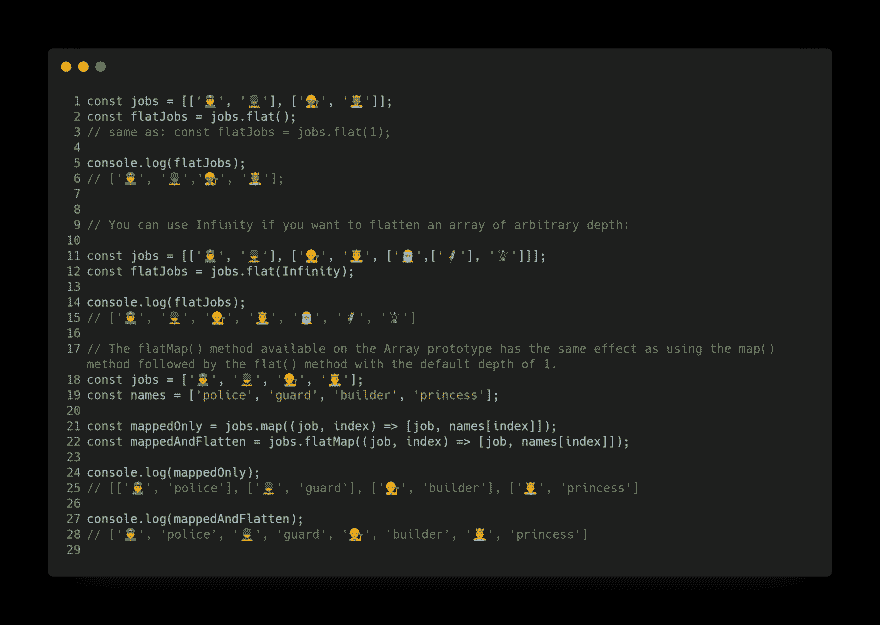](https://res.cloudinary.com/practicaldev/image/fetch/s--iCYu2iWd--/c_limit%2Cf_auto%2Cfl_progressive%2Cq_auto%2Cw_880/https://cdn-images-1.medium.com/max/4000/0%2A2ZQaykVaSpXpQ-eV.png)

## Object.fromEntries()

将一系列键/值对转换成一个对象。

[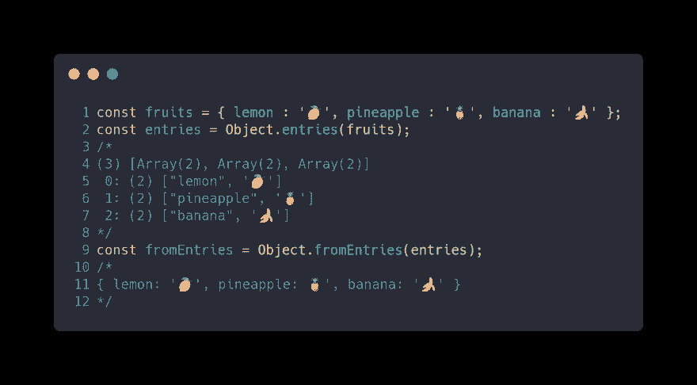](https://res.cloudinary.com/practicaldev/image/fetch/s--LHG6V4Hh--/c_limit%2Cf_auto%2Cfl_progressive%2Cq_auto%2Cw_880/https://cdn-images-1.medium.com/max/2916/0%2A7ZiVwWAx6gYXo0Y0.png)

## String.protype.matchAll

matchAll()方法返回所有匹配正则表达式字符串的结果的迭代器，包括捕获组。

[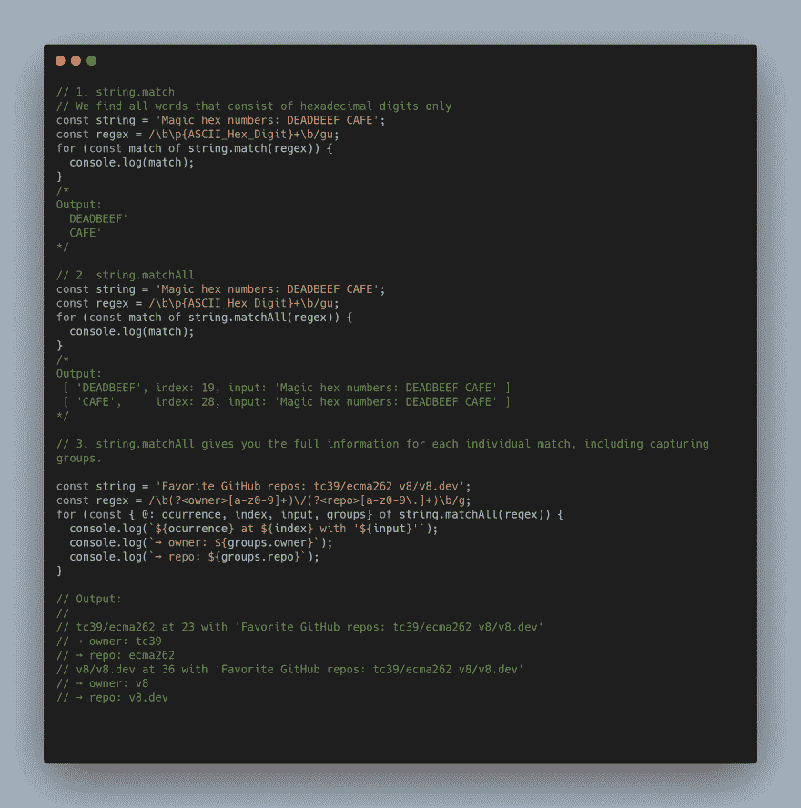](https://res.cloudinary.com/practicaldev/image/fetch/s--DM1-UiGd--/c_limit%2Cf_auto%2Cfl_progressive%2Cq_auto%2Cw_880/https://miro.medium.com/max/2560/1%2AyWPj1hItw2AzySsiF84E5w.png)

## string . trim start()&string . trimend()

有两个新的字符串方法来删除字符串中的空白:

*   trimStart()方法删除字符串开头的空格。

*   方法的作用是:删除字符串末尾的空格。

## 符号。描述

有一个新的符号描述存取器，当您创建符号时，您可以提供一个字符串作为描述，在 ES10 中有一个此属性的存取器。

[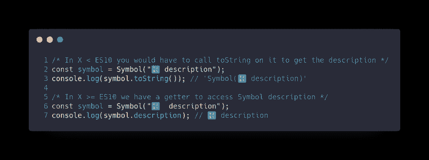](https://res.cloudinary.com/practicaldev/image/fetch/s--c5GKqvJ1--/c_limit%2Cf_auto%2Cfl_progressive%2Cq_auto%2Cw_880/https://cdn-images-1.medium.com/max/3344/0%2Ac0n5PxZ0f15B1EXw.png)

## 可选捕捉绑定

过去，try/catch 语句中的 catch 子句需要一个变量。现在，它允许开发人员使用 try/catch，而无需创建未使用的绑定。

[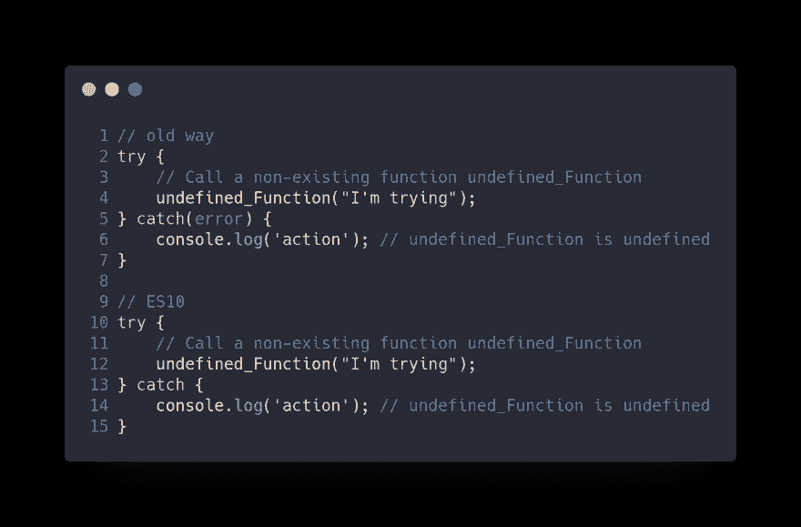](https://res.cloudinary.com/practicaldev/image/fetch/s--Y3UoqrPA--/c_limit%2Cf_auto%2Cfl_progressive%2Cq_auto%2Cw_880/https://cdn-images-1.medium.com/max/2776/0%2AKjmJwEXVGbUmWY5u.png)

## JSON⊂ECMAScript

在 ES10 之前的版本中，不接受未转义的行分隔符 U+2028 和段落分隔符 U+2029。

*   U+2028 是段落分隔符。

*   U+2029 是行分隔符。

[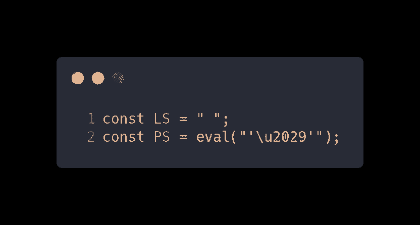](https://res.cloudinary.com/practicaldev/image/fetch/s--pfFNepOQ--/c_limit%2Cf_auto%2Cfl_progressive%2Cq_auto%2Cw_880/https://cdn-images-1.medium.com/max/2000/0%2AjM-ppo6G0oXcWoPr.png)

## 格式良好的 JSON.stringify()

JSON.stringify()可能会返回 U+D800 和 U+DFFF 之间的字符，作为没有等效的 UTF-8 字符的值。然而，JSON 格式需要 UTF-8 编码。建议的解决方案是将不成对的代理代码点表示为 JSON 转义序列，而不是将它们作为单个 UTF-16 代码单元返回。

## 稳定 Array.prototype.sort()

V8 以前的实现对包含 10 个以上项目的数组使用不稳定的快速排序算法。

> *稳定的排序算法是两个键相同的对象在排序后的输出中出现的顺序与它们在未排序的输入中出现的顺序相同。*

[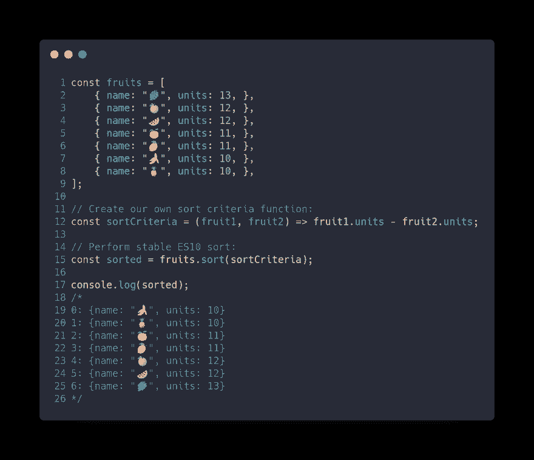](https://res.cloudinary.com/practicaldev/image/fetch/s--qZyuLQ1A--/c_limit%2Cf_auto%2Cfl_progressive%2Cq_auto%2Cw_880/https://cdn-images-1.medium.com/max/3044/0%2ABiSFuQWnrOGXz-ZI.png)

## 新建 Function.toString()

toString()方法返回一个表示函数源代码的字符串。在 ES6 中，当 toString 在一个函数上被调用时，它将根据 ECMAScript 引擎返回该函数的字符串表示。如果可能，它将返回源代码，否则返回一个标准化的占位符。

[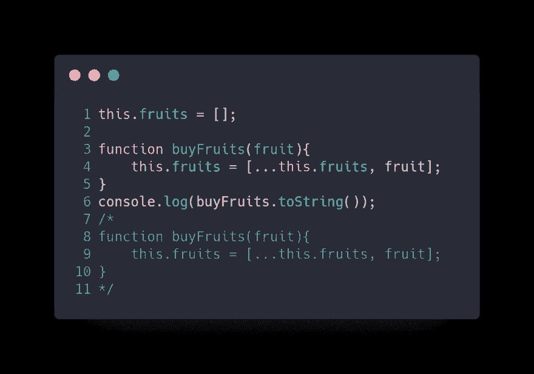](https://res.cloudinary.com/practicaldev/image/fetch/s--Ww6NDvK2--/c_limit%2Cf_auto%2Cfl_progressive%2Cq_auto%2Cw_880/https://cdn-images-1.medium.com/max/2200/0%2ACchEwTj5D7za_WLp.png)

* * *

## BigInt —任意精度的整数

BigInt 是第七种原始类型，它是一个任意精度的整数。变量现在可以表示⁵数，而不仅仅是 9007199254740992。

[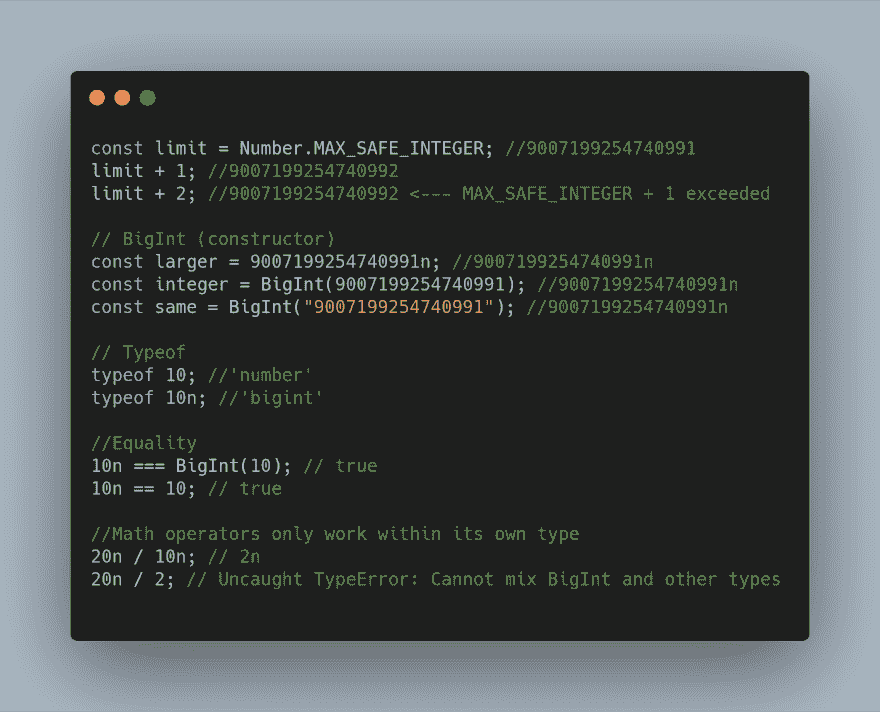](https://res.cloudinary.com/practicaldev/image/fetch/s--H8youZL9--/c_limit%2Cf_auto%2Cfl_progressive%2Cq_auto%2Cw_880/https://cdn-images-1.medium.com/max/2792/0%2AU4v7rbd23tcBOyCe.png)

## 动态导入

Dynamic import()为所请求模块的模块名称空间对象返回一个承诺。因此，现在可以使用 async/await 将导入赋值给变量。

[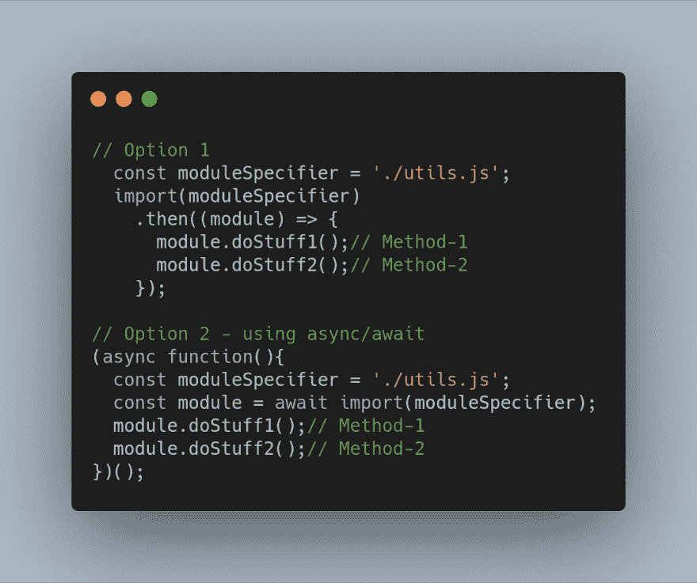](https://res.cloudinary.com/practicaldev/image/fetch/s--giCx7UxQ--/c_limit%2Cf_auto%2Cfl_progressive%2Cq_auto%2Cw_880/https://cdn-images-1.medium.com/max/2184/0%2A9-pdI0pKfGDfvQBy.png)

## 标准化 globalThis 对象

在 ES10 之前，全球没有标准化。在生产代码中，你可以通过编写这个庞然大物在多个平台上“标准化”它:

[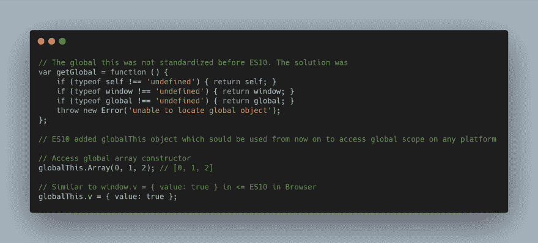](https://res.cloudinary.com/practicaldev/image/fetch/s--i2aBLZy6--/c_limit%2Cf_auto%2Cfl_progressive%2Cq_auto%2Cw_880/https://cdn-images-1.medium.com/max/4000/0%2ALxkj4TR9_s8Oqe_A.png)

## 结论

JavaScript 是一种活的语言，这对于 web 开发来说是非常有益的。自 2015 年 ES6 出现以来，我们正经历着该语言的蓬勃发展。在本帖中，我们回顾了 ES10 (2019)中出现的功能，并介绍了一些将在 ES11 (2020)中保持稳定的功能，因为它们处于状态 3，可能会在下一版本中标准化。

尽管这些特性中的许多对于 Web 应用程序的开发来说可能并不重要，但是它们提供了以前可能通过技巧或冗长来实现的可能性。

*最初发布于 [www.carloscaballero.io](http://www.carloscaballero.io) 。*