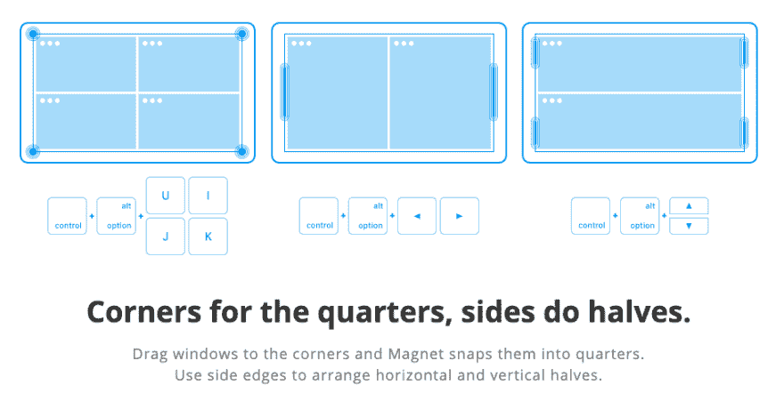
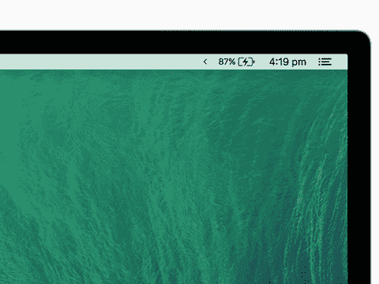
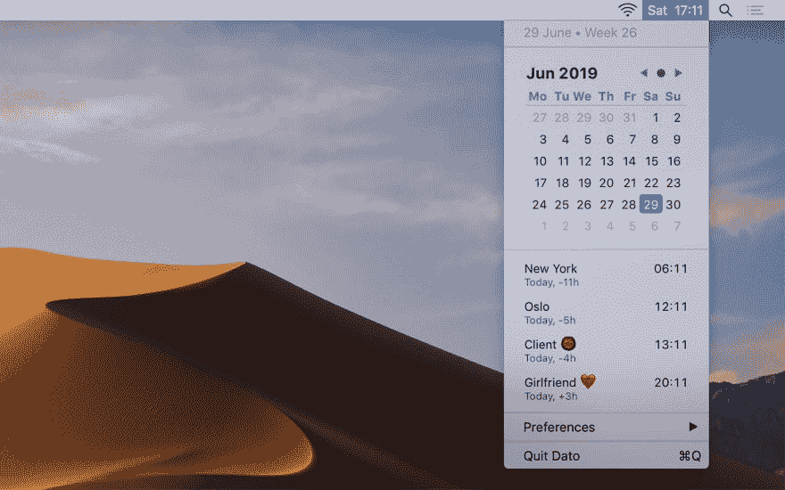
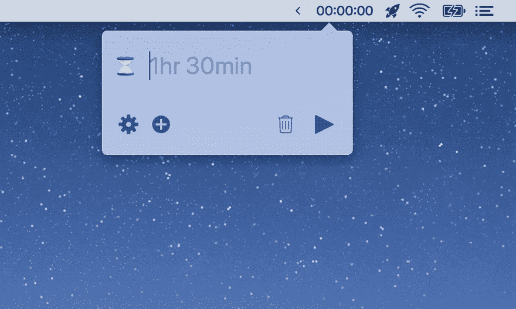
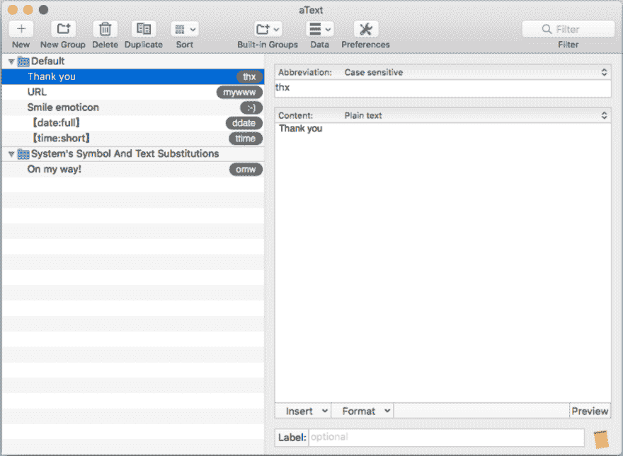
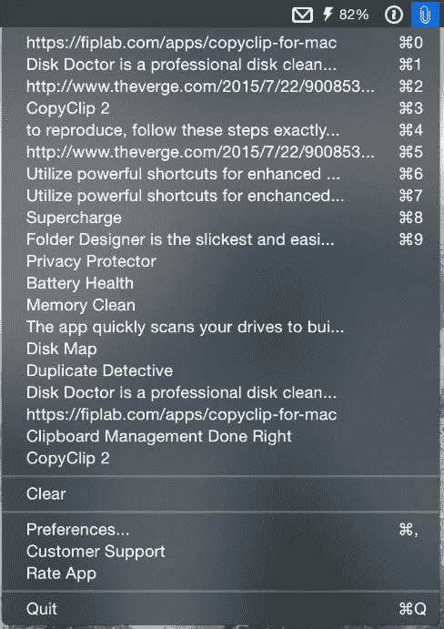
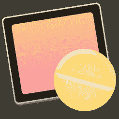
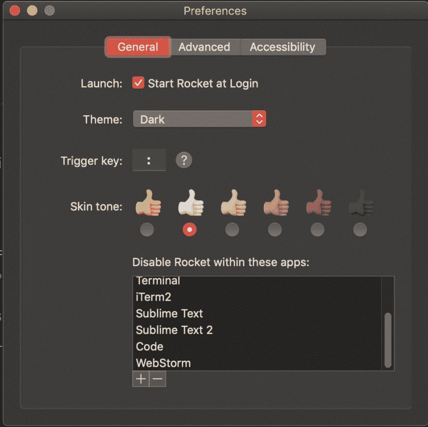

# 12 个苹果应用程序做一件事非常好

> 原文：<https://dev.to/trostcodes/12-mac-apps-that-do-one-thing-really-well-5f4m>

为解决一个问题而创建的工具通常能最好地解决这个问题。

瑞士军刀很方便，但它们不是最好的开瓶器、指甲锉或锯子。

这些小小的 macOS 应用程序能做好一两件事，我认为其中大部分是必不可少的。

如果你正在寻找一个更干净、更快、更有效率的工作流程，就拿几个吧。

大多数都是免费的，有几个不到 5 美元。

## 磁窗组织

排列窗口，尤其是有多个屏幕的窗口，可能会很麻烦。Magnet 可以让你轻松地将应用程序设置成你想要的任何分数。全，一半，三分之一，四分之一-无论你想要什么，用磁铁很容易。

您可以通过键盘快捷键或拖动窗口到屏幕边缘来触发 Magnet。它扣到位，给你完美的比例。

Magnet 甚至允许你在屏幕上移动窗口。敲几下键盘，我的代码编辑器就从左监视器移到了右监视器。

这是我最常用的应用之一，也是我在新电脑上安装的第一件东西。它甚至可以在垂直屏幕上工作！只需 1 美元，它就出奇的坚固。

*价格*:1 美元
T3】网站 T5】磁铁网站

## 香草-整齐工具栏

如果你运行列表中的所有应用，你的工具栏将会非常混乱。你的屏幕上方可能已经有 10 个图标，让你抓狂。

这就是香草的由来。

通过打开/关闭开关，它可以隐藏你想要隐藏的图标。我只想看看我的音量，电池和时间。除此之外，所有东西都被放进了香草的抽屉。

如果你喜欢干净的桌面和最小的混乱，香草是必须的。

太新鲜了。如此干净。

*价格*:免费(有 Pro 版本)
*网站* : [香草网站](https://matthewpalmer.net/vanilla/)

## Dato -时间工具栏++

Dato 看起来和 macOS 时钟一样，但是当你点击它的时候，你会得到更多。

这看起来像是对常规工具栏的一个微不足道的改进，但是在我拥有它的 3 天里，我已经使用过很多次了。

当你打开它，你会得到一个小日历，当天的事件，你甚至可以添加你关心的时区。

快速访问日历比你现在想象的要方便得多。你会用到它的。相信我。

*价格*:免费
*网站* : [Dato 网站](https://sindresorhus.com/dato)

## Horo - Easy Timer

Horo 是一个很棒的小计时器，它存在于你的工具栏中。它能理解自然语言，所以输入`30m`或`30 minutes`都会给你一个 30 分钟的计时器。

Horo 的开发者马修·帕尔默说:

> 如果启动一个定时器需要超过一秒钟，你的定时器应用程序很糟糕。

我同意。Horo 可以处理多个定时器，启动起来毫不费力，最重要的是它是免费的。抓住它。

*价格*:免费(Pro 版可用)
*网站* : [Horo 网站](https://matthewpalmer.net/horo-free-timer-mac/)

## aText -文本扩展

如果您的 IDE 有一个 snippet 插件，您可能知道键入几个字母并获得为您生成的代码行有多棒。

在 iPhone 上，有方便的输入快捷键，比如`omw`扩展为“在路上！”

aText 带来了这样的功能，还有更多。开发商解释道:

> aText 通过将缩写替换为您定义的常用短语来加快您的键入速度。

aText 非常适合电子邮件回复或日志模板等样板文本。这大大节省了时间。

它甚至可以插入图像、当前日期/时间、AppleScript、Shell 脚本等。看看这个试验。

*价格*:5 美元

*试用* : 21 天
*网站* : [aText 网站](https://www.trankynam.com/atext/)

## CopyClip -剪贴板历史

作为一名程序员，你要做大量的复制和粘贴工作。(此处插入堆栈溢出笑话)

问题是剪贴板一次只能容纳一个项目。如果你复制了新的东西，最后一项就永远消失了。

这就是 CopyClip 的用处。它不会丢失复制的每一个项目，而是会保留到你的最后 20 个左右。不要担心，你也可以清除剪贴板删除敏感信息。

正如一位评论家所说，CopyClip 是一种“无价的时间和压力释放器”

*价格*:免费
T3】网站 : [苹果 Appstore](https://apps.apple.com/us/app/copyclip-clipboard-history/id595191960?mt=12)

## 登山扣-定制键盘

登山扣是超级用户的梦想。它允许你重新映射你的键盘。Karabiner 可以让你为几乎任何东西设置自定义热键。

与在 VSCode 中创建代码片段和快捷方式一样，您可以在整个操作系统中设置键盘快捷方式。

最近，当我开始在工作中使用 Windows 键盘时，我发现了一个很好的用例。

Mac 和 Windows 的键盘是一样的，但是`command`和`alt`按钮是翻转的，所以我一直出错。轻松更换登山扣。

*价格*:免费
*网站* : [登山扣网站](https://pqrs.org/osx/karabiner/)

## 安非他命-屏幕浓缩咖啡

有时你需要你的电脑留下来完成安装或运行测试，或其他任何事情。

安非他命会阻止你的电脑进入睡眠状态，直到你关机。

简单的 app，得心应手的功能。旋转一下。

*价格*:免费
T3】网站 : [苹果 Appstore](https://apps.apple.com/us/app/amphetamine/id937984704?mt=12)

## 枪口-自动免打扰

屏幕共享时屏蔽潜在的尴尬警告。

当有人在看你的屏幕时，把你的电脑打开“请勿打扰”是一个好习惯。枪口识别当你分享你的屏幕，并为你触发免打扰。当你完成后，它会关闭它。

即使你不下载，也可以去网站上找些乐子，上一堂如何展示产品价值的精彩课。

*价格*:免费
*网站* : [枪口网站](https://muzzleapp.com/)

## 牙仙-更好的蓝牙

将 AirPods 或其他蓝牙耳机连接到 MacBook 可能会很痛苦。

Toothfairy 让连接变得非常简单。用菜单栏点击连接，甚至设置键盘快捷键。

Toothfairy 允许你在工具栏中为每个蓝牙设备创建一个图标。图标可以让您知道何时连接以及何时电池电量不足。

你经常在手机和笔记本电脑之间切换耳机吗？牙仙值 5 块钱。

*价格*:5 美元
*试用*:没有
*网站* : [苹果 Appstore](https://apps.apple.com/us/app/toothfairy/id1191449274?mt=12)

## Kap -屏幕记录器

Kap 是我在屏幕上创建 gif 的最快方式。设定宽高比，选择区域，然后点按“录制”。

轻松地将视频片段或您最新的 CodePen 转换成重复的 GIF。然后分享到 Twitter，Reddit，Giphy，Slack，随便哪里。

Kap 还提供了一系列插件，让分享或保存变得更快。

*价格*:免费
*网站* : [Kap 网站](https://getkap.co/)

## 快速表情符号

如果你经常使用表情符号，这个是必备的。

不是所有的应用程序都允许快速简单的表情符号。Slack 向我们介绍了优秀的`:dog:` =🐶表情符号速记。Rocket 将同样的功能传播到了每一个地方。

键入一个冒号，开始键入，然后观察自动完成匹配的填充。

Rocket 甚至可以让你选择不运行哪些网站和应用，这样你在编程时就不会觉得烦了。

*价格*:免费
*网站* : [火箭网站](https://matthewpalmer.net/rocket/)

## 就是这样！

如果你知道任何其他伟大的应用程序，解决一两个问题，请让我知道！希望你已经在这个列表中找到了一个应用程序，让你的一天变得更加顺畅。

我认为这种应用程序是任何开发人员考虑创建产品的一个很好的方式。不要试图成为拥有 1000 个功能的 Evernote。认清自己的问题，好好解决。