# MongoDB Atlas 数据湖

> 原文：<https://dev.to/delbussoweb/mongodb-atlas-data-lake-hp6>

大家好，好吗？今天我将稍微谈一谈 mongob atlas-mongob atlas data lake 中提供的新功能！它仍在 Beta 版中，但我们已经可以测试并了解该功能将为我们提供哪些功能-我...。如果你喜欢在文章的结尾，你可以链接到视频，我将演示如何做到这一点。我们走吧？

### MongoDB 图册数据湖

根据大数据的趋势，并观察这个如此庞大的宇宙，6 月份，MongoWorld 发布了一个工具，允许使用 MQL(mongodb query language，mongob query language，mql)查询 AWS 上 S3 存储桶中的各种类型的文件(迄今为止，它是唯一受支持的存储库)。只需单击几下鼠标和一些设置，您就可以退出运行存储桶文件的过程，就像在 mongodb 群集中一样，而无需导入文件。支持多种格式，如 TXT、CSV、PARQUET、AVR 和 claro、JSON。

### 设置新的数据湖

如前所述，此功能是 mongodb atlas 的一部分，因此要使用它，您需要在那里运行一个项目。如果您还没有担心，它非常简单，只需要您的电子邮件和密码(不需要信用卡)，就可以知道如何在 mongob atlas[中启动一个项目。请参见此处](https://dev.to/delbussoweb/conhecendo-o-mongodb-atlas---o-dbaas-da-mongodb-1alo)。

创建项目后，您将在菜单中看到“数据湖 Beta”选项: [](https://res.cloudinary.com/practicaldev/image/fetch/s--ny2Et-h4--/c_limit%2Cf_auto%2Cfl_progressive%2Cq_auto%2Cw_880/https://thepracticaldev.s3.amazonaws.com/i/g7k99d1755uednsd7r5x.png)

进入此选项后，单击“try mongodb atlas data lake”(尝试 mongodb atlas 数据湖)将引导您完成一个非常简单的步骤:

[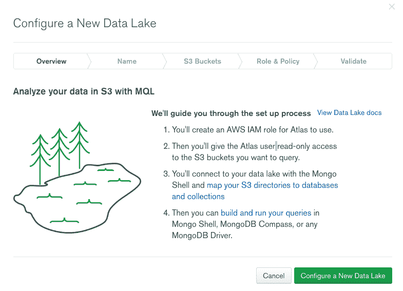](https://res.cloudinary.com/practicaldev/image/fetch/s--yABP_msw--/c_limit%2Cf_auto%2Cfl_progressive%2Cq_auto%2Cw_880/https://thepracticaldev.s3.amazonaws.com/i/gs9wn4t7aa5z3is6r6cz.png)

单击“配置新数据湖”，我们将为新数据湖命名:

[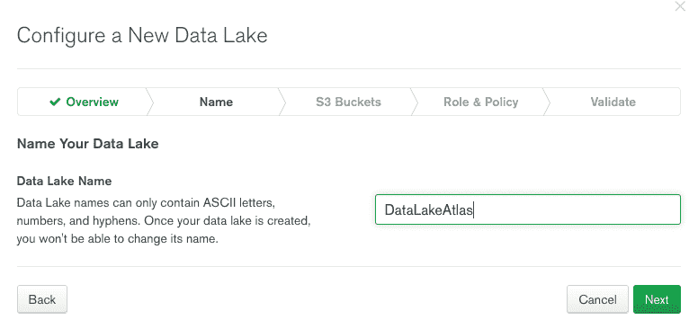](https://res.cloudinary.com/practicaldev/image/fetch/s--5tPCdScj--/c_limit%2Cf_auto%2Cfl_progressive%2Cq_auto%2Cw_880/https://thepracticaldev.s3.amazonaws.com/i/6mdyphwtmfhber59kru9.png)

现在我们来说说 S3 的桶的名字。S3 中的存储桶配置不是文章的重点，我想您已经在 AWS 中创建了一个帐户并配置了一个存储桶，我的存储桶是‘t0’meeting upatlasdatalake:

[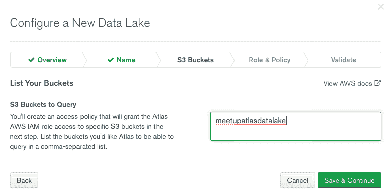](https://res.cloudinary.com/practicaldev/image/fetch/s--CULsYq3s--/c_limit%2Cf_auto%2Cfl_progressive%2Cq_auto%2Cw_880/https://thepracticaldev.s3.amazonaws.com/i/yvqwqrxilxxho5tgdb8p.png)

请注意，您可以连接多个存储桶，只需用逗号分隔各个名称即可！

输入存储桶后，单击“保存并继续”。届时 Atlas 数据湖将通知我们‘t0’唯一的外部 ID 和‘T2’atlas AWS iam user arn。此数据将用于配置 AWS IAM role 以及在 S3 中创建策略。

基本上，我们将为将要在 AWS 中创建的角色命名，在我的例子中，该角色被命名为 *dataLakeRole* 。

按照逐步说明，我们现在将创建一个名为“*”dl-role-trust . JSON“*”的文件，该文件将描述创建 IAM role 所需的策略。复制步骤 2 中描述的内容并将其粘贴到此 json 文件中:

[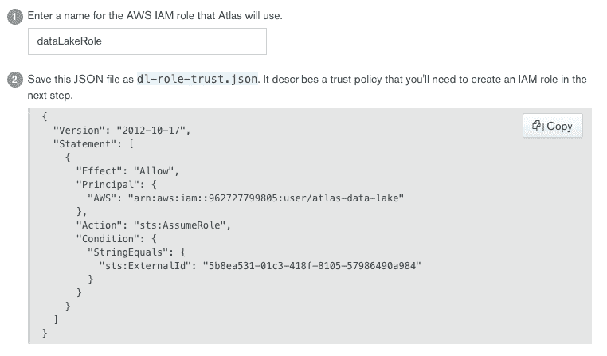](https://res.cloudinary.com/practicaldev/image/fetch/s--zbl51qCa--/c_limit%2Cf_auto%2Cfl_progressive%2Cq_auto%2Cw_880/https://thepracticaldev.s3.amazonaws.com/i/53z0qq6k79xd1jby49ud.png)

步骤 3 使用 AWS CLI 将 IAM role 创建命令滚动到 Atlas 中，以使用:

[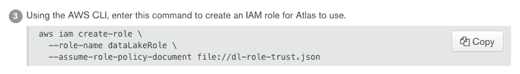](https://res.cloudinary.com/practicaldev/image/fetch/s--vgPWz6Mi--/c_limit%2Cf_auto%2Cfl_progressive%2Cq_auto%2Cw_880/https://thepracticaldev.s3.amazonaws.com/i/9zikeusay07tays5x0d4.png)

此命令的输出将为我们提供进一步使用的信息，复制密钥 **Arn** 的内容:

[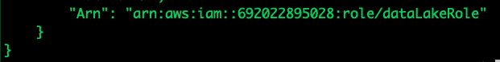](https://res.cloudinary.com/practicaldev/image/fetch/s--cTpO2ku3--/c_limit%2Cf_auto%2Cfl_progressive%2Cq_auto%2Cw_880/https://thepracticaldev.s3.amazonaws.com/i/qfl9l9umd75i0huhph4x.png)

现在，我们将创建另一个名为“*”dl-S3-role-policy . JSON“*”的文件，并在其中放置步骤 4 的内容。此文件包含上一步中创建的 IAM role 所允许的操作:

[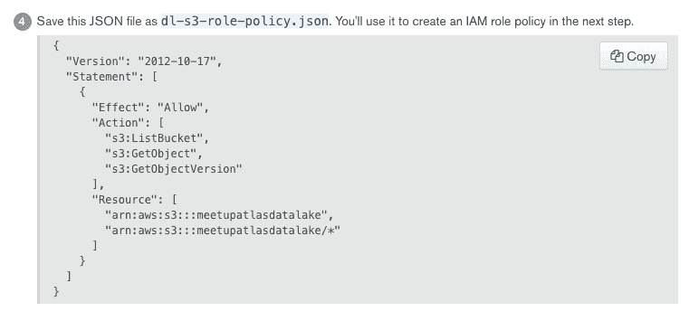](https://res.cloudinary.com/practicaldev/image/fetch/s--XsQBkkCs--/c_limit%2Cf_auto%2Cfl_progressive%2Cq_auto%2Cw_880/https://thepracticaldev.s3.amazonaws.com/i/4b8fj28ugo17aey9p6ko.png)

最后，我们将再次使用 AWS CLI 运行该命令，以便将这些操作绑定到 IAM role(此命令不会生成任何输出，请放心！):

[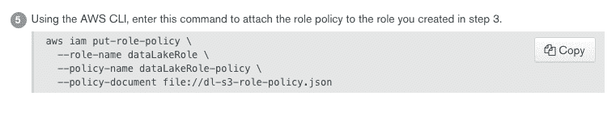](https://res.cloudinary.com/practicaldev/image/fetch/s--YbDpZ-ms--/c_limit%2Cf_auto%2Cfl_progressive%2Cq_auto%2Cw_880/https://thepracticaldev.s3.amazonaws.com/i/9u00ioq54g52ehv8otqg.png)

单击“下一步”按钮，我们现在将输入“*”滚动 RNA*，这正是步骤 3 中生成的 RNA 密钥的内容:

[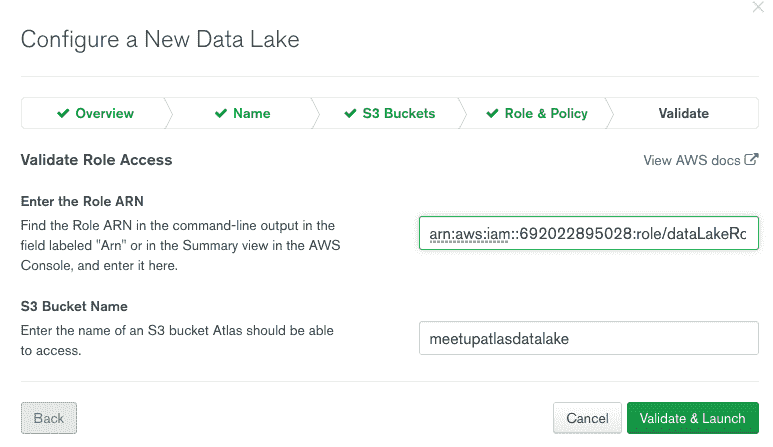](https://res.cloudinary.com/practicaldev/image/fetch/s--2Dednod1--/c_limit%2Cf_auto%2Cfl_progressive%2Cq_auto%2Cw_880/https://thepracticaldev.s3.amazonaws.com/i/urykvg7k337cyev7n2rh.png)

现在只需单击“Validate & Launch(验证和启动)”按钮-我...。

### Conectando 无图册数据湖

设置了访问权限后，我们现在可以连接到新的数据湖，如屏幕上的步骤 2 所示，单击“连接”，然后选择连接方式:

[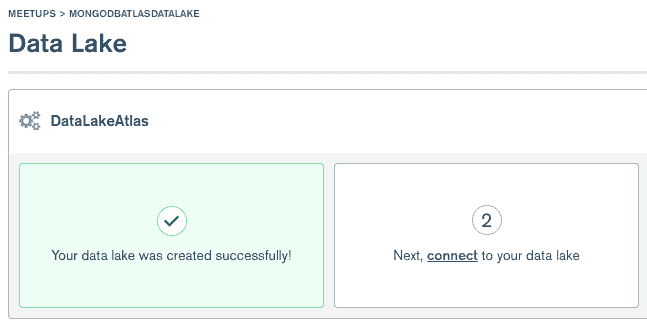](https://res.cloudinary.com/practicaldev/image/fetch/s--l1DmBkbC--/c_limit%2Cf_auto%2Cfl_progressive%2Cq_auto%2Cw_880/https://thepracticaldev.s3.amazonaws.com/i/mm0de2d33nqkxygjjk7g.png)

重要的是，我们必须释放我们的 IP 以访问 mongodb atlas，并为该项目创建一个用户(对于新项目):

[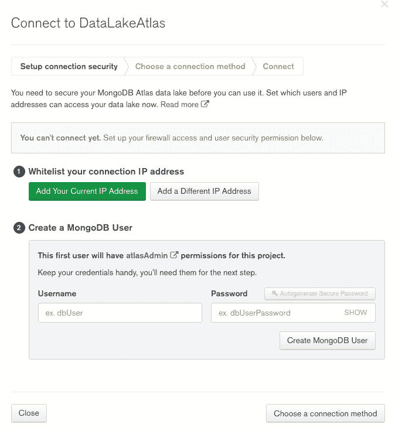](https://res.cloudinary.com/practicaldev/image/fetch/s--7dNEJNgD--/c_limit%2Cf_auto%2Cfl_progressive%2Cq_auto%2Cw_880/https://thepracticaldev.s3.amazonaws.com/i/3lx2mz6by97z97om4ie1.png)

在释放 IP 并创建用户后，我选择通过 Mongo Shell 连接，我们只需复制命令行并替换刚创建的用户和密码即可连接:

[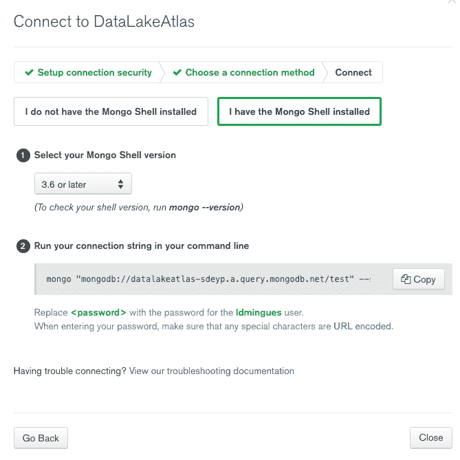](https://res.cloudinary.com/practicaldev/image/fetch/s--RmEEgXlM--/c_limit%2Cf_auto%2Cfl_progressive%2Cq_auto%2Cw_880/https://thepracticaldev.s3.amazonaws.com/i/384pu31v9wlf6h2jnyhu.png)

完成后，我们将进入一个 MongoDB 实例直接连接我们的 S3 存储桶！

[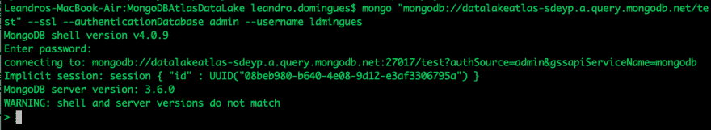](https://res.cloudinary.com/practicaldev/image/fetch/s--SNQZPgOf--/c_limit%2Cf_auto%2Cfl_progressive%2Cq_auto%2Cw_880/https://thepracticaldev.s3.amazonaws.com/i/2xxt2ea9ba22xh438gaa.png)

### 配置存储桶中的文件访问权限

在此步骤中，我们将设置一些参数，以便从存储桶中的文件“创建”数据库和集合。我使用了一个非常简单的脚本，它将创建一个名为 *sample* 的数据库，并为我的存储桶中的每个文件创建一个集合，在我的例子中，我只有文件 *restaurants.json* 。有关所有配置设置，请参阅“[文档”](https://docs.atlas.mongodb.com/reference/data-lake-configuration/)。下面的脚本是访问其中的文件所必需的:

```
use admin;
db.runCommand( { "storageSetConfig": {
  "stores": [{
    "s3": {
      "name": "s3store",              // Cria um store S3
      "region":"us-east-1",           // Altera o código da região do bucket
      "bucket": "meetupatlasdatalake" // Altera o nome do seu bucket
    }
  }],
  "databases": {
    "sample": {                    // Cria um novo database chamado sample
      "*": [{                      // Criará uma collection para cada arquivo no bucket
        "store": "s3store",        // Link o store S3 especificado acima
        "definition": "/{collectionName()}"
      }]
    }
  }
}}) 
```

执行上述命令后，我们已经创建了数据库和 restaurants 集合:

[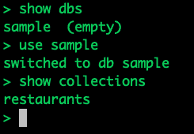](https://res.cloudinary.com/practicaldev/image/fetch/s--rpn-vHBI--/c_limit%2Cf_auto%2Cfl_progressive%2Cq_auto%2Cw_880/https://thepracticaldev.s3.amazonaws.com/i/zcxb00ks3clezvrb6ywk.png)

现在，只需执行几个命令，就像我们在 mongodb 的常规实例中一样:

```
db.restaurants.count() 
```

```
db.restaurantes.findOne() 
```

甚至使用[聚合框架](https://docs.mongodb.com/manual/aggregation/)的操作

```
db.restaurants.aggregate([
    {
        $match: {
            name: "Wendy'S"
        }
    }, 
    {
        $group: {
            _id: "$name",
            total: {
                $sum: 1
            }
        }
    }
]) 
```

### 跟进消费

很漂亮，但是多少钱？嗯，今天的价格是每 TB 5 美元，您可以通过 Atlas 数据湖控制板跟踪消费情况:

[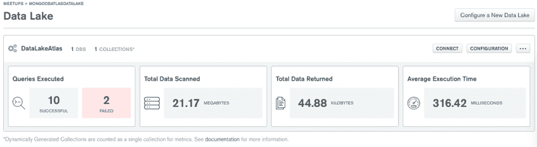](https://res.cloudinary.com/practicaldev/image/fetch/s--YoewQC5q--/c_limit%2Cf_auto%2Cfl_progressive%2Cq_auto%2Cw_880/https://thepracticaldev.s3.amazonaws.com/i/1uugim8pmszb3b2bl4bb.png)

### 结论

你们看到连接有多简单了吗？就像我说的，这是一项仍在测试阶段的功能，而且肯定会有很大的进步！

也不要忘了查看解释我们在这里所做的一切的“t0”视频，也随意分享，让您喜欢这里！

一个拥抱，再见！