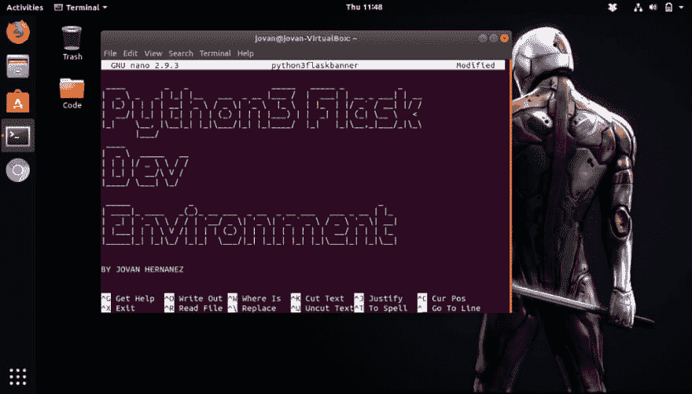
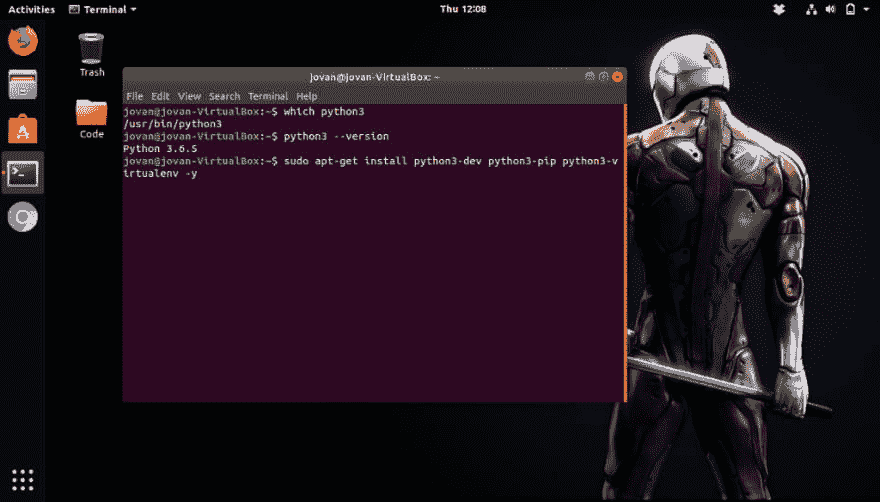
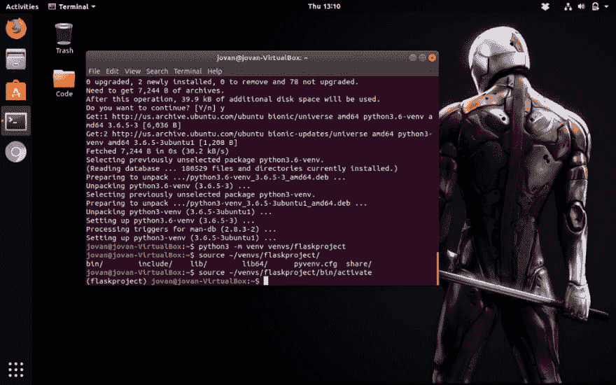
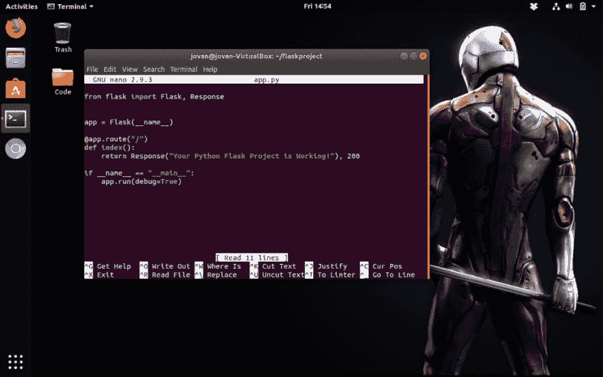
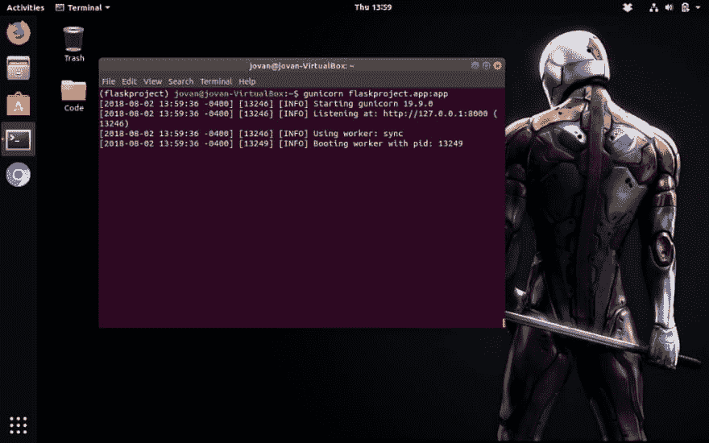
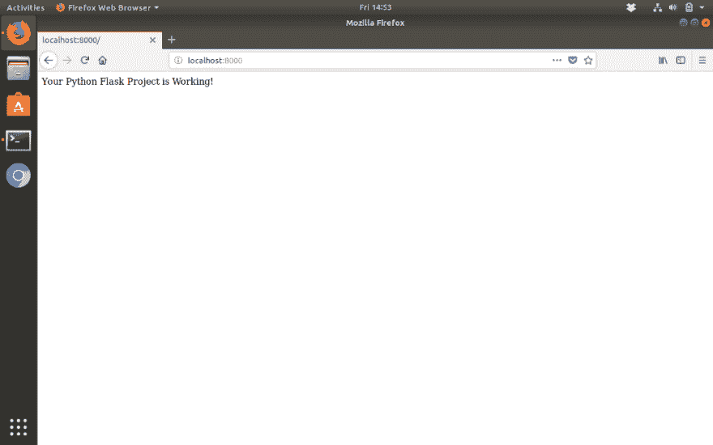

# 使用 Flask、Gunicron 和 VirtualEnv 为 Python 开发环境配置 Ubuntu 18.04

> 原文：<https://dev.to/jovanhernandex/configuring-ubuntu-18-04-for-a-python-dev-environment-with-flask-gunicron-and-virtualenv-595i>

[](https://res.cloudinary.com/practicaldev/image/fetch/s--cCeoLH8k--/c_limit%2Cf_auto%2Cfl_progressive%2Cq_auto%2Cw_880/https://cdn-images-1.medium.com/max/1024/1%2AgK7JTwGHlbhnqLOB18Xy_w.png)

Flask 是一个很好的 Python 框架，可以在轻量级的应用环境中快速获得想法并运行。在本教程中，我们将使用开发系统包配置 Python 3.6，以启动一个新的 Flask web 应用程序项目，并使用 Green Unicorn (Gunicorn)运行它。

### 但是首先，什么是绿色独角兽？

Green Unicorn(从现在开始，我们称它为 Gunicorn)是一个用于 UNIX 的 Python WSGI HTTP 服务器。这是一个前叉工人模型。Gunicorn 服务器广泛兼容各种 web 框架，实现简单，占用服务器资源少，速度相当快。”

你可以从他们的网站找到更多关于 Gunicorn，[的信息，这也是我引用这段话的地方。但是为了简洁起见，Gunicorn 是一个用于 Python web 应用程序的易于使用的 HTTP 服务器。](http://gunicorn.org)

### 系统包安装

首先，我们将安装三个软件包。python-dev python-pip & python-virtualenv。您还应该检查您安装的 Python 版本及其位置，然后运行下面的命令:

```
sudo apt-get install python3-dev python3-pip python3-virtualenv 
```

<figure>[](https://res.cloudinary.com/practicaldev/image/fetch/s--kYqeE1tZ--/c_limit%2Cf_auto%2Cfl_progressive%2Cq_auto%2Cw_880/https://cdn-images-1.medium.com/max/1024/1%2AviHn_D1PVeNfccbiMgV14g.png) 

<figcaption>安装 Python 包。</figcaption>

</figure>

如果运行正确的话，包管理器应该会在一切都设置好的时候给出一堆输出和报告。从那里，我们将使用 pip 和 virtualenv，这两个我们刚刚安装的包，来形成一个目录并处理我们的应用程序依赖关系。

```
###CREATE A NEW DIRECTORY TO HOUSE YOUR VIRTUAL ENVS
cd ~
mkdir -p ~/venvs

###SPECIFY PYTHON3 FOR THE INSTALLTION AND THEN ACTIVATE YOUR VIRTUAL ENV
python3 -m venv venvs/flaskproject
source ~/venvs/flaskproject/bin/activate 
```

<figure>[](https://res.cloudinary.com/practicaldev/image/fetch/s--_6s4QgNt--/c_limit%2Cf_auto%2Cfl_progressive%2Cq_auto%2Cw_880/https://cdn-images-1.medium.com/max/1024/1%2AZcDXHBP7poZqV9W_uj2YKw.png) 

<figcaption>为您的 Flask 项目安装软件包并设置虚拟环境。</figcaption>

</figure>

如果一切顺利，您应该看到您的终端提示符随着您被激活的虚拟环境的名称而改变。在我们的例子中，我们的终端提示符中现在有(flaskproject)。

### 使用画中画进行升级、滚轮和 Gunicorn

我们将使用 pip 来安装一些依赖项和包。让我们从更新我们的软件包列表开始，然后安装 wheel。然后，我们将安装烧瓶和 Gunicorn 以及。

```
###UPDATING AND INSTALLING WHEEL
pip install --upgrade && pip install wheel

###INSTALLING FLASK AND GUNICORN
pip install flask gunicorn 
```

您应该会看到一串表示成功安装的输出。如果一切顺利，您应该不会看到任何错误。

### 测试烧瓶并用 Gunicorn 运行

我们需要创建一个新目录来存放我们的应用程序文件。这个目录将位于我们的主文件夹中，而不是 virtualenvs 文件夹中。

```
###CREATE A DIRECTORY AND MOVE INTO IT
mkdir ~/flaskproject
cd ~/flaskproject
###CREATE FILE FOR TEST APP CODE
nano app.py 
```

在 app.py 文件中，编写以下代码:

```
from flask import Flask, Response

app = Flask(\_\_name\_\_)

@app.route("/")
def index():
 return Response("Your Python Flask Project is Working!"), 200

if \_\_name\_\_ == "\_\_main\_\_":
 app.run(debug=True) 
```

<figure>[](https://res.cloudinary.com/practicaldev/image/fetch/s--S29_qNd_--/c_limit%2Cf_auto%2Cfl_progressive%2Cq_auto%2Cw_880/https://cdn-images-1.medium.com/max/1024/1%2AK8NBrPSsu5H-pL7CzHQWug.png) 

<figcaption>你的测试 app 代码。</figcaption>

</figure>

现在移动到 flaskproject 文件夹上面的目录，在我们的例子中是用户主文件夹。你也可以只输入 cd ~就可以到达那里。

在你的主文件夹中，我们可以使用 Gunicorn 来运行你的应用程序，命令如下:

```
###RUN THIS FROM YOUR HOME FOLDER ~/
gunicorn flaskproject.app:app 
```

<figure>[](https://res.cloudinary.com/practicaldev/image/fetch/s--A__hMqCV--/c_limit%2Cf_auto%2Cfl_progressive%2Cq_auto%2Cw_880/https://cdn-images-1.medium.com/max/1024/1%2AIqi40pXgYWVcOwijg6-ozw.png) 

<figcaption>用烧瓶运行 Gunicorn 来测试你的 app。</figcaption>

</figure>

如果成功，我们将获得 Gunicorn 启动和监听 localhost:8000 或 127.0.0.0:8000 的输出，转到该地址将显示您的应用程序。

<figure>[](https://res.cloudinary.com/practicaldev/image/fetch/s--9sLJV9ae--/c_limit%2Cf_auto%2Cfl_progressive%2Cq_auto%2Cw_880/https://cdn-images-1.medium.com/max/1024/1%2AXVuUvqXNx8bloPO24D-nGg.png) 

<figcaption>如果你成功了，你应该看到这一点。</figcaption>

</figure>

就是这样！您基本上使用 PIP、Flask 和 Gunicorn 建立了一个快速的 Python 测试环境。从这里开始，您可以使用 Flask 构建更多的动态 web 应用程序，并以同样的方式测试它们。