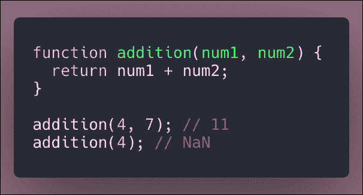
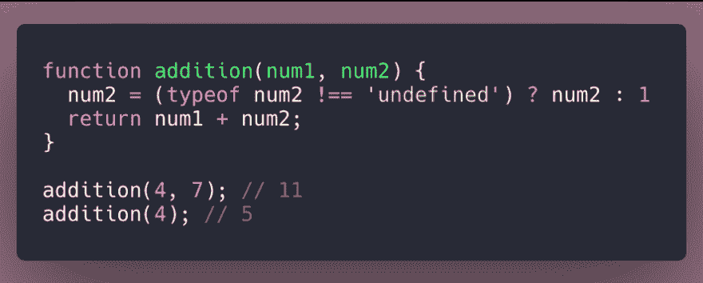
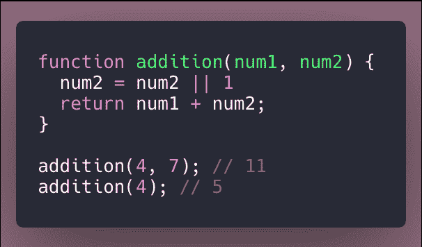
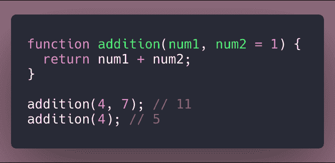
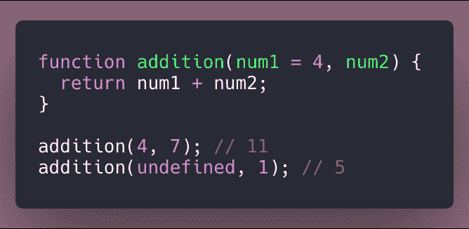
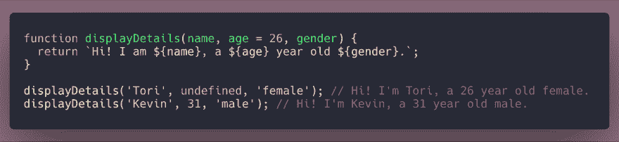

# 分解 ES6:默认参数

> 原文：<https://dev.to/torianne02/breaking-down-es6-default-parameters-111g>

又是一周，我的分解 ES6 博客系列的又一部分！本周我们将讨论 ES6 对默认参数的引入，在我看来这非常有用。当我在训练营中了解到默认参数时，我的第一个想法是“他们为什么不早点教我们这些呢！？!"默认参数是如此简单，却非常强大的特性。

我真的很兴奋能为你们写这篇博客，所以让我们开始吧！

## 在 ES6 之前

关于 JavaScript 中的函数参数，需要注意的一点是它们默认为`undefined`。在接下来的例子中，你会注意到当我们没有为`num2`传递一个值时，我们的函数`addition()`将返回`NaN`。这是因为`undefined`仅仅不是一个数字，不能加到`num1`的值上。

#### 处理未定义的参数

在引入 ES6 和默认参数之前，开发人员有办法解决未定义的参数。他们通过测试函数中的参数做到了这一点。有两种流行的方法来实现这一点。

上面的例子利用一个条件语句来检查参数`typeof`是否严格地不等于`undefined`。如果是这种情况，参数将被设置为传递给它的值，在第一种情况下是 7。现在，如果是`undefined`，就像第二种情况一样，`num2`的值将被设置为 1。

开发人员用来测试函数中参数的另一种方法是利用 truthy/falsy 模式。下面的例子显示了两种情况，有和没有值被传递到`num2`。

## 默认参数介绍

快进到默认参数的引入，我们有了更干净和更容易阅读的代码！下面提供的例子给你一个简单用例的概念。默认参数真的很容易使用，你所要做的就是把参数设置成你想要的默认值。

第二种情况的输出是 5，因为`num1`取值为 4，而`num2`取值为 1，这要感谢我们方便的默认参数。

#### 省略数值

此时你可能会想.."如果您想将第一个参数设为默认参数，会发生什么情况？然后你做什么？”这就是我们将在本节讨论的内容，对我来说也是新知识。

当我们遇到想要创建一个默认参数作为我们的第一个参数，或者甚至是一个中间参数的情况时，我们需要使用关键字`undefined`。当向我们的函数传递参数时，`undefined`应该用作占位符。

上面的例子显示了在第一个参数槽中使用默认参数的情况。以下示例显示了使用默认参数作为中间参数之一的情况。

### 最后的想法

在这篇文章中，我们发现了默认参数的魔力。我们已经知道，通过使用默认参数，我们的代码看起来更干净，更容易被其他开发人员理解。在研究题目之前，我以为你只能用默认参数作为最后一个参数。现在我们知道，作为开发人员，我们可以在传递给函数的参数中使用`undefined`作为占位符来实现这一点。

我希望这篇文章提供了丰富的信息。我知道这不是一个超级复杂的话题，但我今天学到了一些新东西，所以我认为它值得一写！

快乐编码。

注:本周的特色图片来自我最近三月份的爱尔兰之旅。地点:爱尔兰巴利科顿。

#### 来源

[默认参数](https://developer.mozilla.org/en-US/docs/Web/JavaScript/Reference/Functions/Default_parameters)
[使用 ES6 中的默认参数](https://css-tricks.com/using-default-parameters-es6/)
[用 ES6 默认参数清理代码&属性简称](https://www.sitepoint.com/es6-default-parameters/)