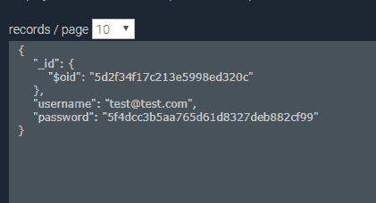

# 将现有用户数据库连接到 AWS Cognito:如何利用无密码身份验证来使用遗留数据库？

> 原文：<https://dev.to/_mikigraf/connecting-existing-users-database-to-aws-cognito-how-to-leverage-passwordless-authentication-to-use-legacy-database-1gip>

密码和我们今天使用密码的方式有两个基本问题。不管网站上欢迎你的用户界面是什么样的，也不管 UX 的设计师在产品上投入了多少心血，我们仍然在使用和 10 年或 20 年前一样的用户认证方式。第一步是让用户访问您的网站，并通过表单提交他的用户名和密码。这是不安全的，所以开发人员想出了双因素认证的想法。在提交登录凭证之后，用户通过电子邮件或另一种通信手段获得消息，然后他必须通过另一种形式提交所提供的安全代码来验证他对该通信设备的所有权。这意味着，作为一个用户，你有两种形式。表格不好玩。

AWS Cognito 使得创建定制认证流成为可能，这允许开发者设计他们自己的流。这可用于创建无密码验证或连接现有用户数据库。
有两种场景通常用于定制认证流程:

1.  无密码认证
2.  根据现有数据库验证用户

我们的场景#2:我们希望根据已经存在的数据库对用户进行身份验证，该数据库托管在 AWS 之外。

**为什么您希望使用现有数据库，而不是将用户迁移到 AWS Cognito？**

在我们的案例中，我们希望在快速原型制作期间利用 AWS Amplify 进行用户身份验证。根据我的理解，将用户迁移到 AWS Cognito 会要求他们更改密码，这是不希望的，尤其是因为要求所有客户更改密码可能会导致安全问题。

我们希望使用 AWS Amplify 和 React.js 来创建应用程序的原型。我们在 mlab 上有一个包含用户数据的 mongoDB 实例。每个用户都有一个非常简单的结构:
[](https://res.cloudinary.com/practicaldev/image/fetch/s--InWzFZIZ--/c_limit%2Cf_auto%2Cfl_progressive%2Cq_auto%2Cw_880/https://thepracticaldev.s3.amazonaws.com/i/wb4kme5cw6o2lo7ku69h.PNG)

每个用户都有用户名和散列密码。

这篇博文中的代码在 AWS Cognito 中创建了定制的身份验证流，并连接到外部数据库进行用户身份验证。只需很小的改动，这段代码就可以用于实现无密码认证，即基于用户通过电子邮件获得随机生成的令牌。

**该实现基于 AWS 的以下博客文章:[https://AWS . Amazon . com/blogs/mobile/implementing-passless-email-authentic ation-with-Amazon-cogni to/](https://aws.amazon.com/blogs/mobile/implementing-passwordless-email-authentication-with-amazon-cognito/)并重用了该示例中的大量代码[https://github . com/AWS-samples/Amazon-cogni to-passless-email-auth](https://github.com/aws-samples/amazon-cognito-passwordless-email-auth)不同的是，我们使用 React.js 并连接到外部数据库。**

## SAM 模板

我们用 AWS SAM 创建我们的基础设施，因为它是 AWS 提供的本地工具。我们能够从原始帖子中重用这个模板的几乎所有代码。

我们首先从[https://docs . AWS . Amazon . com/server less-application-model/latest/developer guide/server less-SAM-CLI-install . html](https://docs.aws.amazon.com/serverless-application-model/latest/developerguide/serverless-sam-cli-install.html)安装 SAM CLI

在目录/infra structure/create template . YAML

```
AWSTemplateFormatVersion: "2010-09-09"
Transform: AWS::Serverless-2016-10-31
Description: >
  Amazon Cognito User Pool with Passwordless E-Mail Auth configured 
```

Enter fullscreen mode Exit fullscreen mode

并设置参数

```
Parameters:
  UserPoolName:
    Type: String
    Description: The name you want the User Pool to be created with
    Default: 'UsingExistingDatabaseWithAWSCognito'
  DbConnectionString:
    Type: String
    Description: The e-mail address to send the secret login code from
    Default: "mongodb://<user>:<password>@<domain>:<port>/<database  name>" 
```

Enter fullscreen mode Exit fullscreen mode

**UserPoolName** 是一个变量，包含将由该模板创建的用户池的名称。 **DbConnectionString** 是到我们现有 MongoDB 数据库的连接字符串。
首先，我们需要创建 Cognito 用户池，之后将保存用户数据，以便我们可以利用 Amplify 轻松进行用户身份验证。

```
Resources:
  UserPool:
    Type: "AWS::Cognito::UserPool"
    Properties:
      UserPoolName: !Ref UserPoolName
      Schema:
        - Name: name
          AttributeDataType: String
          Mutable: true
          Required: true
        - Name: email
          AttributeDataType: String
          Mutable: true
          Required: true
      Policies:
        PasswordPolicy:
          MinimumLength: 8
          RequireLowercase: false
          RequireNumbers: false
          RequireSymbols: false
          RequireUppercase: false
      UsernameAttributes:
        - email
      MfaConfiguration: "OFF"
      LambdaConfig:
        CreateAuthChallenge: !GetAtt CreateAuthChallenge.Arn
        DefineAuthChallenge: !GetAtt DefineAuthChallenge.Arn
        PreSignUp: !GetAtt PreSignUp.Arn
        VerifyAuthChallengeResponse: !GetAtt VerifyAuthChallengeResponse.Arn 
```

Enter fullscreen mode Exit fullscreen mode

**自定义认证流程**允许将 lambda 函数分配给一组预定义的 **Cognito 触发器**。可在[https://docs . AWS . Amazon . com/cogn ITO/latest/developer guide/cogn ITO-user-identity-pools-working-with-AWS-lambda-triggers . html](https://docs.aws.amazon.com/cognito/latest/developerguide/cognito-user-identity-pools-working-with-aws-lambda-triggers.html)上找到可能的触发器列表

我们还必须为我们的用户池定义一个客户机，这样我们就可以用它来访问这个带有定制认证流的用户池:

```
UserPoolClient:
    Type: "AWS::Cognito::UserPoolClient"
    Properties:
      ClientName: auth-with-existing-db
      GenerateSecret: false
      UserPoolId: !Ref UserPool
      ExplicitAuthFlows:
        - CUSTOM_AUTH_FLOW_ONLY 
```

Enter fullscreen mode Exit fullscreen mode

现在我们有了一个引用 lambda 函数的用户池，但是我们还没有创建任何用户池！

让我们在用户池的定义之前添加 lambdas 的定义。

```
PreSignUp:
    Type: AWS::Serverless::Function
    Properties:
      CodeUri: lambda-triggers/00-pre-sign-up/
      Handler: pre-sign-up.handler
      Runtime: nodejs10.x 
```

Enter fullscreen mode Exit fullscreen mode

**预注册**是一项功能，它将用户及其电子邮件地址标记为已确认。我们还需要添加**调用权限**，以便用户池可以触发这个 lambda。

```
PreSignUpInvocationPermission:
    Type: AWS::Lambda::Permission
    Properties:
      Action: lambda:InvokeFunction
      FunctionName: !GetAtt PreSignUp.Arn
      Principal: cognito-idp.amazonaws.com
      SourceArn: !GetAtt UserPool.Arn 
```

Enter fullscreen mode Exit fullscreen mode

在/infra structure/lambda-triggers/00-pre-sign-up/pre-sign-up . js 中，您可以添加以下代码，它将自动确认用户及其电子邮件地址。

```
module.exports.handler = async event => {
    event.response.autoConfirmUser = true;
    event.response.autoVerifyEmail = true;
    return event;
}; 
```

Enter fullscreen mode Exit fullscreen mode

Viola，我们的第一个用于 Cognito 触发器的定制处理程序已经完成。

## 定义验证挑战λ

在/infra structure/lambda-triggers/01-define-auth-challenge 中添加一个名为 define-auth-challenge.js 的新文件，并添加以下代码:

```
module.exports.handler = async event => {
    if (event.request.session &&
        event.request.session.length >= 3 &&
        event.request.session.slice(-1)[0].challengeResult === false) {
        // The user provided a wrong answer 3 times; fail auth
        event.response.issueTokens = false;
        event.response.failAuthentication = true;
    } else if (event.request.session &&
        event.request.session.length &&
        event.request.session.slice(-1)[0].challengeResult === true) {
        // The user provided the right answer; succeed auth
        event.response.issueTokens = true;
        event.response.failAuthentication = false;
    } else {
        // The user did not provide a correct answer yet; present challenge
        event.response.issueTokens = false;
        event.response.failAuthentication = false;
        event.response.challengeName = 'CUSTOM_CHALLENGE';
    }

    return event;
}; 
```

Enter fullscreen mode Exit fullscreen mode

我们检查用户是否提供了正确答案、错误答案或尚未提供任何答案。由此我们定义了认证的流程。

在 template.yaml 中，在用户池的定义前添加右:

```
Resources:
# Defines Authentication Challenge
# Checks if user is already authenticated etc.
# And decides on the next step
  DefineAuthChallenge:
    Type: AWS::Serverless::Function
    Properties:
      CodeUri: lambda-triggers/01-define-auth-challenge/
      Handler: define-auth-challenge.handler
      Runtime: nodejs10.x 
```

Enter fullscreen mode Exit fullscreen mode

并且在用户池的定义之后添加:

```
DefineAuthChallengeInvocationPermission:
    Type: AWS::Lambda::Permission
    Properties:
      Action: lambda:InvokeFunction
      FunctionName: !GetAtt DefineAuthChallenge.Arn
      Principal: cognito-idp.amazonaws.com
      SourceArn: !GetAtt UserPool.Arn 
```

Enter fullscreen mode Exit fullscreen mode

## 创建验证挑战

这就是我们的后端实现与最初的帖子不同的地方。初始化新项目并安装依赖项:

```
npm init
npm install --save mongoose 
```

Enter fullscreen mode Exit fullscreen mode

并使用以下代码创建 create-auth-challenge . js:

```
 const mongoose = require('mongoose');

module.exports.handler = async event => {
    const connectionString = process.env.DB_CONNECTION_STRING

    try {
        mongoose.connect(connectionString);
    } catch(err) {

    }
    const { Schema } = mongoose;
    const userSchema = new Schema({
        username: {
            type: String,
            required: true
        },
        password: {
            type: String,
            required: true
        }
    });

    mongoose.models = {}
    const userModel = mongoose.model('User', userSchema);

    let password;

    if(!event.request.session || !event.request.session.length) {
        // new session, so fetch password from the db
        const username = event.request.userAttributes.email;
        const user = await userModel.findOne({ "username": username});
        password = user.password;
    } else {
        // There's an existing session. Don't generate new digits but
        // re-use the code from the current session. This allows the user to
        // make a mistake when keying in the code and to then retry, rather
        // the needing to e-mail the user an all new code again. 
        const previousChallenge = event.request.session.slice(-1)[0];
        password = previousChallenge.challengeMetadata.match(/PASSWORD-(\d*)/)[1];
    }

    // This is sent back to the client app
    event.response.publicChallengeParameters = { username: event.request.userAttributes.email };

    // Add the secret login code to the private challenge parameters
    // so it can be verified by the "Verify Auth Challenge Response" trigger
    event.response.privateChallengeParameters = { password };

    // Add the secret login code to the session so it is available
    // in a next invocation of the "Create Auth Challenge" trigger
    event.response.challengeMetadata = `PASSWORD-${password}`;

    mongoose.connection.close()
    return event;

} 
```

Enter fullscreen mode Exit fullscreen mode

并在 UserPool:
之前在 template.yaml 中定义这个 lambda

```
# Fetches password from existing user database
# And adds it to the event object,
# So that the next lambda can verify the response
  CreateAuthChallenge:
    Type: AWS::Serverless::Function
    Properties:
      CodeUri: lambda-triggers/02-create-auth-challenge/
      Handler: create-auth-challenge.handler
      Runtime: nodejs10.x
      Environment:
        Variables:
          DB_CONNECTION_STRING: !Ref DbConnectionString 
```

Enter fullscreen mode Exit fullscreen mode

不要忘记在用户池:
之后添加**调用权限**

```
CreateAuthChallengeInvocationPermission:
    Type: AWS::Lambda::Permission
    Properties:
      Action: lambda:InvokeFunction
      FunctionName: !GetAtt CreateAuthChallenge.Arn
      Principal: cognito-idp.amazonaws.com
      SourceArn: !GetAtt UserPool.Arn 
```

Enter fullscreen mode Exit fullscreen mode

## 验证验证挑战λ

Last lambda 会将用户输入的散列密码与从数据库中获取的密码散列进行比较。

在 infra structure/lambda-triggers/03-verify-auth-challenge/中创建新文件 verify-auth-challenge-response . js，并添加以下代码:

```
const md5 = require('md5');

module.exports.handler = async event => {
    const expectedAnswer = event.request.privateChallengeParameters.password; 
    if (md5(event.request.challengeAnswer) === expectedAnswer) {
        event.response.answerCorrect = true;
    } else {
        event.response.answerCorrect = false;
    }
    return event;
}; 
```

Enter fullscreen mode Exit fullscreen mode

添加到用户池:
之前的 template.yaml 中

```
# Compares provided answer with password provided
# By CreateAuthChallenge lambda in the previous call
  VerifyAuthChallengeResponse:
    Type: AWS::Serverless::Function
    Properties:
      CodeUri: lambda-triggers/03-verify-auth-challenge/
      Handler: verify-auth-challenge-response.handler
      Runtime: nodejs10.x 
```

Enter fullscreen mode Exit fullscreen mode

在用户池之后:

```
VerifyAuthChallengeResponseInvocationPermission:
    Type: AWS::Lambda::Permission
    Properties:
      Action: lambda:InvokeFunction
      FunctionName: !GetAtt VerifyAuthChallengeResponse.Arn
      Principal: cognito-idp.amazonaws.com
      SourceArn: !GetAtt UserPool.Arn 
```

Enter fullscreen mode Exit fullscreen mode

搞定了。现在，我们已经为自定义身份验证流设置了后端，它将从数据库中获取用户密码散列，并将其与散列输入进行比较。

## 部署

在基础架构/目录下创建 package.json:

```
{  "name":  "cognito-email-auth-backend",  "version":  "1.0.0",  "description":  "This is a sample template for cognito-sam - Below is a brief explanation of what we have generated for you:",  "main":  "index.js",  "scripts":  {  "test":  "echo \"Error: no test specified\" && exit 1",  "postinstall":  "cd ./lambda-triggers/create-auth-challenge && npm i && cd -",  "package":  "sam package --template-file template.yaml --output-template-file packaged.yaml --s3-bucket ${S3_BUCKET_NAME}",  "deploy":  "sam deploy --template-file packaged.yaml --capabilities CAPABILITY_IAM --stack-name ${STACK_NAME} --parameter-overrides UserPoolName=${USER_POOL_NAME}",  "check-env":  "if [ -e ${S3_BUCKET_NAME} ] || [ -e ${USER_POOL_NAME} ] || [ -e ${STACK_NAME} ]  ]; then exit 1; fi",  "bd":  "npm run check-env && npm run package && npm run deploy",  "publish":  "npm run package && sam publish -t packaged.yaml --region us-east-1"  },  "keywords":  [],  "author":  "",  "license":  "MIT",  "dependencies":  {  "aws-sdk":  "^2.382.0"  },  "devDependencies":  {}  } 
```

Enter fullscreen mode Exit fullscreen mode

并运行

```
npm run bd 
```

Enter fullscreen mode Exit fullscreen mode

## 前端有反应和放大

创建新的 React 应用程序并安装依赖项:

```
npx create-react-app client
npm install --save aws-amplify aws-amplify-react element-react react-router-dom 
```

Enter fullscreen mode Exit fullscreen mode

在 **src** 目录下创建名为**AWS-exports . js**T4】的新文件

```
const awsmobile = {
"aws_project_region": "eu-central-1",
"aws_cognito_region": "eu-central-1",
"aws_user_pools_id": "<add id of your existing user pool created by running template.yaml>",
"aws_user_pools_web_client_id": "<add id of your client for cognito created by running template.yaml>",
};
export default awsmobile; 
```

Enter fullscreen mode Exit fullscreen mode

这些值可以在 AWS Cognito 用户池的 AWS 控制台中找到。

在 client/src/index.js 中初始化 Amplify

```
import React from 'react';
import ReactDOM from 'react-dom';
import './index.css';
import App from './App';
import * as serviceWorker from './serviceWorker';
import Amplify from 'aws-amplify'
import aws_exports from './aws-exports'

Amplify.configure(aws_exports);

ReactDOM.render(<App />, document.getElementById('root')); 
```

Enter fullscreen mode Exit fullscreen mode

修改**app . js**T2】

```
import React from 'react';
import './App.css';
import { Auth } from 'aws-amplify';
import { Form, Button, Input } from "element-react";
import PasswordInput from './components/passwordInput';

class App extends React.Component {
  state = {
    email: "",
    isLogged: false,
    thisUser: null
  };

  handleEmailInput = async event => {
    event.preventDefault();
    try {
      const thisUser = await Auth.signIn(this.state.email);
      this.setState({
        thisUser: thisUser,
        isLogged: true
      });
    } catch(e) {
      console.log(e);
      setTimeout( () => window.location.reload(), 2000)
    }
  }

  render() {
    const { email, isLogged, thisUser } = this.state;
    return (
      <div className="App">
        { /* login */ }
        <div>
          <Form className="login-form">
            <Form.Item label="email">
              <Input type="text" icon="user" placeholder="Email" onChange={email => this.setState({email})} />
            </Form.Item>
            <Form.Item>
              <Button type="primary" disabled={!email} onClick={this.handleEmailInput}>Sign In</Button>
            </Form.Item>
           {isLogged && <PasswordInput email={thisUser}/>}
          </Form>
        </div>
      </div>
    );
  };
}

export default App; 
```

Enter fullscreen mode Exit fullscreen mode

并在 client/src/components/password input . js:
中创建新的 **PasswordInput** 组件

```
import React from 'react';
import { Form, Button, Input } from "element-react";
import { Auth } from 'aws-amplify';

class PasswordInput extends React.Component {
constructor(props) {
    super();
    this.state = { 
        password: '',
        Auth: false
    }
}

handlePasswordInput = async event => {
    event.preventDefault();
    try {
       await Auth.sendCustomChallengeAnswer(this.props.email, this.state.password);
       this.isAuth();
    } catch(e) {
        console.log(e);
    }
};

isAuth = async () => {
    try {
        await Auth.currentSession();
        this.setState({ Auth: true });
    } catch(e) {
        console.log(e);
    }
;}

renderSuccess = () => {
    if (this.state.Auth) {
        return <h1>You are logged in!</h1>
      }
};

render() {   
    const { password } = this.state; 
 return (
      <div> 
        {this.renderSuccess()}
        <Form.Item label="password">
        <Input type="text" icon="user" placeholder="password" onChange={password => this.setState({password})} />
      </Form.Item>
      <Form.Item>
        <Button type="primary" disabled={!password} onClick={this.handlePasswordInput}>Sign In</Button>
      </Form.Item>
      </div>
    )
 }
}

export default PasswordInput; 
```

Enter fullscreen mode Exit fullscreen mode

并使用
部署前端

```
amplify init
amplify add hosting
amplify push
amplify publish 
```

Enter fullscreen mode Exit fullscreen mode

你可以在 Github 上找到代码:
[https://Github . com/spejss/password-authentic ation-with-React-and-AWS-Amplify](https://github.com/spejss/Passwordless-Authentication-with-React-and-AWS-Amplify)