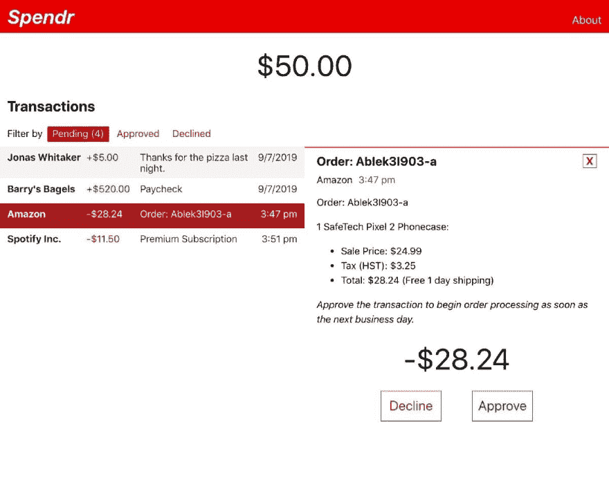

# Spendr:网上银行原型

> 原文：<https://dev.to/dyllandry/spendr-online-banking-prototype-4blg>

这篇文章提供了更多关于我的斯彭德网上银行原型的细节。

*试玩[斯彭德现场演示](https://youthful-lamport-5bf629.netlify.com/)。
源代码可以在 [Spendr GitHub 库](https://github.com/dyllandry/spendr)上查看。
要查看我的其他投资组合，请访问[我的投资组合网站](https://dylanlandry.com)。*

* * *

这个项目只有一个目的:**向雇主展示我使用 React 和 Redux** 的能力。我认为它达到了那个目的，但是我会用另一个 React 项目来跟进。

虽然该网站的主题是网上银行的一种新方法(试图通过要求在交易处理前明确批准每笔交易来降低消费频率)，但我的重点更多的是创建网站的执行和技术。

我想提醒大家注意几个值得注意的部分:

1.  视觉外观干净。
2.  信息清晰呈现。
3.  所有颜色(字体和背景)符合 W3C(万维网联盟)WCAG 2.0(网页内容可访问性指南)4.5:1 的最小对比度。
4.  HTML(超文本标记语言)由必要的 W3C ARIA(可访问的富互联网应用程序)属性构成，以提供具有屏幕阅读器能力的体验。参见[演示屏幕阅读器用法的视频](https://www.youtube.com/watch?v=iAlNIHXWhRM&feature=youtu.be)。

* * *

## 视觉外观

在我看来，视觉外观看起来不错，设计干净简单，我认为这很好地传递了信息。

* * *

## 无障碍颜色

谷歌现在在他们的小工具中呈现对比信息，用于选择文本颜色。制作可访问的 web 应用程序变得更加容易。

* * *

## 屏幕阅读器

当我第一次尝试在 Spendr 上使用屏幕阅读器软件时，我发现这是不可能理解的。经过一天的学习使用谷歌 Chrome 的 Vox 屏幕阅读器扩展，并对我的 HTML 结构和 ARIA 属性进行了大量的修改，我终于创建了一个我认为是屏幕阅读器功能的网站。下面是我使用屏幕阅读器浏览 Spendr 网站的视频演示。

[https://www.youtube.com/embed/iAlNIHXWhRM](https://www.youtube.com/embed/iAlNIHXWhRM)

* * *

## 作出反应并还原

关于 Redux，我有一个挥之不去的问题:你*遗漏了 Redux 的*什么状态？

*   当前交易列表:放入 redux。
*   当前详细交易:放入 redux。
*   当前关注的事务:嗯...

例如，redux 不存储界面的整个状态，比如当前的 DOM(文档对象模型)节点。将所有这些信息存储在 redux 中是很荒谬的。然而，我对 redux 的理解是，它存储所有的应用程序状态。界面的状态，甚至是浏览器当前关注的事务，难道不是应用程序状态的一部分吗？

我遇到的问题是试图操纵 DOM，比如聚焦特定的元素，但是在我的 Redux 状态中没有足够的信息来做我想做的事情。我不想把这些信息放到 Redux 中，所以把它们存储在其他地方。

但是问题仍然存在，Redux 的什么应用程序状态(比如接口状态)你*忽略了*？

我想随着我在 React 和 Redux 方面获得更多的经验，我会更好地回答这个问题。

* * *

*试玩[斯彭德现场演示](https://youthful-lamport-5bf629.netlify.com/)。
源代码可以在 [Spendr GitHub 库](https://github.com/dyllandry/spendr)上查看。
要查看我的其他投资组合，请访问[我的投资组合网站](https://dylanlandry.com)。*