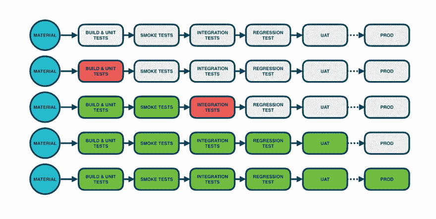
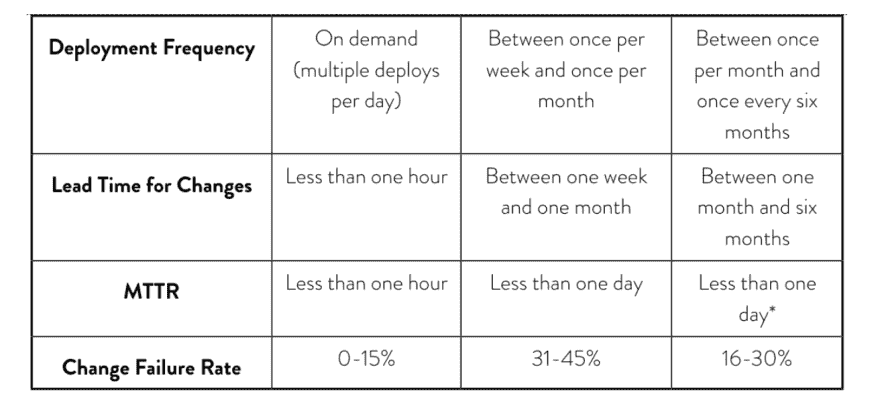

# 连续交付度量标准第 1 部分:为什么要度量您的 CD 过程

> 原文：<https://dev.to/gocd/continuous-delivery-metrics-part-1-why-measure-your-cd-process-2oia>

随着软件和 IT 成为当今大多数组织创新的关键驱动力，软件交付的速度对他们的成功变得非常重要。越来越多的团队正在采用连续交付(CD ),并期望从 CD 提供的加速反馈循环中获益。为了了解你是否在改进和实现你的目标，你需要衡量你的 CD 过程。

[在这个博客系列](https://www.gocd.org/tags/cd-analytics.html)中，我们将分享:

*   为什么 CD 指标很重要
*   您应该衡量哪些指标
*   一步一步的入门指南

## 连续交货

Jez Humble 将 continuousdelivery.com 的持续交付定义为

> 以可持续的方式安全、快速地将所有类型的更改(包括新功能、配置、错误修复和实验)投入生产的能力

实际上，CD 管道可能是这样的:

在图的左边，材料是一个存储库，比如 git 或 svn。交付团队提交一个变更，您的 CI/CD 服务器(比如 GoCD)运行构建和单元测试。如果这些测试失败，团队会立即修复任何问题。带有这些修正的新版本在 CD 管道上走得更远。如果进一步的测试失败了，团队会尽快修复它们。这个过程在应用程序的生命周期中反复发生。

## 为什么要测量您的 CD 流程

**1。测量、反馈和改进**

如果我们考虑像“构建、测量和学习”这样的反馈循环，度量是一种设置具体和可测量目标的方式，指导实现这些目标的活动，并帮助您了解您是否正在实现这些目标。

**2。预测未来行为**

数据将为您的业务提供更准确的估计。例如，如果您知道您的交付周期，您就可以更准确地回答关于为客户准备好产品需要多长时间的问题。

如果您正在考虑并行化任务或删除流程中的手动步骤，一旦您有了关于当前流程的一些数据，您就可以计算这些改进活动节省的时间。在此基础上，这些数据有可能帮助您的组织估计通过某些特定的改进所获得或节省的资金。

**3。持续交付基准测试**

一旦你有了一些数据，这些值就可以作为你的基线。这些基线值是理解您是否正在改进您自己的过程的关键，也是理解您相对于“高绩效”团队所处位置的关键。

鸣谢:佛斯格伦博士，妮可。加速:精益软件和 DevOps 的科学:建立和扩展高性能的技术组织。IT 革命出版社。Kindle 版。

## 衡量哪些指标很重要？

一旦你引入了 CD 渠道并建立了生产路径，下一步就是监控其效率。我们不建议衡量一切。这里是我们建议用来帮助监控您的 CD 流程的四个指标。我们将在本系列的后续部分更深入地讨论细节。

**1。部署频率又称吞吐量**

部署频率是对您的团队部署代码的频率的度量。该指标以百分比表示。它是“代码多久到达 CD 管道中的某一点”这个问题的答案。

**2。交付时间**

交付周期是衡量从提交代码到将代码部署到生产环境中所需时间的指标。该指标以持续时间表示。它是对“从提交代码到 It 到达生产需要多长时间”这个问题的回答。

**3。更改失败百分比**

更改失败百分比是对导致失败的更改百分比的度量。该指标以百分比表示。它回答了诸如“多大比例的变更会中断构建”和“多大比例的部署会导致服务中断”等问题。

**4。平均恢复时间**

平均恢复时间(MTTR)是对修复构建故障所需时间的度量。该指标表示为平均持续时间。这是对“在部署失败期间，您需要多长时间来恢复服务”等问题的回答。

## 总结

这是我们的可操作 CD 度量博客系列的第 1 部分。我们讨论了 CD 指标的重要性，并概述了我们推荐的重要指标。[在下一篇文章](https://www.gocd.org/2018/11/30/deployment-frequency/)中，我们将更深入地探讨每个指标。