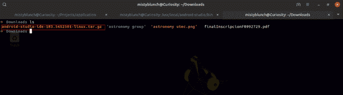
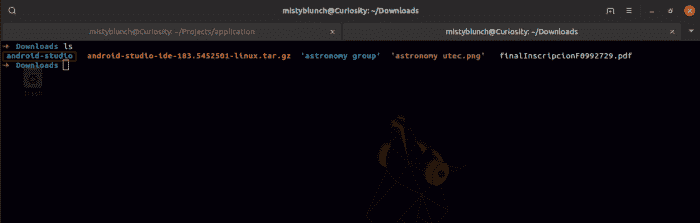
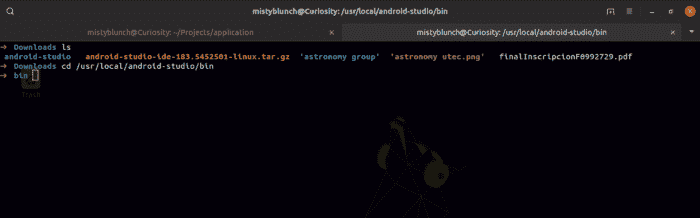
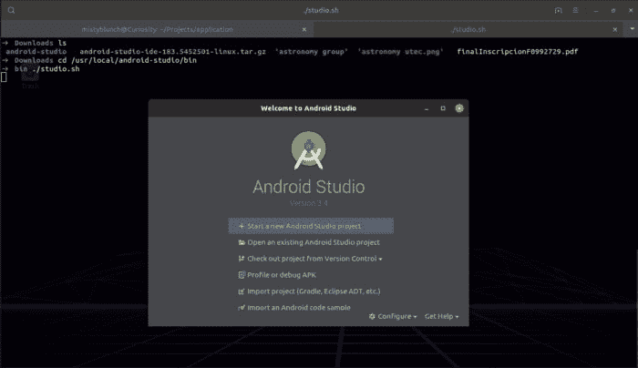
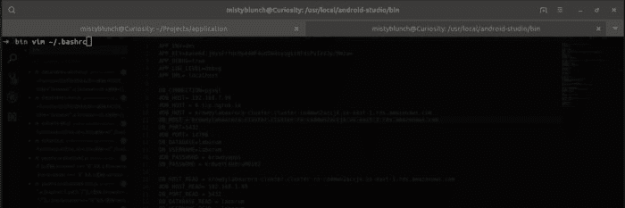
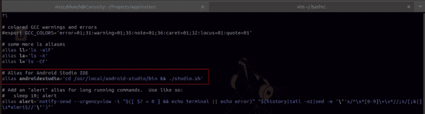
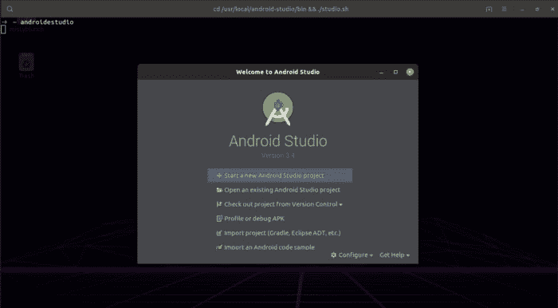

# 如何在 Linux (Ubuntu)上安装 Android Studio

> [https://dev . to/mixyblunch/how-install-El-ide-Android-studio-en-Linux-Ubuntu-521m](https://dev.to/mistyblunch/como-instalar-el-ide-android-studio-en-linux-ubuntu-521m)

许多人很容易在 Windows 上安装一些软件；但是，在 Linux 上，还有其他一些步骤可以执行此操作。

这就是为什么在此帖子中，我将帮助您安装 Android studio ide。只要确保你遵循正确的步骤。

* * *

你要做的第一件事就是把 Android Studio 下载到:[https://developer . Android . com/studio/# downloads](https://developer.android.com/studio/#downloads)。

安装后，我们将打开我们的终端…

默认情况下，该文件为“*. tar . gz]t1”，并位于下载文件夹中。*

[](https://res.cloudinary.com/practicaldev/image/fetch/s--_6KBq57C--/c_limit%2Cf_auto%2Cfl_progressive%2Cq_auto%2Cw_880/https://thepracticaldev.s3.amazonaws.com/i/01zai9cbheqqojyfne5u.png)

现在，我们使用以下命令解压缩该文件:

```
tar -xzf android-studio-ide-183.5452501-linux.tar.gz 
```

[](https://res.cloudinary.com/practicaldev/image/fetch/s--hRiad1w0--/c_limit%2Cf_auto%2Cfl_progressive%2Cq_auto%2Cw_880/https://thepracticaldev.s3.amazonaws.com/i/q8bvh8ud89srnfvnjskl.png) 
我们将看到一个名为**【Android-studio】**的新文件夹，我们将在当前路径中使用以下命令将该文件夹移到 **/usr/local** ，即*下载*

```
tar -xzf android-studio-ide-183.5452501-linux.tar.gz 
```

接下来，我们将前往**/usr/local/Android-studio/bin**运行 Android studio ide:

```
cd /usr/local/android-studio/bin 
```

[](https://res.cloudinary.com/practicaldev/image/fetch/s--6RnGC232--/c_limit%2Cf_auto%2Cfl_progressive%2Cq_auto%2Cw_880/https://thepracticaldev.s3.amazonaws.com/i/njjqx766zs2puflwfe5x.png)

在此处，我们运行以下命令以运行 IDE:

```
./studio.sh 
```

[](https://res.cloudinary.com/practicaldev/image/fetch/s--zqBF9eGC--/c_limit%2Cf_auto%2Cfl_progressive%2Cq_auto%2Cw_880/https://thepracticaldev.s3.amazonaws.com/i/rs5d0om78krzt9q1f5uv.png)

我们已经安装了 Android studio ide！:d

* * *

如果您在终端上看到类似:**【未能加载模块】**
的消息，您只需运行以下命令即可安装

```
sudo apt install libcanberra-gtk-module libcanberra-gtk3-module 
```

* * *

现在要打开 IDE，你要做的就是进入*/usr/local/Android-studio/bin*并运行程序(*。/studio.sh* )，这里我留给你们两人做的指挥:

```
cd /usr/local/android-studio/bin && ./studio.sh 
```

* * *

如果您不想输入上述命令 **N** ，我们有时可以创建别名…

为此，我们将需要编辑我们的文件**。bashrc**，如果你想使用你最喜欢的 IDE，我们将首先用**来打开文件**

```
vim ~/.bashrc 
```

[](https://res.cloudinary.com/practicaldev/image/fetch/s--HLFQ_1zT--/c_limit%2Cf_auto%2Cfl_progressive%2Cq_auto%2Cw_880/https://thepracticaldev.s3.amazonaws.com/i/r8gequls0ulk803crf01.png)

*   要使用 vim 写入文件，必须按键

[](https://res.cloudinary.com/practicaldev/image/fetch/s--3NoPVwnK--/c_limit%2Cf_auto%2Cfl_progressive%2Cq_auto%2Cw_880/https://thepracticaldev.s3.amazonaws.com/i/o3pxctb6ae4j0gyn3dcp.png)

我创造了一个名字叫**【雄性激素工作室】**的别名，你可以给它取你喜欢的名字。

```
alias androidstudio=’cd /usr/local/android-studio/bin && ./studio.sh’ 
```

要保存更改，必须按以下键:

**ESC + :wq**

现在，我们将关闭并重新打开终端，然后运行我们创建的别名

[](https://res.cloudinary.com/practicaldev/image/fetch/s--62-tI7_P--/c_limit%2Cf_auto%2Cfl_progressive%2Cq_auto%2Cw_880/https://thepracticaldev.s3.amazonaws.com/i/ex6l6h5xt4az2y92fn8h.png) 
希望它为你服务

参考文献:

*   [https://developer.android.com/studio/install?hl=es-419](https://developer.android.com/studio/install?hl=es-419)
*   [https://askubuntu . com/questions/342202/failed-to-load-module-Canberra-GTK-module-but-always-installed](https://askubuntu.com/questions/342202/failed-to-load-module-canberra-gtk-module-but-already-installed)