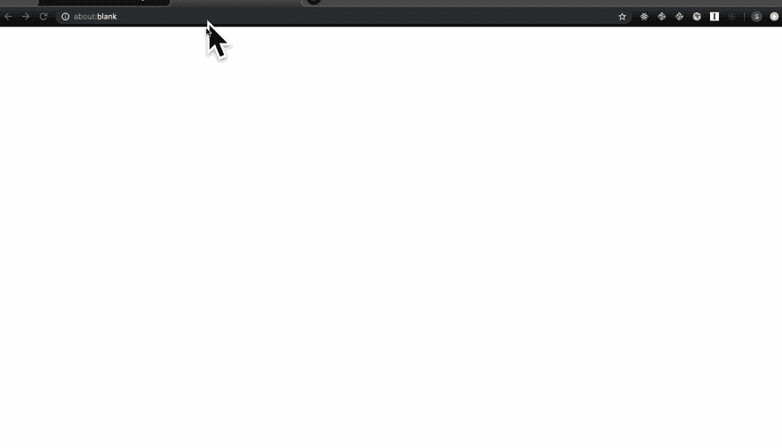

# 用服务器端和客户端重定向(Netlify 和 Gatsby)对抗链接腐烂

> 原文：<https://dev.to/swyx/fight-link-rot-with-server-and-client-side-redirects-netlify-and-gatsby-29jn>

链接断开。以下是如何用重定向来对抗网站上的链接腐败。

## 为什么需要服务器端重定向

随着网站需求的增长，URL 架构一直在变化。以`/my-post`开头的，将来可以变成`@swyx/my-post`或`posts/my-post`或`news/2019/my-post`。

考虑用户体验。想象一下，你正在做一些深入的研究，在翻了几个小时的谷歌搜索结果后，你发现了一个可以解决你所有问题的链接。你点击它，网站仍然在运行，但你看到的只是一个 404 页面！如果内容还在，希望网站有搜索功能找到它，或者谷歌索引它。当然，这是一个小问题，但是作为一个负责任的网站管理员，你应该为你的用户避免这个问题。

考虑到像[社交媒体展开](https://medium.com/slack-developer-blog/everything-you-ever-wanted-to-know-about-unfurling-but-were-afraid-to-ask-or-how-to-make-your-e64b4bb9254)这样的自动化工作流程，以及电子邮件/RSS/网站抓取器会简单地崩溃，所以“不要破坏网络”的原则变得更加迫切。

在最基本的形式中，您会希望从 URL A 重定向到 URL B:

```
/my-broken-url   ->  /posts/my-new-url 
```

<svg width="20px" height="20px" viewBox="0 0 24 24" class="highlight-action crayons-icon highlight-action--fullscreen-on"><title>Enter fullscreen mode</title></svg> <svg width="20px" height="20px" viewBox="0 0 24 24" class="highlight-action crayons-icon highlight-action--fullscreen-off"><title>Exit fullscreen mode</title></svg>

这通常是通过设置一个[来实现的。htaccess](http://www.htaccess-guide.com/) 文件或者[服务器重定向](https://expressjs.com/en/4x/api.html#res.redirect)。

一对一重定向是非常可定制的，但是对于您可能需要重定向的大量帖子来说可能无法扩展。

Netlify 通过 [Netlify 重定向](https://www.netlify.com/docs/redirects/?utm_source=blog&utm_medium=devto&utm_campaign=devex)提供了更强大的重定向配置。您可以使用[占位符](https://www.netlify.com/docs/redirects/?utm_source=blog&utm_medium=devto&utm_campaign=devex#placeholders)来声明性地重新排列 URL。您可以[代理无服务器功能](https://www.netlify.com/docs/redirects/?utm_source=blog&utm_medium=devto&utm_campaign=devex#rewrites-and-proxying)。你可以使用基于 cookie 的语言重定向。我最喜欢的，部分是因为说起来很有趣，是[的 splat 功能](https://www.netlify.com/docs/redirects/?utm_source=blog&utm_medium=devto&utm_campaign=devex#splats) :

```
/posts/*  /news/:splat 
```

<svg width="20px" height="20px" viewBox="0 0 24 24" class="highlight-action crayons-icon highlight-action--fullscreen-on"><title>Enter fullscreen mode</title></svg> <svg width="20px" height="20px" viewBox="0 0 24 24" class="highlight-action crayons-icon highlight-action--fullscreen-off"><title>Exit fullscreen mode</title></svg>

这有点像 URL 的传播操作符。

当你的重定向被访问时，搜索引擎索引会相应地更新。

然而，在现代单页应用的时代，这并不是全部。

## 为什么需要客户端重定向

服务器端重定向负责**站点间链接**:在**其他**站点通过断开的链接进入你的站点的情况。

客户端重定向解决了**站点内链接**的情况:当你自己的站点链接到你站点中的其他页面，通过 JavaScript 呈现，所以它不通过服务器刷新，并且链接断开。

单页面应用程序使用[客户端路由](https://codeburst.io/client-side-routing-done-right-3464275778bf)来避免整个页面刷新(我最近才知道[并不总是更快](https://carter.sande.duodecima.technology/javascript-page-navigation/)！TIL)。这对于链路腐烂有两个主要的含义。

第一种也是最简单的情况是，一个基本的单页应用程序，比如由`create-react-app`创建的，实际上不需要一长串复杂的服务器端重定向。只需建立一个简单的单页应用程序 T2，让客户端路由处理一切，这意味着我们也可以只在客户端设置重定向。所有 JavaScript 框架都支持这一点，从 [React Router](https://github.com/ReactTraining/react-router/blob/master/packages/react-router/docs/api/Redirect.md) 到 [Vue Router](https://router.vuejs.org/guide/essentials/redirect-and-alias.html) 。这允许我们在与路由(当前路由)相同的代码库/位置中管理我们的重定向(旧路由)。

这种方法的一个缺点是在完全页面刷新时解析页面的过程相当迂回。首先点击`/my-old-url`，然后服务器为`/`提供客户端捆绑包，客户端解析并呈现，客户端读取`/my-old-url`，然后重定向到`/posts/my-new-url`。

链接腐烂的客户端路由的第二个含义是，像 Gatsby 这样的现代 JavaScript 静态站点生成器面临一个混合问题，即每个静态生成的页面的包必须进行客户端路由，但是我们不希望配置服务器端 catchalls(以简单的单页面应用程序方式),否则我们将失去使用静态站点生成器的全部好处。

用 Gatsby 设置客户端重定向非常容易，因为 [`createRedirect`](https://www.gatsbyjs.org/docs/actions/#createRedirect) 是一流的 API。这通过几个插件变得更容易，比如[Gatsby-plugin-client-side-redirect](https://www.gatsbyjs.org/packages/gatsby-plugin-client-side-redirect/)或 [gatsby-redirect-from](https://www.gatsbyjs.org/packages/gatsby-redirect-from/) ，它们都使得重定向稍微容易编写。甚至有黑客[使用元标签](https://www.gatsbyjs.org/packages/gatsby-plugin-meta-redirect/?=redirect)的重定向插件，以及用于在快速服务器上为盖茨比服务的[。](https://www.gatsbyjs.org/packages/gatsby-plugin-express/?=redirect)

## 未找到内容的闪烁

在客户端重定向和没有服务器端重定向的情况下使用 SSG 的缺点是，您将首先呈现未找到的页面，直到 JavaScript 加载并接管。导致可怕的**未找到内容的闪现**(开玩笑，我编的):

[](https://res.cloudinary.com/practicaldev/image/fetch/s--1wi4yG0F--/c_limit%2Cf_auto%2Cfl_progressive%2Cq_66%2Cw_880/https://thepracticaldev.s3.amazonaws.com/i/f0abqrjbvzb2fh0we4jv.gif)

## 同时使用服务器端和客户端重定向

表面上，这里的解决方案是建立并行的服务器端和客户端重定向。您可能希望[自动生成。htaccess 文件](https://www.gatsbyjs.org/packages/gatsby-plugin-htaccess-redirects/?=redirect)如果你使用的是 Apache 服务器，或者使用 [Netlify Redirects](https://www.netlify.com/docs/redirects/?utm_source=blog&utm_medium=devto&utm_campaign=devex) 来设置重定向的并行实现。

您甚至可以编写一个工具来自动输出这些重定向...🤔