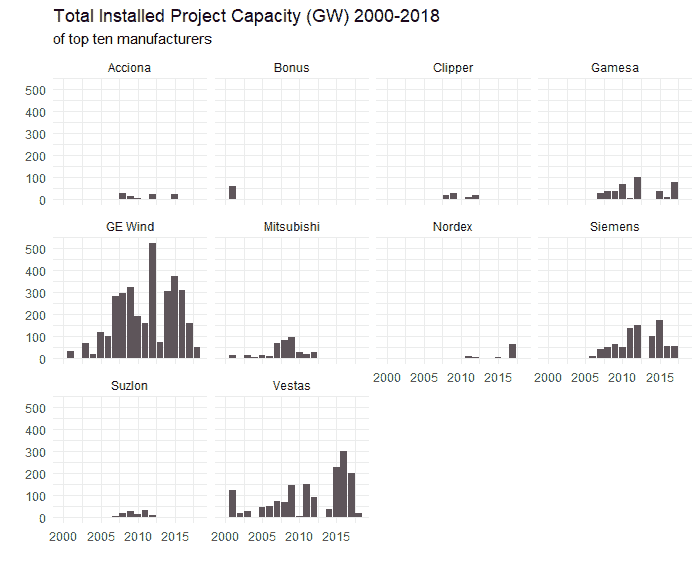
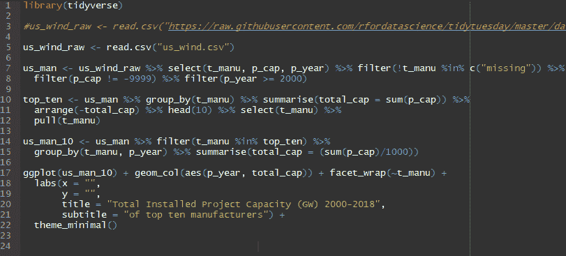

# 选择 R 而不是 Python

> 原文：<https://dev.to/oscar_b123/choosing-r-over-python-2fgn>

在这篇文章中，我将阐述我的观点，为什么你可能想学习用 R 而不是 Python 编程，或者至少尝试一下 R。在这篇文章的最后，我还分享了一些入门建议。

# 我的编程历史的一些背景(随意跳过):

我已经做了一段时间的编程了。虽然我从来没有成为一名优秀的程序员，也没有长时间从事任何复杂的工作，但我曾经用 QBASIC、Turbo Pascal、MATLAB、C、C++和 PHP 编写过一些代码。

我涉猎了一点 Javascript、HTML 和 CSS——甚至在我知道什么是响应式框架之前就用 CSS 编写了自己的媒体查询！

虽然我不精通以上任何一项，但我可以完成课程和个人网站的必要工作。

我擅长 Excel，有些人可能会说，非常擅长。是的，它是一种编程语言，从某种意义上说，它更像编程。

在这一切之后，当想要做非常酷的东西时，我发现了 Python 的世界，并真正进入了它——也就是 Python 3🙂。阅读许多文章，参加在线课程，听所有的[向我讲述 Python](https://talkpython.fm/)集，涉猎足够多的数据清理和一点可视化。我甚至买了一个 Raspberri Pi！

所以你可以看到，当我提出 R 优先于 Python 的论点时，我并没有完全盲目地陷入 R。

这让我想到了 R。不知何故，在 Twitter 上关注了一些人，比如杰西·莫斯蒂帕克和 T2·马拉·阿威克，他们让 R 看起来如此有趣和受欢迎(并不是说 Python 不是)，所以我决定尝试一下。哇，太棒了！在用其他语言完成了所有其他部分之后，R 及其 Tidyverse 软件包对我来说真的很有意义。

# 前 vs 后 Tidyverse

当我第一次开始使用 Python 时，我已经阅读了许多评论和文章，指出 R 比 Python 有更陡峭的学习曲线，但是我认为这必须是在 Tidyverse 时代之前的参考 R。Tidyverse 是一个包集合的名字，这些包可以很好地协同工作，它们之间有共同的语法。我不能确切地说出 Tidyverse 是什么时候发布的，但我猜想它在过去两年左右的时间里已经开始普遍使用，比如从 2017 年开始。我注意到去年网上有一些“我们应该先教基础 R 还是 Tidyverse”类型的讨论，所以这是最近才有的。

我的经验是，R 的学习曲线没有 Python 那么陡峭。

# 数据分析和可视化

如果你编程的主要目的是操纵和可视化数据，那么你应该试试 R。尤其是如果你来自一个 Excel 背景的人。在 r 中可视化要容易得多。我第一次参加 TidyTuesday 挑战赛真的让我大吃一惊。在几行代码中，我就能完成在 Python 中相当痛苦的经历。

原因还是潮汐。所有处理和分析数据的软件包都有一个共同的基本原理和语法，这使得使用起来非常愉快。相比之下，如果你想在 Python 中制作一个像样的可视化，你需要把许多包串在一起(Pandas，Seaborn & Matplotlib ),这些包的差异足以使定制变得困难。

# 软件工程 vs 数据分析

我认为核心的区别归结于这两种语言的两个不同的出发点。Python 是从软件工程的角度来研究数据科学的，而 R 是从数据分析的角度来研究数据科学的，所以从分析和可视化的角度来看，两者似乎更适合处理数据，这并不奇怪。

# 为什么选择？

事实上，你不必。不存在 Python 与 R 的圣战，尽管有些人可能试图让这种情况发生。你可以使用其中一个，或者另一个，或者两个都用。当然，你在一个上面花的时间越多，你就会越熟练。我的建议是，如果你来自 Excel，想做分析和可视化，尝试 r。你可能会喜欢它。

# R 入门

刚接触 R 或者还没有找到可以“点击”的资源？

看看 [R4DS 网书](https://r4ds.had.co.nz/)。很优秀，而且免费。没走多远就上钩了。我甚至还没完成一半，但我已经可以做一些很酷的东西了。

之后，参加 Twitter 上的 [TidyTuesday](https://github.com/rfordatascience/tidytuesday/blob/master/README.md) 挑战赛。它非常有趣，非常欢迎新来的人——如果这是你的第一篇帖子，一定要让我们知道！

我已经在 YouTube 上开设了一个名为“其他人的状态”的频道，播放的内容包括 R 包、小贴士和每日动态。我强烈推荐:d。

# Python 入门

我建议的第一步，特别是对于非程序员来说，是通过 Python book online 版本完成令人惊叹的[自动化枯燥的东西。它有一个折扣代码，可以在网上的 Udemy 课程中获得大量折扣。这是对 Python 自动化能力的一个很好的介绍，并使学习这门语言变得非常有趣。](https://automatetheboringstuff.com/)

下一步是另一个伟大的在线资源。跟随凯文·马卡姆的 youtube 系列[介绍熊猫图书馆](https://www.youtube.com/watch?v=yzIMircGU5I&list=PL5-da3qGB5ICCsgW1MxlZ0Hq8LL5U3u9y)。它让数据争论变得非常有趣，如果没有这个库，我不敢用 Python 做任何事情。凯文是一个非常棒的教练。

为了让自己沉浸在 Python 中，我还推荐收听 [Talk Python To Me](https://talkpython.fm/) 播客。

# 总之

不要太担心从哪种语言开始。你的决定不是一成不变的。

你所做的任何学习都将是有价值的，如果你决定转行，还有许多可以转移的技能。

*我最初在我的[博客](https://oscarbaruffa.com/)T3 上发表了这篇文章*