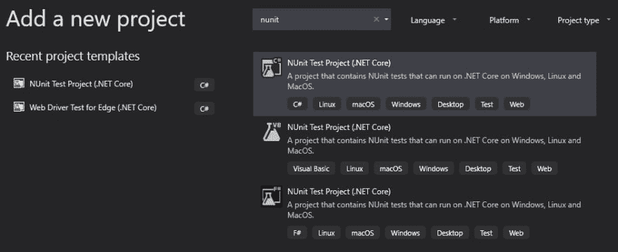
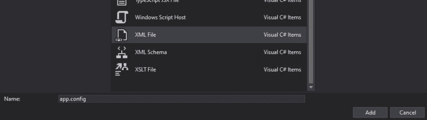
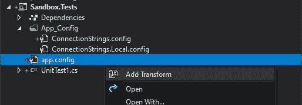
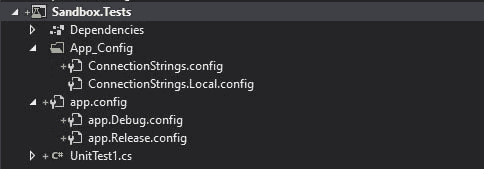

# Kentico 12:设计模式第 8 部分——设置集成测试

> 原文：<https://dev.to/seangwright/kentico-12-design-patterns-part-8-setting-up-integration-tests-14jg>

<figure>

[](https://res.cloudinary.com/practicaldev/image/fetch/s--7k9RPclH--/c_limit%2Cf_auto%2Cfl_progressive%2Cq_auto%2Cw_880/https://thepracticaldev.s3.amazonaws.com/i/nk11wecdfjzxujqjs4n2.jpg)

<figcaption>Photo by [Tabea Damm](https://unsplash.com/@tabeadamm) on [Unsplash](https://unsplash.com)</figcaption>

</figure>

让我为你设置一个场景...

您已经将新的 Kentico 12 MVC 应用程序部署到生产环境中，一切进展顺利。你的老板很开心，你也很开心。😊

一个新的功能请求来到你面前，为了添加这个功能，除了为这个功能编写新代码之外，你还必须对站点的现有部分进行一些更改。

在本地测试，然后将新特性部署到产品中之后，一些人注意到了几个问题😮-不是与你建立的新功能，而是与网站无关的部分。

您没有任何自动化测试，所以当添加新功能时，没有简单的方法来测试站点功能的退化。😧

相反，你(如果你幸运的话，还有几个善良的人)浏览网站，四处点击，希望找出是什么导致了这些问题。

经过一番查找，问题的原因找到了！这是您在现有代码中所做的更改，以使新功能能够工作。😢

* * *

## 用于自动化测试的案例

您决定尝试编写一个自动化的单元测试，它将测试先前损坏的代码，以确保它的行为符合您的预期，而不是擦擦额头上的汗水，然后直接将补丁发布到产品中。😎

> 如果您是 Kentico 自动化测试的新手，可以看看我写的关于编写单元测试的帖子
> 
> [](/seangwright) [## Kentico 12:设计模式第 2 部分——编写单元测试
> 
> ### Sean g . Wright 6 月 1 日 197 分钟阅读
> 
> #kentico #unittesting #dotnet #aspnet](/seangwright/kentico-12-design-patterns-part-2-writing-unit-tests-1f8n)

但是有一个问题。其中一个问题与 CMS 中的数据有关，而不是代码。该数据必须为新特征而改变，而现有数据依赖于该数据的先前状态。

单元测试需要快速执行，并且不依赖于代码库其他部分的功能或数据库中数据的状态，所以单元测试在这里帮不了我们。

您决定去阅读 Kentico 的文档，并找到了关于[创建集成测试](https://docs.kentico.com/k12sp/custom-development/writing-automated-tests/creating-integration-tests-with-a-connection-string)的部分。

哇哦！😄

现在，您可以编写与 CMS 中的数据交互的自动化测试，并确保它按照您的应用程序所期望的方式进行配置。

但是编写集成测试的最佳方式是什么呢？我们如何编写可以针对不同环境或一致测试正确数据的测试？🤔

让我们看看如何创建一个集成测试项目。它将测试存储在数据库中的我们的电子邮件模板，确保它们写得正确，并且与我们的代码预期相匹配。

> 查看 Dustin Christians 在 BizStream 上发表的博客文章[使用 Kentico API](https://www.bizstream.com/blog/september-2017/sending-emails-with-the-kentico-api) 发送电子邮件，了解如何使用您的代码以编程方式发送电子邮件。

* * *

## 创建集成测试项目

在之前的一篇文章中，我写了我是如何喜欢使用更新的。NET 核心工具和特性。NET 框架项目。

> 看看这里的帖子
> 
> [](/seangwright) [## 肯蒂科 12 级图书馆与现代。网络核心功能
> 
> ### Sean g . Wright 6 月 1 日 1915 分钟阅读
> 
> #csharp #dotnet #dotnetcore #kentico](/seangwright/kentico-12-class-libraries-with-modern-net-core-features-34n5)

让我们在这里利用一些。

首先，我们在 Visual Studio 中将一个新的测试项目添加到包含我们的 Kentico 项目的解决方案中。

我们将希望选择“NUnit 测试项目(。网芯)”

<figure>

[](https://res.cloudinary.com/practicaldev/image/fetch/s--Yy5eD_3Y--/c_limit%2Cf_auto%2Cfl_progressive%2Cq_auto%2Cw_880/https://thepracticaldev.s3.amazonaws.com/i/3jl3zfakq29mfqx3p6wa.jpg)

<figcaption>This dialog is specific to Visual Studio 2019\. Older versions will have a slightly different UI.</figcaption>

</figure>

为了确保我们的测试项目能够正确地与 Kentico 的测试工具一起工作，我们想用一个`.Tests`后缀来命名它。我的项目被命名为`Sandbox`，所以我将我的测试项目命名为`Sandbox.Tests`。

如果我们在解决方案资源管理器中双击项目节点，`.csproj`文件将打开进行编辑。

> 使用新的。NET Core 通用项目系统是项目的实时编辑，无需先卸载它。👍

我们将对这个文件做一些修改来帮助。NET Framework 兼容性。

*   将`<TargetFramework>`元素值更改为`net472`(或。您正在使用的. NET Framework)。
*   找到包含`<PackageReference>`元素的`<ItemGroup>`，并添加 Kentico 测试包(指定与您的项目的修补程序版本相匹配的版本):

    `<PackageReference Include="Kentico.Libraries.Tests" Version="12.0.30" />`。

*   添加我最喜欢的断言库，FluentAssertions:

    `<PackageReference Include="FluentAssertions" Version="5.7.0" />`

*   要么将`nunit`包版本改为`3.8.1`(这是 Kentico 支持的版本)，要么移除此包，因为`Kentico.Libraries.Tests`已经包含了它。

*   添加`SlowCheetah`包，它将帮助我们在不同的环境下运行我们的测试:

```
<PackageReference Include="Microsoft.VisualStudio.SlowCheetah" Version="3.2.20">
  <PrivateAssets>all</PrivateAssets>
  <IncludeAssets>runtime; build; native; contentfiles; analyzers</IncludeAssets>
</PackageReference> 
```

现在，我们可以保存并关闭项目文件。

* * *

## 编写集成测试

让我们开始编写测试。

首先，我们将`UnitTest1.cs`重命名为`EmailTemplateTests.cs`，并将其内容替换为:

```
using CMS.EmailEngine;
using CMS.MacroEngine;
using CMS.Tests;
using FluentAssertions;
using NUnit.Framework;
using System.Collections.Generic;

namespace Sandbox.Tests
{
    [TestFixture]
    public class EmailTemplateTests : IntegrationTests
    {
        [Test]
        public void Welcome_EmailTemplate_Will_Exist_And_Have_The_Correct_Macro_Expressions()
        {

        }
    }
} 
```

> `IntegrationTests`基类让我们在测试执行期间连接到真实的数据库，Kentico 的任何数据访问类都将使用该连接来检索数据。

让我们使用 [Kentico 的宏表达式](https://docs.kentico.com/k12sp/macro-expressions)创建一个类来表示我们想要填充电子邮件模板的所有值。

```
public class WelcomeUserEmailModel
{
    public string FirstName { get; set; }
    public string LastName { get; set; }
    public string UserName { get; set; }
    public string LoginUrl { get; set; }
} 
```

现在让我们为我们的测试设置上下文，指定我们想要测试的模板、站点和模型数据。

```
[Test]
public void Welcome_EmailTemplate_Will_Exist_And_Have_The_Correct_Macro_Expressions()
{
    // You can fill in these values to fit your needs.

    var templateName = "WELCOME_NEW_USER";
    var siteId = 1;

    var model = new WelcomeUserEmailModel
    {
        FirstName = "Test",
        LastName = "User",
        UserName = "test-user@some-site.com",
        LoginUrl = "https://test.dev.site.com"
    };

    // ... start testing here
} 
```

我们现在可以编写测试代码，确保我们的电子邮件模板在数据库中，并且它的宏表达式与我们的电子邮件模板模型类`WelcomeUserEmailModel`匹配。

```
var template = EmailTemplateProvider.GetEmailTemplate(templateName, siteId);

template.Should().NotBeNull(); 
```

这两行将从数据库中查询模板，并断言它不是`null`(如果找不到模板，`EmailTemplateProvider.GetEmailTemplate`将返回`null`)。💪

宏表达式呢？接下来让我们测试这些！

```
var resolver = MacroResolver.GetInstance();

var values = new List<string>
{
    model.FirstName,
    model.LastName,
    model.UserName,
    model.LoginUrl
};

resolver.SetNamedSourceData(nameof(WelcomeUserEmailModel.FirstName), model.FirstName);
resolver.SetNamedSourceData(nameof(WelcomeUserEmailModel.LastName), model.LastName);
resolver.SetNamedSourceData(nameof(WelcomeUserEmailModel.UserName), model.UserName);
resolver.SetNamedSourceData(nameof(WelcomeUserEmailModel.LoginUrl), model.LoginUrl);

var hydratedTemplateText = resolver.ResolveMacros(template.TemplateText);

hydratedTemplateText.Should().ContainAll(values); 
```

这段代码创建了一个新的宏解析器，从我们的模型类中添加键和值，并使用这些键和值解析我们的电子邮件模板中的宏。

然后，我们断言模型中的所有值都应该出现在宏解析器生成的“水合”电子邮件模板字符串中。

辣酱！🎉

如果我告诉你有一种更通用的方法可以做到这一点，你会相信吗？

我们来看看吧！🧐

```
var resolver = MacroResolver.GetInstance();

var properties = model.GetType().GetProperties();

var values = new List<string>();

foreach (var property in properties)
{
    var value = property.GetValue(model, null);

    values.Add(value?.ToString());

    resolver.SetNamedSourceData(property.Name, value);
}

var hydratedTemplateText = resolver.ResolveMacros(template.TemplateText);

hydratedTemplateText.Should().ContainAll(values); 
```

这里，我们不使用模型类，而是使用反射。

代码收集模型的所有属性和值，将它们添加到宏解析器，并使用值的集合来断言`hydratedTemplateText`的内容应该包含什么。

如果数据库中的电子邮件模板缺少插入模型值的宏表达式之一，或者宏表达式中有类型，我们的测试将失败，让我们知道我们的错误。

相当酷！😁

* * *

## 使用 SlowCheetah 进行配置

在运行我们的测试之前，我们需要配置项目来存储不同环境的配置。

> 此配置包括不同的连接字符串、应用程序设置或特殊文件。如果您使用持续集成/部署(CI/CD)设置来构建和部署您的应用程序，下面的步骤会特别有帮助。⚡

如果我们在解决方案资源管理器中右键单击我们的测试项目节点，并选择“Add New Item ”,我们将看到一个对话框，其中有许多文件选项。

旧的项目系统(。NET Framework)使用 XML `.config`文件来存储项目的配置，而新的项目系统(NET Core)使用`.json`文件。

我们仍在努力。NET 框架而不是。NET 核心，即使我们使用新的项目系统，所以我们想使用基于 XML 的配置文件。

在我们面前的对话框中，与这些文件最接近的是`XML File`，所以我们选择它并将其命名为`app.config`。

[](https://res.cloudinary.com/practicaldev/image/fetch/s--8pjq76sS--/c_limit%2Cf_auto%2Cfl_progressive%2Cq_auto%2Cw_880/https://thepracticaldev.s3.amazonaws.com/i/2gl8jd3k4xmhwrpe0z5i.jpg)

如果我们打开新的`app.config`文件，除了根 XML 节点之外，它将是空的。

将其内容替换为以下内容

```
<?xml version="1.0" encoding="utf-8" ?>
<configuration>
  <appSettings></appSettings>
  <connectionStrings configSource="App_Config\ConnectionStrings.config" />
</configuration> 
```

现在我们需要将`App_Config`文件夹添加到我们的项目中，并将两个文件添加到这个文件夹中——`ConnectionStrings.config`和`ConnectionStrings.Local.config`。

我们可以像添加上面的`app.config`文件一样添加它们。

每个“连接字符串”文件的内容应该是相同的。

```
<connectionStrings>
  <add name="CMSTestConnectionString" connectionString="" />
</connectionStrings> 
```

> 注意，我们使用名称`CMSTestConnectionString`是因为当我们运行测试时，Kentico 的集成测试基础设施将寻找这个特定的连接字符串。✅

我们将`ConnectionStrings.Local.config`添加到我们的`.gitignore`文件中，因为它将包含一个真实的连接字符串，带有用于本地测试的凭证，并且我们不希望它出现在源代码控制中。🤚

我们现在将使用`SlowCheetah`来帮助我们添加“转换”到我们的`app.config`，方法是右击`app.config`文件并选择“添加转换”。

[](https://res.cloudinary.com/practicaldev/image/fetch/s--yuOsopDC--/c_limit%2Cf_auto%2Cfl_progressive%2Cq_auto%2Cw_880/https://thepracticaldev.s3.amazonaws.com/i/jpvmw0o8emlwnvqg9g00.jpg)

我们最终应该得到的是一个`app.Debug.config`和`app.Release.config`(我们项目中的每个配置一个)。

[](https://res.cloudinary.com/practicaldev/image/fetch/s--uHuBBtNV--/c_limit%2Cf_auto%2Cfl_progressive%2Cq_auto%2Cw_880/https://thepracticaldev.s3.amazonaws.com/i/8lt37yzrsuvkip6tjgzq.jpg)

下面的 XML 应该已经添加到我们的`.csproj`文件中。

```
<ItemGroup>
  <None Update="app.config">
    <TransformOnBuild>true</TransformOnBuild>
  </None>
  <None Update="app.Debug.config">
    <IsTransformFile>true</IsTransformFile>
    <DependentUpon>app.config</DependentUpon>
  </None>
  <None Update="app.Release.config">
    <IsTransformFile>true</IsTransformFile>
    <DependentUpon>app.config</DependentUpon>
  </None>
</ItemGroup> 
```

我们现在更新我们的`app.Debug.config`，以便当我们使用“调试”配置构建我们的`.Tests`项目时，`app.config`被转换为使用我们的`ConnectionStrings.Local.config`而不是`ConnectionStrings.config`。

```
<?xml version="1.0"?>
<configuration xmlns:xdt="http://schemas.microsoft.com/XML-Document-Transform">
  <connectionStrings configSource="App_Config\ConnectionStrings.Local.config"
           xdt:Transform="SetAttributes(configSource)" />
</configuration> 
```

最后，我们添加真正的数据库连接字符串(local 或 dev，而不是 prod！)到`ConnectionStrings.Local.config`。

当您想要测试“生产”时，将一个连接字符串放在`ConnectionStrings.config`文件中，最好使用一些 CI/CD 进程，或者放在您机器上的文件中。然后在“发布”模式下构建您的测试项目，并运行您的测试。

您可以为您的解决方案创建更多配置(开发、QA、试运行等...)并为它们中的每一个创建一个`app.config`变换。

如果您对想要用于测试的每个环境有不同的设置，您可以采用我们用于`ConnectionStrings`的上述方法，并将其用于`AppSettings`。

如果这些设置中有一些不是安全敏感的，那么您可以将它们提交给源代码控制，而本质上更敏感的设置可以通过 CI/CD 过程添加。😀

* * *

## 运行集成测试！

我们现在应该能够运行我们的测试并看到结果。

对于我上面写的测试代码，我需要在 CMS 中定义一个名为`WELCOME_NEW_USER`的电子邮件模板，大致如下:

```
<p>Hello  ,</p>

<p>
   Welcome to our site! Your account has been created successfully 
   and you can now login by <a href="" target="_blank">
   clicking this link</a> and entering the username 
   along with the password you already entered.
</p> 
```

您可能会注意到，运行集成测试比运行单元测试需要更长的时间(集成测试需要 1-2 秒，而单元测试需要 10-20 毫秒)。🤔

这是为什么我们在编写自动化测试时需要明智地集中精力的部分原因。

集成测试并不比单元测试更好或更差——与单元测试相比，它们为我们的代码提供了更多的信心，但是它们也更脆弱(更容易产生错误的失败),并且运行时间更长。

我们需要它们来帮助确保我们的代码匹配 CMS 中的数据，但我们不应该用它们来测试一切。

一种常见的方法是让我们的应用程序中不同种类的测试数量与[自动化测试金字塔](https://smartbear.com/learn/automated-testing/what-is-automated-testing/)相匹配。✅

[](https://res.cloudinary.com/practicaldev/image/fetch/s--tPkGvkox--/c_limit%2Cf_auto%2Cfl_progressive%2Cq_auto%2Cw_880/https://smartbear.com/SmartBear/medimg/Resources/articles/content/test-automation-pyramid.png)

同样常见的是，在每次代码更改时都运行单元测试，但是在将更改部署到新环境之前只运行集成测试。✅

作为开发人员，这些选择是我们自己做出的——让我们善用我们的新能力——帮助减少回归并提高我们工作的应用程序的稳定性。💗

* * *

## 总结

我在这里的目标是建立一个场景，通过将问题的原因放在数据库中，展示自动化测试可以提供真正的好处，特别是集成测试。

我们走过:

1.  如何创建一个测试项目来测试一个 Kentico 12 应用程序。
2.  测试电子邮件模板时，编写集成测试会是什么样子。
3.  如何使用测试项目配置转换来设置每个环境的配置值，并将敏感值置于源代码控制之外。
4.  单元测试相对于集成测试的优缺点，以及集成在您的整体测试策略中应该具有的目的和位置。

如果你对集成测试有什么想法，或者你使用集成测试来帮助确保你的应用程序的信心的酷方法，请在评论中告诉我。📜

感谢阅读！🙏

* * *

如果您正在寻找更多的 Kentico 内容，请在 DEV:

## # [肯蒂科](/t/kentico)

或者我的 Kentico 博客系列:

*   [Kentico 12:设计模式](https://dev.to/search?q=Kentico%2012%20-%20Design%20Patterns)
*   [Kentico CMS 快速提示](https://dev.to/search?q=Kentico%20CMS%20Quick%20Tip)