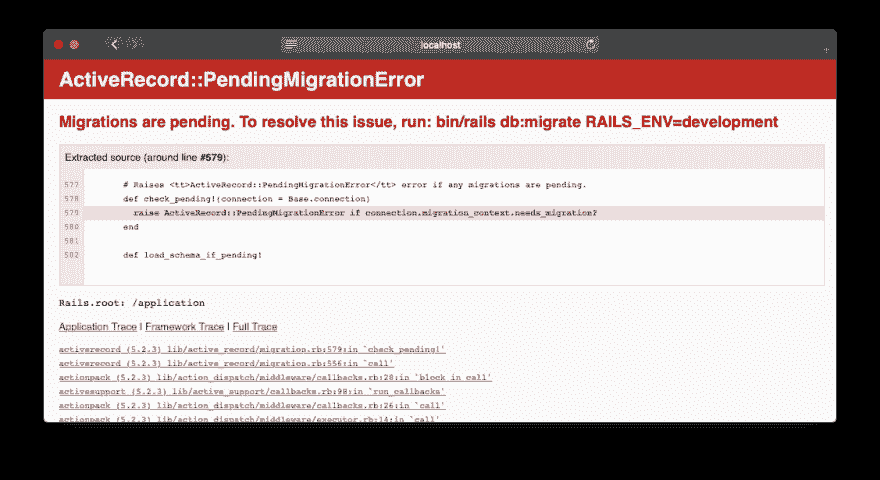
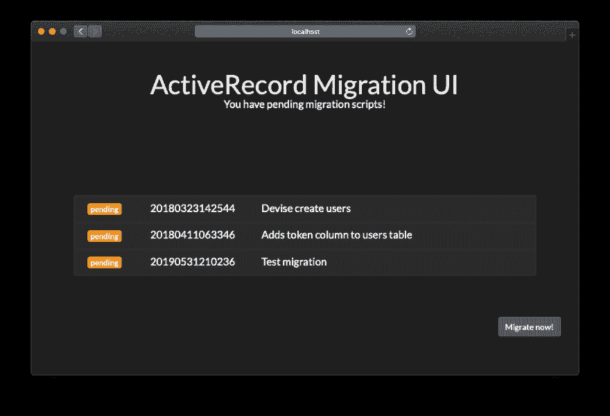
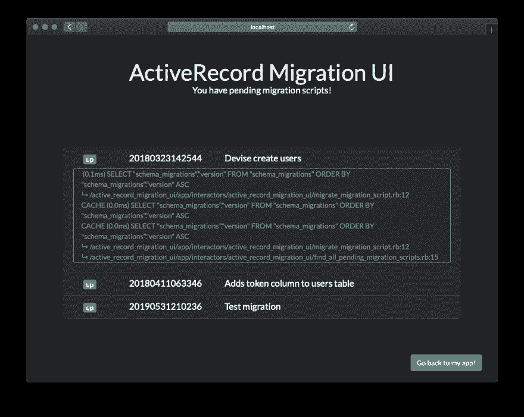

# 从 web 浏览器运行 Rails 迁移

> 原文：<https://dev.to/zedtux/run-your-rails-migrations-from-the-web-browser-4mod>

对于 Rails，让我感到痛苦的是，当使用新的迁移脚本在一个分支上执行`git pull`时，会得到这个错误页面:

这很好，你知道有迁移脚本要执行，你甚至有命令要执行，以便*解决*问题...但仅此而已。

您必须打开您的终端，进入项目的文件夹，运行该命令(或者如果您使用 Docker 的话，使其适应 Docker)，它将加载环境(因此需要几秒钟)，然后，最后，运行迁移脚本。

## 进入 ActiveRecord 迁移 UI gem

在 [Pharmony](http://pharmony.lu/) 我们花时间修复它，所以现在，所有这些都成为过去！看那个:

您得到的只是一个漂亮的页面，上面有待定迁移脚本的列表，以及一个简单的“立即迁移！”按钮。

因为环境已经被加载了，因为你在一个 Rails 应用程序中，你不需要浪费时间，只需要立即迁移你的数据库！👌

### 安装

您只需从您的 Rails 应用程序将 gem 添加到您的`Gemfile`中，运行`bundle`命令并重启您的服务器。

下一次你有待定的迁移脚本时，这个页面将会出现，你将知道你必须做什么！😎

### 还有一件事

这个 gem 将会增加更多的特性，但是在脚本运行之后，您已经有了一个~~错误的~~日志视图:

单击迁移的脚本会显示该迁移的日志。

## 源代码在哪里？

gem 是开源的，在麻省理工学院的许可下，托管在我们的 Gitlab 小组:[https://gitlab.com/pharmony/active_record_migration_ui](https://gitlab.com/pharmony/active_record_migration_ui)。

请随时贡献和报告问题！

通过投票支持[ProductHunt.com](https://www.producthunt.com/posts/activerecord-migration-ui)，帮助我们让世界看到它！