# 带角度的组件库

> 原文：<https://dev.to/radw2020/components-library-with-angular-2c4a>

假设我们的项目正在增长，我们希望将事情分开。有时，我们可以将我们的 angular 项目分成两个或三个不同的项目，但是，我们意识到这将是来自样式、组件或任何其他资源的重复代码。

作为我们想做的第一份简历:

*   创建两个使用相同自定义库的角度项目
*   创建自定义组件库(带角度)
*   像 GIT 子模块一样在我们基础项目中托管自定义库
*   像一个角包一样从我们的基础项目构建和访问库
*   利润:)

你可以找到一些不错的帖子，里面有一些通用的信息，可以帮助你完成这个任务。喜欢这个关于 GIT 子模块的惊人[总结](https://gist.github.com/gitaarik/8735255)。或者[ng-packar](https://github.com/ng-packagr/ng-packagr)关于将库转换成 Angular 包格式的官方文档。

但是对于这个帖子，a 我想做的是一个**有棱角的实际例子**(我需要练习才能觉得自己真的懂了，我敢肯定你们有些人也是！).

### 创建示例项目

创建三个最小角度项目:

```
ng new HelloFoo --minimal
ng new HelloBar --minimal
ng generate library ComponentsLibrary 
```

Enter fullscreen mode Exit fullscreen mode

经过一些调整后，**为了帮助我们区分两个 Hello 项目**，我们可以有这样的东西:

[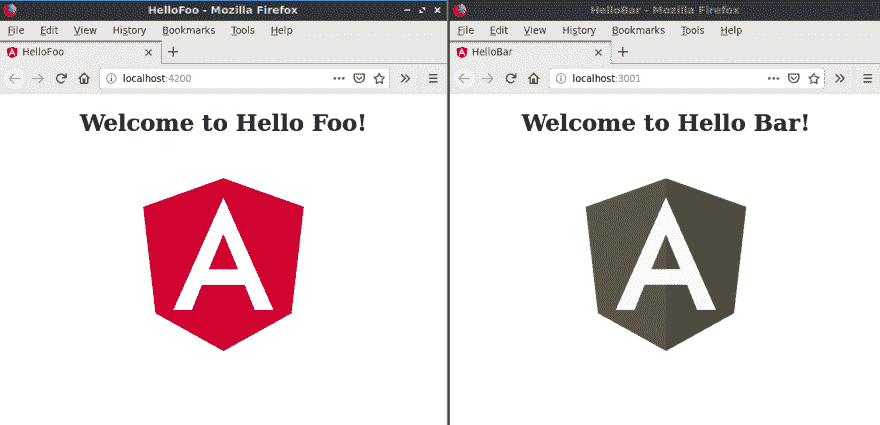](https://res.cloudinary.com/practicaldev/image/fetch/s--9n-F9Zsu--/c_limit%2Cf_auto%2Cfl_progressive%2Cq_auto%2Cw_880/https://i.imgur.com/gSeLcW1.png)

### 准备自定义库项目

注意我们的**组件库**的形状。我们将它生成为一个库。这样做，我们不需要删除无用的角度配置文件，我们只需要能够导出组件/模块。

在这种情况下，让我们在新的组件库项目中创建一个页脚模块。

[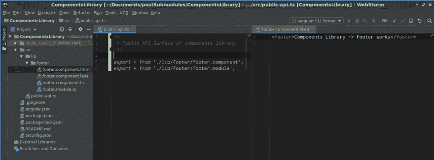](https://res.cloudinary.com/practicaldev/image/fetch/s--aNZhIGbR--/c_limit%2Cf_auto%2Cfl_progressive%2Cq_auto%2Cw_880/https://i.imgur.com/Zbt4xYl.png)

我们希望在两个 Hello 项目中都使用这种资源，并且我们希望确保它能够**保持一致性，同时避免干涸**。(这是拥有公共子模块的主要原因之一)

注意`public-api.ts`文件。它描述了我们稍后需要在 Hello 项目中导入的访问点。

出于本教程的目的，我们可以将这两个项目放在本地，但是我们需要将组件库放在一个共享的存储库中。在这种情况下，我们使用 Github，所以我们将这个新的组件库推送到他的存储库中。[https://github.com/RadW2020/components_library_tutorial](https://github.com/RadW2020/components_library_tutorial)

### 添加子模块到项目中

此时，我们希望我们的两个基础项目知道这个新的库。为此，我们在 Hello 项目的根文件夹中执行这个命令:

```
git submodule add git@github.com:RadW2020/components_library_tutorial.git custom_lib 
```

Enter fullscreen mode Exit fullscreen mode

在我们的两个 Hello 项目中执行这个。这将把它作为子模块添加到给定的文件夹中。请注意 GIT 为我们创建的名为`.gitmodules`的新文件

[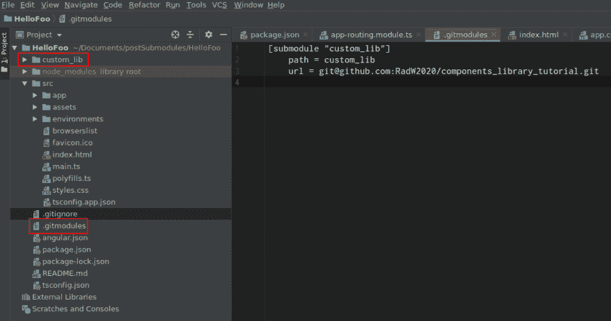](https://res.cloudinary.com/practicaldev/image/fetch/s--2NH2w-sk--/c_limit%2Cf_auto%2Cfl_progressive%2Cq_auto%2Cw_880/https://i.imgur.com/sS3Sgku.png)

> 从现在开始，这个共享库，它本身就是一个项目，作为一个子模块被绑定在我们的 Hello 项目中，托管在他自己的文件夹 *custom_lib* 中。

### 维护子模块更新

如果将更改推送到组件库存储库，会发生什么？我们需要了解并检查它，以保持我们的库更新。
每当我们在 Hello 项目中使用`git status`时，这一点都会很明显:

[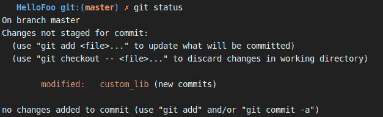](https://res.cloudinary.com/practicaldev/image/fetch/s--_1Xvbfqm--/c_limit%2Cf_auto%2Cfl_progressive%2Cq_auto%2Cw_880/https://i.imgur.com/2VpHWu0.png)

GIT 警告我们关于 lib 源中的提交。我们想告诉我们的 Hello 项目，指向组件库存储库的最后一次提交。为此，我们做:

```
git add .
git commit -m "update custom_lib to last reference" 
```

Enter fullscreen mode Exit fullscreen mode

这将从我们的 Hello 项目的角度更新子模块。我们在这里真正做的是维护我们的 Hello 项目 custom_lib 文件夹。这是通过保存一个指向 custom_lib GIT 历史提交的引用来完成的，如果它不是最后一个，则显示消息 **(new commits)** 。

### 构件库进化

为了完成这种突变，我们必须准备好我们的库，使其表现得像那样。必须创建一个新的配置文件，因此**ng-packar**将知道如何处理它:

[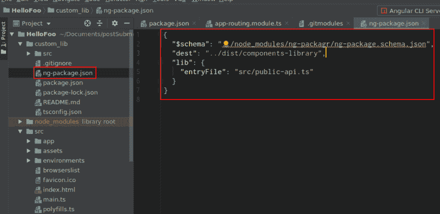](https://res.cloudinary.com/practicaldev/image/fetch/s--xDiwxwFx--/c_limit%2Cf_auto%2Cfl_progressive%2Cq_auto%2Cw_880/https://i.imgur.com/erY446B.png)

在`ng-package.json`中，指定了构建的位置(dest)，以及如何访问(entryFile)。

### 下一步

让我们**告诉我们的 Hello 项目**这个*自定义库*不仅仅是一个与 GIT 同步的子文件夹。我们必须指定几件事:

> *   How to compile *custom _ lib* so that it can be used like an ordinary **dependency** .
> *   Library dependency of. (We put it in the dist folder, next to other installed dependencies)
> *   The compiled **library needs to be listed in package.json.**
> 
> 中

#### 开发依赖关系

在`devDependencies`中，声明了将库转换成 Angular 包格式所需的 ng-packar 和其他依赖项。

[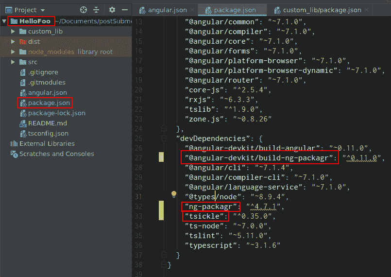](https://res.cloudinary.com/practicaldev/image/fetch/s--K1KknatY--/c_limit%2Cf_auto%2Cfl_progressive%2Cq_auto%2Cw_880/https://i.imgur.com/1h7aFIH.png)

是时候执行`npm install`来获得这些新的依赖项了。

#### 构建库

在`scripts`中，声明了如何构建库。
[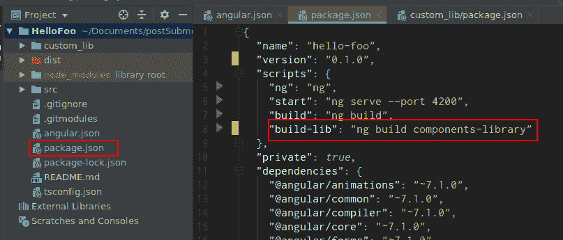](https://res.cloudinary.com/practicaldev/image/fetch/s--GBw0djz3--/c_limit%2Cf_auto%2Cfl_progressive%2Cq_auto%2Cw_880/https://i.imgur.com/gXfYvOp.png)

这将构建我们必须在`angular.json`
[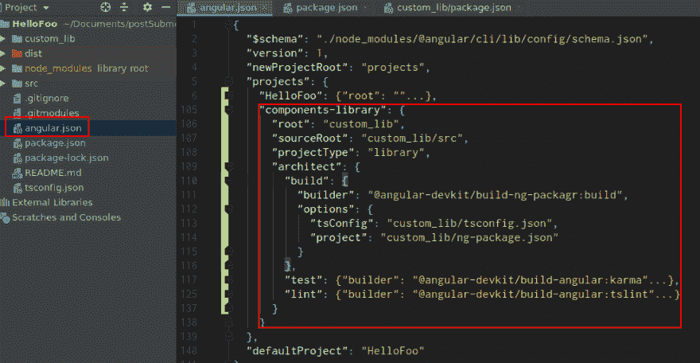](https://res.cloudinary.com/practicaldev/image/fetch/s--805euaEp--/c_limit%2Cf_auto%2Cfl_progressive%2Cq_auto%2Cw_880/https://i.imgur.com/RiUdWFJ.png) 中定义的项目

然后执行`npm run build-lib`。控制台将显示有用的信息。
[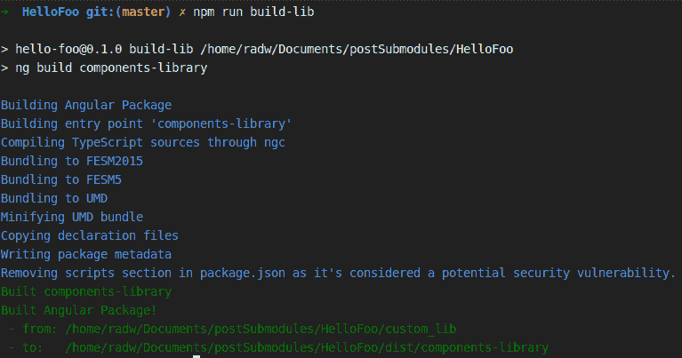](https://res.cloudinary.com/practicaldev/image/fetch/s--ZROiOQMP--/c_limit%2Cf_auto%2Cfl_progressive%2Cq_auto%2Cw_880/https://i.imgur.com/C62YS2z.png)

在`dependencies`中，必须声明在哪里找到构建。
[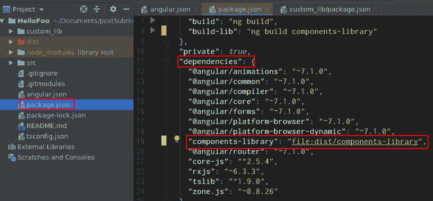](https://res.cloudinary.com/practicaldev/image/fetch/s--rAKgsuRn--/c_limit%2Cf_auto%2Cfl_progressive%2Cq_auto%2Cw_880/https://i.imgur.com/Sn1yyRt.png)

最后一步是执行`npm install`。在这最后一步，我们将软件包作为常规依赖项进行安装。事实上，你可以在*节点模块*文件夹中找到它。

### 恢复工作

现在，我们又回到了正常的 Angular 工作流程。这意味着，要导入 FooterModule

[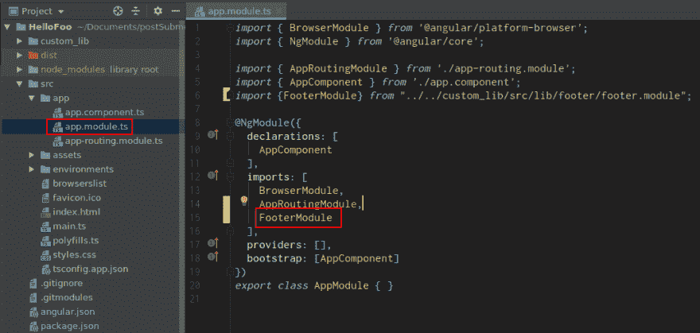](https://res.cloudinary.com/practicaldev/image/fetch/s--S0nZ5elz--/c_limit%2Cf_auto%2Cfl_progressive%2Cq_auto%2Cw_880/https://i.imgur.com/RTmGa4N.png)

然后在模板中使用页脚组件。

[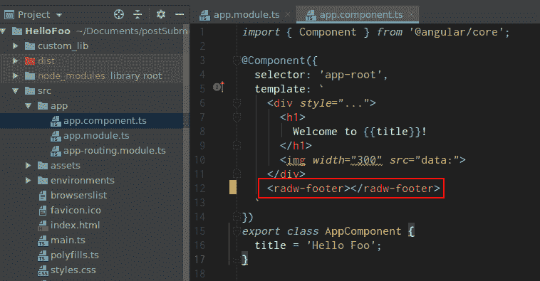](https://res.cloudinary.com/practicaldev/image/fetch/s--5ZPAv5k1--/c_limit%2Cf_auto%2Cfl_progressive%2Cq_auto%2Cw_880/https://i.imgur.com/F1btI20.png)

两个 Hello 项目应该是这样的:
[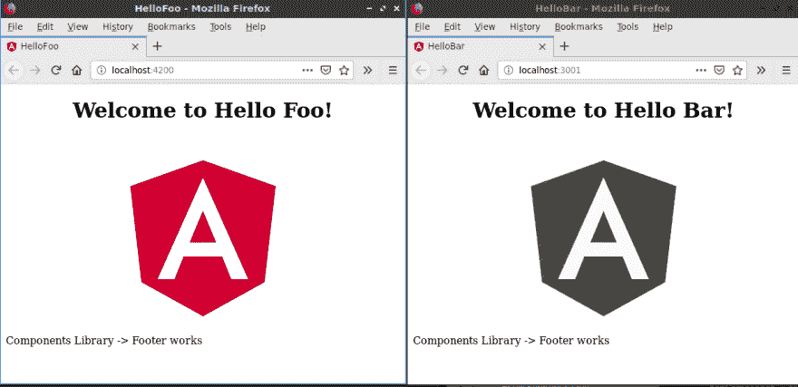](https://res.cloudinary.com/practicaldev/image/fetch/s--fgKM5IGL--/c_limit%2Cf_auto%2Cfl_progressive%2Cq_auto%2Cw_880/https://i.imgur.com/t4Q1ymi.png)

yai！我们得到了它，:D

### 测试一下

1.  自定义库:编辑页脚背景。
2.  自定义库:提交和推送更改。
3.  你好项目:`git pull --recurse-submodules`
4.  你好项目:服务和享受。

[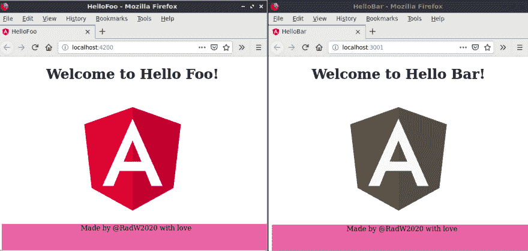](https://res.cloudinary.com/practicaldev/image/fetch/s--gQrPlk9T--/c_limit%2Cf_auto%2Cfl_progressive%2Cq_auto%2Cw_880/https://i.imgur.com/B26uGhJ.png)

敬礼！！