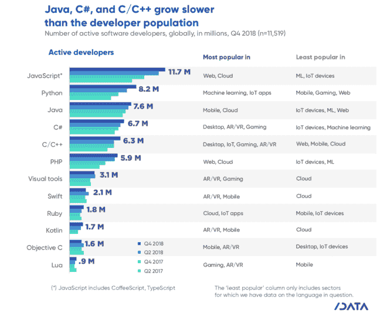

# JavaScript 仍然是编程语言中的女王

> 原文：<https://dev.to/deveconomics/javascript-remains-the-queen-of-programming-languages-3md0>

很难评估一种编程语言的使用有多广泛。Tiobe、Redmonk、Stack Overflow 的 yearly survey 或 Github 的 Octoverse 等公司提供的指数都很不错，但大多只提供了语言之间的相对比较，没有提供每个社区的绝对规模。他们也可能在地理上有偏见，或者偏向软件开发的某些领域，或者开源开发者。

我们在这里给出的估计着眼于使用每种编程语言的活跃的软件开发人员，遍及全球，跨越各种程序员。它们基于两条数据。首先，我们对全球软件开发人员数量的独立估计，这是我们在 2017 年首次发布的。第二，我们的大规模低偏差调查每六个月接触 2 万多名开发商。在调查中，我们不断询问开发人员他们在开发的九个领域中使用编程语言的情况，为我们提供了关于谁在哪个环境中使用每种语言的丰富而可靠的信息。

JavaScript 现在是并且仍然是编程语言的女王。它的 1170 万开发者社区是所有语言中最大的。2018 年，250 万开发人员加入了该社区:绝对数量增长最快，超过了 Swift、Ruby 或 Kotlin 开发人员的总人数。新开发人员认为它是一种有吸引力的入门级语言，但现有开发人员也在将它添加到他们的技能组合中。即使在 Javascript 最不受欢迎的软件领域，如机器学习或物联网中的设备代码，也有超过四分之一的开发人员在他们的项目中使用 Javascript。

Python 已经达到了 820 万活跃开发者，目前在受欢迎程度上已经超过了 Java。就绝对数量而言，它是增长第二快的语言社区，2018 年新增 220 万 Python 开发者。机器学习的兴起是其受欢迎的一个明显因素。高达 69%的机器学习开发人员和数据科学家现在使用 Python(相比之下，他们中有 24%的人使用 R)。

就社区规模而言，Java(760 万活跃开发者)、c#(670 万)和 C/c++(630 万)相当接近，当然都是成熟的语言。然而，这三者现在的增长速度都比一般的开发者群体要慢。虽然它们并没有停滞不前，但它们不再是(新)开发人员的首选语言。

Java 在移动生态系统及其分支(Android)中非常流行，但在物联网设备中却不流行。C#是微软生态系统的核心部分。在我们的研究中，我们发现 C#的使用和微软开发者产品的使用之间有着一致的相关性。看到桌面和 AR/VR (Hololens)成为 C#流行的领域也就不足为奇了。C/C++是游戏引擎和物联网中的核心语言家族，其中性能和底层访问很重要(AR/VR 存在于游戏和物联网的边界上)。

PHP 现在是第二大最受欢迎的网络开发语言，也是第五大最受欢迎的语言，拥有 590 万开发者。与 Python 一样，它的增长速度明显快于整体开发者人数，2018 年其队伍中增加了 32%的开发者。尽管(可以说)有一点坏名声，PHP 易于学习和广泛部署的事实仍然推动它作为现代互联网的主要语言向前发展。

就百分比而言，增长最快的语言社区是 Kotlin。2018 年，开发者人数从 110 万增长到 170 万，增长了 58%。由于谷歌已经将 Kotlin 作为 Android 开发的一流语言，我们可以预计这种增长将继续下去，就像 Swift 在 iOS 开发中超越 Objective-C 一样。

其他利基语言似乎没有增加很多开发人员，如果有的话。Swift 和 Objective-C 是苹果社区的重要语言，但在使用它们的开发人员数量方面是稳定的。Ruby 和 Lua 也没有快速发展他们的社区。

旧的和更流行的编程语言有直言不讳的批评，而新的，令人兴奋的语言往往有热情的支持者。这一数据表明，新语言要超越自己的位置并成为下一个大事件并不容易。这对这些语言和其他语言如 Go 或 Scala 的未来意味着什么？我们当然会继续跟踪这一进展，并计划让你了解情况。

**开发者经济调查现已上线。**
在下一个编程语言女王中发表你的意见，你可能会赢得惊人的奖品和装备。[了解更多。](https://www.developereconomics.net/?utm_medium=textlink&utm_source=partners&utm_campaign=javascript_the_queen_of_prog_languages&utm_content=devto)

想要更多开发者洞察？《开发国家状况报告》可以免费下载。