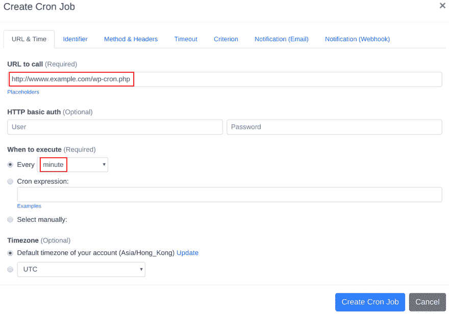

# 如何为 WordPress 设置 cron 作业

> 原文：<https://dev.to/ann/how-to-set-up-cron-job-for-wordpress-bi9>

问题:
我在我的服务器上安装了 WordPress，我想设置一个 cron 作业来触发 WordPress 的 cron 作业脚本。我应该如何设置 cron 作业？

答案:
我们的 webcron 服务最适合触发 WordPress 的 cron 作业脚本。只需按照以下简单的步骤为你的 WordPress 配置 cron job。

[https://www . easycron . com/cron-job-tutorials/how-to-set-up-cron-job-for-WordPress](https://www.easycron.com/cron-job-tutorials/how-to-set-up-cron-job-for-wordpress)

