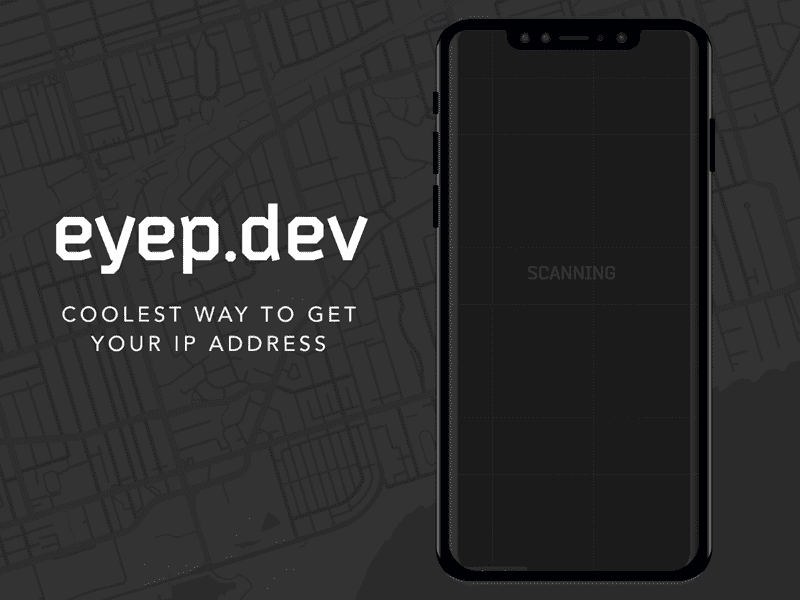

# 获得你的 IP 地址的最酷的方法

> 原文：<https://dev.to/sureshmurali29/eyep-dev-coolest-way-to-get-your-ip-address-53d8>

**你好世界**，
一个快速的辅助项目更新- [Eyep](https://eyep.dev?utm_source=Dev.to&utm_medium=Referral) 。

## 意念萌生💡

我们建立了一个个人食物评论追踪应用程序。我们花了**整整一年**的时间，付出了很多努力来建造它。最终，在[推出了 ProductHunt](https://www.producthunt.com/posts/whatsmyfood) ，但它并没有获得预期的牵引力。因此，我们非常热衷于为即将到来的副业项目做些小事情。

我的朋友想要得到他的 IP 地址。在谷歌上搜索，他立刻就找到了。但他在谷歌搜索中发现了几个网站，显示你的 IP 地址、位置、ISP 提供商等等。然后网站[whatismiypaddress](https://whatismyipaddress.com)在搜索中名列前茅。他震惊地得知，这个网站每月有 1000 万次点击。当他与我分享这一点时，我说我们可以做得更好，因此有了 eyep.dev

随着世界朝着**单一用途**网站/应用 1️⃣、**黑暗模式** ⚫️和更好的 **UX** 发展，我们认为 eyep.dev 将成为游戏改变者。

我们是 ProductHunt(PH)的忠实粉丝。这是一个长期的目标，那也是动力之一。

#### 运行中的 eyep.dev

### 技术堆栈👩‍💻

🌐 **IP** 及其位置由[IP stack](https://ipstack.com/)T4】🗺️ **地图**由谷歌地图&设计由[snazzymaps](https://snazzymaps.com/)T9】💻**前端** -香草 JS &后端- AWS Lambda

## 产品搜索启动🔥

因为我们是 PH 的忠实粉丝，所以我们推出了它。 [PH-Eyep](https://www.producthunt.com/posts/eyep) 。令我们惊讶的是，我们是当时的**第一**产品。人们喜欢这个设计，欣赏它，甚至建议我们开发一个 chrome 扩展。

那一天，我们接近了`4.5` k 的浏览量和`2.4` k 的独立用户。这是一个很长时间的梦想，我们做到了。

**关于 PH 发布的一些提示:**正如你们中的许多人所知道的，确保你提前安排好你的 PH 发布。想出一个**朗朗上口的 GIF** 作为你的标志。添加 **Youtube 视频**、**插图**让人们容易理解。社区非常乐于指出问题，给你新的想法和建议。

## 网络狗仔队🙌

我们在发布后没有太多期望，因为我们知道人们会在一天后忘记。但是第二天，我们的`individual profiles`和`eyep.dev`得到了太多的点击，它们来自土耳其。

然后我们开始知道[网络狗仔队](https://webrazzi.com/)，一个在**土耳其**的受欢迎的技术网站写了关于我们的报道。下面是链接:[Webrazzi](https://webrazzi.com/2019/07/09/ip-adresi-bulma-eyep/)中的 eyep.dev。他们创造了一个新名词叫做**一键式 IP 地址平台**。人们在网站上想出了有趣的迷因。这让我们非常开心。

然后我意识到，**口碑**才是你能得到的真正的&免费营销。

## 有机搜索😭

最初的宣传很好，但是真正成功的是通过 T2 的有机搜索获得用户。我发现 eyep.dev 并没有出现在谷歌搜索的关键词“我的 IP 地址是什么”,即使是在谷歌搜索结果的第四页**。**

做了初步的搜索引擎优化步骤，如更新标题和元标签。这个[视频](https://www.youtube.com/watch?v=-8MU_cIhL0g)确实有助于理解 2019 年 SEO 是如何运作的。

已经更新了``和`<meta>`标签，也配置了**搜索控制台**，让我们看看✌️进展如何