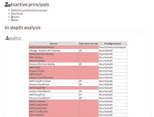
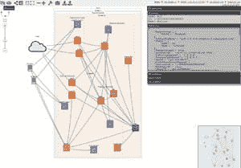
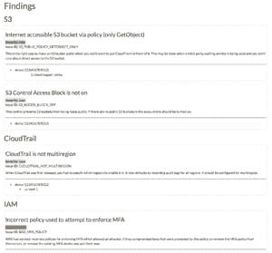
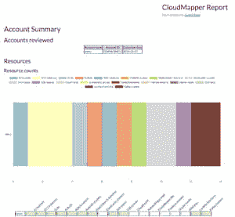

# 绘制 AWS VPC 和 IAM 结构图

> 原文：<https://dev.to/dietertroy/diagramming-your-aws-vpc-iam-structure-593c>

使用 AWS 的组织和创业公司的滚雪球效应是真实存在的。您可能开始尝试使用某个云平台(本文中的 AWS ),很快就会发现您已经拥有了由策略、组、用户、访问密钥等组成的迷宫。这个由安全公司 DUO(现归思科所有)开发的便捷工具将帮助你解开你和开发者之间始于一个倒退&的纱线球。

**[DUO CloudMapper](https://github.com/duo-labs/cloudmapper)** 是一款工具，从最初绘制 AWS *虚拟私有云*发展到现在包括 IAM 报告等等。

我个人最喜欢的 CloudMapper 工具组件的几个例子是[资源聚合](https://raw.githubusercontent.com/duo-labs/cloudmapper/master/doimg/report_resources.png)以及用于识别[策略最佳实践和潜在](https://raw.githubusercontent.com/duo-labs/cloudmapper/master/doimg/report_findings.png)问题的 IAM 报告。

以下是该工具及其组件的一些截图:

[T22】](https://res.cloudinary.com/practicaldev/image/fetch/s--1NiN54RG--/c_limit%2Cf_auto%2Cfl_progressive%2Cq_auto%2Cw_880/https://www.troydieter.com/static/duo-cloudmapper/thumbnail/report_resources.jpg)

关于安装、代码库和更多内容，请访问官方 DUO CloudMapper GitHub 页面。干杯！