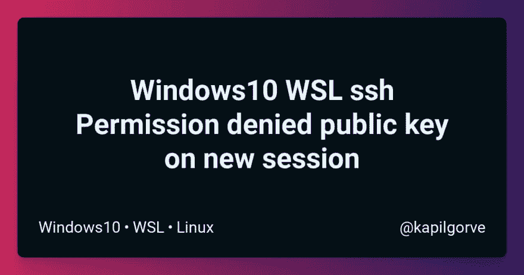

# Windows10 WSL ssh 权限拒绝新会话上的公钥

> 原文：<https://dev.to/kapilgorve/windows10-wsl-ssh-permission-denied-public-key-on-new-session-2i3b>

[](https://res.cloudinary.com/practicaldev/image/fetch/s--ixpJ00b9--/c_limit%2Cf_auto%2Cfl_progressive%2Cq_auto%2Cw_880/https://friendly-heyrovsky-86d9f9.netlify.app/opengraph%3F%26author%3Dkapilgorve%26title%3DWindows10%2520WSL%2520ssh%2520Permission%2520denied%2520public%2520key%2520on%2520new%2520session%26tags%3DWindows10%2CWSL%2CLinux)

问题——当尝试使用 ssh 连接时，WSL shell 无法识别现有的密钥。我不得不在每次会话中手动添加密钥。

TLDR-将您的主机名和密钥添加到~/中。ssh/config

```
Host 49.35.99.253
IdentityFile ~/.ssh/id_work_digitalocean
AddKeysToAgent yes 
```

我使用 WSL 已经很长时间了。大部分只是为了实验目的。

在这个项目的整个技术堆栈中，总有一些东西在 WSL 上无法工作。这就是为什么我只对前端项目使用 Windows，而对后端项目使用安装在其他驱动器上的 Ubunutu。

对于工作，我们使用 DigitalOcean droplets 为客户演示部署项目。直到最近我才开始重视宋承宪。我们正在为客户部署多个单页商业网站。这意味着我必须使用 ssh 密钥连接到 droplets。使用密码变得令人兴奋。所以我换成了 ssh 键。

不过，有一个小问题。它很快变得令人讨厌。

当尝试使用 ssh 连接时，WSL shell 无法识别现有的密钥。我不得不在每次会话中手动添加密钥。

解决方案-在 ssh 配置中添加您的密钥。

首先创建一个配置文件。

```
$ touch ~/.ssh/config 
```

该文件可能不存在。在这种情况下，创建它。如果这个文件存在，跳过这一步。

使用 vim 打开`config`文件。

```
$ vim ~/.ssh/config 
```

输入`i`进入插入模式，以便编辑。添加您的主机名和私钥位置。

```
Host 49.35.99.253
IdentityFile ~/.ssh/id_work_digitalocean
AddKeysToAgent yes 
```

*   输入`ESC`键退出插入模式，按`:wq`保存更改。

现在重新打开 bash 并使用 ssh 连接到您的主机。这次你不需要添加 ssh 密钥了。

祝你在 Windows 上愉快！！！

好玩的事实- `ssh`支持 2018 年登陆`Powershell`。您不再需要使用 bash 来使用 ssh。我在试用新推出的`Windows Terminal`时发现了这一点。

本帖最初发布于[https://www . jskap . com/blog/windows 10-wsl-ssh-permission-denied-new-session/](https://www.jskap.com/blog/Windows10-wsl-ssh-permission-denied-new-session/)

👋嗨！我是卡皮尔。我总是喋喋不休地谈论建造东西，分享我的知识，自由职业。来 https://twitter.com/kapilgorve 和我打招呼吧