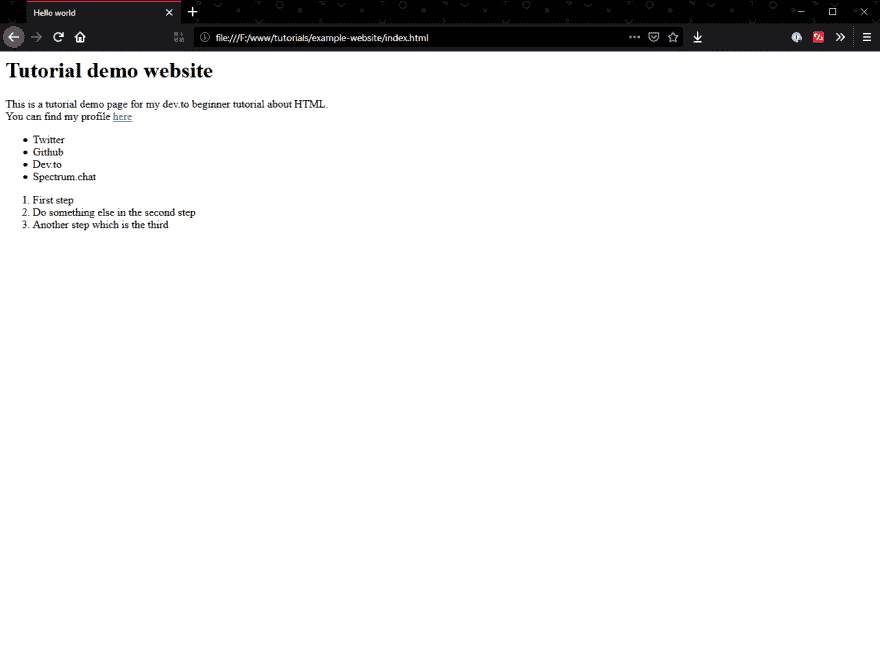
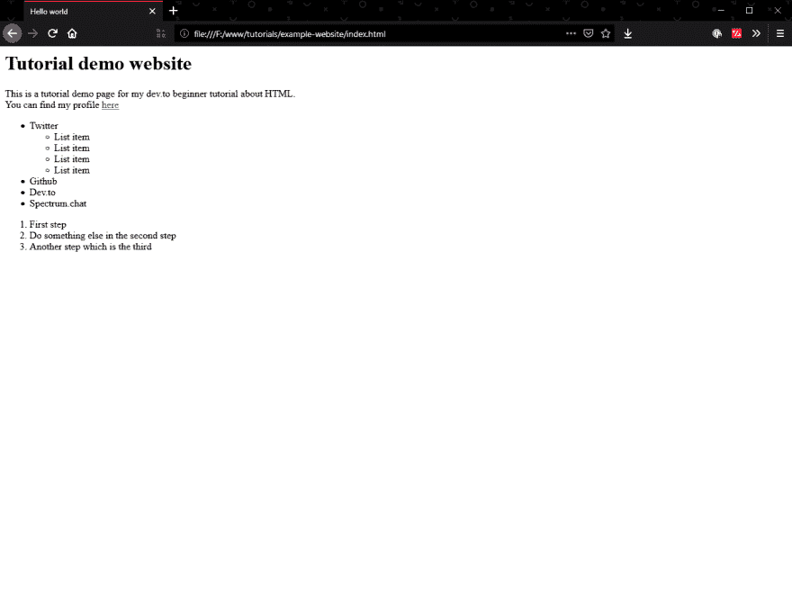
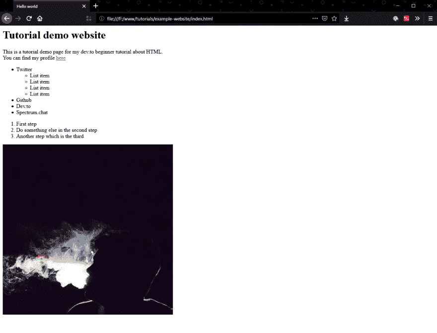
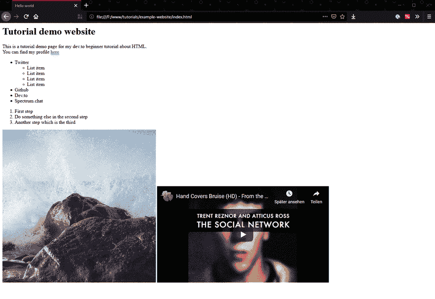

# 初学者网站开发 03 -带来一些行动

> 原文：<https://dev.to/bdbch/webdevelopment-for-beginners-03-bring-in-some-action-2e0b>

嘿，欢迎回到我的网页开发初学者指南。今天我们将学习如何添加图片、列表和 YouTube 视频到我们的页面！

# 列表

所以让我们从最简单的新事物开始学习:**列出**。列表可以在列出内容的任何地方使用。这可能是一个简单的食谱列表、用户列表或导航。

是的，导航也是一个链接列表，所以为你的导航项目使用列表是最好的语义解决方案。

创建列表非常容易。这是两个列表在代码中的样子:

```
<html>
  <head>
    <title>Hello world</title>
  </head>

  <body>
    <h1>Tutorial demo website</h1>
    <p>
      This is a tutorial demo page for my dev.to beginner tutorial about
      HTML.<br />
      You can find my profile
      <a href="https://dev.to/bdbch/" target="_blank">here</a>
    </p>

    <ul>
      <li>Twitter</li>
      <li>Github</li>
      <li>Dev.to</li>
      <li>Spectrum.chat</li>
    </ul>

    <ol>
      <li>First step</li>
      <li>Do something else in the second step</li>
      <li>Another step which is the third</li>
    </ol>
  </body>
</html> 
```

如您所见，我们有三个新标签。`<ul>`、`<ol>`和`<li>`

### `<ul>`:无序列表

`ul`代表无序列表。这意味着我们的列表不会以任何方式进行编号或排序。不是自闭，需要内容。

### `<ol>`:有序列表

`ol`代表有序列表。这意味着我们的列表将以一种逻辑的方式排序。这可能是一个编号列表，或者是一个字母列表。

### `<li>`:列表项

`li`代表列表项，需要建立列表。该元素必须总是在`<ol>`或`<ul>`列表中使用。否则您将无法在列表中创建语义项。

现在我们的网站看起来怎么样？

[](https://res.cloudinary.com/practicaldev/image/fetch/s--3wBFXTXL--/c_limit%2Cf_auto%2Cfl_progressive%2Cq_auto%2Cw_880/https://i.imgur.com/dnJ6ilL.png)

厉害！

### 嵌套列表

您可以将列表嵌套在彼此内部。为此，您需要在一个`<li>`列表元素中创建一个新的`<ul>`或`<ol>`。代码中的嵌套列表如下所示:

```
<ul>
  <li>
    Twitter
    <ul>
      <li>List item</li>
      <li>List item</li>
      <li>List item</li>
      <li>List item</li>
    </ul>
  </li>
  <li>Github</li>
  <li>Dev.to</li>
  <li>Spectrum.chat</li>
</ul> 
```

这将导致类似这样的结果:

[](https://res.cloudinary.com/practicaldev/image/fetch/s--SB8am_b2--/c_limit%2Cf_auto%2Cfl_progressive%2Cq_auto%2Cw_880/https://i.imgur.com/s78Xvi6.png)

正如你所看到的，它的工作与预期的一样。

# 图像

现在变得有趣了。让我们插入一个图像到我们的网站。但是我们如何做到这一点呢？幸运的是，我们有标签`img`供我们使用。img 标签需要一些属性才能正确运行，但是它实际上并没有那么复杂。

让我们看看如何使用图像。我们使用 [unsplash.it](https://picsum.photos/) 来制作我们的图片:

```
 
```

您可以看到我们为 img 标签使用了`src`和`alt`属性。

### `src`

`src`代表源，需要一个有效图像的链接。

### `alt`

`alt`代表备选，表示图像无法加载或某人看不到图像而需要屏幕阅读器时的图像描述。

现在让我们看看页面输出，对吗？

[](https://res.cloudinary.com/practicaldev/image/fetch/s--llknFxQd--/c_limit%2Cf_auto%2Cfl_progressive%2Cq_auto%2Cw_880/https://i.imgur.com/NpT7fYi.png)

不是很难，对吧？

# YouTube 视频嵌入

现在让我们在页面中加入一些动作！我们来嵌入一段 YouTube 上的视频吧！为此，你需要嵌入代码。当你想分享时，你可以在 YouTube 视频上找到它。让我们添加嵌入代码到我们的网站。

```
<iframe width="560" height="315" src="https://www.youtube.com/embed/9SBNCYkSceU" frameborder="0" allow="accelerometer; autoplay; encrypted-media; gyroscope; picture-in-picture" allowfullscreen></iframe> 
```

你可以看到 YouTube 使用了一个名为`<iframe>`的标签。iframe 是一个框架，可以在你的文档中嵌入外部网站。它甚至使用与``标签相同的`src`属性。

宽度和高度是通过宽度和高度属性定义的。所有其他属性都是 iframe 权限的特定属性，以及 iframe 是否可以全屏显示。

现在，如果我们用这个嵌入程序打开我们的网站，它将看起来像这样:

[](https://res.cloudinary.com/practicaldev/image/fetch/s--Bt253fZX--/c_limit%2Cf_auto%2Cfl_progressive%2Cq_66%2Cw_880/https://i.imgur.com/PocMA5F.gif)

所以现在我们在 HTML 文档中有了一个 YouTube 的嵌入式版本，它将在点击时启动。轻松点。

## 结论

既然我们已经讨论了标签和属性，我想是时候建立一个多页面的网站并创建一个导航了。如果你想了解更多，请看下一个帖子！

感谢阅读！