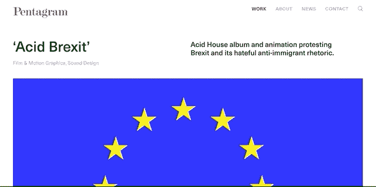
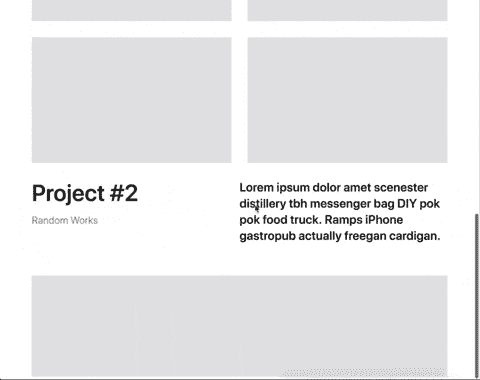
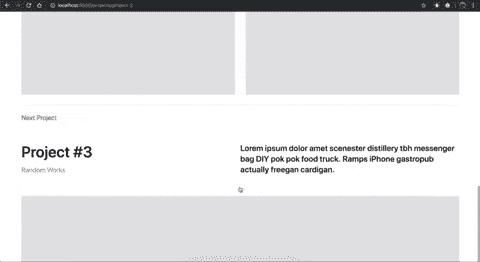
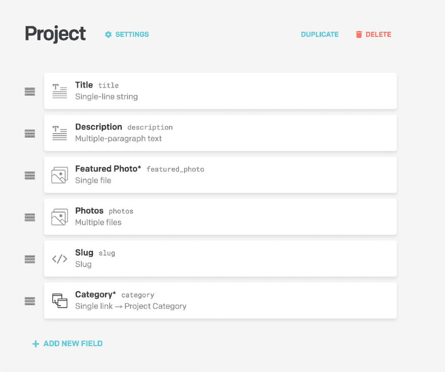
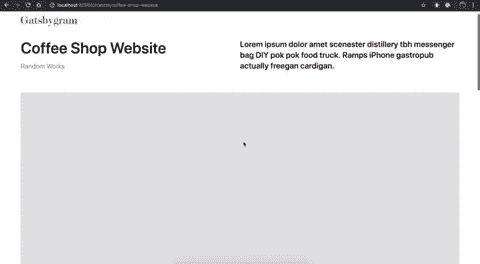

# 五角星形页面过渡——深入了解 Gatsby.js

> 原文：<https://dev.to/mattrothenberg/recreating-pentagram-com-a-deep-dive-with-gatsby-js-h75>

*TL；在这篇博文中，我们用 Gatsby.js 创建了一个简单的五角星形的漂亮投资组合网站。很无头的 CMS。所以做出反应。*

[https://gatsbygram-clone.netlify.com/](https://gatsbygram-clone.netlify.com/)
T3】https://github.com/mattrothenberg/gatsbygram

* * *

有人说“模仿是最真诚的奉承。”

在我作为一名设计师/开发人员的职业生涯中，我试图将模仿作为一种教育工具，解剖、分析和再造对我产生影响的图像、网站和应用程序。

请放心，这不是剽窃他人作品的抽象合理化。相反，我的模仿背后的意图从来都不是把别人的作品冒充成我自己的，而是把这个作品作为灵感和教育的来源。

我提到这个是因为今天我们将“模仿”我在过去几年中见过的一个更聪明的网站的一些细节:[Pentagram.com](https://www.pentagram.com/)。如果你不熟悉五芒星，他们是一家为大客户做杀手级工作的设计公司。

[](https://res.cloudinary.com/practicaldev/image/fetch/s--7-4zEOtN--/c_limit%2Cf_auto%2Cfl_progressive%2Cq_66%2Cw_880/https://i.imgur.com/FS5L02p.gif)

具体来说，我们将使用 [Gatsby](https://gatsbyjs.org) (我们都知道并喜爱的静态站点生成器)，在您从一个项目导航到另一个项目时，重新创建那些漂亮的页面转换，从而学习一些有价值的 Gatsby 技能:

*   从头开始搭建和配置项目
*   用一些最新的热点来设计网站，例如`styled-components`
*   用来自远程源的数据填充站点(例如，无头 CMS)
*   使用 Gatsby 的内置图像组件和插件系统来渲染优化的图像

**公平警告**:我将会分享*很多*的代码。不要觉得你必须一行一行地复制它。我已经尽了最大努力，将我们将在`gatsbygram` [回购](https://github.com/mattrothenberg/gatsbygram)上构建的各种“功能”作为分支，并将包括到相关提交/PRs 和每个部分底部的链接。

## 搭建我们的盖茨比项目

让我们从安装 Gatsby CLI(如果您还没有安装)开始，创建一个新的项目目录，并安装一些依赖项。

```
yarn global add gatsby-cli
mkdir gatsbygram
cd gatsbygram
yarn init
yarn add react-dom react gatsby 
```

从那里，我们可以向我们的`package.json`添加一些脚本，以便在本地运行开发服务器并构建项目。

```
"scripts":  {  "develop":  "gatsby develop",  "serve":  "gatsby serve",  "build":  "gatsby build"  } 
```

## 添加页面

到目前为止，我们的网站还不是很实用。那是因为我们还没有告诉盖茨比要渲染哪些页面。

在盖茨比的土地上，`src/pages`目录是特殊的。这个目录中的 JS 模块代表我们站点上的离散“路线”(例如，`src/pages/index` - >“主页”，`src/pages/about` - >“关于”页面)。

例如，如果我们向`src/pages/index.js`添加一个简单的 React 组件，当我们运行`yarn develop`并访问 [http://localhost:8000](http://localhost:8000) 来加速我们的站点时，我们会看到它被渲染。

```
// src/pages/index.js
import React from 'react'

const Home = () => <div>Hello world</div>

export default Home 
```

然而，对于我们的网站，我们无法预先定义我们的页面。我们的投资组合中的项目都有不同的标题，不同的 slugs，因此我们需要使用一种机制来动态地*生成这些页面。幸运的是，盖茨比为这个问题提供了一个很好的解决方案。输入`gatsby-node.js`。*

 *### 盖茨比-node.js

> Gatsby 为插件和站点构建者提供了许多 API 来控制你的站点。

在`gatsby-node.js`中，我们可以直接与这样的 API 进行交互。出于我们的意图和目的，我们将使用`createPages` API。您可能已经猜到，这个 API 允许我们动态地创建页面(例如，给定我们从远程数据源获取的数据)。

在下一步中，我们将返回到这个文件，实际上从一个这样的远程数据源(DatoCMS)中提取数据，但是现在让我们考虑一个“项目”的模式，并对将驱动我们的投资组合站点的数据结构进行硬编码。为了让网站尽快建立起来，我们也要保持简单。

```
// gatsby-node.js
const projects = [
  {
    title: 'Project #1',
    slug: 'project-1',
  },
  {
    title: 'Project #2',
    slug: 'project-2',
  },
  // etcetera
] 
```

完成存根项目数据集后，让我们深入了解一下`createPages`函数实际上是如何工作的。

文件: [`gatsby-node.js`](https://github.com/mattrothenberg/gatsbygram/blob/d1b5a959945a3a22a187eb4937b56b0f4c45a8e2/gatsby-node.js)

你会注意到我们已经析构了传递给`createPages`的参数，挑选出一个`actions`对象，它本身包含一个`createPage`(单数)函数。这个函数将执行将我们的存根项目数据集翻译成实际页面的魔术。

实际上，`createPage`需要几个值来执行这样的转换。

1.  您试图构建的页面的`path`(例如`/projects/project-1`)。
2.  当用户访问这个路径时我们想要呈现的`component`(把它想象成一个“模板”,我们将把项目数据放入其中)。
3.  将被传入该组件的`context`或道具。

例如，它可能看起来像这样...

```
// The path to our template component
const projectTemplate = path.resolve(`./src/templates/project.js`)

projects.forEach(project => {
  // Rudimentary way to get the "next" project so we can show a preview at the bottom of each project
  const next = projects[index === projects.length - 1 ? 0 : index + 1]

  createPage({
    path: `/projects/${project.slug}`,
    component: projectTemplate,
    context: {
      ...project,
      next,
    },
  })
}) 
```

...其中我们的`component`，或者说模板，是另一个简单的 React 组件。

```
import React from 'react'

const Project = ({ pageContext: project }) => <div>{project.title}</div>

export default Project 
```

随着我们的`createPages`脚本准备就绪，我们可以重启开发服务器(通过`yarn develop`)并导航到[http://localhost:8000/projects/project-1](http://localhost:8000/projects/project-1)。丑陋，但它肯定能完成任务。

我们现在有了动态生成的页面！是时候让项目页面变得生动了。

# [ 壮举:动态生成项目页面 #1](https://github.com/mattrothenberg/gatsbygram/pull/1) 

[](https://github.com/mattrothenberg) **[mattrothenberg](https://github.com/mattrothenberg)** posted on [<time datetime="2019-07-20T00:18:23Z">Jul 20, 2019</time>](https://github.com/mattrothenberg/gatsbygram/pull/1)[View on GitHub](https://github.com/mattrothenberg/gatsbygram/pull/1)

## 视觉&交互设计

开始有趣的部分！在这一节中，我们将安装和配置我们的工具集来设计我们的网站。

就个人而言，我是 [Rebass](https://rebassjs.org/) 和[风格组件](https://www.styled-components.com)的超级粉丝。让我们安装这些依赖项。

```
yarn add rebass gatsby-plugin-styled-components styled-components babel-plugin-styled-components 
```

您会注意到其中一个依赖项是`gatsby-plugin-styled-components`。Gatsby 的另一个伟大特性是它的一流插件 API，开发者可以通过它来扩展这个库的核心功能。在这里，我稍微挥了一下手，我们正在添加一些代码，添加对`styled-components`的配置和支持。但是安装依赖项只是这个过程中的一步。我们需要让盖茨比知道使用它。

输入`gatsby-config.js`。

### 盖茨比-config.js

这是另一个“神奇的”配置文件(正如我们在上一步中看到的)，但本质上它是我们的 Gatsby 站点正在使用的所有插件的清单。我们在这里需要做的就是指定我们的插件，然后继续前进。

```
module.exports = {
  plugins: [`gatsby-plugin-styled-components`],
} 
```

### 布局

如今，大多数网站都采用熟悉的组织结构，将任意的“主要内容”夹在页眉和页脚之间。

```
// Layout.jsx
const Layout = () => (
  <>
    <Header />
    {
      // main content
    }
    <Footer />
  </>
) 
```

我们将遵循类似的模式，但有两个具体原因——

1.  我们的视觉/交互设计要求我们在项目页面之间有一个共同的`Header`
2.  我们需要一个组件，它用我们站点的主题初始化`styled-components`，并将主题信息向下传递给它的孩子。

因此，让我们修改上面的手动波浪`Layout.jsx`示例—

```
import React from 'react'
import { ThemeProvider } from 'styled-components'
import { Box } from 'rebass'

// A very simple CSS reset
import '../style/reset.css'

const theme = {
  fonts: {
    sans: 'system-ui, sans-serif',
  },
  colors: {
    grey: '#999',
    black: '#1a1a1a',
    red: '#e61428',
  },
}

const Layout = ({ children }) => (
  <ThemeProvider theme={theme}>
    <React.Fragment>
      <Box as="header">silly header</Box>
      <Box as="main">{children}</Box>
    </React.Fragment>
  </ThemeProvider>
)

export default Layout 
```

至于我们的`theme`，我浏览了一下五角星的网站，找出了一些设计细节

*   他们使用漂亮的 [Neue Haas Grotesk](http://www.fontbureau.com/nhg/) 字体，但是我们将使用系统字体。
*   他们网站上唯一真正的“颜色”是`black`、`grey`和`red`。照片本身传达了大部分的视觉复杂性。

### 项目头组件

五角星网站上的每个项目页面似乎都有如下结构—

```
const Project = () => (
  <>
    {/* Title + description + category + hero image */}
    <ProjectHeader />

    {/* Photo grid */}
    <ProjectPhotos />

    {/* Title + description + category + truncated preview of hero image of NEXT project */}
    <ProjectHeader truncated />
  </>
) 
```

注意`ProjectHeader`出现了两次*。你可能会问，为什么它会出现两次？嗯，为了方便你点击下一个项目的预览时得到的可爱的页面转换(在任何项目页面的底部)。我们一会儿将进入这个转变的细节，但是现在，让我们注意我们的`ProjectHeader`将需要生活在两个状态中——*

 *1.  项目的`title`、`description`、`category`和`hero`图像可见的默认状态。
2.  一个`truncated`状态，其中我们隐藏了`hero`图像的一个很好的部分，作为列表中下一个项目的预告。

我在想我们的`ProjectHeader`组件应该是这样的。我们将利用来自`rebass`的`Flex`和`Box`助手组件，并使用`styled-components`为页面上相应的排版元素赋予一些视觉样式(例如，字体粗细、字体大小和颜色)。

```
const ProjectHeader = ({ project, truncated }) => (
  <Box>
    <Flex>
      <Box>
        title goes here
        <Box>
          <Category as="h3">category goes here</Category>
        </Box>
      </Box>
      <Box>
        <Box>
          <Description as="h2">description goes here...</Description>
        </Box>
      </Box>
    </Flex>
    <Hero truncated={truncated} />
  </Box>
) 
```

但是，请注意，我们一直将我们的`truncated`属性传递给了`Hero`组件，现在，它以 8:5 的纵横比呈现了一个灰色框。向下传递这个道具允许我们在前面提到的两种状态下渲染我们的`ProjectHeader`，默认和“截断”

```
const HeroWrap = styled(Box)` ${props =>
    props.truncated &&
    css`
      max-height: 200px;
      overflow: hidden;
    `} `

const Hero = ({ truncated }) => (
  <HeroWrap mt={[4, 5]} truncated={truncated}>
    <AspectRatioBox ratio={8 / 5} />
  </HeroWrap>
) 
```

请放心，我们将在教程的后面回来调整这个组件。不过现在，我们已经有了开始行动所需的东西。

相关提交: [`7f0ff3f`](https://github.com/mattrothenberg/gatsbygram/commit/7f0ff3fc901479c3c0491d8a01c95e949492623b)

### 项目内容

夹在两个`ProjectHeader`组件之间的是项目内容！

鉴于我们目前没有任何“真实的”项目数据，我们将完全伪造这一部分。我们将这样连接一个漂亮的占位框网格。

```
import React from 'react'
import { Box } from 'rebass'
import styled from 'styled-components'

import AspectRatioBox from './aspect-ratio-box'

const Grid = styled(Box)`
  display: grid;
  grid-template-columns: repeat(2, 1fr);
  grid-gap: ${props => props.theme.space[4]}px;
`

const ProjectContent = () => (
  <Box my={4}>
    <Grid>
      <AspectRatioBox ratio={8 / 5} />
      <AspectRatioBox ratio={8 / 5} />
      <AspectRatioBox ratio={8 / 5} />
      <AspectRatioBox ratio={8 / 5} />
    </Grid>
  </Box>
)

export default ProjectContent 
```

还不错！

让我们回到我们的`Project`模板组件，添加这些元素，并提交它。

```
const Project = ({ pageContext: project }) => (
  <Layout>
    <ProjectHeader project={project} />
    <ProjectContent />
    <ProjectHeader project={project.next} truncated />
  </Layout>
) 
```

* * *

# [ 专长:设计实施项目页面 #2](https://github.com/mattrothenberg/gatsbygram/pull/2) 

[](https://github.com/mattrothenberg) **[mattrothenberg](https://github.com/mattrothenberg)** posted on [<time datetime="2019-07-20T13:05:35Z">Jul 20, 2019</time>](https://github.com/mattrothenberg/gatsbygram/pull/2)[View on GitHub](https://github.com/mattrothenberg/gatsbygram/pull/2)

## 过渡

虽然我们还有很多事情要做，但让我们从有趣的部分开始:实现我们在五角星网站上看到的页面过渡。

[](https://res.cloudinary.com/practicaldev/image/fetch/s--7-4zEOtN--/c_limit%2Cf_auto%2Cfl_progressive%2Cq_66%2Cw_880/https://i.imgur.com/FS5L02p.gif)

在深入到代码方面之前，让我们试着找出在这个转换过程中到底发生了什么。

1.  `ProjectContent`相对快速地淡出(几百个`ms`)。
2.  在内容淡出之后，下一个项目被截断的`ProjectHeader`滑动到页面的“顶部”,有效地过渡到即将加载的页面的`ProjectHeader`。

很简单，对吧？魔鬼当然在细节中😈。

但幸运的是，许多艰苦的工作已经为我们做了。让我们使用一个名为 [`gatsby-plugin-transition-link`](https://transitionlink.tylerbarnes.ca/docs/) 的神奇库，它:

> [提供]通过链接组件上的属性描述页面转换的简单方法。对于进入和退出页面，您可以指定一些计时值，将状态传递给两个页面，并为每个页面触发一个函数。

```
yarn add gatsby-plugin-transition-link 
```

正如我们之前看到的，让我们将这个插件添加到我们的`gatsby-config.js`

```
module.exports = {
  plugins: [`gatsby-plugin-styled-components`, `gatsby-plugin-transition-link`],
} 
```

现在，为了开始使用这个库，我们需要对我们的`Project`模板组件做一些修改。

事实上，这个过渡插件的工作方式是它公开了一个`TransitionLink`组件，我们可以用它来代替 Gatsby 的内置`Link`组件(它有一些神奇的能力，但有效地提供了一种在页面之间路由的机制)。

```
import TransitionLink from 'gatsby-plugin-transition-link'

const Project = ({ pageContext: project }) => {
  const nextProjectUrl = `/projects/${project.next.slug}`

  return (
    <Layout>
      <ProjectHeader project={project} />
      <ProjectContent />
      <TransitionLink to={nextProjectUrl}>
        <ProjectHeader project={project.next} truncated />
      </TransitionLink>
    </Layout>
  )
} 
```

请注意，通过将我们的`ProjectHeader`组件包装在`TransitionLink`中，我们已经有效地将它变成了我们投资组合中下一个项目的超链接。而且很管用！但它肯定不会触发我们在上面的 GIF 中看到的漂亮的页面过渡。为此，我们需要一些其他工具。

我们首先需要的是来自`gatsby-plugin-transition-link`的另一个组件:TransitionState。

简而言之，这个组件所做的是公开一个描述转换当前处于什么状态的属性:T1、T2、T3 或 T4。这很有用，因为它给了我们需要的信息来*声明*我们的转换应该如何工作。虽然这个插件也公开了以更为*命令性的*方式执行转换的钩子(例如，使用类似`gsap`的库)，但是我更喜欢这种声明性的方法，原因将在接下来的几个步骤中变得清楚。

让我们以下面的方式重构我们的`Project`模板组件，以便开始使用这些数据。

1.  将模板的表示元素移动到功能组件中，`ProjectInner`
2.  引入`<TransitionState>`，它将一个“函数作为子函数”并传递给它一个描述转换在其生命周期中所处位置的`transitionStatus`属性。

```
const ProjectInner = ({ transitionStatus, project }) => {
  const nextProjectUrl = `/projects/${project.next.slug}`
  return (
    <Layout>
      <ProjectHeader project={project} />
      <ProjectContent />
      <TransitionLink to={nextProjectUrl}>
        <ProjectHeader project={project.next} truncated />
      </TransitionLink>
    </Layout>
  )
}

const Project = ({ pageContext: project }) => {
  return (
    <TransitionState>
      {({ transitionStatus }) => (
        <ProjectInner transitionStatus={transitionStatus} project={project} />
      )}
    </TransitionState>
  )
} 
```

就这样，我们的`ProjectInner`现在可以使用`transitionStatus`道具来*声明*我们在本节开始时概述的过渡步骤(例如，淡化内容，滑动标题)。

如前所述，我是*声明式*思维定势的忠实粉丝，这种思维定势会推动你前进。从`jQuery`的时代开始，我们强制性地告诉我们的程序这里的`addClass`，或者那里的`fadeOut`，React 的方法声明我们想要做的事情，并让库处理剩下的事情，这是一股新鲜空气。

也就是说，声明式风格也可能完全令人迷惑，尤其是在动画方面。如果你和我一样，你可能已经从 Greensock 图书馆用类似`TweenMax`的工具学习了动画。总的来说，`TweenMax`遵循了一种非常*必要的*(当然也是强大的)方法。例如，我们可以用如下代码实现我们的转换:

```
// Fade out the main content
TweenMax.to(mainContentEl, 1, { opacity: 0 })

// Slide up the header
TweenMax.to(nextHeaderEl, 1, { y: nextYPos, delay: 250 })

// Profit 😎 
```

今天，我们将避开这种方法，转而采用声明式方法。为此，我们将使用我最喜欢的 React 库之一， [`Pose`](https://popmotion.io/pose/) 。

需要我们用下面的 API 来“声明”我们的转换。

```
const FadingBox = posed.div({
  visible: { opacity: 1 },
  hidden: { opacity: 0 },
}) 
```

然后我们可以像使用任何其他 React 组件一样使用`FadingBox`。不同的是，`FadingBox`公开了一个`pose`属性，我们可以将一个字符串值传递给它。如果该字符串值与姿势实例中定义的关键点之一匹配(在本例中为`visible`或`hidden`)，组件将自动触发到该特定状态的转换。

```
<!-- Now you see me 👀 -->
<FadingBox pose="visible" />

<!-- Now you don't 🙈 -->
<FadingBox pose="hidden" /> 
```

那我为什么要给你这些背景资料呢？嗯，你可能记得我们现在在我们的`ProjectInner`组件中有一个特殊的`transitionStatus`道具，它有效地*声明*我们的转换处于什么状态。让我们用这个道具来实现我们过渡的第一步，淡出主要内容。

我们要做的第一件事是构建我们的`Pose`实例。

```
// Transition to {opacity: 0} when pose === 'exiting'
const FadingContent = posed.div({
  exiting: { opacity: 0 },
}) 
```

然后我们将在实例中包装当前项目的标题和内容。

```
<FadingContent pose={transitionStatus}>
  <ProjectHeader project={project} />
  <ProjectContent />
</FadingContent> 
```

但是你会注意到实际上什么也没有发生。这是因为我们需要告诉我们的`TransitionLink`组件我们各自的`entry`和`exit`转换需要多长时间，以及描述当这些转换开始和结束时我们希望发生什么。

```
// For now, let's use this as a magic number that describes how long our transition should take
const TRANSITION_LENGTH = 1.5

const exitTransition = {
  length: TRANSITION_LENGTH, // Take 1.5 seconds to leave
  trigger: () => console.log('We are exiting'),
}

const entryTransition = {
  delay: TRANSITION_LENGTH, // Wait 1.5 seconds before entering
  trigger: () => console.log('We are entering'),
}

// Let's pass these hooks as props to our TransitionLink component
<TransitionLink
  to={nextProjectUrl}
  exit={exitTransition}
  entry={entryTransition}
/> 
```

保存并刷新浏览器。祝贺您，您刚刚实现了第一个(尽管是 janky)转换！

[](https://i.giphy.com/media/VfEWTnSrIliuN43Q7h/giphy.gif)

让我们继续下一个过渡，这无疑是一个*小*有点棘手。首先，我们需要删除`TransitionLink`添加到页面底部的`ProjectHeader`的`text-decoration`样式，因为这个标题看起来*应该和上面的*一模一样，除了被截断的英雄图像。

```
<TransitionLink
  style={{
    textDecoration: 'none',
    color: 'inherit',
  }}
/> 
```

接下来，让我们为滑动的`<ProjectHeader />`定义我们的`pose`。

```
const SlidingHeader = posed.div({
  exiting: {
    y: ({ element }) => {
      // This is an alternative API that allows us to dynamically generate a "y" value.

      // When scrolling back to the top, how far should we actually go? Let's factor the height of our site's header into the equation.
      const navbar = document.querySelector('header')
      const navbarDimensions = navbar.getBoundingClientRect()
      const distanceToTop =
        element.getBoundingClientRect().top - navbarDimensions.height

      // And return that aggregate distance as the dynamic "y" value.
      return distanceToTop * -1
    },
    transition: {
      ease: [0.59, 0.01, 0.28, 1], // Make the transition smoother
      delay: 250, // Let's wait a tick before starting
      duration: TRANSITION_LENGTH * 1000 - 250, // And let's be sure not to exceed the 1.5s we have allotted for the entire animation.
    },
  },
}) 
```

在那个代码块中发生了很多事情。这里的要点是，您可以动态地生成您的`Pose`转换状态。您不需要硬编码这些值，尤其是如果您需要在触发转换之前执行某种计算(比如我们的`distanceToTop`)。

不过，我们还需要施一些其他的咒语。

首先，让我们把截断的`ProjectHeader`放在新创建的姿势中。

```
<SlidingHeader pose={transitionStatus}>
  <ProjectHeader project={project.next} truncated={shouldTruncate} />
</SlidingHeader> 
```

您会注意到，我们现在传递的是一个名为`shouldTruncate`的变量，而不是为`truncated`硬编码一个真值。我们这样做是因为现在，一旦我们进入下一页，我们只想截断下一个项目*的英雄图像。对于过渡的持续时间，我们希望显示被截断的内容，因为它给过渡一种自然的感觉。* 

```
const shouldTruncate = ['entering', 'entered'].includes(transitionStatus) 
```

最后，我们需要在我们的`TransitionLink`组件中添加*几个*小的命令性细节(伪君子，我知道),以便平滑实际的转换。

```
const exitTransition = {
  length: TRANSITION_LENGTH,
  trigger: () => {
    if (document) {
      // Preventing overflow here make the animation smoother IMO
      document.body.style.overflow = 'hidden'
    }
  },
}

const entryTransition = {
  delay: TRANSITION_LENGTH,
  trigger: () => {
    if (document && window) {
      // Ensuring we're at the top of the page when the page loads
      // prevents any additional JANK when the transition ends.
      window.scrollTo(0, 0)
      document.body.style.overflow = 'visible'
    }
  },
} 
```

现在我们有了。

[](https://i.giphy.com/media/gjCz97t28j8FYJdRtl/giphy.gif)

# [ 专长:添加页面转场 #3](https://github.com/mattrothenberg/gatsbygram/pull/3) 

[](https://github.com/mattrothenberg) **[mattrothenberg](https://github.com/mattrothenberg)** posted on [<time datetime="2019-07-20T16:15:09Z">Jul 20, 2019</time>](https://github.com/mattrothenberg/gatsbygram/pull/3)[View on GitHub](https://github.com/mattrothenberg/gatsbygram/pull/3)

## 添加上光剂

在我们匆忙添加这些漂亮的页面过渡时，我们忽略了一些设计细节。

*   我们的`<header>`太小，当页面加载时没有淡入，并且仍然有文本“愚蠢的标题”🙈
*   我们省略了截断页脚上方的“下一个项目”标题，该标题在过渡开始时会消失。

### 标志&表头过渡

让我们在`/src/components/logo.svg`中给我们的项目添加一个廉价恐怖的五角星标志副本(抱歉，五角星)。然后我们可以导入它并将其添加到我们的`Layout`组件中。虽然我们在那里，但是，让我们继续装配另一个 Pose 实例，以便我们可以在页面过渡时淡出&中的标题。

```
import { Box, Image } from 'rebass'

const FadingHeader = posed.header({
  exiting: { opacity: 0 },
  exited: { opacity: 0 },
  entering: { opacity: 1 },
  entered: { opacity: 1 },
})

const Layout = ({ children, transitionStatus }) => (
  <ThemeProvider theme={theme}>
    <React.Fragment>
      <FadingHeader pose={transitionStatus}>
        <Box px={[3, 5]} py={4}>
          <Image src={Logo} alt="Gatsbygram Logo" height={32} />
        </Box>
      </FadingHeader>
      <Box as="main" px={[3, 5]}>
        {children}
      </Box>
    </React.Fragment>
  </ThemeProvider>
) 
```

稍等...`transitionStatus`是如何成为这个组件的道具的？还记得我们如何在`Project`组件模板中使用`Layout`组件吗？从那里，我们可以简单地把这个值作为道具传递下去，让`Layout`用它做它想做的任何事情。

```
<Layout transitionStatus={transitionStatus}>project content goes here</Layout> 
```

### 【下一个项目】标题和过渡

既然我们是经验丰富的过渡专家，让我们通过在截短的`ProjectHeader`之上添加额外的设计元素来展示我们的技能。

```
// next-project-heading.jsx

import React from 'react'
import { Box, Text } from 'rebass'
import styled from 'styled-components'

const Heading = styled(Text)`
  color: ${props => props.theme.colors.red};
  font-family: ${props => props.theme.fonts.sans};
  font-size: ${props => props.theme.fontSizes[3]}px;
  font-weight: normal;
`

const Rule = styled.hr`
  background: #e3e4e5;
  height: 1px;
  border: 0;
`

const NextProjectHeading = () => (
  <Box mb={5}>
    <Rule />
    <Heading pt={3}>Next Project</Heading>
  </Box>
)

export default NextProjectHeading 
```

最后，让我们将它放入我们的`Project`模板组件中。

```
const FadingNextProjectHeading = posed.div({
  exiting: { opacity: 0 },
})

<TransitionLink
  style={{
    textDecoration: 'none',
    color: 'inherit',
  }}
  to={nextProjectUrl}
  exit={exitTransition}
  entry={entryTransition}
>
  <FadingNextProjectHeading pose={transitionStatus}>
    <NextProjectHeading />
  </FadingNextProjectHeading>
  <SlidingHeader pose={transitionStatus}>
    <ProjectHeader project={project.next} truncated={shouldTruncate} />
  </SlidingHeader>
</TransitionLink> 
```

[](https://i.giphy.com/media/VdJWm6LRWX5i0eBMej/giphy.gif)

# [ 专长:设计增强 #4](https://github.com/mattrothenberg/gatsbygram/pull/4) 

[](https://github.com/mattrothenberg) **[mattrothenberg](https://github.com/mattrothenberg)** posted on [<time datetime="2019-07-20T16:44:21Z">Jul 20, 2019</time>](https://github.com/mattrothenberg/gatsbygram/pull/4)[View on GitHub](https://github.com/mattrothenberg/gatsbygram/pull/4)

## 通过 DatoCMS 远程数据

目前我最喜欢的一个 CMS 是 [DatoCMS](https://datocms.com) 。你可能会问，为什么？

1.  他们有一个慷慨的免费层。
2.  他们有一个一流的 Gatsby 插件(用于数据源)。
3.  兼容[盖茨比预告](https://www.gatsbyjs.org/blog/2018-07-17-announcing-gatsby-preview/)

有了免费帐户，我们将能够用来自无头 CMS 的*实际*数据替换硬编码的项目数据集！

一旦创建了您的帐户，登录并创建一个`Project`模型，其模式如下所示。

```
const project = {
  title: 'single-line-string',
  description: 'multiple-paragraph-text',
  featuredPhoto: 'single-file',
  photos: 'multiple-files',
  slug: 'seo',
  category: 'link',
} 
```

[](https://res.cloudinary.com/practicaldev/image/fetch/s--_IjaaJmH--/c_limit%2Cf_auto%2Cfl_progressive%2Cq_auto%2Cw_880/https://thepracticaldev.s3.amazonaws.com/i/yag4d8z6rflb06ftha7p.png)

有了模型之后，继续添加几个不同的项目。他们不需要完美。只需添加几个，确保指定标题、描述、类别，并添加照片。

一旦您添加了一些项目，我们就可以将注意力转移到用这些远程数据构建 Gatsby 站点上。

```
yarn add gatsby-source-datocms gatsby-transformer-sharp gatsby-plugin-sharp gatsby-image 
```

现在，在我们进入`gatsby-config.js`添加这个插件之前，我们需要将一个`.env.development`和`.env.production`文件添加到我们的根目录，并确保这些文件在版本控制中被*忽略*(这样我们就不会意外地向外界泄露我们的 DatoCMS 凭证)。继续获取您的 Dato API 密钥以及您的站点 URL，并将这些值添加到您创建的相应的`.env`文件中。目前，这些凭证对于开发和生产都是相同的，但是您总是可以生成单独的凭证。

```
DATO_API_TOKEN="" 
```

然后，在`gatsby-config.js`的顶部，让我们要求`dotenv`库，以便这些环境变量被拉入内存并在模块中可用。

```
require('dotenv').config({
  path: `.env.${process.env.NODE_ENV}`,
})

module.exports = {
  plugins: [
    `gatsby-transformer-sharp`, // for eventual image manipulation
    `gatsby-plugin-sharp`, // for eventual image manipulation
    {
      resolve: `gatsby-source-datocms`,
      options: {
        apiToken: process.env.DATO_API_TOKEN,
        apiUrl: 'https://site-api.datocms.com',
      },
    },
    ...etcetera,
  ],
} 
```

现在，下次运行`yarn develop`时，要特别注意显示为
的输出

```
View GraphiQL, an in-browser IDE, to explore your site's data and schema
⠀
  http://localhost:8000/___graphql 
```

Gatsby 附带了一个内置的 GraphQL explorer(包含各种好东西，包括一个杀手级的自动完成功能)，我们可以用它来构建一个获取项目数据的查询。将下面的查询抛到左边，您会看到 DatoCMS 数据出现在您的眼前！

```
{  projects:  allDatoCmsProject  {  edges  {  node  {  title  slug  }  next  {  title  slug  }  }  }  } 
```

但是我们的网站还没有使用这些数据来动态创建我们的项目页面。为了连接起来，我们需要回到`gatsby-node.js`并做一些调整。

首先，让我们将`graphql`析构为`createPages`方法的附加参数。

```
exports.createPages = async ({ graphql, actions }) => {} 
```

然后，让我们迭代并将上面的 GraphQL 查询保存为一个局部变量。请注意，我们没有为每个项目提取*所有*信息(例如，描述、特色照片等？).我非常支持将这种数据获取推迟到我们的`Project`组件模板中。稍后会有更多的介绍。

```
const query = `{
  projects:allDatoCmsProject {
    edges {
      node {
        title
        slug
        description
      }
      next {
        title
        slug
      }
    }
  }
}` 
```

最后，让我们实际运行 Graphql 查询并调整页面创建逻辑，以适应 DatoCMS 返回的数据的新形状/结构。

```
// Run the query
const result = await graphql(query)

// Abort if there were errors
if (result.errors) {
  throw new Error(result.errors)
}

const projects = result.data.projects.edges

const createProjectPage = project => {
  // Our GraphQL response actually tells us what the "next" node is, which is great! In the case of the last project in the list, let's default "next" to the very first project so we have a nice "carousel" of projects on our site.
  const next = project.next || projects[0].node

  createPage({
    path: `/projects/${project.node.slug}`,
    component: projectTemplate,
    context: {
      nextSlug: next.slug,
      ...project.node,
    },
  })
}

projects.forEach(createProjectPage) 
```

如果一切顺利的话，运行应该没有错误，您应该能够打开浏览器进入[http://localhost:8000/projects/slug](http://localhost:8000/projects/SLUG)，其中 SLUG 是 DatoCMS 根据您的项目标题自动生成的 SLUG 之一。

[](https://i.giphy.com/media/S5cUCPnaJQ9RGr1SI1/giphy.gif)

我们非常接近终点线了！但是我们仍然需要获取项目的剩余细节。出发去`Project`组件模板吧！

您可能会问，“等等，为什么我们不直接在这里获取所有的数据”？在我看来，有一个比`gatsby-node.js`更好的地方来获取我们的项目数据。事实上，这个文件更多的是为了构建我们网站的“边缘”,枚举不同页面的内容，而不需要获取*我们需要的每个页面的所有*数据。把我们刚刚做的想象成构建我们网站的“外壳”。从这里，我们可以返回到我们的`Project`模板组件，并获取我们需要的东西来使这个页面变得生动。

在`project.js`中，我们继续导入盖茨比的内置`graphql`函数。在文件的底部，让我们继续编写+导出另一个查询，以获得我们需要的剩余数据。

```
import { graphql } from 'gatsby'

// component boilerplate
export const query = graphql`
  query($slug: String!, $nextSlug: String!) {
    project: datoCmsProject(slug: { eq: $slug }) {
      description
      category {
        title
      }
      featuredPhoto {
        fluid {
          ...GatsbyDatoCmsFluid
        }
      }
      photos {
        fluid {
          ...GatsbyDatoCmsFluid
        }
      }
    }
    next: datoCmsProject(slug: { eq: $nextSlug }) {
      title
      slug
      description
      category {
        title
      }
      featuredPhoto {
        fluid {
          ...GatsbyDatoCmsFluid
        }
      }
    }
  }
` 
```

几个音符。

*   我撒谎了。我们实际上正在编写两个查询。一个获取当前项目的所有数据，另一个获取渲染队列中的下一个项目所需的信息。注意这些查询是如何分别用`project:`和`next:`作为别名的？
*   `GatsbyDatoCmsFluid`是来自`gatsby-source-datocms`的 GraphQL 片段(实际上是查询逻辑的共享部分)。这个片段返回一个对象，该对象无缝地嵌入 Gatsby 的负责渲染图像的`Img`组件。你可能会问，为什么要使用这个库？良好的...

> 它将 Gatsby 的本地图像处理能力与高级图像加载技术相结合，轻松而全面地优化您的站点的图像加载。gatsby-image 使用 gatsby-plugin-sharp 来支持其图像转换。

因此，我们已经导出了这个冗长的 GraphQL 查询，但是仍然没有任何反应！这是因为在引擎盖下，Gatsby 正在将一个`data`道具注入到我们的页面组件`project.js`中，但是我们实际上并没有用它做任何事情。让我们继续建立一个真正的`project`——充满来自我们远程数据管理系统的数据——并将这个传递给`ProjectInner`*。* 

```
const Project = ({ pageContext: projectShell, data }) => {
  const { project, next } = data // GraphQL results
  const aggregateProject = {
    ...projectShell,
    ...project,
    next,
  }

  return (
    <TransitionState>
      {({ transitionStatus }) => (
        <ProjectInner
          transitionStatus={transitionStatus}
          project={aggregateProject}
        />
      )}
    </TransitionState>
  )
} 
```

鉴于我们的`project`数据结构已经改变，我们需要相应地重构一些表示组件。先从`ProjectHeader`说起吧。

之前，我们硬编码了`category`、`description`和`hero`图像。对于前两个值，我们可以简单地从我们的`project`道具中选取字段，例如

```
<Category as="h3">{project.category.title}</Category> 
```

然而，对于我们的`hero`图像，我们实际上需要传递`project.featuredPhoto`作为道具，并利用`gatsby-image`库中的`Img`组件来呈现实际的图像。

```
const Hero = ({ photo, truncated }) => {
  return (
    <HeroWrap mt={[4, 5]} truncated={truncated}>
      <AspectRatioBox ratio={8 / 5}>
        
      </AspectRatioBox>
    </HeroWrap>
  )
} 
```

我们需要修复的下一个组件是`ProjectContent`，因为它目前被硬编码为返回 8:5 占位符的网格。我们需要将`project.photos`作为道具传递，迭代集合，并相应地呈现`Img`组件。

```
const ProjectContent = ({ photos }) => {
  return (
    <Box my={4}>
      <Grid>
        {photos.map((photo, index) => {
          return (
            <AspectRatioBox key={index} ratio={8 / 5}>
              
            </AspectRatioBox>
          )
        })}
      </Grid>
    </Box>
  )
} 
```

就这样，我们的项目页面完成了。

# [ 专长:添加 Dato CMS  #5](https://github.com/mattrothenberg/gatsbygram/pull/5) 

[](https://github.com/mattrothenberg) **[mattrothenberg](https://github.com/mattrothenberg)** posted on [<time datetime="2019-07-20T22:50:59Z">Jul 20, 2019</time>](https://github.com/mattrothenberg/gatsbygram/pull/5)[View on GitHub](https://github.com/mattrothenberg/gatsbygram/pull/5)

## 添加首页

我们网站缺少的一个东西是一个列出所有项目的漂亮主页。幸运的是，在这一点上，我们是盖茨比专家，应该没有问题为此建立一个主页。

让我们从编写一个 GraphQL 查询开始，它将获取我们需要的所有数据。

```
export const query = graphql`
  {
    projects: allDatoCmsProject {
      edges {
        node {
          slug
          title
          featuredPhoto {
            fluid {
              ...GatsbyDatoCmsFluid
            }
          }
        }
      }
    }
  }
` 
```

然后就是简单地迭代我们的数据集，并在页面上呈现一些项目！

```
const Home = ({ data }) => {
  const projects = data.projects.edges
  return (
    <Layout>
      <Grid>
        {projects.map(project => (
          <ProjectGridItem key={project.node.title} project={project.node} />
        ))}
      </Grid>
    </Layout>
  )
} 
```

```
const ProjectGridItem = ({ project }) => {
  return (
    <AniLink
      style={{ textDecoration: 'none' }}
      fade
      to={`/projects/${project.slug}`}
      duration={0.2}
    >
      <Box>
        
        <Box mt={3}>
          <Description>{project.title}</Description>
        </Box>
      </Box>
    </AniLink>
  )
} 
```

这一次，我选择使用来自`gatsby-plugin-transition-link`的`AniLink`组件。

> AniLink 是 TransitionLink 组件的包装器，提供了四种默认的过渡:淡入淡出、颜料滴落、滑动和覆盖。

在引擎盖下，它使用 [`gsap`](https://greensock.com/gsap) 来执行实际的过渡。

如果你想在你的网站上添加简单的页面过渡(或者至少是它的某些部分)，我绝对推荐使用`AniLink`而不是`TransitionLink`。

提交:[https://github . com/mattrothenberg/Gatsby gram/commit/ffd cc 67 ad 1 aa 02 f 2d 6 ca 85 ea 58 ebdc 900 bb 2c 0 fc](https://github.com/mattrothenberg/gatsbygram/commit/ffdcc67ad1aa02f2d6ca85ea58ebdc900bb2c0fc)

## 结论

唷，真有趣！我希望我们从零开始建立 Gatsby 站点的旅程给了你信心，让你可以建立一个自己的非模仿站点！

非常感谢您对我如何使这篇文章更好/更有帮助的反馈！

我也有兴趣听听你还想让我写什么盖茨比的主题！**