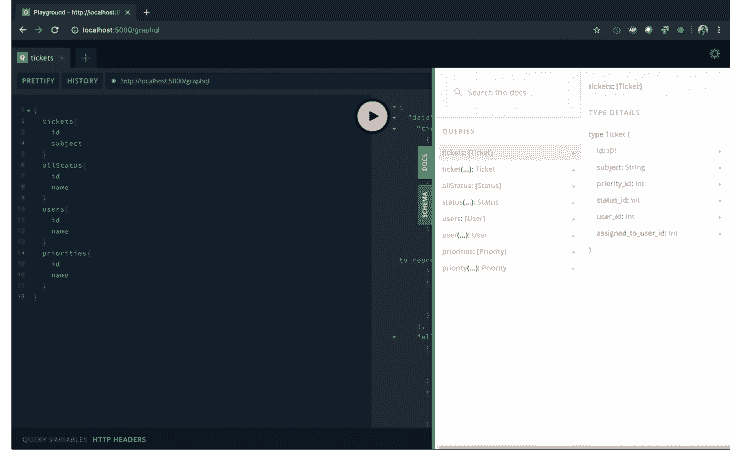
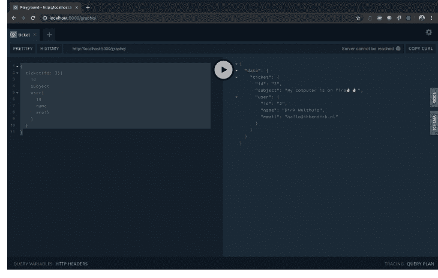

# 从 REST 到 GraphQL:创建 API 的不同方式(使用 Apollo 和 NodeJS)

> 原文：<https://dev.to/bnevilleoneill/from-rest-to-graphql-a-different-way-to-create-an-api-with-apollo-nodejs-3jd2>

[](https://res.cloudinary.com/practicaldev/image/fetch/s--d8PT2J4t--/c_limit%2Cf_auto%2Cfl_progressive%2Cq_auto%2Cw_880/https://thepracticaldev.s3.amazonaws.com/i/9kkj8wt73muyzc9gxopb.png)

准备好跳到 GraphQL API 了吗？如果您已经有了一个 MySQL 数据库，那么您就有了一个创建可伸缩 API 的绝佳起点。在本教程中，我们将介绍如何基于数据库创建模型，创建一个从数据库读取数据的 NodeJS GraphQL API，并学习如何在不同的表之间建立关系。

在本教程中，我们将为票务系统构建一个小的 GraphQL 端点。我们希望创建一个端点，在这里我们可以读取票据并获取它们的相关数据，比如用户、状态和优先级。

我们将使用的构造块有:

*   (现有的)MySQL 数据库
*   [节点 j](https://nodejs.org/en/)
*   [Express](https://expressjs.com/)(node . js 的 web 框架)
*   [Apollo](https://www.apollographql.com/) (创建 GraphQL 端点的工具)
*   [序列化](http://docs.sequelizejs.com/)(对象关系映射包)
*   [Webpack](https://webpack.js.org/) (打包应用程序)
*   (要启动一个本地 MySQL 数据库，只要你有一个 MySQL 实例，这是可选的)

如果你不知道我刚才提到的每一部分，不要担心，我会描述这一过程中的每一步。如果你想继续编码，你可以签出[这个库](https://github.com/DirkWolthuis/graphql-express-migrating-mysql)并用这个命令克隆教程发布的开始:

```
git clone <https://github.com/DirkWolthuis/graphql-express-migrating-mysql> --branch start 
```

<svg width="20px" height="20px" viewBox="0 0 24 24" class="highlight-action crayons-icon highlight-action--fullscreen-on"><title>Enter fullscreen mode</title></svg> <svg width="20px" height="20px" viewBox="0 0 24 24" class="highlight-action crayons-icon highlight-action--fullscreen-off"><title>Exit fullscreen mode</title></svg>

## 第一步:数据库层

首先，我们将假设我们正在使用一个现有的数据库。我已经创建了一个 SQL 文件，您可以将其导入 MySQL 数据库。我喜欢在 Docker 容器中运行我的 MySQL 数据库，你可以使用`docker-compose.yaml`文件(在存储库中)来启动一个 MySQL 容器。

该数据库有四个表:票据、优先级、状态和用户。这些表格具有以下结构:

门票

```
| Field               | Type             | Null | Key | Default           | Extra          |
+---------------------+------------------+------+-----+-------------------+----------------+
| id                  | int(11) unsigned | NO   | PRI | NULL              | auto_increment |
| subject             | varchar(256)     | NO   |     | NULL              |                |
| priority_id         | int(11)          | NO   |     | NULL              |                |
| status_id           | tinyint(4)       | NO   |     | NULL              |                |
| user_id             | int(11)          | NO   |     | NULL              |                |
| assigned_to_user_id | int(11)          | YES  |     | NULL              |                |
+---------------------+------------------+------+-----+-------------------+----------------+ 
```

<svg width="20px" height="20px" viewBox="0 0 24 24" class="highlight-action crayons-icon highlight-action--fullscreen-on"><title>Enter fullscreen mode</title></svg> <svg width="20px" height="20px" viewBox="0 0 24 24" class="highlight-action crayons-icon highlight-action--fullscreen-off"><title>Exit fullscreen mode</title></svg>

用户

```
| Field | Type             | Null | Key | Default | Extra          |
+-------+------------------+------+-----+---------+----------------+
| id    | int(10) unsigned | NO   | PRI | NULL    | auto_increment |
| name  | varchar(256)     | NO   |     | NULL    |                |
| email | varchar(256)     | NO   |     | NULL    |                |
+-------+------------------+------+-----+---------+----------------+ 
```

<svg width="20px" height="20px" viewBox="0 0 24 24" class="highlight-action crayons-icon highlight-action--fullscreen-on"><title>Enter fullscreen mode</title></svg> <svg width="20px" height="20px" viewBox="0 0 24 24" class="highlight-action crayons-icon highlight-action--fullscreen-off"><title>Exit fullscreen mode</title></svg>

优先事项

```
| Field | Type             | Null | Key | Default | Extra          |
+-------+------------------+------+-----+---------+----------------+
| id    | int(10) unsigned | NO   | PRI | NULL    | auto_increment |
| slug  | varchar(64)      | NO   |     | NULL    |                |
| name  | varchar(256)     | NO   |     | NULL    |                |
+-------+------------------+------+-----+---------+----------------+ 
```

<svg width="20px" height="20px" viewBox="0 0 24 24" class="highlight-action crayons-icon highlight-action--fullscreen-on"><title>Enter fullscreen mode</title></svg> <svg width="20px" height="20px" viewBox="0 0 24 24" class="highlight-action crayons-icon highlight-action--fullscreen-off"><title>Exit fullscreen mode</title></svg>

状态

```
| Field | Type             | Null | Key | Default | Extra          |
+-------+------------------+------+-----+---------+----------------+
| id    | int(10) unsigned | NO   | PRI | NULL    | auto_increment |
| slug  | varchar(64)      | NO   |     | NULL    |                |
| name  | varchar(256)     | NO   |     | NULL    |                |
+-------+------------------+------+-----+---------+----------------+ 
```

<svg width="20px" height="20px" viewBox="0 0 24 24" class="highlight-action crayons-icon highlight-action--fullscreen-on"><title>Enter fullscreen mode</title></svg> <svg width="20px" height="20px" viewBox="0 0 24 24" class="highlight-action crayons-icon highlight-action--fullscreen-off"><title>Exit fullscreen mode</title></svg>

使用上面的图表创建您自己的数据库，或者将 SQL 文件导入到您的 MySQL 数据库中，我们就可以开始编码了。您可以在目录`tutorial_assets`中的存储库内找到 SQL 文件。

## 步骤 2:引导应用程序

在本教程的资源库中，我已经设置了 [Webpack](https://webpack.js.org/) 来编译`dist`目录中的`app.js`文件。它提供一个基本的 Express Hello World 应用程序。克隆项目后，您需要运行`npm install`来安装依赖项。

安装完毕？可以运行`npm run start`来启动 app。它将服务于`http://localhost:5000`上的一个端点。

让我们开始构建我们的 GraphQL API 吧！

[](https://logrocket.com/signup/)

## 第三步:创建数据库模型

几乎每个框架都使用模型与数据库进行交互。为了与我们的 MySQL 数据库交互，我们使用 [Sequelize](http://docs.sequelizejs.com/) 作为 ORM(对象关系映射)包。让我们从添加包开始(mysql2 包是连接 mysql 数据库所必需的)。

```
npm install sequelize mysql2 
```

<svg width="20px" height="20px" viewBox="0 0 24 24" class="highlight-action crayons-icon highlight-action--fullscreen-on"><title>Enter fullscreen mode</title></svg> <svg width="20px" height="20px" viewBox="0 0 24 24" class="highlight-action crayons-icon highlight-action--fullscreen-off"><title>Exit fullscreen mode</title></svg>

现在我们可以做两件事之一，我们可以手动创建数据库模型，或者用一个额外的包自动生成。对于本教程，手动创建模型不成问题，我们的数据库中只有四个小表。但是当您正在迁移一个更大的数据库时，您可能想要更加自动化的东西。幸运的是，有一个基于现有数据库生成序列数据库文件的包。该软件包被命名为 [Sequelize-Auto](https://github.com/sequelize/sequelize-auto) ，可以在全球范围内安装 NPM。

```
npm install -g sequelize-auto mysql 
```

<svg width="20px" height="20px" viewBox="0 0 24 24" class="highlight-action crayons-icon highlight-action--fullscreen-on"><title>Enter fullscreen mode</title></svg> <svg width="20px" height="20px" viewBox="0 0 24 24" class="highlight-action crayons-icon highlight-action--fullscreen-off"><title>Exit fullscreen mode</title></svg>

为了以更加自动化的方式迁移数据库，我们可以使用`sequelize-auto`命令。我们需要在命令中插入 MySQL 数据库凭证来生成模型。如果您正在使用步骤 1 中提供的 MySQL dump，我已经创建了一个您需要使用的 config JSON 文件。

sequelize-auto-settings.json 位于 tutorial_assets 目录中。如果您在本教程中使用自己的数据库，请查看 Sequelize API 文档中的[设置页面](https://sequelize.readthedocs.io/en/latest/api/sequelize/)以了解您需要的设置。

```
sequelize-auto -h <host> -d <database> -u <user> -x [password] -p [port] --dialect [dialect] -c [/path/to/config] -o [/path/to/models] 
```

<svg width="20px" height="20px" viewBox="0 0 24 24" class="highlight-action crayons-icon highlight-action--fullscreen-on"><title>Enter fullscreen mode</title></svg> <svg width="20px" height="20px" viewBox="0 0 24 24" class="highlight-action crayons-icon highlight-action--fullscreen-off"><title>Exit fullscreen mode</title></svg>

所以在我的情况下:

```
sequelize-auto -h localhost -d graphql-mysql-tutorial -u graphql -x 123456 -p 8006 --dialect mysql -c /Users/wolthuis/Documents/websites/tutorials/graphql-migrating-mysql/tutorial\_assets/sequelize-auto-settings.json -o /Users/wolthuis/Documents/websites/tutorials/graphql-migrating-mysql/app/models 
```

<svg width="20px" height="20px" viewBox="0 0 24 24" class="highlight-action crayons-icon highlight-action--fullscreen-on"><title>Enter fullscreen mode</title></svg> <svg width="20px" height="20px" viewBox="0 0 24 24" class="highlight-action crayons-icon highlight-action--fullscreen-off"><title>Exit fullscreen mode</title></svg>

我们走吧！app/models 目录中出现了四个文件。在我们的文件中，让我们从导入序列并设置一些变量开始。

## 第四步:实现数据库模型

我们现在需要实现数据库模型。在应用程序的目录下创建一个 database.js 文件。在这个文件中，我们导入并导出数据库模型，这样我们就可以在应用程序中的任何地方使用它们。

```
const Sequelize = require('sequelize')

var db = {}

const sequelize = new Sequelize(
    'DATABASE_NAME',
    'DATABASE_USER',
    'DATABASE_PASSWORD',
    {
        host: 'DATABASE_HOST',
        port: 'DATABASE_PORT',
        dialect: 'mysql',
        define: {
            freezeTableName: true,
        },
        pool: {
            max: 5,
            min: 0,
            acquire: 30000,
            idle: 10000,
        },
        // <http://docs.sequelizejs.com/manual/tutorial/querying.html#operators>
        operatorsAliases: false,
    },
)

let models = []

// Initialize models
models.forEach(model => {
    const seqModel = model(sequelize, Sequelize)
    db[seqModel.name] = seqModel
})

// Apply associations
Object.keys(db).forEach(key => {
    if ('associate' in db[key]) {
        db[key].associate(db)
    }
})

db.sequelize = sequelize
db.Sequelize = Sequelize

module.exports = db 
```

<svg width="20px" height="20px" viewBox="0 0 24 24" class="highlight-action crayons-icon highlight-action--fullscreen-on"><title>Enter fullscreen mode</title></svg> <svg width="20px" height="20px" viewBox="0 0 24 24" class="highlight-action crayons-icon highlight-action--fullscreen-off"><title>Exit fullscreen mode</title></svg>

好了，我们需要做两件事，填写我们的 MySQL 数据库凭证，并导入新创建的模型。通常，您会使用环境变量来安全地传递敏感数据，但是出于教程的目的，我将在 database.js 文件中硬编码一些值。

所以导入中带有凭证的 database.js 文件看起来像这样:

```
const Sequelize = require('sequelize')

var db = {}

const sequelize = new Sequelize('graphql-mysql-tutorial', 'graphql', '123456', {
    host: 'localhost',
    port: '8006',
    dialect: 'mysql',
    define: {
        freezeTableName: true,
    },
    pool: {
        max: 5,
        min: 0,
        acquire: 30000,
        idle: 10000,
    },
    // <http://docs.sequelizejs.com/manual/tutorial/querying.html#operators>
    operatorsAliases: false,
})

let models = [
    require('./models/priorities.js'),
    require('./models/status.js'),
    require('./models/tickets.js'),
    require('./models/users.js'),
]

// Initialize models
models.forEach(model => {
    const seqModel = model(sequelize, Sequelize)
    db[seqModel.name] = seqModel
})

// Apply associations
Object.keys(db).forEach(key => {
    if ('associate' in db[key]) {
        db[key].associate(db)
    }
})

db.sequelize = sequelize
db.Sequelize = Sequelize

module.exports = db 
```

<svg width="20px" height="20px" viewBox="0 0 24 24" class="highlight-action crayons-icon highlight-action--fullscreen-on"><title>Enter fullscreen mode</title></svg> <svg width="20px" height="20px" viewBox="0 0 24 24" class="highlight-action crayons-icon highlight-action--fullscreen-off"><title>Exit fullscreen mode</title></svg>

太好了，我们现在可以在应用程序的任何地方导入`db`变量，并访问我们所有的模型。在接下来的步骤中，我们肯定会使用该变量来访问我们的数据。

## 第五步:设置阿波罗服务器

阿波罗 T2 是建立在 GraphQL 规范之上的一层，他们提供了优秀的开发工具。他们还提供了将 Apollo server 集成到(现有的)Express 应用程序中的包。我们将使用这个包，根据我的经验，创建 GraphQL API 的最佳方式是有时依靠一个`normal` rest API。例如，在创建认证端点时，我更喜欢将 GraphQL 和认证路由完全分开。

首先，我们需要添加两个包:

```
npm install apollo-server-express graphql 
```

<svg width="20px" height="20px" viewBox="0 0 24 24" class="highlight-action crayons-icon highlight-action--fullscreen-on"><title>Enter fullscreen mode</title></svg> <svg width="20px" height="20px" viewBox="0 0 24 24" class="highlight-action crayons-icon highlight-action--fullscreen-off"><title>Exit fullscreen mode</title></svg>

安装后，我们需要在 app.js 中做一些设置来耦合 Apollo 和 Express。我们从导入 ApolloServer 开始:

```
const { ApolloServer } = require('apollo-server-express') 
```

<svg width="20px" height="20px" viewBox="0 0 24 24" class="highlight-action crayons-icon highlight-action--fullscreen-on"><title>Enter fullscreen mode</title></svg> <svg width="20px" height="20px" viewBox="0 0 24 24" class="highlight-action crayons-icon highlight-action--fullscreen-off"><title>Exit fullscreen mode</title></svg>

然后我们创建一个新的 Apollo 服务器实例:

```
const server = new ApolloServer({
        modules: []
}) 
```

<svg width="20px" height="20px" viewBox="0 0 24 24" class="highlight-action crayons-icon highlight-action--fullscreen-on"><title>Enter fullscreen mode</title></svg> <svg width="20px" height="20px" viewBox="0 0 24 24" class="highlight-action crayons-icon highlight-action--fullscreen-off"><title>Exit fullscreen mode</title></svg>

最后一步，我们将 Apollo 服务器作为中间件应用到现有的 Express 应用程序中:

```
server.applyMiddleware({ app }) 
```

<svg width="20px" height="20px" viewBox="0 0 24 24" class="highlight-action crayons-icon highlight-action--fullscreen-on"><title>Enter fullscreen mode</title></svg> <svg width="20px" height="20px" viewBox="0 0 24 24" class="highlight-action crayons-icon highlight-action--fullscreen-off"><title>Exit fullscreen mode</title></svg>

我们还不能启动我们的应用程序，没有任何模块阿波罗服务器将抛出一个错误。因此，在下一步中，我们将把我们的数据库实体实现到 GraphQL 端点中，这样我们就可以用 GraphQL 查询来访问它们。

## 步骤 6:创建我们的 GraphQL 类型和解析器

在 GraphQL 中，需要类型和解析器。类型描述了可以通过 GraphQL 端点获取或写入的数据。解析器是解析用户请求的逻辑。

在 GraphQL 目录中，我们创建一个名为 tickets.js 的新文件。在这个文件中，我们将包含一个来自`apollo-server-express`包的变量，我们将使用它来创建 GraphQL 类型定义，包含我们的`db`变量和两个用于我们的类型 GraphQL 定义和 GraphQL 解析器的空对象。

```
import { gql } from 'apollo-server-express'
import * as db from '../database'

export const typeDefs = gql`

`
export const resolvers = {
} 
```

<svg width="20px" height="20px" viewBox="0 0 24 24" class="highlight-action crayons-icon highlight-action--fullscreen-on"><title>Enter fullscreen mode</title></svg> <svg width="20px" height="20px" viewBox="0 0 24 24" class="highlight-action crayons-icon highlight-action--fullscreen-off"><title>Exit fullscreen mode</title></svg>

## 创建 GraphQL 类型

所以首先我们填充 typeDefs 变量。您可以看到我们正在使用来自`apollo-server-express`包的`gql`变量。`gql`变量让我们编写包可读的类型定义。

在`typeDefs`变量中，我们需要做两件事，扩展查询类型并创建一个名为`Ticket`的新类型。我们需要扩展查询类型的原因是因为 GraphQL 总是使用名为`Query`的顶级类型。在该类型中嵌套了其他类型，这就是 GraphQL 如何知道在您的 GraphQL API 中可用的类型。

好了，让我们扩展查询类型:

```
export const typeDefs = gql`
    extend type Query {
        tickets: [Ticket]
        ticket(id: ID!): Ticket
    }
    type Ticket {

    }
` 
```

<svg width="20px" height="20px" viewBox="0 0 24 24" class="highlight-action crayons-icon highlight-action--fullscreen-on"><title>Enter fullscreen mode</title></svg> <svg width="20px" height="20px" viewBox="0 0 24 24" class="highlight-action crayons-icon highlight-action--fullscreen-off"><title>Exit fullscreen mode</title></svg>

所以在上面的代码中，我们做了一些事情。我们让 GraphQL 知道我们想用两个新的实体来扩展查询:ticket 和 tickets。

`Tickets`返回一个`tickets` :
的数组

```
tickets: [Ticket] 
```

<svg width="20px" height="20px" viewBox="0 0 24 24" class="highlight-action crayons-icon highlight-action--fullscreen-on"><title>Enter fullscreen mode</title></svg> <svg width="20px" height="20px" viewBox="0 0 24 24" class="highlight-action crayons-icon highlight-action--fullscreen-off"><title>Exit fullscreen mode</title></svg>

`Ticket`返回单类型的`Ticket`。票证类型将接收一个名为 id 的参数，类型为 ID，不能为 null(换句话说，该参数是必需的)。GraphQL 类型中的感叹号象征着一个值不能为空:

```
ticket(id: ID!): Ticket 
```

<svg width="20px" height="20px" viewBox="0 0 24 24" class="highlight-action crayons-icon highlight-action--fullscreen-on"><title>Enter fullscreen mode</title></svg> <svg width="20px" height="20px" viewBox="0 0 24 24" class="highlight-action crayons-icon highlight-action--fullscreen-off"><title>Exit fullscreen mode</title></svg>

现在我们的`Ticket`类型是空的，所以让我们填充这个类型:

```
export const typeDefs = gql`
    extend type Query {
        tickets: [Ticket]
        ticket(id: ID!): Ticket
    }
    type Ticket {
        id: ID!
        subject: String
        priority_id: Int
        status_id: Int
        user_id: Int
        assigned_to_user_id: Int
    }
` 
```

<svg width="20px" height="20px" viewBox="0 0 24 24" class="highlight-action crayons-icon highlight-action--fullscreen-on"><title>Enter fullscreen mode</title></svg> <svg width="20px" height="20px" viewBox="0 0 24 24" class="highlight-action crayons-icon highlight-action--fullscreen-off"><title>Exit fullscreen mode</title></svg>

所以在上面的代码中，我们描述了票证类型由哪些类型组成。它与我们的数据库模型 100%匹配。这对于现在来说是正确的，但是将来当我们要在我们的类型/模型之间添加关系时，这种情况将会改变。

## 创建 GraphQL 解析器

所以我们为票实体创建了我们的类型。现在让我们创建解析器。解析器需要或多或少地反映我们的类型。在解析器对象内部，我们也从顶级查询对象开始。

```
export const resolvers = {
    Query: {},
} 
```

<svg width="20px" height="20px" viewBox="0 0 24 24" class="highlight-action crayons-icon highlight-action--fullscreen-on"><title>Enter fullscreen mode</title></svg> <svg width="20px" height="20px" viewBox="0 0 24 24" class="highlight-action crayons-icon highlight-action--fullscreen-off"><title>Exit fullscreen mode</title></svg>

在查询中，我们反映了我们的查询类型，所以我们添加了两个键:ticket 和 tickets。我们使用我们的`db`(数据库)变量来解析来自数据库的数据。

```
export const resolvers = {
    Query: {
        tickets: async () => db.tickets.findAll(),
        ticket: async (obj, args, context, info) =>
            db.tickets.findByPk(args.id),
    },
} 
```

<svg width="20px" height="20px" viewBox="0 0 24 24" class="highlight-action crayons-icon highlight-action--fullscreen-on"><title>Enter fullscreen mode</title></svg> <svg width="20px" height="20px" viewBox="0 0 24 24" class="highlight-action crayons-icon highlight-action--fullscreen-off"><title>Exit fullscreen mode</title></svg>

解析器接收两个参数，我们可以用它们来解析删除请求。`obj`是根对象，我们将使用这个根对象来建立关系。`args`是我们在类型中定义的函数参数。所以在我们的`tickets`的情况下，这是我们需要得到的票的 ID。如果你想了解更多关于 obj，args，context，info 的信息，请查看 [Apollo Docs](https://www.apollographql.com/docs/graphql-tools/resolvers/) 。

## 将票务模块添加到我们的阿波罗服务器

我们已经创建了一个模块，我们只需要将它导入到 app.js 中的应用程序中

```
const server = new ApolloServer({
    modules: [require('./GraphQL/tickets')],
}) 
```

<svg width="20px" height="20px" viewBox="0 0 24 24" class="highlight-action crayons-icon highlight-action--fullscreen-on"><title>Enter fullscreen mode</title></svg> <svg width="20px" height="20px" viewBox="0 0 24 24" class="highlight-action crayons-icon highlight-action--fullscreen-off"><title>Exit fullscreen mode</title></svg>

现在对优先级、用户和状态进行同样的操作，并导入这些模块:

```
const server = new ApolloServer({
    modules: [
        require('./GraphQL/tickets'),
        require('./GraphQL/status'),
        require('./GraphQL/users'),
        require('./GraphQL/priorities'),
    ],
}) 
```

<svg width="20px" height="20px" viewBox="0 0 24 24" class="highlight-action crayons-icon highlight-action--fullscreen-on"><title>Enter fullscreen mode</title></svg> <svg width="20px" height="20px" viewBox="0 0 24 24" class="highlight-action crayons-icon highlight-action--fullscreen-off"><title>Exit fullscreen mode</title></svg>

再次启动 app 后，进入 [localhost:5000/graphql](http://localhost:5000/graphql) 就进入了 Apollo GraphQL 查询构建器环境。在这个环境中，您可以测试您的 API 并创建查询，稍后您将在其他应用程序中使用这些查询。此外，您可以使用右侧的 docs 按钮来浏览您的 API。因为 GraphQL 是类型化的，所以您自动拥有 API 文档。相当酷！

[](https://res.cloudinary.com/practicaldev/image/fetch/s--QyStGaZx--/c_limit%2Cf_auto%2Cfl_progressive%2Cq_auto%2Cw_880/https://i1.wp.com/blog.logrocket.com/wp-content/uploads/2019/07/scherma.png%3Fresize%3D730%252C463%26ssl%3D1)

## 第七步:创建数据间的关系

所以这很酷，但是如果能在得到票的时候自动得到用户名就更好了。在我们应用程序的当前状态下，我们只能获得与票相关联的用户 id。在这一步中，我们将创建票证和用户之间的关系。

## 在票据类型上添加用户类型

因此，首先让我们编辑票证类型。我们需要让 GraphQL 知道我们想要请求一个类型为 user:
的用户

```
export const typeDefs = gql`
    extend type Query {
        tickets: [Ticket]
        ticket(id: ID!): Ticket
    }
    type Ticket {
        id: ID!
        subject: String
        priority_id: Int
        status_id: Int
        user_id: Int
        user: User
        assigned_to_user_id: Int
    }
` 
```

<svg width="20px" height="20px" viewBox="0 0 24 24" class="highlight-action crayons-icon highlight-action--fullscreen-on"><title>Enter fullscreen mode</title></svg> <svg width="20px" height="20px" viewBox="0 0 24 24" class="highlight-action crayons-icon highlight-action--fullscreen-off"><title>Exit fullscreen mode</title></svg>

## 为用户添加额外的解析器

接下来，我们需要添加一个嵌套的解析器来解析票据中的用户。在 resolver 对象中，我们将添加键`Ticket`。当我们在一个类型中请求另一个类型时，GraphQL 就是这样知道如何解析嵌套查询的。在本例中，解析器是票据类型中的用户类型:

```
export const resolvers = {
    Query: {
        tickets: async () => db.tickets.findAll(),
        ticket: async (obj, args, context, info) =>
            db.tickets.findByPk(args.id),
    },
    Ticket: {
        user: async (obj, args, context, info) => db.users.findByPk(obj.user_id),
    },
} 
```

<svg width="20px" height="20px" viewBox="0 0 24 24" class="highlight-action crayons-icon highlight-action--fullscreen-on"><title>Enter fullscreen mode</title></svg> <svg width="20px" height="20px" viewBox="0 0 24 24" class="highlight-action crayons-icon highlight-action--fullscreen-off"><title>Exit fullscreen mode</title></svg>

您可以看到我们正在使用`obj`来访问票证数据。在票证数据中设置了`user_id`,因此我们可以从数据库中获得正确的用户。

所以让我们看看我们的代码是否有效。我创建了这个查询，看看能否获得嵌套的用户数据。请注意，您还需要指定您想要的用户类型字段，在我的例子中是 id、name 和 email 字段。

```
{
  ticket(id: 3){
    id
    subject
    user{
      id
      name
      email
    }
  }
} 
```

<svg width="20px" height="20px" viewBox="0 0 24 24" class="highlight-action crayons-icon highlight-action--fullscreen-on"><title>Enter fullscreen mode</title></svg> <svg width="20px" height="20px" viewBox="0 0 24 24" class="highlight-action crayons-icon highlight-action--fullscreen-off"><title>Exit fullscreen mode</title></svg>

太好了，成功了！这是阿波罗的回报:

[](https://res.cloudinary.com/practicaldev/image/fetch/s--e9R94vrV--/c_limit%2Cf_auto%2Cfl_progressive%2Cq_auto%2Cw_880/https://i2.wp.com/blog.logrocket.com/wp-content/uploads/2019/07/graphqlexample.png%3Fresize%3D730%252C463%26ssl%3D1)

现在以同样的方式添加其他关系:优先级、状态和 assigned_to_user。添加完另一个嵌套解析器后，您的 tickets.js 文件将看起来像这样:

```
import { gql } from 'apollo-server-express'
import * as db from '../database'
export const typeDefs = gql`
    extend type Query {
        tickets: [Ticket]
        ticket(id: ID!): Ticket
    }
    type Ticket {
        id: ID!
        subject: String
        priority_id: Int
        priority: Priority
        status_id: Int
        status: Status
        user_id: Int
        user: User
        assigned_to_user_id: Int
        assigned_to_user: User
    }
`
export const resolvers = {
    Query: {
        tickets: async () => db.tickets.findAll(),
        ticket: async (obj, args, context, info) =>
            db.tickets.findByPk(args.id),
    },
    Ticket: {
        user: async (obj, args, context, info) =>
            db.users.findByPk(obj.user_id),
        priority: async (obj, args, context, info) =>
            db.priorities.findByPk(obj.priority_id),
        status: async (obj, args, context, info) =>
            db.status.findByPk(obj.status_id),
        assigned_to_user: async (obj, args, context, info) =>
            db.users.findByPk(obj.assigned_to_user_id),
    },
} 
```

<svg width="20px" height="20px" viewBox="0 0 24 24" class="highlight-action crayons-icon highlight-action--fullscreen-on"><title>Enter fullscreen mode</title></svg> <svg width="20px" height="20px" viewBox="0 0 24 24" class="highlight-action crayons-icon highlight-action--fullscreen-off"><title>Exit fullscreen mode</title></svg>

转到`localhost:5000/graphql`并构建一个查询，获取所有票据及其状态、优先级和用户。用这个查询:

```
{
  tickets{
    subject
    status{
      slug
    }
    priority{
      slug
    }
    user{
      name
    }
    assigned_to_user{
      name
    }
  }
} 
```

<svg width="20px" height="20px" viewBox="0 0 24 24" class="highlight-action crayons-icon highlight-action--fullscreen-on"><title>Enter fullscreen mode</title></svg> <svg width="20px" height="20px" viewBox="0 0 24 24" class="highlight-action crayons-icon highlight-action--fullscreen-off"><title>Exit fullscreen mode</title></svg>

我得到了以下门票及其属性:

```
{
  "data": {
    "tickets": [
      {
        "subject": "My computer is on fire🔥🔥",
        "status": {
          "slug": "open"
        },
        "priority": {
          "slug": "high"
        },
        "user": {
          "name": "Dirk Wolthuis"
        },
        "assigned_to_user": null
      },
      {
        "subject": "MS Word is not starting, can someone help?",
        "status": {
          "slug": "doing"
        },
        "priority": {
          "slug": "low"
        },
        "user": {
          "name": "Chris Vogt"
        },
        "assigned_to_user": {
          "name": "Dirk Wolthuis"
        }
      },
      {
        "subject": "There is a bug in the 🛒 of the webshop, steps to reproduce are included",
        "status": {
          "slug": "doing"
        },
        "priority": {
          "slug": "high"
        },
        "user": {
          "name": "Andrew Clark"
        },
        "assigned_to_user": {
          "name": "Dirk Wolthuis"
        }
      },
      {
        "subject": "404 error: website not found - website down?💀",
        "status": {
          "slug": "closed"
        },
        "priority": {
          "slug": "high"
        },
        "user": {
          "name": "Andrew Clark"
        },
        "assigned_to_user": {
          "name": "Dirk Wolthuis"
        }
      }
    ]
  }
} 
```

<svg width="20px" height="20px" viewBox="0 0 24 24" class="highlight-action crayons-icon highlight-action--fullscreen-on"><title>Enter fullscreen mode</title></svg> <svg width="20px" height="20px" viewBox="0 0 24 24" class="highlight-action crayons-icon highlight-action--fullscreen-off"><title>Exit fullscreen mode</title></svg>

## 结论

我们已经创建了一个可用的 GraphQL API，您可以按照自己想要的方式定制它。您可以在实体之间添加多层关系。在创建一个新的数据库表后，您可以轻松地为您的应用程序创建所需的序列模型。出于本教程的目的，我们已经创建了一个只读数据库。只是想看看代码？你可以在这个库中找到它。如果你想了解更多关于如何操作数据库中的数据，你可以查看[设计突变](https://www.apollographql.com/docs/apollo-server/essentials/schema/#designing-mutations)或者阅读[这篇关于突变的文章](https://www.howtographql.com/graphql-js/3-a-simple-mutation/)。服务器的设置略有不同，但逻辑是相同的。

* * *

## Plug: [LogRocket](https://logrocket.com/signup/) ，一款适用于网络应用的 DVR

[](https://res.cloudinary.com/practicaldev/image/fetch/s--6FG5kvEL--/c_limit%2Cf_auto%2Cfl_progressive%2Cq_auto%2Cw_880/https://i2.wp.com/blog.logrocket.com/wp-content/uploads/2017/03/1d0cd-1s_rmyo6nbrasp-xtvbaxfg.png%3Fresize%3D1200%252C677%26ssl%3D1)

[log rocket](https://logrocket.com/signup/)是一个前端日志工具，让你重放问题，就像它们发生在你自己的浏览器中一样。LogRocket 不需要猜测错误发生的原因，也不需要向用户询问截图和日志转储，而是让您重放会话以快速了解哪里出错了。它可以与任何应用程序完美配合，不管是什么框架，并且有插件可以记录来自 Redux、Vuex 和@ngrx/store 的额外上下文。

除了记录 Redux 动作和状态，LogRocket 还记录控制台日志、JavaScript 错误、stacktraces、带有头+体的网络请求/响应、浏览器元数据、自定义日志。它还使用 DOM 来记录页面上的 HTML 和 CSS，甚至为最复杂的单页面应用程序重新创建像素级完美视频。

[免费试用](https://logrocket.com/signup/)。

* * *

帖子[从 REST 到 GraphQL:创建 API 的不同方式(用阿波罗& NodeJS)](https://blog.logrocket.com/from-rest-to-graphql/) 首先出现在 [LogRocket 博客](https://blog.logrocket.com)上。