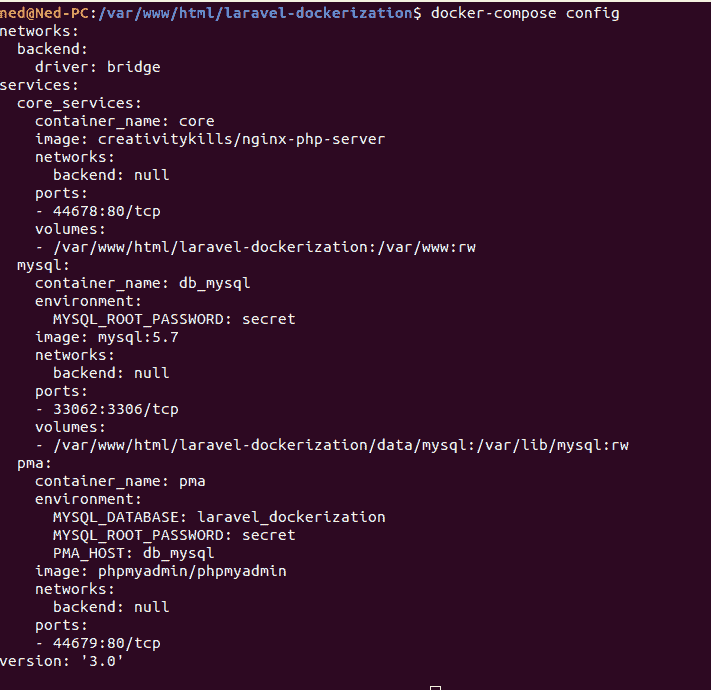
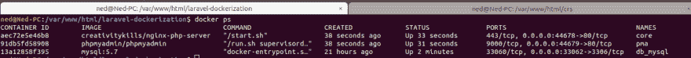
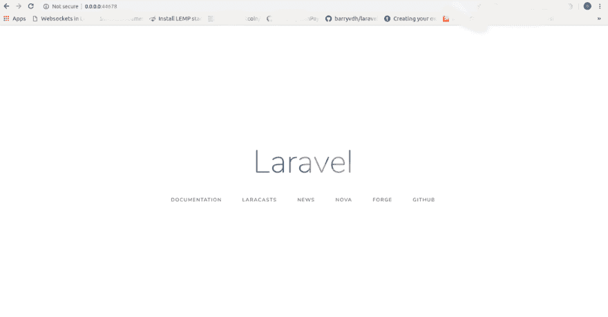
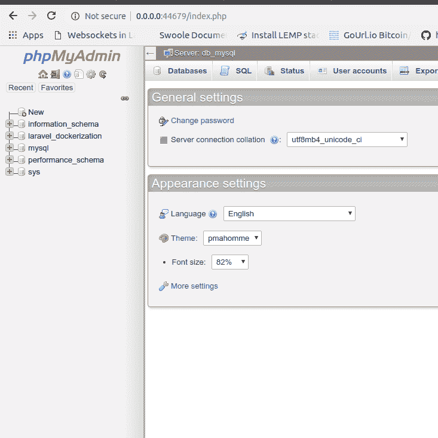
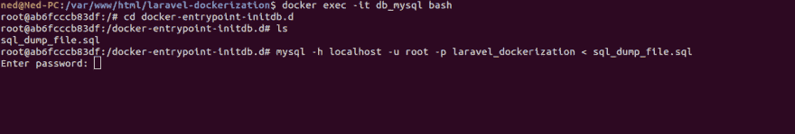

# Laravel Dockerization 开箱即用！

> 原文：<https://dev.to/nedsoft/laravel-dockerization-out-of-the-box-4aej>

Docker 是一个开源平台，软件开发者可以在任何地方构建、发布和运行任何应用。
从更高的层面来解释，`dockerized`应用程序可以比作一朵生长在桶里的花，这个桶包含了这朵花在任何环境下生存所需的一切。
它基本上将应用程序放置(*容器化*)在一个包含应用程序运行所需的所有东西的容器中。

本文假设读者已经了解如何使用 Laravel，我们的业务是如何`dockerize`它。

> 本文最初发表于[媒体](https://medium.com/@Oriechinedu/laravel-dockerization-out-of-the-box-c2214f6a6af8)

### 要求

要在 Docker 上运行 Laravel 应用程序，必须具备以下条件:

*   Laravel 安装在您的本地机器上。关于安装 Laravel 的步骤，请参见官方文档。

*   Docker 安装在您的本地机器上。检查此处为您的操作系统安装合适的发行版

*   Docker Compose 安装在您的本地机器上。

*   命令行知识，如果你是一个 Linux 用户，你应该看看这个 Linux 教程来理解基本的 Linux 命令

如果你已经满足了上面的要求，那么你已经准备好了。让我们深入主营业务。

> 本文中使用的示例项目可以在这里克隆

## 入门

在我们继续之前，有必要解释一下我们将在本教程中用到的一些基本概念。其中最突出的是图像和容器。

> I * mages *:运行容器所需的文件系统和元数据。它们可以被认为是一种应用程序打包格式，包括运行应用程序的所有依赖项，以及执行该应用程序的默认设置。元数据包括要运行的命令的默认值、环境变量、标签和 healthcheck 命令。
> 
> *容器*:隔离应用的一个实例。容器需要映像来定义其初始状态，并使用映像中的只读文件系统以及容器特定的读写文件系统。运行容器是运行进程的包装器，为该进程提供文件系统、网络和 PID 等名称空间。
> 
> [Stackoverflow.com](https://stackoverflow.com/questions/21498832/in-docker-whats-the-difference-between-a-container-and-an-image)

另一个解释图像和容器的类比是面向对象编程中的类和对象。图像是一个类，而容器是该类的一个对象。

进一步解释；为了在我们的本地机器上运行一个 Laravel 应用程序，我们安装了 LEMP、WAMP、XAMP 或 MAMP，如果需要的话，还安装了 phpmyadmin。这些软件在 docker 环境中被打包成映像。这意味着，要对一个 Laravel 应用程序进行 dockerize，我们需要创建一个包含每个包的映像，或者我们为每个包创建不同的映像，并在 docker 容器中对它们进行互联

在本文中，我们不会从头开始创建图像，我们将从 [docker hub](http://hub.docker.com) 中提取已经构建好的图像。以下是我们将从 docker hub 获取的图片，以便我们的应用程序使用:

*   [creativitykills/nginx-PHP-server-PHP](https://hub.docker.com/r/creativitykills/nginx-php-server)和 nginx 由`Neo Ighodaro`维护
*   [mysql:5.7](https://hub.docker.com/_/mysql)
*   [phpmyadmin/phpmyadmin](https://hub.docker.com/r/phpmyadmin/phpmyadmin)

点击每张图片，阅读相关详细信息。已经建立了关于我们将要做什么的必要理论，让我们按照下面的步骤开始将应用程序归档的主要过程。

**步骤 1 -创建要归档的 Laravel 项目**

创建您想要归档的 Laravel 项目。打开您的终端和 cd 进入项目的根目录。

```
ned@Ned-PC:/var/www/html/laravel-dockerization$ 
```

<svg width="20px" height="20px" viewBox="0 0 24 24" class="highlight-action crayons-icon highlight-action--fullscreen-on"><title>Enter fullscreen mode</title></svg> <svg width="20px" height="20px" viewBox="0 0 24 24" class="highlight-action crayons-icon highlight-action--fullscreen-off"><title>Exit fullscreen mode</title></svg>

**步骤 2-创建 docker-compose.yaml 文件**

```
$ touch docker-compose.yaml 
```

<svg width="20px" height="20px" viewBox="0 0 24 24" class="highlight-action crayons-icon highlight-action--fullscreen-on"><title>Enter fullscreen mode</title></svg> <svg width="20px" height="20px" viewBox="0 0 24 24" class="highlight-action crayons-icon highlight-action--fullscreen-off"><title>Exit fullscreen mode</title></svg>

接下来，编辑`docker-compose.yaml`文件，如下所示:

```
version: '3'
services:
  core_services:
    image: creativitykills/nginx-php-server
    container_name: core
    ports:
      - "44678:80"
    volumes:
      - ./:/var/www
    networks: 
      - backend

  mysql:
    container_name: db_mysql
    image: mysql:5.7
    ports:
      - "33062:3306"
    environment:
      - "MYSQL_ROOT_PASSWORD=${DB_PASSWORD}"
    volumes:
      - "./db/mysql/data:/var/lib/mysql"
      - "./db/mysql/initdb.d:/docker-entrypoint-initdb.d"
    networks: 
      - backend
  pma:
    container_name: pma
    image: phpmyadmin/phpmyadmin
    ports:
      - "44679:80"
    environment:
      - "PMA_HOST=db_mysql"
      - "MYSQL_DATABASE=${DB_DATABASE}"
      - "MYSQL_ROOT_PASSWORD=${DB_PASSWORD}"
    networks: 
      - backend

networks:
  backend:
    driver: bridge 
```

<svg width="20px" height="20px" viewBox="0 0 24 24" class="highlight-action crayons-icon highlight-action--fullscreen-on"><title>Enter fullscreen mode</title></svg> <svg width="20px" height="20px" viewBox="0 0 24 24" class="highlight-action crayons-icon highlight-action--fullscreen-off"><title>Exit fullscreen mode</title></svg>

> 你可以在 GitHub Gist 上查看上面的代码片段。

我们已经完成了我们需要做的事情，但是在我们总结之前，让我解释一下在上面的 YAML 文件中发生了什么。

在第 1 行，我们指定了要使用的 docker-compose 的版本。

在第 2 行，我们声明了服务定义的开始，这里的服务字面意思是图像。

在第 3 行，我们声明了第一个服务名`core_services`；注意，名字由你决定。该服务将是一个包含 Nginx 和 PHP 解释器以及 composer 等其他依赖项的映像。

在第 4 行，我们指定了要从 docker hub 中提取的图像的名称。
在第 5 行，我们指定了容器名，即`core_services`图像的任何实例的名称。注意，名字由你决定。

在第 6–7 行，我们指定了可以在浏览器上访问应用程序的端口。这意味着我们可以通过在浏览器上访问 0.0.0.44678 来访问应用程序。
在第 8–9 行，我们将项目的目录映射到 docker 容器中的`/var/www`。它的意思是，将位于`/var/www/html/laravel-dockerization`的整个项目复制到容器内的`/var/www`。这样，我们在项目目录中所做的任何外部更改都将反映在 docker 容器中，反之亦然。

在第 10–11 行，我们指定了容器要使用的网络，以便任何其他容器连接到同一个网络并相互通信。如果没有指定网络，docker 会创建一个网络并将容器附加到它上面。建议您指定要使用的网络，以便您可以完全控制其行为。

在第 13–23 行，我们创建了 mysql 服务。我们指定使用的版本为 5.7，这可以根据您的选择进行更改。我们指定了`MYSQL_ROOT_PASSWORD`。这个`${DB_PASSWORD}`意味着用中`DB_PASSWORD`的值替换它。环境文件。所以，确保中`DB_PASSOWRD`的值。env 是您想要用于 mysql 的密码。

在第 20–21 行，我们将卷从外部目录映射到 mysql 容器卷。该卷确保存储在数据库中的数据即使在容器被删除的情况下也能保存在本地机器中。您可以随意命名目录，但要确保在映射之前创建它。

在第 22 行，我们将外部目录`./db/mysql/initdb.d`映射到`docker-entrypoint-initdb.d`。该卷用于将数据导入数据库。例如，如果您想将一个 sql 转储导入到数据库中，您需要将 SQL 转储文件复制到`db/mysql/initdb.d`中，然后从 db_mysql 容器中的 docker-entrypoint-initdb.d 访问该文件。我们将在本文后面演示如何做到这一点。你可以在这里阅读更多关于`docker-entrypoint`T4 的内容。

从第 24–34 行开始，我们创建了 phpmyadmin 服务，容器名为 pma。我们公开了端口 44679，这意味着我们可以访问`0.0.0.44679`来访问 phpmyadmin。在第 30 行，你会注意到我们将`PMA_HOST`指定为 MySQL 容器`db_mysql`，这非常重要。如果`PMA_HOST`与 mysql 容器不同步，您将无法访问 phpmyadmin，因为`PMA_HOST`将默认为 localhost。我们还指定了`MYSQL_ROOT_PASSWORD`和`MYSQL_DATABASE`来使用。分别为 env。注意`MYSQL_DATABASE`是可选的。

从第 36–38 行开始，我们定义了连接前面几行中的容器的后端网络。当 docker 遇到后端网络时，它会查找它的定义位置，并在继续之前先创建它。
接下来，我们通过运行下面的命令来确认正确的值从`.env`传递到了 docker-compose:

```
$ docker-compose config 
```

<svg width="20px" height="20px" viewBox="0 0 24 24" class="highlight-action crayons-icon highlight-action--fullscreen-on"><title>Enter fullscreen mode</title></svg> <svg width="20px" height="20px" viewBox="0 0 24 24" class="highlight-action crayons-icon highlight-action--fullscreen-off"><title>Exit fullscreen mode</title></svg>

上面命令的输出应该类似下面的截图:
[](https://res.cloudinary.com/practicaldev/image/fetch/s--3FaayN7r--/c_limit%2Cf_auto%2Cfl_progressive%2Cq_auto%2Cw_880/https://thepracticaldev.s3.amazonaws.com/i/kgujrq9w8r3mstfwhfgh.png)

下面是我的样子。环境文件:

```
...
DB_CONNECTION=mysql
DB_HOST=db_mysql
DB_PORT=3306
DB_DATABASE=laravel_dockerization
DB_USERNAME=root
DB_PASSWORD=secret
... 
```

<svg width="20px" height="20px" viewBox="0 0 24 24" class="highlight-action crayons-icon highlight-action--fullscreen-on"><title>Enter fullscreen mode</title></svg> <svg width="20px" height="20px" viewBox="0 0 24 24" class="highlight-action crayons-icon highlight-action--fullscreen-off"><title>Exit fullscreen mode</title></svg>

请注意，`DB_HOST`被设置为 docker-compose.yaml.
步骤 3 —构建容器
既然我们已经设置了 docker-compose.yaml，我们就要开始构建容器了。在项目的根目录下运行下面的命令:

```
$ docker-compose up -d 
```

<svg width="20px" height="20px" viewBox="0 0 24 24" class="highlight-action crayons-icon highlight-action--fullscreen-on"><title>Enter fullscreen mode</title></svg> <svg width="20px" height="20px" viewBox="0 0 24 24" class="highlight-action crayons-icon highlight-action--fullscreen-off"><title>Exit fullscreen mode</title></svg>

上面的命令将构建容器并启动它们。标志`-d`以交互模式启动容器，进程在后台运行，您将能够随后运行其他命令，但是如果您想要监视构建进程，那么只需运行:

```
$ docker-compose up 
```

<svg width="20px" height="20px" viewBox="0 0 24 24" class="highlight-action crayons-icon highlight-action--fullscreen-on"><title>Enter fullscreen mode</title></svg> <svg width="20px" height="20px" viewBox="0 0 24 24" class="highlight-action crayons-icon highlight-action--fullscreen-off"><title>Exit fullscreen mode</title></svg>

接下来，我们需要给存储目录完全的权限，以便 docker 能够读写它，运行下面的命令:

```
$ sudo chmod 777 -R ./storage 
```

<svg width="20px" height="20px" viewBox="0 0 24 24" class="highlight-action crayons-icon highlight-action--fullscreen-on"><title>Enter fullscreen mode</title></svg> <svg width="20px" height="20px" viewBox="0 0 24 24" class="highlight-action crayons-icon highlight-action--fullscreen-off"><title>Exit fullscreen mode</title></svg>

现在，如果上面的 docker-compose 命令构建成功，我们可以通过运行下面的命令来确认容器是否正常运行:

```
$ docker ps 
```

<svg width="20px" height="20px" viewBox="0 0 24 24" class="highlight-action crayons-icon highlight-action--fullscreen-on"><title>Enter fullscreen mode</title></svg> <svg width="20px" height="20px" viewBox="0 0 24 24" class="highlight-action crayons-icon highlight-action--fullscreen-off"><title>Exit fullscreen mode</title></svg>

上面命令的输出应该类似于下面的屏幕截图:

[](https://res.cloudinary.com/practicaldev/image/fetch/s--Q8GYhvTY--/c_limit%2Cf_auto%2Cfl_progressive%2Cq_auto%2Cw_880/https://thepracticaldev.s3.amazonaws.com/i/tenjt2u6cbf00eo6rj74.png)

上面的截图显示，所有的容器都在按预期运行。如果三个容器都没有运行，这意味着出现了问题。您需要删除容器并删除-d 标志重新构建。这将使构建过程变得冗长，您可以很容易地指出哪里出错并修复它。为此，运行以下命令:

```
$ docker-compose down && docker-compose up 
```

<svg width="20px" height="20px" viewBox="0 0 24 24" class="highlight-action crayons-icon highlight-action--fullscreen-on"><title>Enter fullscreen mode</title></svg> <svg width="20px" height="20px" viewBox="0 0 24 24" class="highlight-action crayons-icon highlight-action--fullscreen-off"><title>Exit fullscreen mode</title></svg>

现在打开浏览器，访问`http://0.0.0.0:44678`，瞧！我们的 app 上线了！

[](https://res.cloudinary.com/practicaldev/image/fetch/s--x45-r1aR--/c_limit%2Cf_auto%2Cfl_progressive%2Cq_auto%2Cw_880/https://thepracticaldev.s3.amazonaws.com/i/cj4jybu4ahreo859f81s.png)

要查看`phpmyadmin`仪表板，请访问`http://0.0.0.0:44679`:

[](https://res.cloudinary.com/practicaldev/image/fetch/s--tEg4vTbl--/c_limit%2Cf_auto%2Cfl_progressive%2Cq_auto%2Cw_880/https://thepracticaldev.s3.amazonaws.com/i/11z3e1aadmmlgpppph0q.png)

> 注意:如果数据库不是自动创建的，您可以使用 PMA GUI 或通过 MySQL 命令行手动创建。

**步骤 4——与容器互动**

既然应用程序已经启动并运行，您可能希望与容器进行交互，以执行诸如运行迁移或将 SQL 转储导入数据库之类的操作。要输入容器，运行下面的命令:

```
$ docker exec -it core bash 
```

<svg width="20px" height="20px" viewBox="0 0 24 24" class="highlight-action crayons-icon highlight-action--fullscreen-on"><title>Enter fullscreen mode</title></svg> <svg width="20px" height="20px" viewBox="0 0 24 24" class="highlight-action crayons-icon highlight-action--fullscreen-off"><title>Exit fullscreen mode</title></svg>

记住 core 是 php 和 nginx 容器的名字。现在，您可以在容器内部运行迁移。

```
$ php artisan migrate 
```

<svg width="20px" height="20px" viewBox="0 0 24 24" class="highlight-action crayons-icon highlight-action--fullscreen-on"><title>Enter fullscreen mode</title></svg> <svg width="20px" height="20px" viewBox="0 0 24 24" class="highlight-action crayons-icon highlight-action--fullscreen-off"><title>Exit fullscreen mode</title></svg>

要进入 mysql 容器，运行:

```
$ docker exec -it db_mysql bash 
```

<svg width="20px" height="20px" viewBox="0 0 24 24" class="highlight-action crayons-icon highlight-action--fullscreen-on"><title>Enter fullscreen mode</title></svg> <svg width="20px" height="20px" viewBox="0 0 24 24" class="highlight-action crayons-icon highlight-action--fullscreen-off"><title>Exit fullscreen mode</title></svg>

* * *

## 如何将 SQL 转储文件导入数据库

有些情况下，您可能希望将大型 SQL 转储文件导入到数据库中，在这种情况下，您可能希望通过终端来完成。遵循以下步骤实现这一点:

*   首先将 SQL 转储复制到`db/mysql/initdb.d`

*   使用`docker exec -it db_mysql bash`进入 mysql 容器

*   运行`cd docker-entrypoint-initdb.d`

*   `$ ls` //确保 sql 文件在那里

*   `$ mysql -h localhost -u root -p <database_name> < sql_dump_file.sql`

*   系统会提示您输入 mysql 密码。

> 注意，在将 SQL 转储文件复制到 initdb.d 中时，如果您没有机器上的 root 访问权限，您可能希望使用 sudo 命令通过终端复制文件，如下所示:

```
$ sudo cp /path/to/sql_dump_file.sql db/mysql/initdb.d 
```

<svg width="20px" height="20px" viewBox="0 0 24 24" class="highlight-action crayons-icon highlight-action--fullscreen-on"><title>Enter fullscreen mode</title></svg> <svg width="20px" height="20px" viewBox="0 0 24 24" class="highlight-action crayons-icon highlight-action--fullscreen-off"><title>Exit fullscreen mode</title></svg>

下面的屏幕截图显示了正在应用的上述步骤。

[](https://res.cloudinary.com/practicaldev/image/fetch/s--14DrRZf---/c_limit%2Cf_auto%2Cfl_progressive%2Cq_auto%2Cw_880/https://thepracticaldev.s3.amazonaws.com/i/mtjl17iddo3ga2qhy2py.png)

### 结论

在本文中，我们展示了如何使用 docker hub 中已经构建的 docker 映像对 Laravel 应用程序进行 docker 化。我们试图解释 docker-compose.yaml 中发生了什么，并展示了我们如何与容器进行交互，以及如何将 SQL 转储导入 MySQL 容器。

如果你对我有任何贡献或问题，请联系这里或通过 [twitter](https://twitter.com/iam_nedsoft) 。