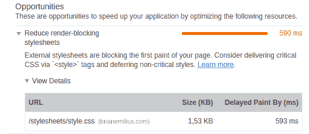

# 优化你的网站

> 原文：<https://dev.to/brianemilius/optimize-your-website-fef>

*本文原载于[https://www.brianemilius.com/optimize-your-website/](https://www.brianemilius.com/optimize-your-website/)，2018-04-17。访问[https://www.brianemilius.com/blog](https://www.brianemilius.com/blog)了解更多内容。*

* * *

如果你曾经使用过谷歌 Chrome 的审计工具，你可能已经注意到，几乎无论你做什么，审计都会告诉你，你的 CSS 阻止了你的网站的渲染。

如果你看一下报告的细节，谷歌建议直接在`head`部分加载你的样式的关键部分，推迟非关键的样式。

[](https://res.cloudinary.com/practicaldev/image/fetch/s--j0TArBtp--/c_limit%2Cf_auto%2Cfl_progressive%2Cq_auto%2Cw_880/https://thepracticaldev.s3.amazonaws.com/i/bk5ehxsw3n7hsnllif43.png)

那么什么是临界造型呢？渲染阻塞是什么意思？

当你用浏览器加载一个网页时，你就让它工作了。从服务器，你的浏览器接收一堆 HTML，CSS，大多数情况下还有 JavaScript。浏览器需要解释所有这些代码，并把它们翻译成看起来不错的东西，并且让任何一个普通的页面访问者都能理解。换句话说，文本、形状、颜色和动画。这就是我们所说的渲染。

您放在`head`部分的所有样式表和脚本必须首先下载，然后由浏览器处理，浏览器才能开始解释要做什么和显示什么。这意味着任何外部脚本或样式表都会阻碍浏览器快速完成工作——尤其是在连接速度较慢的设备上。

```
<html>
        <head>
                Slow Website

                <link rel="stylesheet" href="/css/mainstyling.css">
                <link rel="stylesheet" href="/css/fonts.css">
                <link rel="stylesheet" href="/css/fancybox.css">

                <script src="/js/jquery.min.js"></script>
                <script src="/js/app.js"></script>
                <script src="/js/fancybox.js"></script>
                <script src="/js/googleadwords.min.js"></script>
        </head>
        <body>
        <!-- contents that needs to render -->
        </body>
</html> 
```

Enter fullscreen mode Exit fullscreen mode

在上面的例子中，在浏览器开始渲染之前，需要下载 7 个外部文件。这就是我们所说的*渲染阻塞*。

关键的风格与我们希望我们的网站看起来如何有关。它与你网站的布局、最重要的颜色、字体和字号有关。

## 一解

我建议一个两部分的解决方案:

*   我们需要确定我们的关键风格是什么
*   推迟下载我们的样式表和脚本，直到 DOM 加载完毕。

### 关键造型

在你的网站上什么样的风格是关键的完全取决于个人网站。你必须决定第一次渲染需要多少样式。问自己这样一个问题:“我的网站要多长时间才能达到我想要的样子？”然后选择所需的 CSS 并将其放在`head`部分的`<style>`标签中。

```
<html>
    <head>
        A Slightly Faster Website
        <style>
        :root {
            --colorPrimaryForeground: hsl(0, 0%, 7%);
            --colorPrimaryBackground: hsl(0, 0%, 98%);
            --fontStack: Arial, Verdana, sans-serif;
            --fontSize: 1em;
        }
        html, body {
            margin: 0;
            padding: 0;
        }
        body {
            background-color: var(--colorPrimaryBackground);
            color: var(--colorPrimaryForeground);
            font: normal 400 var(--fontSize)/100% var(--fontStack);
        }
        .container {
            display: grid;
            grid-template-columns: repeat(12, minmax(50px, 1fr));
            grid-template-rows: 100px auto 50px;
        }
        </style>
    </head>
    <body>
    <!-- contents that needs to render -->
    </body>
</html> 
```

Enter fullscreen mode Exit fullscreen mode

### 推迟下载非关键样式和脚本

当页面渲染完成并加载 DOM 后，我们就可以下载剩下的样式表和脚本了。以这种方式加载 JavaScripts 非常容易。您所需要做的就是将属性`defer`添加到脚本标签:

```
<script src="/js/jquery.min.js" defer></script>
<script src="/js/app.js" defer></script>
<script src="/js/fancybox.js" defer></script>
<script src="/js/googleadwords.min.js" defer></script> 
```

Enter fullscreen mode Exit fullscreen mode

此外，我认为将脚本标签放在 HTML 文档的最后，正好在`</body>`标签之前是一个很好的做法。

样式表处理起来有点复杂。我们需要编写一个简短的 JavaScript 函数，在 DOM 加载后注入`<link>`标签。

```
const cssLoader = function (src) {
    const stylesheet = document.createElement('link');
    stylesheet.href = src;
    stylesheet.rel = 'stylesheet';
    stylesheet.type = 'text/css';
    document.getElementsByTagName('head')[0].appendChild(stylesheet);
}; 
```

Enter fullscreen mode Exit fullscreen mode

该函数可以在事件监听器内部使用:

```
document.addEventListener('DOMContentLoaded', () => {
    cssLoader('/css/mainstyling.css');
    cssLoader('/css/fonts.css');
    cssLoader('/css/fancybox.css');
}); 
```

Enter fullscreen mode Exit fullscreen mode

这使得整个 HTML 文档看起来像这样:

```
<html>
    <head>
        Much Faster Website
        <style>
        :root {
            --colorPrimaryForeground: hsl(0, 0%, 7%);
            --colorPrimaryBackground: hsl(0, 0%, 98%);
            --fontStack: Arial, Verdana, sans-serif;
            --fontSize: 1em;
        }
        html, body {
            margin: 0;
            padding: 0;
        }
        body {
            background-color: var(--colorPrimaryBackground);
            color: var(--colorPrimaryForeground);
            font: normal 400 var(--fontSize)/100% var(--fontStack);
        }
        .container {
            display: grid;
            grid-template-columns: repeat(12, minmax(50px, 1fr));
            grid-template-rows: 100px auto 50px;
        }
        </style>
    </head>
    <body>

    <!-- contents that needs to render -->

    <script src="/js/jquery.min.js" defer></script>
    <script src="/js/app.js" defer></script>
    <script src="/js/fancybox.js" defer></script>
    <script src="/js/googleadwords.min.js" defer></script>
    <script>
    const cssLoader = function (src) {
        const stylesheet = document.createElement('link');
        stylesheet.href = src;
        stylesheet.rel = 'stylesheet';
        stylesheet.type = 'text/css';
        document.getElementsByTagName('head')[0].appendChild(stylesheet);
    };
    document.addEventListener('DOMContentLoaded', () => {
        cssLoader('/css/mainstyling.css');
        cssLoader('/css/fonts.css');
        cssLoader('/css/fancybox.css');
    });
    </script>
    </body>
</html> 
```

Enter fullscreen mode Exit fullscreen mode

我们现在需要做的唯一一件事就是确保样式表被加载，即使浏览器关闭了 JavaScript。

```
<noscript>
<link rel="stylesheet" href="/css/mainstyling.css">
<link rel="stylesheet" href="/css/fonts.css">
<link rel="stylesheet" href="/css/fancybox.css">
</noscript> 
```

Enter fullscreen mode Exit fullscreen mode

在你的下一个项目中尝试这种方法，看看你是否能注意到它是否对你的审计业绩报告有影响。

我很乐意在下面的评论中听到你对这种方法的体验。

封面照片由[路易斯 _ 莫利内罗-](https://www.freepik.com/free-photos-vectors/business)www.freepik.comT2 拍摄