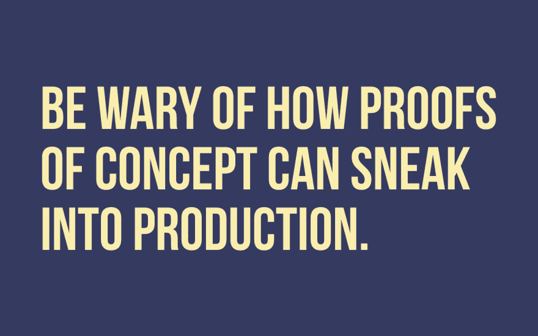

# 警惕概念验证如何潜入生产

> 原文：<https://dev.to/simplecto/be-wary-of-how-proofs-of-concept-can-sneak-into-production-381p>

CTO Protip.

这个很有战术性。

警惕你向谁发送了什么概念证明。

很久以前，在一个很远很远的地方，我为一个客户演示运送了一些代码。这正是我的销售人员所要求的。他很兴奋。

我想，“太好了！”就认为已经完成了。我以为销售人员会带着时间表和细节回来找我，这样我就可以把它放在产品路线图上，集成到我们更大的产品套件中。

没有。
事情不是这样的。

大约一个月后，我们开始收到一位新客户发来的与支持相关的电子邮件。直到那时我才意识到发生了什么事。
:我们向一个重要的客户出售了一个概念验证，但是我们的质量控制都没有到位。

*   无错误跟踪
*   没有备份
*   没有真正的安全感

这是我的错。

1.  我没有和我的销售人员交流演示的基本规则是什么
2.  我没有向销售和产品经理交付概念证明的模板。

最后事情解决了。我们最终正确地构建了功能，然后将客户移交给我们。

**经验教训**:有一个探索想法的过程。并为您的销售、支持和客户设定适当的期望值。

不再需要临时概念验证！